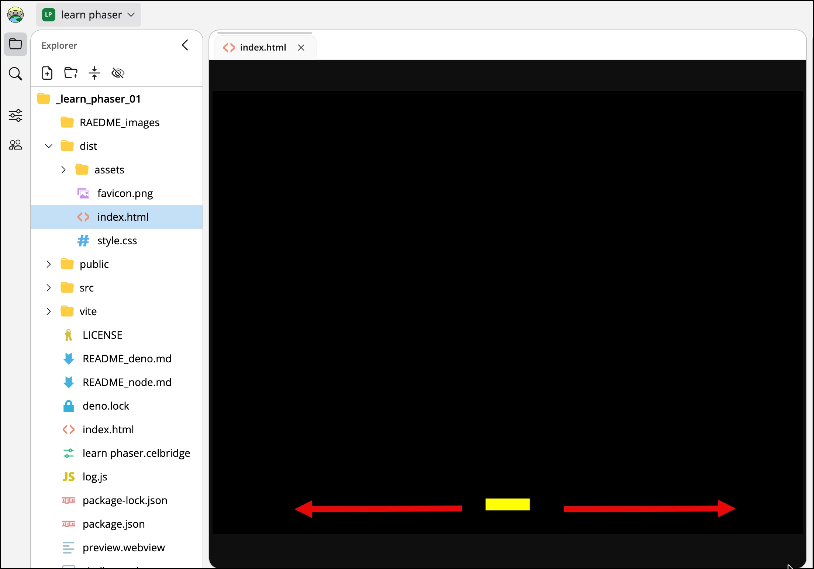

# Learn Phaser: Moving Rectangle (Deno)

This guide sets up a **Phaser 4.2.1** project from the official scaffolder, using **Deno** as the tooling. The result is a single scene with a black background and a small yellow rectangle near the bottom centre of the screen. You move it left and right with the **arrow keys** or **A / D**.

> No Deno? Use [README_node.md](./README_node.md) instead.

Phaser runs in the browser. Deno is only used to scaffold the project, install packages, and run the Vite dev server.

What you'll build:

{ width=50%}

---

## 1. Run the official scaffolder

You can put the new game in a **new folder** or in the **current folder**.

**Option A: a new folder** (the safe choice). Replace `my-game` with any folder name you like:

```bash
deno run -A npm:@phaserjs/create-game@latest my-game
```

This creates a `my-game` folder next to these README files. Nothing already in the current folder is touched.

**Option B: the current folder.** Use `.` (a dot, meaning "this folder") instead of a folder name:

```bash
deno run -A npm:@phaserjs/create-game@latest .
```

The scaffolder doesn't ask about the folder; it copies the template straight into the current folder.

> ⚠️ **Warning: existing files with the same name are overwritten, without asking.**
> The template includes files such as `README.md`, `index.html`, `package.json`, `tsconfig.json`
> and `src/main.ts`. If the current folder already has any of these, they are replaced and your
> versions are lost. Other files are left alone.
> That's why this guide is called `README_deno.md` and `README_node.md`, not `README.md`, so running
> the scaffolder with `.` won't overwrite it.
> Copy any file you want to keep somewhere safe before using `.`.

Answer the prompts:

1. **What do you want to create?** → `Web Bundler`
2. **Which bundler?** → `Vite`
3. **Language?** → `TypeScript`

## 2. Install dependencies

If you used **Option A**, first move into the new folder:

```bash
cd my-game
```

If you used **Option B** (`.`), you are already in the right folder; skip the `cd`.

Then install the packages:

```bash
deno install
```

Deno reads the template's `package.json` and creates a `node_modules` folder.

## 3. Pin Phaser to 4.2.1

The template may ship an older Phaser version. Pin it to 4.2.1:

```bash
deno add npm:phaser@4.2.1
```

Confirm the version in `package.json`. It should read `"phaser": "4.2.1"` (possibly with a `^`).

## 4. Remove the template's demo scenes

The template includes several scenes (Boot, Preloader, MainMenu, Game, GameOver). We only need one.

**➡️ Delete the entire `src/game` folder**, including everything inside it. Use your file explorer, your editor's sidebar, or your terminal.

## 5. Write the single scene

Open `index.html` and check that it contains `<div id="game-container"></div>`. The game will be placed inside it.

Then replace **everything** in `src/main.ts` with:

```ts
import Phaser from 'phaser';

const SPEED = 300; // pixels per second

class MainScene extends Phaser.Scene {
  private player!: Phaser.GameObjects.Rectangle;
  private cursors!: Phaser.Types.Input.Keyboard.CursorKeys;
  private keyA!: Phaser.Input.Keyboard.Key;
  private keyD!: Phaser.Input.Keyboard.Key;

  constructor() {
    super('MainScene');
  }

  create() {
    const { width, height } = this.scale;

    // Small yellow rectangle near the bottom centre: x, y, width, height, colour
    this.player = this.add.rectangle(width / 2, height - 40, 60, 16, 0xffff00);

    // Arrow keys + A/D
    const keyboard = this.input.keyboard!;
    this.cursors = keyboard.createCursorKeys();
    this.keyA = keyboard.addKey(Phaser.Input.Keyboard.KeyCodes.A);
    this.keyD = keyboard.addKey(Phaser.Input.Keyboard.KeyCodes.D);
  }

  update(_time: number, delta: number) {
    let direction = 0;
    if (this.cursors.left.isDown || this.keyA.isDown) direction -= 1;
    if (this.cursors.right.isDown || this.keyD.isDown) direction += 1;

    // delta is in milliseconds, so movement speed is frame-rate independent
    const halfWidth = this.player.width / 2;
    this.player.x = Phaser.Math.Clamp(
      this.player.x + direction * SPEED * (delta / 1000),
      halfWidth,
      this.scale.width - halfWidth
    );
  }
}

new Phaser.Game({
  type: Phaser.AUTO,
  width: 800,
  height: 600,
  backgroundColor: '#000000',
  parent: 'game-container',
  scene: [MainScene],
});
```

## 6. Run it

```bash
deno task dev-nolog
```

Open the URL shown in the terminal (usually http://localhost:8080). You should see the yellow rectangle on a black background, and it should move with the arrow keys or A / D.

The template's plain `dev` script runs `node log.js` first, which sends anonymous usage stats to Phaser and requires Node installed. The `-nolog` variants skip that step and need only Deno.

## 7. Build for production (optional)

```bash
deno task build-nolog
```

The output goes to the `dist/` folder.

---

## How it works

- **`create()`** runs once when the scene starts. It draws the rectangle and sets up the keys.
- **`update(time, delta)`** runs every frame. It reads the keys and moves the rectangle. Multiplying by `delta / 1000` keeps the speed at 300 px/second regardless of frame rate.
- **`Phaser.Math.Clamp`** stops the rectangle from leaving the screen.

## Troubleshooting

- **`deno install` warns about lifecycle scripts:** run `deno install --allow-scripts` instead.
- **Script names differ:** open `package.json` and look at `"scripts"`. Run any of them with `deno task <name>`.
- **Blank page:** check the browser console. Make sure `index.html` has the `game-container` div and still loads `src/main.ts`.
