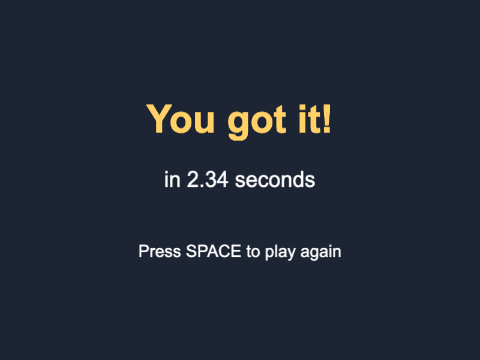
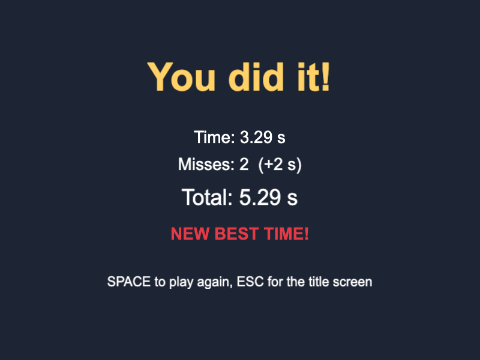

# Chapter 2 - A three-scene game

Most games are more than one screen: a title screen, the game itself, and a screen at the end. In
Phaser each of those is a **scene**. In this chapter you build a complete little game in three
scenes - press SPACE to start, click a bouncing ball as fast as you can, and see how long you
took - and learn how scenes start each other, how they pass data along, and how a game object
responds to the mouse.


## What you will learn

- how a game is split into scenes, and how one scene starts another
- how to pass data from one scene to the next with `init(data)`, checked by an `interface`
- why a scene's fields keep their old values when it starts again, and how `init()` fixes that
- how to make a game object clickable, with `setInteractive()` and `"pointerdown"`
- the difference between `on` and `once` for events
- how to keep values that every scene can see, in the game's **registry**

## The projects

| Project | What it shows |
|---|---|
| [ch02_click_the_ball](projects/ch02_click_the_ball/) | the three-scene game at its simplest: start, click the ball, see your time |
| [ch02_click_the_ball_plus](projects/ch02_click_the_ball_plus/) | the same game, made better: five hits to win, a ball that speeds up, misses that cost time, sounds, and a best time |

## Three scenes


Here is the whole game, as a picture:


Each box is a class that extends `Phaser.Scene`, in its own file in `src/scenes/`. The config lists
all three:

`src/main.ts`
```ts
scene: [StartScene, PlayScene, WinScene],
```

When the game begins, Phaser makes **one object of each scene class**, and starts the **first** one
in the list. The others wait. From then on, the scenes themselves decide what comes next.

### Scene keys

Every scene has a **key** - its name - which it gives to `super(...)` in its constructor. Scenes
start each other by key, so the keys are kept together as constants:

`src/scenes/keys.ts`
```ts
export const START_SCENE = "StartScene";
export const PLAY_SCENE = "PlayScene";
export const WIN_SCENE = "WinScene";
```

`src/scenes/PlayScene.ts`
```ts
constructor() {
  super(PLAY_SCENE);
}
```

Why bother? Because `this.scene.start("Playscene")` - one letter wrong - does nothing at all, and
says nothing about it. Misspell a constant - `this.scene.start(PLAYSCENE)` - and it is a build error you cannot miss. Whenever a
string is used as a name in more than one place, make it a constant.

### Starting a scene

`src/scenes/StartScene.ts`
```ts
this.input.keyboard!.once("keydown-SPACE", () => {
  this.scene.start(PLAY_SCENE);
});
```

`this.scene` is the scene's **scene plugin** - its way of talking to Phaser's scene manager.
`this.scene.start(key)` does two things:

1. it **shuts down** this scene - every game object in it is destroyed, its listeners are removed,
   and Phaser stops calling its `update()`
2. it **starts** the scene called `key` - which runs that scene's `init()`, `preload()`, `create()`,
   and then `update()` every frame


### `on` and `once`

Chapter 1 used `on(...)`: "every time this happens, run this". Here it is `once(...)`: "the first time
this happens, run this, then stop listening". SPACE should start the game one time, and `once` says
exactly that.

In this game `on` would happen to work too: `this.scene.start(...)` shuts the start scene down, and a
scene's listeners are removed when it shuts down. But `this.scene.start` does not switch scenes
instantly - it happens at the start of the next frame - and a scene that *keeps running* (a pause
menu on top of the game, say, or a HUD) would react to every press. Use `once` whenever something
should only happen once; it says what you mean.

### Loading once, for everyone

The start scene runs first, so it loads everything:

`src/scenes/StartScene.ts`
```ts
preload(): void {
  this.load.image(LOGO_KEY, LOGO_FILE);
  this.load.image(BALL_KEY, BALL_FILE);
}
```

Loaded pictures and sounds belong to the **game**, not to the scene that loaded them. Once
`"ball"` is loaded, `PlayScene` can use it without loading it again - so `PlayScene` has no
`preload()` at all. (Chapter 3 gives loading a scene of its own, with a progress bar.)

## Making the ball clickable

`PlayScene` uses the `Ball` class from Chapter 1, unchanged: an `Image` that moves itself in
`preUpdate()` and bounces off the edges. The scene makes one, heading off in a random direction:

`src/scenes/PlayScene.ts`
```ts
const angle = Phaser.Math.Angle.Random();
const ball = new Ball(this, 400, 300, Math.cos(angle) * BALL_SPEED, Math.sin(angle) * BALL_SPEED);
```

`Angle.Random()` is a random angle (in radians); `cos` and `sin` split the speed into its across and
down parts, so the ball always moves at `BALL_SPEED` whichever way it goes.

Game objects ignore the mouse until you ask:

```ts
ball.setInteractive({ useHandCursor: true });

ball.on("pointerdown", () => {
  this.win();
});
```

- `setInteractive()` tells Phaser's input system to watch this game object. By default Phaser checks
  the pointer against the object's rectangle (its picture's bounds); Chapter 8 shows other shapes
- `{ useHandCursor: true }` shows a pointing hand while the mouse is over it
- `ball.on("pointerdown", ...)` - every game object can have listeners. The **pointer** is Phaser's
  word for the mouse *or* a finger on a touch screen, so the same code works on a phone

Other pointer events you can listen for on a game object: `"pointerup"`, `"pointerover"` (the
pointer has moved onto it), `"pointerout"` (and off again), and `"pointermove"`.

Notice that `Ball` does not know it can be clicked. The **scene** decides that - so the same `Ball`
class works in Chapter 1, where it cannot be clicked, and here, where it can.

## Timing the round

`src/scenes/PlayScene.ts`
```ts
create(): void {
  ...
  this.startTime = this.time.now;
}

override update(time: number, _delta: number): void {
  const seconds = (time - this.startTime) / 1000;
  this.timeText.setText(`Time: ${seconds.toFixed(1)}`);
}
```

`this.time` is the scene's **clock**, and `this.time.now` is the time in milliseconds. The `time`
passed to `update()` is the same clock. `toFixed(1)` turns a number into a string with one decimal
place - `2.3412` becomes `"2.3"`.

## Passing data to the next scene

When the ball is clicked, `WinScene` needs to know how long the player took. The second argument to
`this.scene.start(...)` is handed to the new scene's `init()`:

`src/scenes/PlayScene.ts`
```ts
private win(): void {
  const seconds = (this.time.now - this.startTime) / 1000;

  const data: WinData = { seconds: seconds };
  this.scene.start(WIN_SCENE, data);
}
```

`src/scenes/WinScene.ts`
```ts
export interface WinData {
  seconds: number;
}

export class WinScene extends Phaser.Scene {
  private seconds = 0;

  init(data: WinData): void {
    this.seconds = data.seconds;
  }

  create(): void {
    ...
    this.add.text(centreX, 300, `in ${this.seconds.toFixed(2)} seconds`, { ... });
```

`{ seconds: seconds }` is an **object literal** - JavaScript's quick way of making an object with
named values, with no class needed.

An **interface** describes the shape an object must have - like a Java interface, but for data as
well as methods. `WinData` says "an object with a `seconds` that is a number". Both scenes use it, so
if `PlayScene` sent `{ secs: 2.3 }` or `{ seconds: "fast" }`, the build would say so.

`PlayScene` imports it with `import type { WinData } from "./WinScene.ts";`. Types disappear when the
code is built, so `import type` brings in only the type, and costs nothing when the game runs.



## Playing again - and the trap in it

`WinScene` starts `PlayScene` again when SPACE is pressed. It works first time, because `PlayScene`
sets everything it needs in `create()`. But this is the place where almost everyone, once, writes a
bug - and the plus version of the game shows why.

**Phaser does not make a new scene object when a scene starts again.** It made one `PlayScene` when
the game began, and `this.scene.start(PLAY_SCENE)` starts that *same object* again. Its game objects
are all new - `create()` makes them - but its **fields still hold whatever they held at the end of
the last round**.

In the plus version, `PlayScene` counts hits and misses in fields:

`ch02_click_the_ball_plus/src/scenes/PlayScene.ts`
```ts
private hits = 0;
private misses = 0;
```

`= 0` there only happens **once**, when the object is made. Play a second round and `hits` would
already be 5 - so the first click would win. The fix is `init()`, which runs every time the scene
starts:

```ts
init(): void {
  this.hits = 0;
  this.misses = 0;
}
```

**Rule of thumb:** anything that should start fresh every time a scene starts is set in `init()` or
`create()` - not just where the field is declared.

## The plus version


`ch02_click_the_ball_plus` is the same three scenes, with more game. It is worth reading all of it;
here are the new ideas.

### Hits, misses, and clicks on nothing

```ts
this.ball.on("pointerdown", () => {
  this.hit();
});

this.input.on("pointerdown", (_pointer: Phaser.Input.Pointer, over: Phaser.GameObjects.GameObject[]) => {
  if (over.length === 0) {
    this.miss();
  }
});
```

`this.input.on("pointerdown", ...)` listens to **every** click in the scene, wherever it lands.
Phaser passes the listener the pointer, and a list of the interactive game objects that were under
it. An empty list means the click hit nothing - a miss. (Clicking the ball fires **both** listeners;
the second sees the ball in the list and ignores it.)

### The ball does what it is told

`Ball` gained two public methods, and the scene calls them after each hit:

`ch02_click_the_ball_plus/src/objects/Ball.ts`
```ts
public speedUp(factor: number): void {
  this.speedX = this.speedX * factor;
  this.speedY = this.speedY * factor;
}

public teleport(): void {
  const radius = this.width / 2;
  this.x = Phaser.Math.Between(radius, this.scene.scale.width - radius);
  this.y = Phaser.Math.Between(radius, this.scene.scale.height - radius);
}
```

The speeds stay private. The scene does not reach in and change them; it asks the ball to speed up,
and the ball decides how. That is ordinary OO encapsulation - and it pays off the moment you want
the ball to, say, flash when it speeds up: one place to change.

### Sounds

```ts
// StartScene.preload()
this.load.audio(POP_KEY, POP_FILE);

// PlayScene.hit()
this.sound.play(POP_KEY);
```

Loading a sound is like loading a picture; `this.sound.play(key)` plays it. That is all this chapter
needs - Chapter 5 is all about audio. (Browsers will not play any sound until the player has
clicked or pressed a key on the page. Here the first sound comes after a click, so that is never a
problem.)

### The registry: values every scene can see

The best time has to outlive the scene that works it out - the start scene shows it. Every Phaser
game has a **registry**: a store of named values shared by all its scenes.

`ch02_click_the_ball_plus/src/scenes/WinScene.ts`
```ts
const best: number | undefined = this.registry.get(BEST_TIME);
const isNewBest = best === undefined || total < best;
if (isNewBest) {
  this.registry.set(BEST_TIME, total);
}
```

`ch02_click_the_ball_plus/src/scenes/StartScene.ts`
```ts
const best: number | undefined = this.registry.get(BEST_TIME);
const bestMessage = best === undefined ? "No best time yet" : `Best time: ${best.toFixed(2)} seconds`;
```

- `number | undefined` is a **union type**: "a number, or nothing". Until a game has been won,
  there is no best time, and `registry.get` gives back `undefined` - JavaScript's "no value here"
- `condition ? a : b` is the **conditional operator**, as in Java
- the registry lasts as long as the game - until the page is refreshed. Chapter 6 keeps scores
  for good, in the browser's storage



### Spreading a style

```ts
const style = { fontFamily: "Arial", fontSize: "28px", color: "#ffffff" };

this.add.text(centreX, 130, "You did it!", { ...style, fontSize: "64px", fontStyle: "bold", color: "#ffd166" });
this.add.text(centreX, 230, `Time: ${this.result.seconds.toFixed(2)} s`, style);
```

`{ ...style, fontSize: "64px" }` makes a **new** object with everything from `style`, then changes
`fontSize`. The `...` is the **spread** operator. It saves writing the same style out six times,
without changing `style` itself.

> **Note** - Java has nothing quite like object literals, spreading, or union types. They are three
> of the TypeScript features you will use most in Phaser code, because Phaser takes so many of its
> settings as plain objects.

## Summary

- a game is a list of scenes in the config; Phaser starts the first
- `this.scene.start(KEY, data)` shuts this scene down and starts another; `data` arrives in the new
  scene's `init(data)`
- keep scene keys as constants; describe the data passed between scenes with an `interface`
- Phaser reuses the same scene object each time a scene starts: reset fields in `init()`
- `setInteractive()` makes a game object clickable; listen for `"pointerdown"` on it. Listen on
  `this.input` to hear every click in the scene
- `once` listens for the first time only; `on` listens every time
- `this.registry` holds values every scene can see, for as long as the game runs

## Challenges

1. **Restyle** *(ch02_click_the_ball)* - Use the blue ball (`assets/images/ball_blue.png` from the
   asset library - copy it into `public/assets/images/`), make it faster, and change the wording and
   colours on the start and win screens.

2. **Enter works too** *(ch02_click_the_ball)* - Let ENTER do everything SPACE does: start the game
   from the title screen, and play again from the win screen.

3. **Give up** *(ch02_click_the_ball)* - Pressing ESC during play goes back to the title screen. The
   title screen should then work exactly as it did the first time.

4. **Too slow!** *(ch02_click_the_ball)* - Give the player five seconds. If they have not clicked the
   ball by then, go to the win scene anyway - but it should say "Too slow!" instead of showing a
   time. Do it without adding a fourth scene. *Hint:* what you pass to `WinScene` can say whether the
   player won. Look up `this.time.delayedCall(milliseconds, callback)`.

5. **The decoy** *(ch02_click_the_ball_plus)* - Add a second, blue ball that also bounces around.
   Clicking it counts as **two** misses. Clicking the red ball still counts as a hit. *Hint:* `Ball`
   will need to be told which picture to use. Think about what the "missed everything" listener sees
   when the blue ball is clicked.

6. **Top five** *(ch02_click_the_ball_plus)* - Keep the five best totals, not just one. Show them as
   a table on the title screen, and on the win screen say which place (if any) the new time took.
   *Hint:* the registry can hold an array. `array.sort((a, b) => a - b)` sorts numbers smallest
   first, and `array.slice(0, 5)` keeps the first five.

---

Previous: [Chapter 1 - Introduction](../ch01_introduction/README.md) ·
Next: [Chapter 3 - Preloading](../ch03_preloading/README.md)
