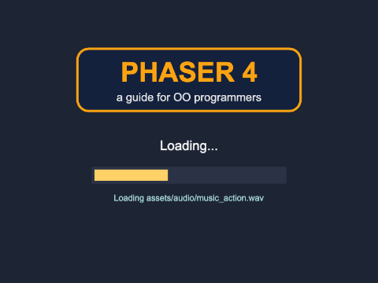
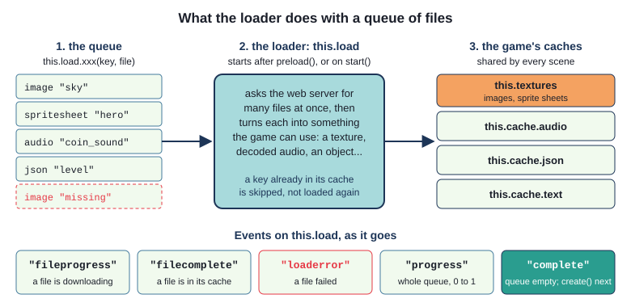
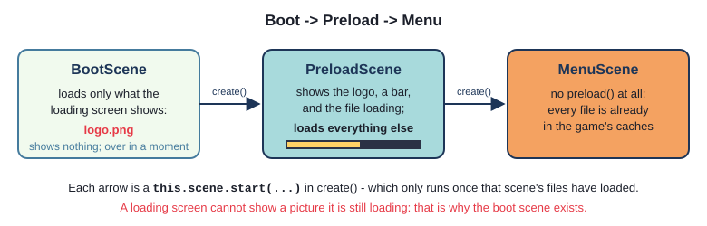
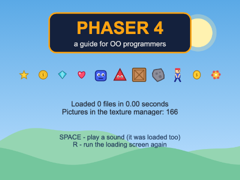
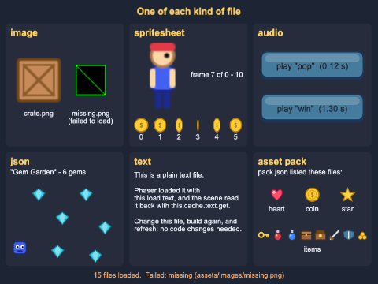
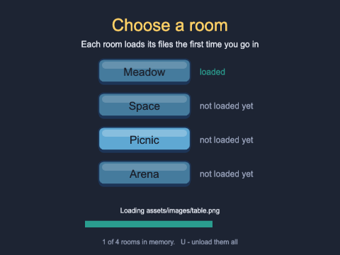
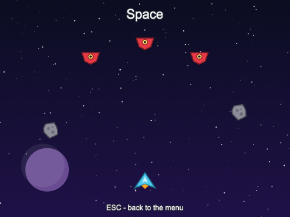

# Chapter 3 - Preloading

A game is made of files - pictures, sprite sheets, sounds, music, level data - and every one has to
come over the network before the game can use it. In this chapter you look inside Phaser's
**loader**: how it queues files, where it keeps them, and what it tells you as it goes. You build a
proper loading screen with a progress bar, load one of every common kind of file, deal with files
that fail to load, and load a room's files only when the player first goes into it.



## What you will learn

- what the loader does: the **queue**, **keys**, and the game's **caches** where loaded files are kept
- how file paths work, and how `setPath()` and `setBaseURL()` save typing
- the **Boot -> Preload -> Menu** pattern, and how to draw a progress bar with `Graphics`, driven by
  the loader's events
- how to load images, sprite sheets, audio, JSON, text, and an **asset pack**, and read each back
- what happens when a file is missing, and how to find out which one
- how to load more files in the middle of a game, and only when they are needed

## The projects

| Project | What it shows |
|---|---|
| [ch03_loading_screen](projects/ch03_loading_screen/) | Boot -> Preload -> Menu: a loading screen with a progress bar and the file being loaded |
| [ch03_asset_types](projects/ch03_asset_types/) | one of each kind of file - image, sprite sheet, audio, JSON, text and an asset pack - each shown on screen, and a missing file |
| [ch03_load_on_demand](projects/ch03_load_on_demand/) | a menu of rooms; each room's files are loaded the first time it is chosen |

## What the loader does

Every scene has a **loader**, `this.load`. You have used it since Chapter 1:

```ts
preload(): void {
  this.load.image(LOGO_KEY, LOGO_FILE);
}
```

It is worth knowing exactly what that line does - because it is not what it looks like. It does
**not** load the picture. It adds the picture to a **queue**: "when you start, fetch this file,
and keep it under this name". Nothing is fetched yet.

When `preload()` returns, Phaser starts the loader for you. The loader asks the web server for the
queued files - many at once - and turns each into something the game can use: a picture becomes a
**texture** the graphics card can draw, a sound is decoded, a JSON file becomes an object. Each one
goes into a **cache**. When the queue is empty, Phaser calls `create()`. That is why `create()` can
always use everything `preload()` asked for.



### Keys and caches

The first argument to every `this.load...` method is the file's **key** - the name it is kept
under. From then on the rest of the game uses only the key; the file name is never mentioned
again.

There is a cache for each kind of thing:

| What was loaded | Where it is kept | Read it back with |
|---|---|---|
| `image`, `spritesheet` | the texture manager, `this.textures` | `this.add.image(x, y, key)` - or `this.textures.get(key)` |
| `audio` | `this.cache.audio` | `this.sound.play(key)` - or `this.cache.audio.get(key)` |
| `json` | `this.cache.json` | `this.cache.json.get(key)` |
| `text` | `this.cache.text` | `this.cache.text.get(key)` |

Three things follow from this:

- **The caches belong to the game, not to the scene.** A picture loaded by one scene can be used
  by every scene, for as long as the game runs. Chapter 2's `PlayScene` relied on this
- **A key only has to be unique within its own kind.** A picture called `"coin"` and a sound called
  `"coin"` can live side by side (in different caches). It is still kinder to the reader to name
  them differently - this chapter's projects use `"coin"` and `"coin_sound"`
- **A key that is already loaded is skipped.** Ask for `"sky"` a second time and the loader does
  not fetch it again - it quietly leaves it out of the queue. That is usually what you want (and
  the last project in this chapter depends on it), but it also means you cannot replace a picture
  just by loading a different file under the same key

### Where files come from

`build.ts` copies everything in `public/` into `dist/`, and `dist/` is what the web server serves.
So a file in `public/assets/images/sky.png` ends up at `dist/assets/images/sky.png`, and the page
asks for it as `assets/images/sky.png`. File names in the loader are **relative to the web page**
(`index.html`) - not to the TypeScript file doing the loading.

When many files share a folder, `setPath()` saves writing it out every time:

`src/scenes/PreloadScene.ts` (ch03_loading_screen)
```ts
// setPath() is put in front of every file name that follows, until it is changed again
this.load.setPath("assets/images/");
this.load.image(SKY_KEY, "sky.png");
this.load.image(SPACE_KEY, "space.png");
...
this.load.setPath("assets/audio/");
this.load.audio(COIN_SOUND_KEY, "coin.wav");
```

The full address the loader asks for is **base URL + path + file name**. The base URL is empty
unless you set one with `this.load.setBaseURL("https://example.com/my-game/")` - useful when a
game's files are kept on a different server from the game. Both can also be set for the whole game
in the config, with `loader: { baseURL: "...", path: "..." }`. A file name that is already a full
address (`https://...`) ignores both.

> **Note** - `setPath()` lasts until you change it - including for loads later in the same scene.
> That is why `queueFiles()` ends with `this.load.setPath("")`.

## A loading screen

A handful of small files load in a blink. A real game has hundreds, and some are big - music, large
backgrounds - so on a slow connection the player can wait seconds with nothing but a black screen.
Every finished game shows a **loading screen** instead.

### Boot, Preload, Menu

There is a catch. The loading screen wants to show the game's logo - but the logo is a file too, and
a loading screen cannot show a picture it is still loading. The standard answer is three scenes:



`src/main.ts`
```ts
scene: [BootScene, PreloadScene, MenuScene],
```

`BootScene` loads only the few, small files the loading screen needs, and starts the next scene:

`src/scenes/BootScene.ts`
```ts
preload(): void {
  this.load.image(LOGO_KEY, LOGO_FILE);
}

// create() only runs once everything queued in preload() has loaded
create(): void {
  this.scene.start(PRELOAD_SCENE);
}
```

It shows nothing, and is over in a moment.

`PreloadScene` is the loading screen. Its `preload()` does three things, in order: it draws the
screen, it listens to the loader's events, and it queues every file. Then `MenuScene` - and the rest
of the game - never needs a `preload()` at all.

### Drawing the bar

The bar is not a picture; it is drawn by Phaser, with a **Graphics** game object. A `Graphics` is a
list of drawing instructions - "fill with this colour", "fill a rectangle here" - that Phaser draws
every frame:

`src/scenes/PreloadScene.ts`
```ts
// the box is drawn once; the bar is redrawn every time the progress changes
const box = this.add.graphics();
box.fillStyle(BOX_COLOUR);
box.fillRect(barX - BOX_PADDING, BAR_Y - BOX_PADDING, BAR_WIDTH + BOX_PADDING * 2, BAR_HEIGHT + BOX_PADDING * 2);

const bar = this.add.graphics();
```

- `fillStyle(colour)` chooses the colour for the fills that follow. Colours are numbers written in
  hexadecimal - `0x2b3245` is the same colour as `"#2b3245"` in CSS
- `fillRect(x, y, width, height)` - note: `x` and `y` are the rectangle's **top-left** corner, not
  its centre
- `clear()` throws away everything drawn so far, ready to draw again

There are others you will meet later: `lineStyle(thickness, colour)` and `strokeRect` for outlines,
`fillCircle`, `fillRoundedRect`, and more. The bar starts empty. The loader fills it in.

### Listening to the loader

The loader is an **event emitter**, like the keyboard in Chapter 1 and game objects in Chapter 2.
As it works through the queue, it announces what is happening:

`src/scenes/PreloadScene.ts`
```ts
// "progress": the whole queue - value goes from 0 (nothing loaded) to 1 (everything loaded)
this.load.on("progress", (value: number) => {
  bar.clear();
  bar.fillStyle(BAR_COLOUR);
  bar.fillRect(barX, BAR_Y, BAR_WIDTH * value, BAR_HEIGHT);
});

// "fileprogress": one file is on its way - Phaser passes the File, which knows its key and URL
this.load.on("fileprogress", (file: Phaser.Loader.File) => {
  fileText.setText(`Loading ${file.src}`);
});

// "complete": the queue is empty - every file has loaded (or failed)
this.load.on("complete", () => {
  fileText.setText("All done!");
});
```

Each time the progress changes, the bar is cleared and drawn again, `BAR_WIDTH * value` wide: no
width at 0, all of it at 1, and half of it at 0.5.

Notice the listeners are added **before** the files are queued, and all of it happens inside
`preload()`. The loader only starts after `preload()` returns, so nothing can be missed.

The loader's most useful events:

| Event | Phaser passes | When |
|---|---|---|
| `"start"` | the loader | the loader starts |
| `"fileprogress"` | the `File`, and how much of it has arrived (0 to 1) | part of a file has arrived |
| `"filecomplete"` | the key, the type, and the data | a file is loaded and in its cache |
| `"loaderror"` | the `File` | a file could not be loaded |
| `"progress"` | a number from 0 to 1 | the queue as a whole has moved on |
| `"complete"` | the loader, how many loaded, how many failed | the queue is empty |

> **Java and TypeScript** - the listener's parameter types (`value: number`,
> `file: Phaser.Loader.File`) are written out by you. `this.load.on` accepts *any* function, so
> TypeScript cannot check that you asked for the right thing - the table above, and Phaser's
> documentation, say what each event passes. Leave the type off and the build complains that the
> parameter "implicitly has an 'any' type".

### When the loading is done

`src/scenes/PreloadScene.ts`
```ts
// create() runs once the loader's queue is empty
create(): void {
  const data: MenuData = {
    files: this.load.totalComplete,
    seconds: (performance.now() - this.startTime) / 1000,
  };

  // leave the full bar up for a moment, so the player sees it finish
  this.time.delayedCall(FINISHED_PAUSE, () => {
    this.scene.start(MENU_SCENE, data);
  });
}
```

`this.load.totalComplete` is how many files loaded (and `this.load.totalFailed` how many did not).
The menu is handed both numbers through `init(data)`, as in Chapter 2, and shows them.
`performance.now()` is the browser's own clock, in milliseconds - `preload()` notes it at the start.

### Seeing it work

Try it: build and run `ch03_loading_screen`. You will probably see the loading screen for about a
second - and only because of this:

```ts
// Files on your own computer load far too quickly to see a progress bar. So that you can watch it
// work, the game also loads COPIES extra copies of some small pictures, each under its own key.
// A real game would not do this - set it to 0 and the loading screen is gone in a blink.
const COPIES = 150;
```

Each copy is loaded under its own key (`copy_0`, `copy_1`, ...), so none is skipped: 170 files in
all. Set `COPIES` to 0, build, and the loading screen barely appears.

The honest way to see what your players see is to **slow the network down**. Open the game in
Chrome or Edge at http://127.0.0.1:8000/, open the developer tools (F12), and go to the **Network**
tab:

1. tick **Disable cache**, so every file really is fetched again
2. in the throttling menu (it says **No throttling**), choose **Fast 4G**, or **Slow 4G** for a
   long wait
3. refresh the page

Now the bar crawls, and you can watch the big files - the three music tracks are over 1.5 MB
between them - arrive. (Firefox has the same menu.) Switch throttling off afterwards.


### Loading again

The menu shows a few of the loaded pictures. It has no `preload()` - and pictures from a sprite
sheet are shown by giving the frame as the fourth argument:

`src/scenes/MenuScene.ts`
```ts
SHOW.forEach((shown, index) => {
  this.add.image(firstX + index * SHOW_SPACING, 250, shown.key, shown.frame);
});
```

Press **R** in the menu. It starts `BootScene` again, which runs the whole loading screen again. But
this time the menu says **Loaded 0 files in 0.00 seconds**: every key is already in its cache, so
the loader skipped every file, found its queue empty, and finished at once. Loaded files stay loaded
until the page is closed - or until you remove them (see the last project).



> **Note** - there is another way to load the loading screen's own files: a scene can list files in
> its constructor, `super({ key: PRELOAD_SCENE, pack: { files: [ ... ] } })`, and Phaser loads them
> before that scene's `preload()` runs. It does the same job as a boot scene. The boot scene is
> easier to read, and has room to grow.

## Every kind of file



`ch03_asset_types` loads one file of each kind Phaser games use most, and shows each in a panel.
All of them are queued in `preload()`, and read back from their caches in `create()`.

### Images and sprite sheets

`src/scenes/AssetTypesScene.ts`
```ts
// an image: one picture
this.load.image(CRATE_KEY, CRATE_FILE);

// a sprite sheet: one picture, cut into frames of the size given
this.load.spritesheet(HERO_KEY, HERO_FILE, { frameWidth: 32, frameHeight: 48 });
this.load.spritesheet(COIN_SPIN_KEY, COIN_SPIN_FILE, { frameWidth: 32, frameHeight: 32 });
```

A **sprite sheet** is many pictures of the same size in one file - usually the frames of an
animation. Phaser cuts it into frames of `frameWidth` x `frameHeight`, and numbers them from 0,
left to right, then row by row. `coin_spin.png` is 192 x 32, so it is six frames, 0 to 5. The
asset library's `README.md` lists the frame size of every sheet; get it wrong and every frame is
cut in the wrong place.

The panel shows every frame of the coin, and steps the hero through its frames, one every quarter
of a second:

```ts
// frameTotal counts every frame, plus one extra, "__BASE" - the whole picture
this.heroFrames = this.textures.get(HERO_KEY).frameTotal - 1;
```

```ts
override update(time: number, _delta: number): void {
  const frame = Math.floor(time / HERO_FRAME_TIME) % this.heroFrames;
  this.hero.setFrame(frame);
  ...
}
```

`time / HERO_FRAME_TIME` counts up by one every 250 ms; `Math.floor` drops the fraction; `%` (the
remainder, as in Java) wraps it round to 0 after the last frame. Chapter 7 does this properly, with
Phaser's animations.

### Audio

```ts
this.load.audio(POP_KEY, POP_FILE);
```

Sounds are decoded as they load, and kept in `this.cache.audio`. The panel reads one back, to show
how long it is:

```ts
// with Web Audio (every modern browser), the audio cache holds a decoded AudioBuffer
const buffer: AudioBuffer = this.cache.audio.get(key);
```

You rarely need the cache directly - `this.sound.play(key)` finds the sound by its key. This guide's
sounds are WAV files.
Games often use MP3 or OGG, which are much smaller, and `this.load.audio(key, [oggFile, mp3File])`
lets the browser choose the first format it can play. Chapter 5 is all about audio.

### JSON: data for the game

JSON is how games keep data outside the code - levels, enemy types, dialogue, settings. Here is a
tiny level:

`public/assets/data/level.json`
```json
{
  "name": "Gem Garden",
  "player": { "x": 30, "y": 150 },
  "gems": [
    { "x": 70, "y": 40 },
    { "x": 120, "y": 90 },
    ...
  ]
}
```

```ts
this.load.json(LEVEL_KEY, LEVEL_FILE);
```

The loader parses it, and `this.cache.json.get(key)` gives back an ordinary JavaScript object. But
what *type* is it? Phaser has no idea what is in the file, so `get` returns `any` - TypeScript's
word for "anything; I will not check". Left like that, a typo such as `level.gem` would not be
caught. So the project describes the file with interfaces:

`src/LevelData.ts`
```ts
export interface Point {
  x: number;
  y: number;
}

export interface LevelData {
  name: string;
  player: Point;
  gems: Point[];
}
```

`src/scenes/AssetTypesScene.ts`
```ts
// cache.json.get gives back whatever the file held - TypeScript cannot know what that is, so
// we say what we expect: a LevelData (see LevelData.ts)
const level: LevelData = this.cache.json.get(LEVEL_KEY);

this.add.text(x + 10, y + 34, `"${level.name}" - ${level.gems.length} gems`, SMALL_STYLE);
```

```ts
level.gems.forEach((gem) => {
  this.add.image(originX + gem.x, originY + gem.y, GEM_KEY);
});
```

From here on, `level.gem` or `level.name * 2` is a build error.

> **Java and TypeScript** - this is like reading JSON into a class with a Java library such as
> Gson or Jackson - with one big difference. Those libraries check the file against the class as
> they read it. TypeScript's types disappear when the game is built, so **nothing checks the file**.
> If `level.json` said `"gemz"`, `level.gems` would be `undefined`, and `level.gems.length` would
> crash the game when it ran. The interface is a promise you make about the file; keep the two in
> step.

Change a position in `level.json`, build, and refresh: the level changes, with no change to the
code. That is the point of data files.

### Text

```ts
this.load.text(NOTES_KEY, NOTES_FILE);
...
const notes: string = this.cache.text.get(NOTES_KEY);
```

Any plain text file comes back as one string - line breaks and all. Useful for credits, help
screens, dialogue, or your own simple file formats.

### Asset packs

A game with hundreds of files ends up with hundreds of `this.load...` lines. An **asset pack** moves
that list out of the code into a JSON file:

`public/assets/pack.json`
```json
{
  "pickups": {
    "path": "assets/",
    "files": [
      { "type": "image", "key": "heart", "url": "images/heart.png" },
      { "type": "image", "key": "coin", "url": "images/coin.png" },
      { "type": "image", "key": "star", "url": "images/star.png" },
      {
        "type": "spritesheet",
        "key": "items",
        "url": "spritesheets/items.png",
        "frameConfig": { "frameWidth": 32, "frameHeight": 32 }
      }
    ]
  }
}
```

A pack is divided into **sections** (here there is one, `"pickups"`). Each section has a list of
files - each with the `type` of loader method to use, its `key` and its `url` - and can set its own
`path` (and `baseURL` and `prefix`) for the files in it.

`src/scenes/AssetTypesScene.ts`
```ts
// a pack: a JSON file that is a LIST of files to load. Phaser loads the pack, then queues
// everything in the section named, and loads those too
this.load.pack(PACK_KEY, PACK_FILE, PACK_SECTION);
```

Leave off the third argument and every section is loaded. The files arrive under the keys the pack
gave them, so the code still has to know those keys (they are in `src/assets.ts`). What the pack
changes is *where the list of files lives*: add a file to the game by adding a line to the pack,
with no code to change - and a tool can write the pack for you.

The count at the bottom of the screen - **15 files loaded** - includes the pack file itself.

## When a file is missing

Look at the image panel again. `assets.ts` asks for `assets/images/missing.png`, which does not
exist - on purpose. The game does not stop. The web server answers "404 Not Found", the loader
gives up on that file, and carries on with the rest.

Two things happen that you can see. First, the **"loaderror"** event, which the project listens for:

`src/scenes/AssetTypesScene.ts`
```ts
// "loaderror" fires once for each file that could not be loaded
this.load.on("loaderror", (file: Phaser.Loader.File) => {
  this.failed.push(`${file.key} (${file.src})`);
});
```

The status line at the bottom lists what failed. (The browser's developer console shows the failed
request too, in red.) Second, when `create()` asks for the picture, `"missing"` is not in the
texture manager - so Phaser draws its **missing texture** instead: a black square with a green
outline and a green diagonal line. You will see it again. It always means "there is no picture with
that key", and the cause is one of:

- the file is not in `public/` - for a picture from the asset library, it has to be copied into the
  project first
- the file name or folder is spelled differently in the code - `Sky.png` is not `sky.png`. Your own
  computer may not mind about capitals; a web server usually does, so a game can work at home and
  fail once it is uploaded
- the key used in `create()` is not the key used in `preload()` - one more reason for key constants

Pictures fail quietly. Other kinds of file fail less politely:

| Missing | What happens |
|---|---|
| a picture | the missing-texture square is drawn; the game carries on |
| a sound | `this.sound.play(key)` throws `Error: Audio key "pop" not found in cache`, and the scene stops there |
| JSON or text | `this.cache.json.get(key)` returns `undefined`, and the first use of it crashes |

So when something is not there, look at the developer console first: the red 404 line names the
file the game asked for, exactly as it asked for it.

## Loading later



Loading everything at the start is simplest, and right for most small games. But a big game might
have forty levels, each with its own backgrounds and music. Loading all of it up front makes every
player wait for levels they may never reach, and keeps all of it in memory at once. Instead, a game
can load each part **when it is needed**.

`ch03_load_on_demand` is a menu of four rooms. At the start, only the menu's own files are loaded.
The first time you choose a room, the menu loads that room's pictures and sound - with a progress
bar - and then goes in.

### The rooms as data

`src/rooms.ts`
```ts
export interface Room {
  name: string;
  background: RoomFile;
  pictures: RoomFile[];
  props: RoomProp[];
  sound: RoomFile;          // played as you walk in
}
```

```ts
{
  name: "Space",
  background: { key: "space", url: "assets/images/space.png" },
  pictures: [
    { key: "player_ship", url: "assets/images/player_ship.png" },
    { key: "enemy_ship", url: "assets/images/enemy_ship.png" },
    { key: "rock", url: "assets/images/rock.png" },
  ],
  props: [
    { key: "player_ship", x: 400, y: 500 },
    ...
  ],
  sound: { key: "shoot", url: "assets/audio/shoot.wav" },
},
```

The menu reads this to know what to load. `RoomScene` reads it to know what to show. One
`RoomScene` class serves all four rooms; the data it is started with (`{ index: 2 }`) says which.

### Loading from create()

In `preload()`, Phaser starts the loader for you. Anywhere else, you queue the files and start it
yourself:

`src/scenes/MenuScene.ts`
```ts
private chooseRoom(index: number): void {
  // one load at a time: ignore clicks while a room is loading
  if (this.load.isLoading()) {
    return;
  }
  this.sound.play(CLICK_KEY);

  const room = ROOMS[index];
  if (this.isLoaded(room)) {
    this.enterRoom(index);
    return;
  }

  // queue the room's files, say what to do when they have all loaded, and start the loader
  this.queueRoom(room);
  this.load.once("complete", () => {
    this.enterRoom(index);
  });
  this.load.start();
}
```

- `this.load.start()` - the step that is easy to forget. Without it, the files sit in the queue for
  ever, and nothing happens: no error, no room
- `this.load.once("complete", ...)` - there is no `create()` to wait for this time, so the
  `"complete"` event is how the menu knows the room is ready. `once`, because each load wants its
  own, single, "then go in"
- `this.load.isLoading()` - a second click while a room is loading is ignored

The progress bar uses the same `"progress"` and `"fileprogress"` events as the loading screen, with
listeners added in `create()`. A scene's loader removes all its listeners when the scene shuts down,
so adding them every time the menu starts does not pile them up.

### Is it loaded already?

`src/scenes/MenuScene.ts`
```ts
// Is every file the room needs already in the game's caches?
private isLoaded(room: Room): boolean {
  const pictures = [room.background, ...room.pictures];
  const picturesLoaded = pictures.every((picture) => this.textures.exists(picture.key));
  return picturesLoaded && this.cache.audio.exists(room.sound.key);
}
```

`this.textures.exists(key)` and `this.cache.audio.exists(key)` ask the caches directly.
`array.every(test)` is `true` if the test is true for every item. `[room.background, ...room.pictures]`
is Chapter 2's spread, on an array: the background followed by the other pictures.

`queueRoom()` then queues only the files that are missing. Two rooms share the player's picture,
under the same key, so whichever of them you visit second finds it already there and loads one file
fewer. (The loader would skip it anyway, as you saw - checking first just makes plain what is
happening.)

Visit a room, press ESC, and choose it again: it is **loaded**, and you go straight in.



### Letting go

Loaded files take memory - a picture takes width x height x 4 bytes on the graphics card, however
small its file is: the 800 x 600 backgrounds are nearly 2 MB each. A game that loads a level's
files when the level starts might remove them when it ends. Press **U** in the menu:

```ts
for (const room of ROOMS) {
  for (const picture of [room.background, ...room.pictures]) {
    if (this.textures.exists(picture.key)) {
      this.textures.remove(picture.key);
    }
  }
  this.cache.audio.remove(room.sound.key);
}
```

Every room says **not loaded yet** again, and the next visit loads it again. Only remove what no
game object is still using - the rooms are not running while the menu is, so here it is safe.

Which to choose? Load up front if the game is small, or if a pause in the middle of play would spoil
it. Load on demand when the game is big, or when players only see part of it. Many games do both: a
loading screen at the start for what every player needs, and a short "Loading..." between levels.

## Common mistakes

> **Common mistakes**
> - **A path starting with `/`**: `"/assets/images/sky.png"` means "from the top of the web
>   server", not "from the page". It happens to work with `deno task serve`, and breaks as soon as
>   the game is put in a folder of a website. Leave the `/` off
> - **Forgetting `this.load.start()`** outside `preload()`: nothing loads, and nothing says why
> - **Using a file in `preload()`**: `preload()` only queues. Nothing is loaded until it returns -
>   anything that uses a file belongs in `create()` (or in a loader event)
> - **The wrong frame size** for a sprite sheet: every frame is cut in the wrong place. Check the
>   size in the asset library's `README.md`
> - **Loading a new file under an old key**: the loader skips it, and the old picture stays.
>   Remove the old one first, or use a new key

## Summary

- `this.load.image(key, file)` and friends only **queue** a file. In `preload()`, Phaser starts the
  loader when `preload()` returns, and calls `create()` when everything has loaded
- loaded files are kept, by key, in the game's caches - `this.textures`, `this.cache.audio`,
  `this.cache.json`, `this.cache.text` - shared by every scene. A key that is already loaded is
  skipped
- file names are relative to the web page; `setPath()` and `setBaseURL()` go in front of them
- **Boot -> Preload -> Menu**: a boot scene loads what the loading screen shows; the loading scene
  draws a bar with `Graphics`, moved by the loader's `"progress"` event
- `image`, `spritesheet` (with `frameWidth`, `frameHeight`), `audio`, `json` (describe it with an
  interface), `text`, and `pack` (a JSON list of files, in sections)
- a missing file fires `"loaderror"`; a missing picture is drawn as the missing texture; a missing
  sound throws an error
- outside `preload()`: queue the files, listen for `"complete"`, call `this.load.start()`. Check
  with `this.textures.exists(key)` first; remove with `this.textures.remove(key)`

## Challenges

1. **Restyle the bar** *(ch03_loading_screen)* - Make the loading screen your own: a bigger bar in a
   box with rounded corners and an outline, new colours and wording, and a bar that changes colour
   as it fills - red for the first third, orange for the second, green for the last.

2. **Percentage** *(ch03_loading_screen)* - Show how far the loading has got as a percentage, in the
   middle of the bar: `0%` at the start, `100%` at the end, and whole numbers only. Make sure it
   never says `100%` before everything really has loaded.

3. **Hearts in the level** *(ch03_asset_types)* - Add a list of hearts to `level.json`, and draw
   them in the JSON panel, alongside the gems. The panel's heading should say how many of each
   there are. Keep TypeScript in the picture: the build should know about the hearts too.

4. **Keep it moving** *(ch03_loading_screen)* - A bar that stops moving while a big file loads looks
   like a game that has crashed. Add a spinner beside the bar - a picture that keeps turning round
   all the time the files are loading. *Hint:* `update()` is not called until after `create()`, so
   it cannot turn anything during loading. A tween can:
   `this.tweens.add({ targets: picture, angle: 360, duration: 1000, repeat: -1 })` (Chapter 7 has
   the details). And think about *which scene* has to load the spinner's picture.

5. **When files fail** *(ch03_loading_screen)* - If any file fails to load, show a new screen
   instead of the menu, listing each file that failed - its key and the address Phaser tried - with
   **R** to try again and **SPACE** to carry on to the menu anyway. Test it by asking for a file
   that is not there. *Hint:* collect failures from the `"loaderror"` event, and pass them to the
   new scene in its data. Remember that the loading scene may run more than once. What does trying
   again from the boot scene load the second time?

6. **Rooms from a pack** *(ch03_load_on_demand)* - Move the list of every room's files out of the
   code into one asset pack, `assets/rooms_pack.json`, with a section for each room. `rooms.ts`
   keeps only what the code needs - each room's name, section, keys and where things go - and the
   menu loads a room with a single call. U must still work: after unloading, every room has to load
   again properly. *Hint:* the third argument to `this.load.pack` picks one section. Each call
   needs its own key - and a loaded pack is kept in the JSON cache under that key. What does the
   loader do with a key that is already in its cache?

---

Previous: [Chapter 2 - A three-scene game](../ch02_three_scene_game/README.md) ·
Next: [Chapter 4 - The life of a scene](../ch04_scene_lifecycle/README.md)
