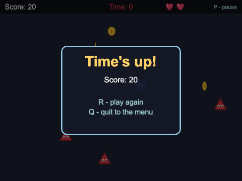

# Chapter 4 - The life of a scene

So far you have written `preload()`, `create()` and `update()` and trusted Phaser to call them. This
chapter looks at exactly **what Phaser calls, and when**, the events a scene announces as it goes,
and what the scene manager can do besides `start` - run scenes side by side, pause them, put them to
sleep and wake them. Then it puts those powers to work in a game with a HUD and a pause menu.


## What you will learn

- the exact order of a scene's life: `constructor` (once), `init`, `preload`, `create`, then
  `update` every frame - and where game objects' `preUpdate` fits in
- the scene events (`CREATE`, `PRE_UPDATE`, `UPDATE`, `POST_UPDATE`, `PAUSE`, `RESUME`, `SLEEP`,
  `WAKE`, `SHUTDOWN`, `DESTROY`) and how to listen for them
- why a `Sprite` subclass must call `super.preUpdate(time, delta)`
- the scene manager: `start`, `restart`, `launch`, `stop`, `pause`/`resume`, `sleep`/`wake`,
  `remove`, `bringToTop`, `isActive`, `get` - and what "paused" and "asleep" really mean
- how scenes running side by side are drawn, and how to use that for a HUD and a pause menu
- which listeners Phaser tidies up when a scene shuts down, which it does not, and how to clean up
  the rest
- `time`, `this.time.now` and `delta`, and the game's frame rate settings

## The projects

| Project | What it shows |
|---|---|
| [ch04_lifecycle_logger](projects/ch04_lifecycle_logger/) | every lifecycle call and scene event written to an on-screen log, with keys to pause, resume, sleep, wake, restart, stop, launch and remove the scene being watched |
| [ch04_pause_and_hud](projects/ch04_pause_and_hud/) | Coin Rush: a game scene with a HUD scene launched on top, and a pause menu scene launched with P that pauses the game |

## The life of a scene

Here is everything that happens to a scene, from the moment the game starts:


`ch04_lifecycle_logger` lets you watch it happen. It has two scenes. `DemoScene`, on the left, is the
scene being watched: every one of its methods writes a line to the log on the right. `LogScene`
draws the log, shows `DemoScene`'s state along the bottom, and reads the keys.

### The constructor - once

`src/scenes/DemoScene.ts`
```ts
constructor() {
  super(DEMO_SCENE);
  eventLog.add("constructor()");
}
```

Phaser makes **one object** of each scene class in the config's list, when the game starts - that is
when the constructor runs, and it never runs again. (Chapter 2 showed what that means for fields.)
At this point the scene has no loader, no clock, no events and no game objects - none of the things
`this.` usually reaches. So the constructor gives the scene its key, and very little else. (That is
why the log is a plain class of its own, `EventLog`, that any file can import.)

### `init`, `preload`, `create` - every time the scene starts

```ts
// Runs every time the scene starts: the place to reset fields
init(): void {
  this.log("init()");
  this.updates = 0;
  this.gameSteps = 0;
  this.framesToLog = 0;
}

// Runs after init(). create() waits until everything queued here has loaded.
preload(): void {
  this.log("preload()");
  this.load.spritesheet(COIN_KEY, COIN_FILE, { frameWidth: 32, frameHeight: 32 });

  this.load.once(Phaser.Loader.Events.COMPLETE, () => {
    this.log("  loader: complete");
  });
}
```

When a scene starts - because it is first in the list, or something called `start` or `launch` -
Phaser calls:

1. `init(data)` - with the data passed to `start`/`launch`, if any. Reset fields here
2. `preload()` - queue files to load. The loader then runs, and Phaser **waits** for it
3. `create(data)` - everything is loaded; make the game objects. The same `data` again
4. the scene's `CREATE` event, just after `create()` returns

Any of the three can be left out. Each log line starts with the frame number (`game.loop.frame`):
`init()` and `preload()` happen in frame 0, but `create()` waits until frame 2, when the coin's
sprite sheet has arrived - with big files on a real server, that could be seconds.

Now press **5** to restart `DemoScene`, and read the log again: `SHUTDOWN`, then `init()`,
`preload()`, `create()` - but no `constructor()`. It is the same object, started again. And
`preload()` finishes at once, in the same frame: the sprite sheet is already loaded, and loaded
files belong to the game, not the scene.

Animations belong to the game too (Chapter 7 is all about them). `DemoScene` makes one in
`create()` - which runs on every restart - so it only makes it the first time:

```ts
if (!this.anims.exists(SPIN_ANIM)) {
  this.anims.create({
    key: SPIN_ANIM,
    frames: this.anims.generateFrameNumbers(COIN_KEY, { start: 0, end: 5 }),
    frameRate: 10,
    repeat: -1,
  });
}
```

Anything that belongs to the whole game needs the same thought: "what happens the second time
`create()` runs?"

## One frame, in order

Once `create()` has finished, the scene is **running**, and Phaser steps it once every frame. A
scene's step has more in it than `update()`:


The logger writes the first frame out in full (after that, 60 lines a second would be too many to
read, so it only counts):

```
    2 PRE_UPDATE event
    2   Spinner.preUpdate()
    2   UPDATE event
    2   update()
    2   POST_UPDATE event
    2   RENDER event
```

- **`PRE_UPDATE`** - Phaser tidies up: game objects added during the last frame join the scene's
  update list
- **`UPDATE`** - Phaser's own systems work: every game object on the update list has its
  `preUpdate(time, delta)` called (the coin, `Spinner`, is one), timers tick, tweens move, physics
  bodies move. Listeners you add to `UPDATE` come after Phaser's, which were there first
- **`update(time, delta)`** - your scene's method, once every game object has moved itself - so the
  rules of the game (did the player touch a coin?) see everything where it will be this frame
- **`POST_UPDATE`** - after `update()`
- **render** - the scene is drawn, then its `RENDER` event

### Listening for scene events

A scene announces all of these on its own **event emitter**, `this.events`. `DemoScene` signs up for
them in `create()`:

```ts
private listen(): void {
  this.events.on(Phaser.Scenes.Events.CREATE, this.onCreate, this);
  this.events.on(Phaser.Scenes.Events.PRE_UPDATE, this.onPreUpdate, this);
  ...
  this.events.on(Phaser.Scenes.Events.PAUSE, this.onPause, this);
  this.events.on(Phaser.Scenes.Events.RESUME, this.onResume, this);
  ...
```

`Phaser.Scenes.Events.PAUSE` is just the string `"pause"`, kept as a constant - use the constants,
for the same reason Chapter 2 used them for scene keys.

These listeners are **methods**, not arrow functions, with a third argument, `this`: the
**context** - the object the method should be called on.

> **Note** - In Java, `this::onClick` remembers which object `onClick` belongs to. In JavaScript,
> `this.onPause` on its own is just the function: called later, it would not know its `this`. So
> Phaser's `on(event, method, context)` keeps the object with the method. (An arrow function keeps
> the `this` from where it was written.) The method style has one big advantage, as you will see:
> the listener can be taken off again with exactly the same three arguments.

## A Sprite's own `preUpdate`

In Chapter 1, `Ball` extended `Image`, and its `preUpdate()` had no `override`, because an `Image`
has no `preUpdate()` of its own. A `Sprite` does. A sprite is an image that can play **animations**,
and its `preUpdate()` is the method that moves the animation on to its next frame. So when a class
of yours extends `Sprite` and has a `preUpdate()`, it is **replacing** Phaser's:

`src/objects/Spinner.ts`
```ts
protected override preUpdate(time: number, delta: number): void {
  ...
  // Sprite's own preUpdate() plays the animation. Press S in the game to leave it out, and the
  // coin still slides (that is our code, below) but stops spinning.
  if (this.scene.registry.get(SKIP_SUPER) !== true) {
    super.preUpdate(time, delta);
  }

  this.x = this.x + this.speed * delta / 1000;
  ...
}
```

Three things to get right:

- **`override`** - it replaces `Sprite`'s method. Leave it out and the build says
  `This member must have an 'override' modifier because it overrides a member in the base class 'Sprite'.`
- **`protected`** (or `public`) - `Sprite` declares `preUpdate` as `protected`. A subclass may make
  it more visible, never less: `private` gives
  `Class 'Spinner' incorrectly extends base class 'Sprite'. Property 'preUpdate' is private in type 'Spinner' but not in type 'Sprite'.`
- **`super.preUpdate(time, delta)`** - the compiler does *not* check this one. Leave it out and
  everything still builds, the sprite still moves, and its animation silently freezes. Press **S** in
  the logger to see it: the coin keeps sliding, stuck on one frame

The rule is the same as in Java: when you override a method, call `super`'s version unless you
really mean to replace everything it did. For a `Sprite`, call it first.

## The scene manager

`this.scene` is the scene's **scene plugin** - its handle on Phaser's scene manager, which owns the
list of every scene in the game. Chapter 2 used `start`. Here is the rest of the family, all of them
in `LogScene`, each on a number key:

`src/scenes/LogScene.ts`
```ts
keyboard.on("keydown-ONE", () => {
  this.logCommand("scene.pause(DEMO_SCENE)");
  this.scene.pause(DEMO_SCENE);
});
...
keyboard.on("keydown-THREE", () => {
  this.logCommand("scene.sleep(DEMO_SCENE)");
  this.scene.sleep(DEMO_SCENE);
});
```

| Method | What it does to the scene | Updated? | Drawn? | Keeps its game objects? |
|---|---|---|---|---|
| `start(key, data)` | stops **this** scene, and starts `key` (restarting it if it is already running) | yes | yes | new ones, from `create()` |
| `launch(key, data)` | starts `key` **alongside** this one - this scene carries on | yes | yes | new ones |
| `restart(data)` | stops and starts **this** scene again | yes | yes | new ones |
| `pause(key)` / `resume(key)` | freezes it / unfreezes it | no | **yes** | yes |
| `sleep(key)` / `wake(key)` | puts it to sleep / wakes it | no | **no** | yes |
| `stop(key)` | shuts it down: `SHUTDOWN` | no | no | no - all destroyed |
| `remove(key)` | shuts it down for good: `DESTROY`; it cannot be started again | - | - | - |

Leave the key out and most of them act on the scene itself: `this.scene.pause()` pauses this scene.
`restart()` only ever restarts its own scene - which is why `LogScene` restarts `DemoScene` by asking
`DemoScene`'s own scene plugin: `demo.scene.restart()`.

### Paused or asleep?

Press **1** to pause `DemoScene`. The coin stops, the numbers stop - `update()` is no longer called,
and neither is the coin's `preUpdate()` - but you can still see it all. A paused scene is **frozen,
not hidden**. Press **2** to resume.

Press **3** to put it to sleep. Now it disappears, and you can see what `LogScene` drew underneath:


A sleeping scene is neither updated nor drawn - but, like a paused one, it keeps everything: its
game objects, its fields, its timers. Press **4** to wake it, and the coin carries on from exactly
where it stopped.

**Pause** a scene that should still be seen - a game behind a pause menu. **Sleep** a scene you will
come back to but do not want on screen - a world map while the player is inside a building. **Stop**
a scene you have finished with; starting it again rebuilds it from `init()`.

While the scene is paused or asleep its `update()` count stops, but **"game steps seen"** keeps going:
the game never stops, only this one scene. And a paused scene does not hear the keyboard or the
mouse - which is why the keys are in `LogScene`. If `DemoScene` read them, pressing 1 would pause it,
and nothing could ever resume it.

### Asking questions

The bottom of the logger reports on `DemoScene` with the scene plugin's questions:
`this.scene.isActive(DEMO_SCENE)`, `isPaused`, `isSleeping`, `isVisible` and `getStatus`.
`isActive` means "running and being updated" - it is `false` while paused. `getStatus` gives the
state as a number (`Phaser.Scenes.RUNNING` is 5, `PAUSED` 6, `SLEEPING` 7, ...).

`this.scene.get(key)` hands you the scene object itself - handy for a tool like this, but a game
scene that reaches into another scene's fields is tied to it. It returns `null` for a key it does
not know (once **8** has removed `DemoScene`), though its type does not say so - hence the `as`:

```ts
private getDemo(): DemoScene | null {
  return this.scene.get(DEMO_SCENE) as DemoScene | null;
}
```

### Requests wait their turn

`pause`, `start`, `launch`, `stop`, `sleep`, `wake` and `restart` do not happen there and then: the
request is **queued**, and the scene manager carries it out as its next update begins. (Keys are read
between frames, so in the log a command, marked `>>`, and the event it causes share a frame number.)

The exceptions are `add` and `remove`, which happen at once when they can. The logger's **8** key
shows why that matters: removing a scene while Phaser is handing a key press to every scene,
including the one being removed, makes Phaser trip over itself
(`TypeError: Cannot read properties of null (reading 'queue')`). So `LogScene` waits a frame:

```ts
this.logCommand("scene.remove(DEMO_SCENE)");
this.time.delayedCall(0, () => {
  this.scene.remove(DEMO_SCENE);
});
```

After a remove, **7** makes a brand new `DemoScene` with `this.scene.add(DEMO_SCENE, DemoScene, true)`,
and this time the log shows `constructor()` again: a new object.

## Cleaning up

When a scene shuts down, Phaser clears away a great deal: its game objects are destroyed, its timers
and tweens thrown away, and listeners on its input (`this.input`, `this.input.keyboard`, game
objects) removed.

But two kinds of listener are **not** removed:

1. **listeners on the scene's own `this.events`.** The scene object is reused, and so is its emitter.
   A listener added in `create()` is still there after a restart - and the next `create()` adds
   another
2. **listeners on anything that lives longer than the scene** - the game's emitter
   (`this.game.events`), the registry's (`this.registry.events`), or another scene's `events`

`DemoScene` uses both. Besides its own events, it listens to the **game's** `STEP` event, which
happens once every frame whatever state the scene is in - that is the "game steps seen" count:

```ts
this.game.events.on(Phaser.Core.Events.STEP, this.onGameStep, this);
```

So when it shuts down, it takes everything off again:

```ts
private onShutdown(): void {
  ...
  this.events.off(Phaser.Scenes.Events.CREATE, this.onCreate, this);
  this.events.off(Phaser.Scenes.Events.PRE_UPDATE, this.onPreUpdate, this);
  ...
  this.game.events.off(Phaser.Core.Events.STEP, this.onGameStep, this);
```

`off(event, method, context)` removes the listener that was added with exactly those three things.
And `onShutdown` itself was added with `once`, which removes itself after it has run.

### A leak you can see

Press **L** to turn on **leak mode** - `onShutdown()` "forgets" to clean up - then **5** twice:


Nearly every event is now logged three times: one listener from each run of `create()`. "game
steps seen" climbs three times faster than `update()` is called, and the status line counts three
listeners for `CREATE` and three for the game's `STEP`.

Here a leak just makes the log noisy. In a real game every leftover listener does its work again -
a score added twice, a sound played three times - or touches a game object that has since been
destroyed, and crashes.

The rule: **whatever you add to an emitter that outlives your scene, take off in `SHUTDOWN`.**
Listen with `once` where one time is enough.

> **Note** - `off` needs the *same* function that `on` was given. This does nothing at all, because
> each arrow function is a new, different function:
> ```ts
> this.game.events.on(Phaser.Core.Events.STEP, () => this.count());
> this.game.events.off(Phaser.Core.Events.STEP, () => this.count());   // removes nothing
> ```
> Pass a method and `this` (as `DemoScene` does), or keep the arrow function in a variable.

### `SHUTDOWN` or `DESTROY`?

`SHUTDOWN` is for a scene that stops but may start again. `DESTROY` is for a scene removed for good.
Phaser empties the scene's own `this.events` on `DESTROY`, but the game's emitter is still yours to
tidy - and a running scene that is removed gets `DESTROY` **without** a `SHUTDOWN` first, so
`DemoScene` tidies the game's emitter in `onDestroy()` as well.

## Time, delta and the frame rate

`update(time, delta)` - and every `preUpdate(time, delta)` - gets two numbers:

- **`time`** - the game's clock, in milliseconds. It counts from when the page loaded, not from when
  the scene started. `this.time.now` is the same value (the logger shows both, side by side)
- **`delta`** - how long the last frame took, in milliseconds (Phaser smooths it a little, so one
  slow frame does not make things jump)

The difference shows when a scene is paused. **`time` keeps going** - the game is still running.
**`delta` only arrives while the scene runs.** Pause for ten seconds and `time` has jumped ten
seconds when you resume, while anything that adds up `delta` has not moved. `ch04_pause_and_hud`
shows why that matters.

### Frame rate

The logger shows `this.game.loop.actualFps`: the frames per second the browser is giving Phaser -
usually the screen's refresh rate, 60, or 120 or 144 on faster screens. The config decides what
Phaser does with them:

`src/main.ts`
```ts
fps: {
  target: 60,
  limit: 0,
},
```

`target` is the rate Phaser expects (60 is the default). `limit` caps it: with `limit: 30`, Phaser
skips browser frames so that the game steps at most 30 times a second (`actualFps` still counts the
browser's frames, so it does not drop). Try `limit: 10` in the logger: the coin moves at the same
speed, in bigger jumps, because it moves by `delta` - the payoff for Chapter 1's pixels per second.

## Pause and HUD


`ch04_pause_and_hud` is a small game, Coin Rush: move the blue blob with the arrow keys, collect the
spinning coins before they fade, keep away from the triangles, and see how much you can collect in
45 seconds. The game is written as four scenes:

`src/main.ts`
```ts
scene: [MenuScene, GameScene, HudScene, PauseScene],
```

`MenuScene` loads everything and waits for SPACE. `GameScene` is the game. It does not draw the score,
lives or time - `HudScene` does, running **on top of it**. And P opens `PauseScene`, on top of both,
while `GameScene` is paused underneath:


Scenes that are running at the same time are drawn in the order of the scene list - the first at the
back. (They are *updated* in the opposite order: the top scene first.)

### A HUD in its own scene

Why not just add the text to `GameScene`? Each scene has its own camera, so when a later chapter
makes the game's camera follow the player round a big world, or shake, the HUD stays put. And the
HUD's code lives in its own class, not tangled into the game's.

`GameScene` launches it at the end of `create()`:

`src/scenes/GameScene.ts`
```ts
const hudData: HudData = { score: this.score, lives: this.lives, seconds: this.secondsShown };
this.scene.launch(HUD_SCENE, hudData);
```

`launch` starts the HUD **alongside** `GameScene` - `start` would stop `GameScene`. And because the
launch is queued, the HUD's `create()` will not run until after `GameScene`'s has finished, so it is
handed the starting values as data rather than left to wait for the first change.

### The HUD listens

From then on, `GameScene` never touches the HUD. When something changes, it **emits an event** on its
own emitter:

```ts
private collect(coin: Coin): void {
  coin.destroy();
  this.sound.play(COIN_SOUND_KEY);
  this.score = this.score + COIN_POINTS;
  this.events.emit(SCORE_CHANGED, this.score);
}
```

`this.events.emit(name, value)` calls every listener for `name`, passing them `value`. The names are
constants in `src/scenes/gameEvents.ts`. The HUD listens:

`src/scenes/HudScene.ts`
```ts
// Listen to GameScene's own emitter. That emitter belongs to GameScene, not to this scene,
// so Phaser will not remove these listeners when the HUD shuts down - we must.
const gameScene = this.scene.get(GAME_SCENE);
gameScene.events.on(SCORE_CHANGED, this.showScore, this);
gameScene.events.on(LIVES_CHANGED, this.showLives, this);
gameScene.events.on(TIME_CHANGED, this.showTime, this);

this.events.once(Phaser.Scenes.Events.SHUTDOWN, () => {
  gameScene.events.off(SCORE_CHANGED, this.showScore, this);
  gameScene.events.off(LIVES_CHANGED, this.showLives, this);
  gameScene.events.off(TIME_CHANGED, this.showTime, this);
});
```

This is the cleaning-up rule at work. The listeners are on **`GameScene`'s** emitter, which outlives
every run of the HUD: without the `SHUTDOWN` handler, after two restarts every score change would be
handled three times. (Here that does no visible harm - which is what makes leaks easy to miss.
Chapter 6 compares this way of feeding a HUD with two others.)

The HUD belongs with the game, so when `GameScene` shuts down - a restart, or quitting to the menu -
it stops the HUD too:

`src/scenes/GameScene.ts`
```ts
this.events.once(Phaser.Scenes.Events.SHUTDOWN, () => {
  this.scene.stop(HUD_SCENE);
});
```

### Pausing

P (or ESC) calls this:

```ts
private pauseGame(): void {
  const data: PauseData = { gameOver: false, title: "Paused", score: this.score };
  this.scene.launch(PAUSE_SCENE, data);
  this.scene.pause();
}
```


Launch the pause menu, pause this scene. Everything in `GameScene` freezes: the player and the
triangles (their `preUpdate()` is not called), the coins (their animation is in `preUpdate()` too),
the round's timer and the coin spawner (the scene's clock is not updated), the keyboard (a paused
scene hears nothing). And it all stays on screen, behind the darkened panel. The HUD is still
running, but nothing is emitting events, so it has nothing to change.

`PauseScene` reads its own keys:

`src/scenes/PauseScene.ts`
```ts
keyboard.once("keydown-R", () => {
  // start() stops THIS scene and starts GameScene - which, being paused, is shut down and
  // started again from init()
  this.scene.start(GAME_SCENE);
});
keyboard.once("keydown-Q", () => {
  this.scene.stop(GAME_SCENE);
  this.scene.start(MENU_SCENE);
});
```

```ts
// resume the game, and take this scene away
private carryOn(): void {
  this.scene.resume(GAME_SCENE);
  this.scene.stop();
}
```

`this.scene.stop()` with no key stops the pause scene itself; next time P is pressed it starts fresh.
Its `create()` begins with `this.scene.bringToTop()`, which moves it to the end of the scene list -
it is last already, but this keeps it on top whatever order the list is later given. (`sendToBack`,
`moveAbove` and `moveBelow` do the other moves.)

`GameScene`'s P listener uses `on`, not `once`: that scene keeps running after a pause, and P must
work every time. `PauseScene` uses `once`: it is stopped after one choice.

### Game over, with the same scene

When the time runs out, or the last life goes, `endRound()` does almost the same thing - pauses the
game and launches `PauseScene` - but with `gameOver: true` in the data, so the pause scene leaves out
"P - carry on", and its P key. One scene, two uses, told apart by its data.



### Time that survives a pause

After the player is hit, they are safe for a second and a half. The obvious way is to remember the
time and compare:

```ts
// NOT what the game does
this.safeUntil = this.time.now + SAFE_TIME;
...
if (this.time.now > this.safeUntil) { ... }
```

But `this.time.now` is the game's clock, and it keeps going while the scene is paused. Pause during
the safe time, wait, carry on - and the safe time has already gone. So the game uses a **timer**,
which belongs to the scene's clock and only counts while the scene runs:

`src/scenes/GameScene.ts`
```ts
this.player.setAlpha(0.4);
this.time.delayedCall(SAFE_TIME, () => {
  this.safe = false;
  this.player.setAlpha(1);
});
```

The round's 45 seconds are a timer too (`this.time.addEvent(...)`, and `roundTimer.getRemaining()`
for the HUD). And each coin counts its own age with `delta`:

`src/objects/Coin.ts`
```ts
protected override preUpdate(time: number, delta: number): void {
  super.preUpdate(time, delta);

  // Age by delta, not by the clock: delta only arrives while the scene is running, so a
  // coin's four seconds do not tick away while the game is paused.
  this.age = this.age + delta;

  const timeLeft = LIFETIME - this.age;
  if (timeLeft <= 0) {
    this.destroy();
  } else if (timeLeft < FADE_TIME) {
    this.setAlpha(timeLeft / FADE_TIME);
  }
}
```

`Coin` is a `Sprite` (it spins), so here is `super.preUpdate(time, delta)` again, first.

**Rule of thumb:** in a game that can be paused, measure time with **timers** and **`delta`**, not by
comparing `time` or `this.time.now`.

## Common mistakes

> **Note** - **"My animation does not play."** A `Sprite` subclass with a `preUpdate()` that does not
> call `super.preUpdate(time, delta)`. It builds, it moves, it never changes frame.
>
> **"Everything happens twice after I restart."** A listener added in `create()` to `this.events`,
> `this.game.events`, `this.registry.events` or another scene's `events`, and never removed. Take it
> off in `SHUTDOWN`.
>
> **"`this.scene.start(PAUSE_SCENE)` made my game disappear."** `start` stops the scene that called
> it. To run a scene alongside, use `launch`.
>
> **"The timer ran out while I was paused."** Time measured with `time` or `this.time.now`. Use a
> timer, or add up `delta`.

## Summary

- the constructor runs **once**, when the game starts; `init`, `preload` and `create` run every time
  the scene starts; `update` runs every frame while it is running
- each frame, for each running scene: `PRE_UPDATE`, `UPDATE` (game objects' `preUpdate`, timers,
  tweens, physics), your `update()`, `POST_UPDATE`, then drawing
- listen for scene events with `this.events.on(Phaser.Scenes.Events.X, this.method, this)`
- a `Sprite` subclass overrides `protected preUpdate` - and must call `super.preUpdate(time, delta)`
- `launch` runs a scene alongside; `pause` freezes a scene but still draws it; `sleep` hides it too;
  `stop` shuts it down; `remove` destroys it. Requests are queued until the next frame
- running scenes are drawn in the order of the scene list; `bringToTop` moves one to the front
- Phaser clears a scene's game objects, timers, tweens and input listeners when it shuts down - but
  not listeners on `this.events` or on longer-lived emitters. Remove those in `SHUTDOWN`
- `time` and `this.time.now` keep going while a scene is paused; timers and `delta` do not
- `fps: { target, limit }` sets the frame rate; things that move by `delta` do not care

## Challenges

1. **Count the frames drawn** *(ch04_lifecycle_logger)* - Count how many times `DemoScene` has been
   drawn (its `RENDER` event) since it started, and show it with the number of `update()` calls in
   the status lines at the bottom - not in `DemoScene`'s own text (why not?). Pause the scene, then
   put it to sleep: which numbers stop?

2. **Thirty frames a second** *(ch04_pause_and_hud)* - Limit the game to 30 frames a second, and show
   on the HUD how many frames the game *really* runs each second (`actualFps` counts the browser's).
   Check that the player and the triangles move just as fast as before.

3. **How long was I away?** *(ch04_pause_and_hud)* - The pause menu shows how long the game has been
   paused, counting up in tenths of a second. When the player carries on, the HUD shows the total
   time paused this round. A pause must count once, however many times the round has been restarted.

4. **Settings** *(ch04_pause_and_hud)* - Add "S - settings" to the pause menu. It opens a new
   `SettingsScene` over the paused game while the pause menu sleeps; S or ESC closes it and wakes the
   pause menu. One setting: H turns the HUD on and off, at once, and it stays that way after a
   restart. *Hint:* `this.scene.setVisible(false, key)` hides a scene without pausing it. Where can a
   setting live that outlasts every scene?

5. **Fade in, fade out** *(ch04_pause_and_hud)* - The menu fades to black before the game starts, and
   the game and HUD fade in; restarting or quitting from the pause menu fades out first too. A key
   pressed during a fade must not start another. *Hint:* `this.cameras.main.fadeOut(ms)`, `fadeIn(ms)`
   and the camera event `Phaser.Cameras.Scene2D.Events.FADE_OUT_COMPLETE`. A camera's effects are
   updated with its scene - so which camera can fade while the game is paused?

6. **Auto-pause, without a leak** *(ch04_pause_and_hud)* - Open the pause menu by itself when the
   window loses focus or the tab is hidden - but only while a round is being played. Then prove there
   is no leak: show on the HUD how many listeners the game's emitter has for those events, and check
   the number does not grow however often you restart, or quit and play again. *Hint:* the events are
   `Phaser.Core.Events.BLUR` and `HIDDEN` on `this.game.events`, which lives as long as the game;
   `listenerCount(event)` counts (Phaser has listeners of its own there). To test, click on another
   window, or switch tab and back.

---

Previous: [Chapter 3 - Preloading](../ch03_preloading/README.md) ·
Next: [Chapter 5 - Audio](../ch05_audio/README.md)
