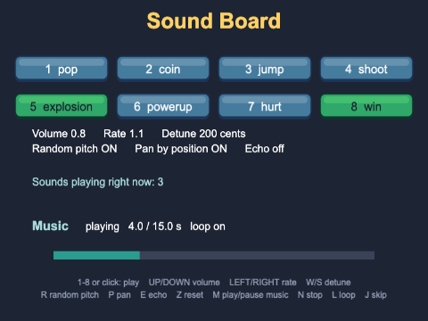
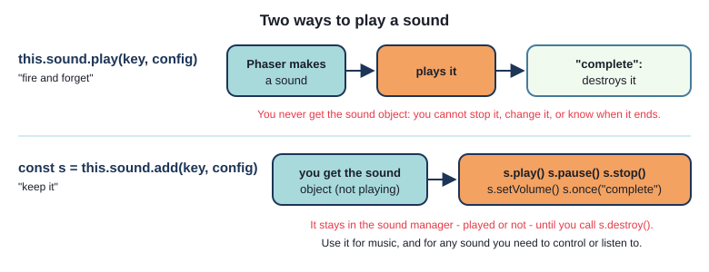
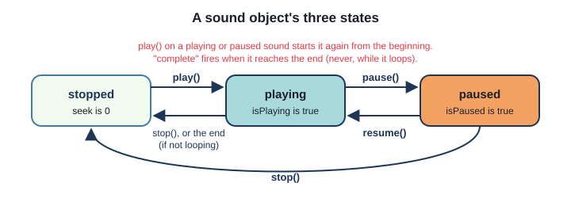
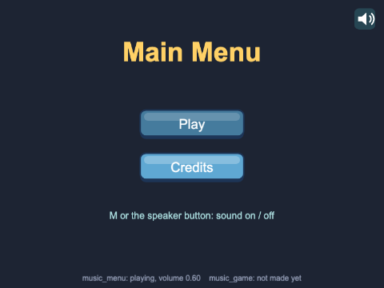
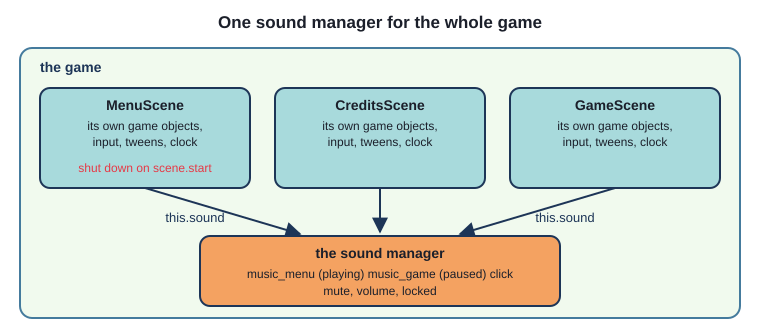
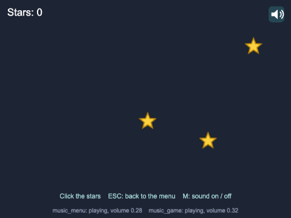
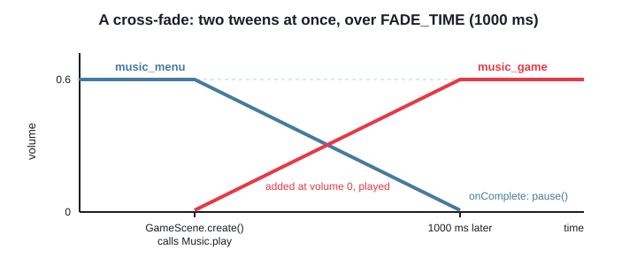
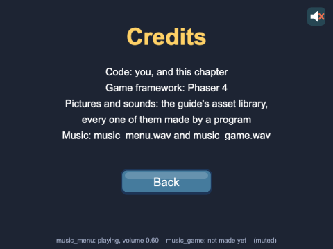
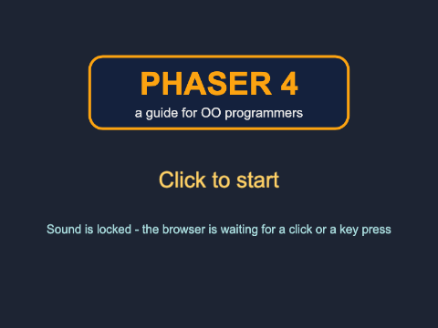

# Chapter 5 - Audio

A game without sound feels strangely empty: a click that makes no noise, a jump with no *boing*, a
menu with no music. In this chapter you learn how Phaser plays sound effects and music - loading
them, playing them in different ways, changing them while they play - and how to deal with the two
things about audio that surprise everyone: music does not stop when the scene that started it does,
and a browser will not let a page make a sound until the player has clicked on it.



## What you will learn

- how to load sounds, and the two ways to play one: `this.sound.play()` and `this.sound.add()`
- how to change a sound with a config object - volume, rate, detune, pan, loop, delay - and with a
  sound object's methods while it plays
- a sound object's life: playing, paused, stopped, the `"complete"` event, and `destroy()`
- why the sound manager belongs to the **game**, not to a scene - and how to keep one copy of the
  music playing as the scenes change
- how to fade and cross-fade music with tweens, and mute every sound in the game
- the browser's autoplay rule, `this.sound.locked`, and "click to start" screens

## The projects

| Project | What it shows |
|---|---|
| [ch05_sound_board](projects/ch05_sound_board/) | eight pads that play sound effects, keys that change how they sound, and a music track to play, pause, stop, loop and skip through |
| [ch05_music_across_scenes](projects/ch05_music_across_scenes/) | a title screen, a menu, credits and a tiny game, with music that carries on between scenes, cross-fades, and a mute button that works everywhere |

## Loading sounds

Sounds are loaded like pictures (Chapter 3), in `preload()`, with a key and a file:

`ch05_sound_board/src/scenes/SoundBoardScene.ts`
```ts
preload(): void {
  for (const pad of PAD_SOUNDS) {
    this.load.audio(pad.key, pad.file);
  }
  this.load.audio(MUSIC_KEY, MUSIC_FILE);
  this.load.image(BUTTON_KEY, BUTTON_FILE);
  this.load.image(BUTTON_OVER_KEY, BUTTON_OVER_FILE);
}
```

`PAD_SOUNDS` is an array of `{ key, file }` objects in `src/assets.ts`, so the list of sounds is data,
and the loop loads them all. Once loaded, a sound is **decoded** - turned from a file into raw audio
the browser can play - and kept in the game's audio cache under its key, for every scene to use.

The guide's sounds are all WAV files, which every browser plays. Real games usually use smaller,
compressed formats - MP3, OGG, M4A - and not every browser plays every format (Safari has no OGG,
for example). So `load.audio` also takes an **array** of files, and Phaser loads the first one this
browser can play:

```ts
this.load.audio("theme", ["assets/audio/theme.ogg", "assets/audio/theme.mp3"]);
```

> **Note** - Music files are big: `music_game.wav` is 660 KB, bigger than every picture in the
> project put together. Load music in a loading scene (Chapter 3), so the player is not left staring
> at a black screen.

## Playing a sound: fire and forget

The quickest way to play a sound is the one Chapter 2 used:

```ts
this.sound.play("coin");
```

`this.sound` is the **sound manager**. `play(key)` makes a sound, plays it, and - when it has
finished - throws it away. You never see the sound object, so you cannot stop it or change it once it
has started. For most sound effects that is exactly right: a coin pings, and that is the end of it.

`play` takes a second argument: a **config** object that says *how* to play it. Only the settings you
give change; the rest keep their defaults.

| Setting | Default | What it does |
|---|---|---|
| `volume` | 1 | 0 is silent, 1 is full volume |
| `rate` | 1 | speed: 2 is twice as fast (and an octave higher), 0.5 half speed (an octave lower) |
| `detune` | 0 | pitch, in **cents**: 100 cents is a semitone, 1200 an octave; -1200 to 1200 |
| `pan` | 0 | -1 is fully left, 0 the middle, 1 fully right |
| `loop` | false | start again from the beginning each time it ends |
| `delay` | 0 | wait before starting - in **seconds** |
| `seek` | 0 | start this far in - in **seconds** |
| `mute` | false | silent, but still "playing" |

`SoundConfig` is a Phaser type (`Phaser.Types.Sound.SoundConfig`), but the object itself is just an
**object literal** (Chapter 2). The sound board's echo uses one - the same sound again, quieter and a
quarter of a second later:

`ch05_sound_board/src/scenes/SoundBoardScene.ts`
```ts
if (this.echo) {
  this.sound.play(pad.soundKey, { ...config, volume: this.volume * ECHO_VOLUME, delay: ECHO_DELAY });
}
```

`{ ...config, volume: ..., delay: ... }` is the **spread** from Chapter 2: a copy of the pad's config,
with a new volume and a delay.

> **Note** - Almost everything in Phaser is timed in milliseconds - but `delay` and `seek` in a sound
> config are in **seconds**. `delay: 250` does not wait a quarter of a second: it waits four minutes.
> There is no error, just a sound that never seems to play.

## Rate and detune

Both change the pitch, and both change the speed - in Web Audio, a sound played higher is played
faster, like a record at the wrong speed. The difference is the units:

- `rate` is a multiplier: `rate: 2` is twice as fast and an octave higher
- `detune` is in cents, the unit musicians use: `detune: 1200` is also an octave higher - and so also
  twice as fast. `detune: 100` is one semitone, the next note up on a piano

Use `detune` when you think in notes ("two semitones up"), and `rate` when you think in speed ("a
little faster"). Phaser multiplies them together, so they can be used at the same time. Try them on
the sound board: LEFT/RIGHT change the rate, W/S the detune, a semitone per press.

## Keeping hold of a sound: `add`

When you need to control a sound after it starts - stop it, change its volume, know when it ends -
use `this.sound.add(key, config)` instead. It makes the sound object and **gives it to you**. It does
not start it: you call `play()` when you want it.



Each pad on the sound board lights up while its sound plays, and goes out when it ends - so it needs
the sound object, to listen for its end:

`ch05_sound_board/src/objects/SoundPad.ts`
```ts
public play(config: Phaser.Types.Sound.SoundConfig): void {
  // add() makes a Sound object and keeps it in the sound manager until it is destroyed.
  // Unlike this.sound.play(key), it gives us the object - so we can listen for its end
  const sound = this.scene.sound.add(this.soundKey);

  sound.once(Phaser.Sound.Events.COMPLETE, () => {
    this.playing = this.playing - 1;
    this.showState();
    // a sound made with add() stays in the manager until destroyed - and we will not need
    // this one again (the next press makes a new one)
    sound.destroy();
  });

  sound.play(config);
  this.playing = this.playing + 1;
  this.showState();
}
```

- a sound is an event emitter, like a game object: `sound.once(event, callback)` listens for one
  event. `Phaser.Sound.Events.COMPLETE` is the constant for `"complete"`, which fires when the sound
  reaches its end. (There are others: `"play"`, `"pause"`, `"resume"`, `"stop"`, `"looped"`)
- `sound.play(config)` plays it, with the settings the scene worked out
- the pad counts how many of its sounds are playing, because you can press it again before the first
  one has finished - both play at once, and the pad should only go out when the last one ends

**Sounds made with `add()` are not thrown away for you.** `this.sound.play()` destroys its sound when
it completes; `add()` leaves it in the sound manager until you call `destroy()`. Forget, and every
press of a pad would leave another dead sound object behind, for as long as the game runs.

### What type is a sound?

The sound board keeps its music in a field. What type is it? When a game starts, Phaser picks one of
**three** sound managers: Web Audio (nearly every browser), HTML5 Audio (very old browsers), or "no
audio" (no sound hardware, or sound turned off in the config). Each makes its own kind of sound, so
the honest answer is "one of three" - a **union type** (Chapter 2):

`ch05_sound_board/src/GameSound.ts`
```ts
export type GameSound = Phaser.Sound.WebAudioSound | Phaser.Sound.HTML5AudioSound | Phaser.Sound.NoAudioSound;
```

`type` gives a type a name - like a very short interface. All three classes have the same methods
(`play`, `setVolume`, ...), so TypeScript lets you call any of them on a `GameSound`, whichever one
Phaser picked. `SoundPad` does not need the type written out at all: `const sound = this.scene.sound.add(...)`
lets TypeScript work it out.

## Controlling a sound while it plays

The sound board's music is **one** sound object, made once in `create()` and kept:

`ch05_sound_board/src/scenes/SoundBoardScene.ts`
```ts
// The music is made ONCE, with add(), and kept: it is the same sound object every time it is
// played, paused or changed. Adding it does not start it.
this.music = this.sound.add(MUSIC_KEY, { loop: true, volume: MUSIC_VOLUME });
```

A sound object is always in one of three states:



M plays, pauses and carries on - three jobs for one key, depending on the state:

```ts
private playOrPauseMusic(): void {
  if (this.music.isPlaying) {
    this.music.pause();
  } else if (this.music.isPaused) {
    this.music.resume();
  } else {
    this.music.play();
  }
}
```

`pause()` remembers where the sound had got to, and `resume()` carries on from there; `stop()` goes
back to the start. Calling `play()` on a sound that is already playing starts it again from the
beginning - which is why the code checks first.

Every setting in the config table can be changed while a sound plays, with a `set...` method or by
setting the property:

```ts
private changeRate(step: number): void {
  this.rate = Phaser.Math.Clamp(this.rate + step, MIN_RATE, MAX_RATE);
  this.music.setRate(this.rate);
  this.showSettings();
}
```

`Phaser.Math.Clamp(value, min, max)` keeps a value between a minimum and a maximum. The `set...`
methods return the sound itself, so they can be **chained**, as Phaser's game object methods can:

```ts
this.music.setVolume(MUSIC_VOLUME).setRate(1).setDetune(0);
```

The others: `setLoop(true)` (the L key), `setPan(-1)`, `setMute(true)`, and `setSeek(seconds)`,
which jumps to a place in the sound (the J key). Seeking only works while a sound is playing:

```ts
private skipMusic(): void {
  if (this.music.isPlaying) {
    const seek = (this.music.seek + MUSIC_SKIP) % this.music.duration;
    this.music.setSeek(seek);
  }
}
```

`music.seek` is how far through the sound it is, in seconds, and `music.duration` its length. The
`%` wraps the new position round to the start if it would go past the end. `update()` uses the same
two values every frame to draw the progress bar.

## Making repeated sounds less boring

Click the same pad ten times, and by the fifth it sounds like a machine - because it is. Real sounds
are never quite the same twice. Two cheap tricks help:

- **random pitch**: a small random `detune` each time. Press R on the sound board, then play a pad
  over and over
- **pan by position**: play a sound from the side of the screen it came from. Press P, then play the
  pads on the far left and far right (use headphones)

The music project's game uses both. Every star you click plays a coin sound:

`ch05_music_across_scenes/src/scenes/GameScene.ts`
```ts
const centreX = this.scale.width / 2;
this.sound.play(COIN_KEY, {
  detune: Phaser.Math.Between(-RANDOM_DETUNE, RANDOM_DETUNE),
  pan: (star.x - centreX) / centreX * MAX_PAN,
});
```

`Phaser.Math.Between(min, max)` is a random whole number from `min` to `max`. The pan sum turns the
star's x (0 to 800) into a number from -1 to 1, then `MAX_PAN` (0.8) keeps it from going fully to one
side, which sounds odd.

> **Note** - Panning needs Web Audio's stereo panner, and Phaser does not use it on iPhones and
> iPads (older versions of Safari had none): there, `pan` is quietly ignored. Make it a finishing
> touch, never something the game depends on.

## The sound manager belongs to the game



Here is the fact that shapes every game with music: **`this.sound` is the same object in every
scene.** There is one sound manager, and it belongs to the game. Each scene has its own game objects,
input, clock and tweens - all thrown away when the scene shuts down - but it shares the sound
manager with every other scene.



So when `this.scene.start(...)` shuts a scene down, its sounds **keep playing**. That is what you
want for music: the menu music carries on while the player looks at the credits. It is also why the
click in `MenuButton` still plays after the button's scene has gone:

`ch05_music_across_scenes/src/objects/MenuButton.ts`
```ts
this.on("pointerdown", () => {
  // fire and forget: the click carries on playing even though onClick() usually starts
  // another scene - sounds belong to the game, not to the scene that played them
  scene.sound.play(CLICK_KEY);
  onClick();
});
```

But it causes a bug in almost every first attempt at music. Suppose the menu's `create()` did this:

```ts
this.sound.add(MUSIC_MENU_KEY, { loop: true }).play();
```

Menu, credits, menu: the menu's `create()` runs again - it runs every time the scene starts - and
adds a **second** copy of the music, on top of the first, which never stopped. Go back and forth a
few times and there are five copies, slightly out of step, getting louder and louder. (That is not a
guess: with that change, after menu - credits - menu - credits - menu, `this.sound.getAllPlaying()`
holds five `music_menu` sounds.)

The fix is to ask the sound manager first. `this.sound.get(key)` returns the sound with that key if
there is one - and `null` if there is not.

### One place for the music

In the music project, every scene says which music it wants, in its `create()`:

`ch05_music_across_scenes/src/scenes/MenuScene.ts`
```ts
Music.play(this, MUSIC_MENU_KEY);
```

`CreditsScene` asks for the same track, and `GameScene` for `MUSIC_GAME_KEY`. `Music` is a small class
of our own that decides what to do:

`ch05_music_across_scenes/src/Music.ts`
```ts
public static play(scene: Phaser.Scene, key: string): void {
  // fade out every OTHER track that is playing
  for (const otherKey of MUSIC_TRACKS) {
    if (otherKey !== key) {
      Music.fadeOut(scene, otherKey);
    }
  }

  // Is this track in the sound manager already? Phaser's types say get() always returns a
  // sound, but it returns null when there is no sound with that key - so we say so ourselves.
  let music: Phaser.Sound.BaseSound | null = scene.sound.get(key);

  if (music === null) {
    // the first time: make it (silent), and start it
    music = scene.sound.add(key, { loop: true, volume: 0 });
    music.play();
  } else if (music.isPaused) {
    // faded out earlier: carry on from where it was
    music.resume();
  } else if (!music.isPlaying) {
    music.play();
  }
  // (and if it is already playing, leave it alone - it just gets faded up to full volume)
```

- `static` means the same as in Java: `play` belongs to the class, and is called as `Music.play(...)`,
  with no `new Music()`. The music does not belong to any scene, so it is given a home of its own -
  but the scene is passed in, because Phaser's sound manager and tweens are reached through a scene
- `Phaser.Sound.BaseSound | null`: Phaser's type for `get` forgets to say it can return `null`. Writing
  the union ourselves makes TypeScript insist on the `=== null` check
- menu to credits: `music_menu` is already playing, so nothing starts - it just carries on. Menu to
  game: `music_game` is made (the first time) or resumed (after that), and `music_menu` fades out



## Fading with tweens

A **tween** changes a number on an object smoothly, over time. Chapter 7 covers tweens properly; here
is all you need for fading. Volume is a number on the sound, so a tween can fade it:

`ch05_music_across_scenes/src/Music.ts`
```ts
// stop any fade that is still running on it (it might be fading OUT), then fade it in
scene.tweens.killTweensOf(music);
scene.tweens.add({
  targets: music,
  volume: MUSIC_VOLUME,
  duration: FADE_TIME,
});
```

"Take `music`, and move its `volume` from whatever it is now to `MUSIC_VOLUME`, over `FADE_TIME`
milliseconds." Fading out is the same, towards 0, with one more thing - an `onComplete` function that
the tween calls when it has finished:

```ts
scene.tweens.add({
  targets: music,
  volume: 0,
  duration: FADE_TIME,
  onComplete: () => {
    music.pause();
  },
});
```

A silent track is still playing, so it is paused at the end of the fade - and resumed, from the same
place, when the player comes back to that scene. Both tweens run at the same time, so one track
fades out while the other fades in: a **cross-fade**.



`killTweensOf(music)` stops any tween this scene already has running on the music. Without it, a
second fade could start while the first was still going: two tweens pulling one volume in opposite
directions - and a fade-out's `onComplete` pausing music that is meant to be playing. In this
project each scene calls `Music.play` once, so it is a safety net; the moment anything else tweens
the music's volume (challenge 4 does), it earns its place.

### Whose tweens?

The music belongs to the game, but **tweens belong to a scene** - `scene.tweens` - and when a scene
shuts down, its tweens are thrown away, finished or not. So a menu that started fading its own music
out, then called `this.scene.start(GAME_SCENE)`, would leave the menu music stuck half-way, playing
quietly underneath the game for ever.

That is why `Music.play` is called by the scene that is **starting**, in its `create()`, and makes
both fades with that scene's tweens: that scene will be around to finish them.

The `MusicMonitor` line at the bottom of each scene shows each track's state and volume every frame,
so you can watch the fades happen - and see that `music_game` is only ever paused, never made twice.

## Mute, everywhere



Two properties of the sound manager affect every sound in the game:

- `this.sound.mute = true` silences everything - sounds playing now, and sounds started later
- `this.sound.volume = 0.5` is a master volume: every sound's own volume is multiplied by it

Each scene makes its own `MuteButton` - a game object belongs to one scene - but they all show and
change the same setting:

`ch05_music_across_scenes/src/objects/MuteButton.ts`
```ts
private isMuted(): boolean {
  return this.scene.registry.get(MUTED) === true;
}

private toggle(): void {
  const muted = !this.isMuted();
  this.scene.registry.set(MUTED, muted);
  // this.sound.mute silences every sound in the game - playing ones, and ones not yet started
  this.scene.sound.mute = muted;
  this.showState();
}

private showState(): void {
  this.setTexture(this.isMuted() ? SOUND_OFF_KEY : SOUND_ON_KEY);
}
```

`this.sound.mute` is itself game-wide, so strictly the registry is not needed. It is there because
the registry (Chapter 2) is where the game keeps its **settings**: the button reads the setting to
choose its picture (`sound_on.png` or `sound_off.png`), and when a setting needs to outlive the page -
saved in the browser, say - the registry is the one place to save it from. Until the button is first
pressed there is nothing in the registry (`undefined`), so `=== true` counts that as "not muted".

The button also listens for the M key, on its own scene's keyboard. Those listeners go when the scene
shuts down, and the next scene's button adds its own - so M always works, and never twice.

## The browser's autoplay rule



Imagine opening a web page and having it blare music at you. Browsers decided no page may do that:
**a page may not play any sound until the player has interacted with it** - clicked, tapped or
pressed a key. Until then, Phaser's sound manager is **locked**. Phaser listens for that first click
or key press itself, and unlocks the sound as soon as it comes.

What happens to a sound played while the sound is locked? Phaser keeps it waiting, and it starts when
the sound unlocks. That sounds fine, but anything timed goes wrong: a fade-in happens in silence, so
the music starts at full volume - and every sound effect "played" before the click comes out at
once, the moment it is unlocked. (Try it: three effects played a second apart while locked all
start together on the first click.)

So most browser games start with a **"click to start"** screen. It has no sound, and the click that
leaves it is the one that unlocks the sound - so by the time the menu starts its music, the sound is
ready.

`ch05_music_across_scenes/src/scenes/TitleScene.ts`
```ts
if (this.sound.locked) {
  status.setText("Sound is locked - the browser is waiting for a click or a key press");

  // The sound manager belongs to the game, so a listener on it outlives this scene. The
  // click that unlocks the sound also starts the menu - and "unlocked" arrives a frame
  // later, when this scene and its text are gone. So take the listener off at SHUTDOWN.
  const onUnlocked = (): void => {
    status.setText("Sound is unlocked");
  };
  this.sound.once(Phaser.Sound.Events.UNLOCKED, onUnlocked);
  this.events.once(Phaser.Scenes.Events.SHUTDOWN, () => {
    this.sound.off(Phaser.Sound.Events.UNLOCKED, onUnlocked);
  });
} else {
  status.setText("Sound is ready");
}
```

- `this.sound.locked` is `true` until the browser allows sound
- the sound manager emits `"unlocked"` (`Phaser.Sound.Events.UNLOCKED`) when it has been unlocked

Notice the `SHUTDOWN` listener - the lesson of Chapter 4, met for real. The first version of this
scene did not have it. The click that unlocks the sound also starts the menu, which shuts the title
scene down and destroys its text. The `"unlocked"` event comes a frame later - and the listener,
which lives on the game-wide sound manager, not the scene, tried to change text that no longer
existed:

```
TypeError: Cannot read properties of null (reading 'drawImage')
```

**Any listener you put on something that outlives the scene - the sound manager, `this.game.events`,
the registry's events - must be taken off when the scene shuts down.** A listener on the scene's own
objects, or `this.input`, is cleaned up for you.

Whether you ever see "Sound is locked" depends on the browser, and on the page's history: some
browsers let a page play sound straight away when you have clicked on it before, or often play
sound on that site. Test with a fresh browser window, as a new player would see it.

> **Common mistakes**
>
> - **Two copies of the music**: playing the music in a scene's `create()` without checking
>   `this.sound.get(key)` first. Every visit to the scene adds another copy
> - **Music that never stops**: forgetting that sounds carry on when their scene shuts down. Stop or
>   fade out music on purpose, when a scene that should be quiet starts
> - **`delay: 500` does nothing**: sound delays and seeks are in seconds, not milliseconds
> - **Sounds that pile up**: `add()` without `destroy()`. Use `this.sound.play()` for effects you do
>   not need to control
> - **A fade that stops half-way**: a tween made in a scene that is shutting down is thrown away
>   with it
> - **`Audio key "music_menu" not found in cache`**: the sound was not loaded under that key - a
>   misspelled key, or a file that failed to load (look for a red 404 in the browser's console)

## Summary

- `this.load.audio(key, file)` loads a sound; an array of files lets the browser pick a format
- `this.sound.play(key, config)` plays a sound and throws it away when it ends - fire and forget
- `this.sound.add(key, config)` gives you a sound object to keep: `play`, `pause`, `resume`, `stop`,
  `isPlaying`, `isPaused`, `seek`, `duration`, and `setVolume`, `setRate`, `setDetune`, `setPan`,
  `setLoop`, `setSeek`. Destroy it when you are done with it
- a config object sets `volume`, `rate`, `detune` (cents), `pan`, `loop`, `delay` and `seek` (seconds)
- `sound.once("complete", ...)` tells you when a sound has finished
- a little random detune and a pan by position keep repeated sounds from sounding mechanical
- the sound manager belongs to the game: sounds keep playing across scenes, so check
  `this.sound.get(key)` before starting music; `this.sound.mute` and `this.sound.volume` affect
  everything
- tween a sound's `volume` to fade it; tweens belong to the scene that made them
- sound is locked until the player interacts with the page: `this.sound.locked`, the `"unlocked"`
  event, and a "click to start" screen

## Challenges

1. **More pads** *(ch05_sound_board)* - Add four more pads in a third row, for `door`, `whoosh`,
   `correct` and `wrong` (copy the files from the asset library's `audio/` folder into
   `public/assets/audio/`). Pad 9 should also play with the 9 key; the others can be click-only.

2. **Turn it down** *(ch05_music_across_scenes)* - The V key changes the master volume of the whole
   game, in every scene except the title: 100%, then 60%, then 30%, then back to 100%. Show the
   current level as a small percentage next to the mute button.

3. **Remember the mute** *(ch05_music_across_scenes)* - Make the mute setting survive refreshing the
   page. Browsers keep small strings for a site in `localStorage`:
   `localStorage.setItem("muted", "true")` saves one, and `localStorage.getItem("muted")` gives it back
   (or `null` if there is nothing saved). Chapter 6 says more about it. The game should start muted
   if it was muted when the page was closed.

4. **Duck the music** *(ch05_music_across_scenes)* - In the game, every tenth star plays the power-up
   sound. Make the music "duck" under it: drop to a fifth of its volume while the power-up plays, and
   come back up when it has finished. *Hint:* you need to know when the power-up ends, so
   `this.sound.play()` will not do. And the music is in the sound manager: `this.sound.get(...)` will
   find it.

5. **On the beat** *(ch05_music_across_scenes)* - `music_game.wav` is 128 beats per minute. Add a
   circle to the game that pulses - grows, then shrinks back - on every beat. It must stay in time
   after the music has been paused and resumed (leave the game and come back). *Hint:* do not count
   beats with a timer - it drifts, and it does not know about pauses. Work out, every frame, which beat
   the music is on from its `seek`, and pulse when the beat number changes.

6. **Jukebox** *(ch05_sound_board)* - Turn the music strip into a playlist of three tracks -
   `music_menu`, `music_game` and `music_action` - that plays them in order, one after another, and
   goes back to the first after the last. K skips to the next track. Show the name of the track that
   is playing. *Hint:* a track that does not loop fires `"complete"` when it ends. Think about what
   should happen to the playing track when K is pressed, and whether its `"complete"` listener should
   still fire.

---

Previous: [Chapter 4 - The life of a scene](../ch04_scene_lifecycle/README.md) ·
Next: [Chapter 6 - Scoring](../ch06_scoring/README.md)
