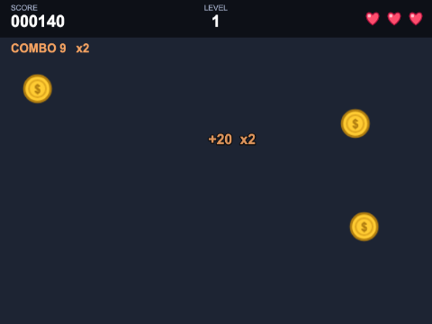
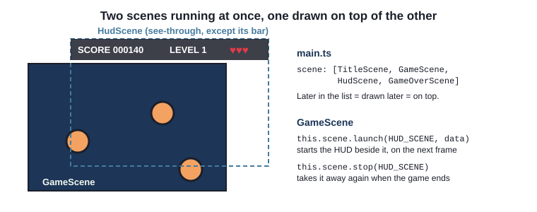
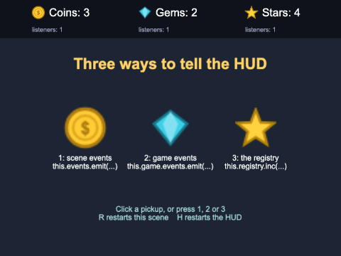
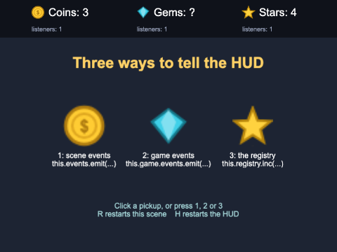
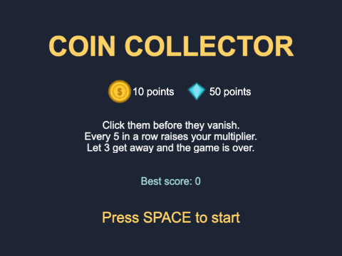
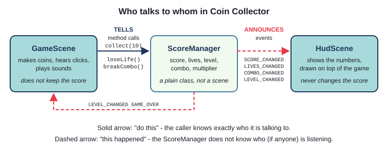
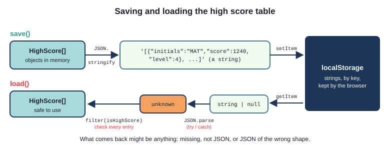
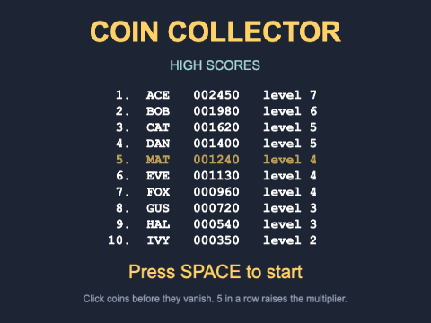

# Chapter 6 - Scoring

Almost every game keeps score, and players look at the score more than at anything else on the
screen. In this chapter the score gets a proper home: a **HUD** (heads-up display) in a scene of
its own, running on top of the game; a `ScoreManager` class that owns the numbers and **announces**
every change as an event; and a high score table that is still there tomorrow, because it is saved
in the browser.



## What you will learn

- how to run a HUD as a second scene, launched on top of the game, and why that is better than
  drawing it in the game scene
- three ways to tell the HUD that something changed - an event on the game scene, an event on the
  game, and the registry's `changedata-` events - and how to choose between them
- how to put the rules of scoring in a plain class of their own that sends events, and why the
  scenes should only *tell* it things and *listen* to it
- how to make scoring feel good: a "+10" that floats away, and a score that counts up
- how to keep high scores for good with `localStorage`, `JSON.stringify` and `JSON.parse`, and how
  to check what comes back before trusting it
- how to read typed letters from the keyboard, for entering initials

## The projects

| Project | What it shows |
|---|---|
| [ch06_hud_events](projects/ch06_hud_events/) | a HUD scene fed three different ways - restart either scene and see what each way does |
| [ch06_coin_collector](projects/ch06_coin_collector/) | a complete little game: click coins before they vanish; a HUD scene listening to a `ScoreManager`; combos, a multiplier, levels and lives |
| [ch06_high_score_table](projects/ch06_high_score_table/) | the same game with a top-ten table saved in the browser, and initials typed on the keyboard |

## A HUD is a scene of its own

In Chapter 2 the score was a piece of text in the play scene. That works, but it mixes two jobs in
one class - *playing the game* and *showing information about it* - and it causes small problems as
a game grows: shake the camera when the player is hit, and the score shakes too; make the camera
follow the player, and the score scrolls off the screen. So the HUD gets a scene of its own. **Two
scenes run at the same time**, and Phaser draws them one on top of the other:



The game scene starts the HUD with `launch`:

`ch06_coin_collector/src/scenes/GameScene.ts`
```ts
const hudData: HudData = { scoreManager: this.scoreManager };
this.scene.launch(HUD_SCENE, hudData);
```

`this.scene.start(key)` (Chapter 2) shuts *this* scene down and starts another;
`this.scene.launch(key, data)` starts another scene **beside** this one. Chapter 4 covers the scene
manager in full; three things matter for a HUD:

- **Drawing order is the order of the `scene` list in the config.** `HudScene` comes after
  `GameScene`, so it is drawn later - on top. Its background is see-through except for what it
  draws, so the game shows through
- **Each scene has its own camera.** `GameScene` shakes its camera when a coin gets away
  (`this.cameras.main.shake(150, 0.005)`) - and the HUD, with its own camera, stays perfectly still
- **A launched scene starts on the next frame**, not straight away. Keep that in mind: it is the
  reason for one of the traps below

When the game ends, the game scene takes the HUD away again before moving on:

```ts
this.scene.stop(HUD_SCENE);
this.scene.start(GAME_OVER_SCENE, result);
```

## Telling the HUD: three routes

The HUD could look at the game scene's fields sixty times a second in `update()`, but that ties the
two scenes tightly together, and wastes work: the score changes perhaps once a second. Much better:
when something changes, the game **announces** it, and the HUD, which is **listening**, updates
itself.

You have used this already. `ball.on("pointerdown", ...)` listens for an event that the ball sends.
The ball is an **event emitter**: an object you can `emit` events on, and listen to with `on`,
`once` and `off`. Phaser has emitters everywhere, and three of them are candidates for talking to a
HUD. The `ch06_hud_events` project uses all three side by side - one for each thing you can click.



The event names - `COINS_CHANGED` and `GEMS_CHANGED` - are constants in `src/events.ts`, for the
same reason as scene keys: a misspelt event name is a listener that never hears anything, with no
error to tell you.

### Route 1: the game scene's own events

Every scene has an emitter, `this.events`. Phaser uses it for the scene's own events (`update`,
`shutdown` and so on), and you can send events of your own on it:

`ch06_hud_events/src/scenes/GameScene.ts`
```ts
private addCoin(): void {
  this.coins = this.coins + 1;
  this.events.emit(COINS_CHANGED, this.coins);
}
```

`emit(name, ...values)` calls every listener for that name, straight away, passing it the values.
To listen, the HUD needs the game scene itself, which it gets from the scene manager by key:

`ch06_hud_events/src/scenes/HudScene.ts`
```ts
this.gameScene = this.scene.get<GameScene>(GAME_SCENE);
this.gameScene.events.on(COINS_CHANGED, this.showCoins, this);
```

`this.scene.get(key)` returns the scene object; `<GameScene>` tells TypeScript which class it is
(Phaser only knows it is "a `Scene`"). The third argument to `on` is the **context** - the object
that `this` will mean inside `showCoins` when the emitter calls it. More on that in a moment.

### Route 2: the game's events

The game has an emitter too, `this.game.events`, and every scene can reach it:

```ts
// GameScene.addGem()
this.game.events.emit(GEMS_CHANGED, this.gems);

// HudScene.create()
this.game.events.on(GEMS_CHANGED, this.showGems, this);
```

No reference to the game scene is needed: anyone can send, anyone can listen. That is convenient,
and also the danger - it is one noticeboard for the whole game, and nothing on it says who sent what.

### Route 3: the registry's change events

Chapter 2 kept the best time in the **registry**, the game-wide store of named values. The registry
has an emitter as well, `this.registry.events`, and it announces changes **by itself**: whenever a
key it already holds is set, it sends `changedata-` followed by the key's name.

```ts
// GameScene.addStar()
this.registry.inc(STARS, 1);

// HudScene.create()
this.registry.events.on(`changedata-${STARS}`, this.onStarsChanged, this);
```

`inc(key, amount)` adds to a number in the registry (`set` works too). The game scene sends no
event itself - it just changes the value. The listener is given the game, the new value and the old
value.

> **Note** - `changedata-stars` is only sent when a key that **already exists** changes. The very
> first `set` of a new key sends a different event, `setdata`. That is why `GameScene.init()` sets
> the stars to 0 before anything else happens: from then on, every change is a `changedata`.

### News and state

Start the project and look at the gems: the HUD says `Gems: ?`. Press H to restart the HUD, and it
says `?` again, even though you have collected some.



An event is **news**: it tells whoever is listening *at that moment* that something changed. A
listener that starts later has missed it. And a HUD always starts late - it was launched, so it
starts on the frame after the game scene's `create()`. So as well as listening, the HUD has to find
out how things stand **now**:

`ch06_hud_events/src/scenes/HudScene.ts`
```ts
this.showCoins(this.gameScene.getCoins());   // route 1: ask the game scene
this.gemsText.setText("Gems: ?");            // route 2: no way to ask - wait for the next event
this.showStars(this.registry.get(STARS));    // route 3: the registry holds the value itself
```

With route 1 the HUD has the game scene, so it can ask it. With route 2 it has nobody to ask. The
registry, route 3, is the only one of the three that is **state and news together**: it holds the
value, and announces changes to it.

### Cleaning up

This is the part people forget. A scene's own game objects, timers and input listeners are cleared
away when it shuts down - but the HUD's listeners are not on the HUD. They are on three emitters
that **outlive the HUD**, and Phaser has no idea they belong to it. The HUD must remove them itself,
when it shuts down:

`ch06_hud_events/src/scenes/HudScene.ts`
```ts
this.events.once(Phaser.Scenes.Events.SHUTDOWN, () => {
  this.gameScene.events.off(COINS_CHANGED, this.showCoins, this);
  this.game.events.off(GEMS_CHANGED, this.showGems, this);
  this.registry.events.off(`changedata-${STARS}`, this.onStarsChanged, this);
});
```

`off` takes exactly what `on` was given - the event, the function *and* the context - and removes
that listener. (Chapter 4 covers `SHUTDOWN` and the other scene events.)

The HUD shows each event's `listenerCount` under its number. Press H as often as you like: it stays
at 1. Take the clean-up away and every restart adds one more - and **nothing looks wrong**. Phaser
reuses the scene object (Chapter 2), so the old listeners call the same `HudScene`, which updates
its new text perfectly well. Every change is simply handled two, three, ten times - which you *would*
notice the day the HUD plays a sound on each change.

> **Note** - why pass `this` as the third argument? A method passed as a value, like
> `this.showCoins`, forgets which object it belongs to: when the emitter calls it, `this` inside it
> is **the emitter**, and `this.coinsText` is `undefined`. Passing the context fixes that. (So does
> an arrow function - but then you cannot name that same function again for `off`.) In Java,
> `this::showCoins` stays bound to its object; in JavaScript a method does not.

### Which one?

| | Scene events | Game events | Registry |
|---|---|---|---|
| Sent with | `this.events.emit(...)` | `this.game.events.emit(...)` | `this.registry.set(...)` / `inc(...)` |
| The listener needs | the sending scene (`this.scene.get`) | nothing | nothing |
| A late listener can find the current value? | only by asking the scene | no | yes - `this.registry.get(key)` |
| Good for | events that belong to one scene | game-wide happenings: "paused", "settings changed" | a few values shown in several places |

All three work, and you will see all three in other people's games. For a score, though, there is a
fourth answer, and it is the one the rest of this chapter uses: an emitter that belongs to **the
score itself**.

## A ScoreManager



`ch06_coin_collector` is a real game: click coins and gems before they vanish. Five in a row raises
a multiplier, every ten pickups is a faster level, and three that get away end the game. The score,
level, combo and lives belong together, and so do the rules that change them - in OO terms, one
object:

`ch06_coin_collector/src/ScoreManager.ts`
```ts
// The events a ScoreManager sends, and what each one passes to its listeners.
export const SCORE_CHANGED = "score-changed";   // (score: number, added: number)
export const LIVES_CHANGED = "lives-changed";   // (lives: number)
export const COMBO_CHANGED = "combo-changed";   // (combo: number, multiplier: number)
export const LEVEL_CHANGED = "level-changed";   // (level: number)
export const GAME_OVER = "game-over";           // ()

export class ScoreManager extends Phaser.Events.EventEmitter {
  private score = 0;
  private lives = START_LIVES;
  private level = 1;
  private combo = 0;
  private bestCombo = 0;
  private pickups = 0;
```

It is a **plain class** - not a scene and not a game object. It knows nothing about text, pictures,
sounds or scenes. It extends `Phaser.Events.EventEmitter`, the class behind `this.events`,
`this.game.events` and every game object's `on(...)`, so it gets `on`, `once`, `off` and `emit`
for free.

Its public methods are the things that can **happen** in the game, and each one applies the rules
and announces the results:

```ts
public collect(basePoints: number): number {
  if (this.isGameOver()) {
    return 0;
  }

  this.combo = this.combo + 1;
  this.bestCombo = Math.max(this.bestCombo, this.combo);
  const points = basePoints * this.getMultiplier();
  this.score = this.score + points;
  this.pickups = this.pickups + 1;

  this.emit(SCORE_CHANGED, this.score, points);
  this.emit(COMBO_CHANGED, this.combo, this.getMultiplier());

  if (this.pickups % PICKUPS_PER_LEVEL === 0) {
    this.level = this.level + 1;
    this.emit(LEVEL_CHANGED, this.level);
  }
  return points;
}
```

`getMultiplier()` works the multiplier out from the combo: 1 for the first four in a row, 2 from the
fifth, 3 from the tenth, up to 5. `loseLife()` and `breakCombo()` work like `collect()`, and
`loseLife()` sends `GAME_OVER` when the last life goes. The fields are private and there are no setters: the only way to change the score is to
report something that happened.



This is worth pausing on, because it is the design idea of the chapter. There are two directions,
and they are different kinds of message:

- **the game scene tells the ScoreManager** what happened - `collect(10)`, `loseLife()`. These are
  ordinary method calls: the scene knows exactly what it is talking to
- **the ScoreManager announces** the results as events. It does not know who is listening - the
  HUD, the game scene, both, or nobody - and it does not need to

Because of that, each class has one job. Want the multiplier to go up every three in a row instead
of five? One constant in `ScoreManager.ts`; nothing else changes. Want a second display of the
score? It just listens. Want to test the scoring rules? They are in one class that needs no scene.

> **Note** - in Java this is the **observer** pattern, and you have met it as Swing's
> `addActionListener`. TypeScript does not check events, though: `emit(SCORE_CHANGED, this.score,
> points)` accepts any values at all, and a listener declared as `(score: number)` is a promise you
> make, not one the compiler checks. That is why the comment beside each event name says what it
> sends.

### A new ScoreManager for every game

Chapter 2's trap was a scene reused with old values in its fields. Here the whole score is one
object, so `GameScene.init()` starts again in one line, `this.scoreManager = new ScoreManager();`,
and the old one - with any listeners still attached to it - is thrown away.

### The game scene reports; the HUD listens

When a coin is clicked, the game scene reports it, and shows the points it was worth:

`ch06_coin_collector/src/scenes/GameScene.ts`
```ts
// the ScoreManager applies the multiplier, and says how many points that was worth
const points = this.scoreManager.collect(coin.points);
const multiplier = this.scoreManager.getMultiplier();
const message = multiplier > 1 ? `+${points}  x${multiplier}` : `+${points}`;
const colour = multiplier > 1 ? "#f4a261" : "#ffd166";
new FloatingText(this, coin.x, coin.y - 20, message, colour);
```

A coin that gets away sends an event of its own, `COIN_EXPIRED` - a `Coin` is a game object, so it
is an emitter too - and the game scene reports that as `loseLife()`. The game scene also listens to
the ScoreManager, for the two things that are its business:

```ts
this.scoreManager.on(LEVEL_CHANGED, () => this.sound.play(LEVEL_SOUND_KEY));
this.scoreManager.once(GAME_OVER, () => this.endGame());
```

The HUD is handed the ScoreManager when it is launched, as its scene data (an interface, `HudData`,
as in Chapter 2), and in `create()` it does the three things every HUD must: show how things stand now
(`this.showScore(this.scoreManager.getScore())` and so on), listen for changes
(`this.scoreManager.on(SCORE_CHANGED, this.countUpTo, this)` and so on), and stop listening on
`SHUTDOWN`.

## Making the score feel good

A number that changes is information. A number that *reacts* is a reward. Two small touches make a
big difference.

### Floating points

Where the coin was, a "+10" drifts upwards and fades away. It is a class of its own, which does
everything itself:

`ch06_coin_collector/src/objects/FloatingText.ts`
```ts
export class FloatingText extends Phaser.GameObjects.Text {
  constructor(scene: Phaser.Scene, x: number, y: number, message: string, colour: string) {
    super(scene, x, y, message, {
      ...
    });
    this.setOrigin(0.5);
    scene.add.existing(this);

    // two properties in one tween: it rises quickly at first then slows (Cubic.easeOut), and fades
    // slowly at first then quickly (Cubic.easeIn) - so it can be read before it goes
    scene.tweens.add({
      targets: this,
      y: y - RISE,
      alpha: { value: 0, ease: "Cubic.easeIn" },
      duration: DURATION,
      ease: "Cubic.easeOut",
      onComplete: () => this.destroy(),
    });
  }
}
```

A **tween** changes properties of an object smoothly over time - here `y` (upwards by `RISE`
pixels) and `alpha` (to transparent) over `DURATION` milliseconds; `ease` says *how*. When the tween
finishes, `onComplete` destroys the text. So the game scene makes one with `new FloatingText(...)`
and never thinks about it again. Chapter 7 covers tweens properly.

### A score that counts up

In the HUD the score does not jump from 120 to 140 - it counts up, 121, 123, 127 ... 140, in less
than half a second. A **counter tween** does it. It tweens a number rather than a property of an
object, and on every step the HUD shows the number it has reached:

`ch06_coin_collector/src/scenes/HudScene.ts`
```ts
private countUpTo(score: number): void {
  this.countUp?.stop();   // a new score while still counting? start again from where it got to
  this.countUp = this.tweens.addCounter({
    from: this.shownScore,
    to: score,
    duration: COUNT_UP_TIME,
    ease: "Cubic.easeOut",
    onUpdate: (tween) => {
      // getValue() is number | null: null only if the tween has no value yet - so 0
      this.showScore(Math.round(tween.getValue() ?? 0));
    },
  });
}

private showScore(score: number): void {
  this.shownScore = score;
  this.scoreText.setText(String(score).padStart(SCORE_DIGITS, "0"));
}
```

- the tween always runs from `shownScore`, the score on the screen, so collecting three coins quickly
  never makes the number jump backwards
- `this.countUp?.stop()` - `?.` is **optional chaining**: "if `countUp` is not `undefined`, call
  `stop()` on it". Before the first score there is no tween yet
- `tween.getValue()` returns `number | null`, and the compiler will not let a possible `null` into
  `Math.round`. `??` is the **nullish coalescing** operator: `a ?? b` is `a`, unless `a` is `null`
  or `undefined`, in which case it is `b`
- `padStart(6, "0")` pads a string on the left: `"140"` becomes `"000140"` - the arcade look

The combo is simpler: the HUD shows `COMBO 9   x2` whenever it hears `COMBO_CHANGED`, and
hides it when the combo is broken. Clicking empty space breaks it (the `over` list from Chapter 2);
letting a coin escape breaks it and costs a life.

## High scores that last

The registry forgets everything when the page is closed. For a high score table you need the
browser to keep something for you - and it will, in **local storage**. `localStorage` is part of
the browser, not Phaser, and has three methods that matter: `setItem(key, text)` keeps some text
under a key, `getItem(key)` gives it back (or `null` if there is nothing), and `removeItem(key)`
forgets it. What you keep stays - through refreshes, closing the tab, and restarting the computer -
until the player clears their browser's data. Three things to know:

- **it keeps strings only.** Anything else has to be turned into a string first
- **it belongs to the web site** - the address the page came from. Every project in this book is
  served from http://127.0.0.1:8000/, so as far as the browser is concerned they are all *one* web
  site, sharing *one* storage. Give your keys a name that says which game they belong to
- **each browser keeps its own.** Celbridge's `game.webview` and Chrome on the same machine do not
  share scores

### Objects to text, and back: JSON

`ch06_high_score_table/src/HighScoreTable.ts`
```ts
export interface HighScore {
  initials: string;
  score: number;
  level: number;
}
```

The table is an array of these. `JSON.stringify(value)` turns objects and arrays into a string of
**JSON** (JavaScript Object Notation) - the table above becomes
`[{"initials":"MAT","score":1240,"level":4}, ...]` - and `JSON.parse(text)` turns the string back
into objects.



Saving is short. `try`/`catch` is there because `setItem` throws an error if storage is full or
turned off - and a score that cannot be saved is no reason to stop the game:

```ts
public save(): void {
  try {
    localStorage.setItem(STORAGE_KEY, JSON.stringify(this.entries));
  } catch {
    // storage full or turned off: the scores just are not kept - not worth stopping the game for
  }
}
```

`STORAGE_KEY` is `"phaser4-guide.coin-collector.high-scores"` - a name no other game will use.

### Never trust what comes back

Loading is where the care goes. The text in storage could be **anything**: missing (the first time
the game runs), not JSON at all, JSON of some other shape saved by an older version of the game or
another game using the same key, or edited by a curious player - it is all visible in the browser's
developer tools. If the game just trusted it, one bad save would stop the game from ever starting.
So `load()` checks every step, and if anything is wrong it starts with an empty table:

`ch06_high_score_table/src/HighScoreTable.ts`
```ts
public static load(): HighScoreTable {
  let text: string | null;
  try {
    text = localStorage.getItem(STORAGE_KEY);   // null if nothing has been saved yet
  } catch {
    return new HighScoreTable([]);              // storage turned off in this browser
  }
  if (text === null) {
    return new HighScoreTable([]);
  }

  let data: unknown;
  try {
    data = JSON.parse(text);
  } catch {
    return new HighScoreTable([]);              // not JSON at all
  }
  if (!Array.isArray(data)) {
    return new HighScoreTable([]);              // JSON, but not a list
  }

  // keep only the entries that really are high scores, best first, ten at most
  const entries = data.filter(HighScoreTable.isHighScore);
  entries.sort((a, b) => b.score - a.score);
  return new HighScoreTable(entries.slice(0, TABLE_SIZE));
}
```

- `getItem` returns `string | null`, and the compiler will not let that into `JSON.parse`, which
  wants a `string` - you must deal with `null` first
- `JSON.parse` **throws** a `SyntaxError` on text that is not JSON - so it is inside `try`
- `data` is `unknown`: "could be anything". Unlike `any`, TypeScript lets you do nothing with an
  `unknown` until you have checked what it is - `Array.isArray(data)` is the first check
- the constructor is `private`, so the only way to get a table is `HighScoreTable.load()`, which
  always checks: a **static factory method**, as in Java

Then each entry is checked by a **type guard** - a function whose return type,
`value is HighScore`, tells the compiler that a `true` means "this is a `HighScore`":

```ts
private static isHighScore(value: unknown): value is HighScore {
  if (typeof value !== "object" || value === null) {
    return false;
  }
  // `as` - it is an object, but TypeScript cannot know what properties it has: look at them
  const entry = value as Record<string, unknown>;
  return typeof entry.initials === "string" && /^[A-Z]{1,3}$/.test(entry.initials) &&
    typeof entry.score === "number" && Number.isInteger(entry.score) && entry.score >= 0 &&
    typeof entry.level === "number" && Number.isInteger(entry.level) && entry.level >= 1;
}
```

`typeof x` gives the type of a value as a string: `"string"`, `"number"`, `"object"` and so on.
(`typeof null` is `"object"` - a famous JavaScript oddity - hence the extra check.)
`/^[A-Z]{1,3}$/` is a regular expression for "one to three capital letters" - more on those in the
next section. Because
`isHighScore` is a type guard, `data.filter(HighScoreTable.isHighScore)` has the type
`HighScore[]`: the compiler knows every entry that survived the filter is safe.

Try it: in the browser's developer tools, change the saved value to `this is not json`, or to a list
with a few broken entries, and reload. The game starts anyway, keeping what it can.

### Getting into the table

`qualifies(score)` says whether a score makes the table: it does if the table is not full yet, or if
it beats the lowest score in it. `add(entry)` finds the first entry the new score beats, inserts it
there with `splice`, cuts the list back to ten, and returns the place it went. A score that *ties*
goes below the one already there - whoever got it first keeps their place.

When the game ends, the game scene uses `qualifies` to decide where to go next:

`ch06_high_score_table/src/scenes/GameScene.ts`
```ts
const madeTheTable = HighScoreTable.load().qualifies(result.score);
this.scene.stop(HUD_SCENE);
this.scene.start(madeTheTable ? NAME_ENTRY_SCENE : GAME_OVER_SCENE, result);
```

## Typing your initials


So far every key has had its own listener - `keydown-SPACE`, `keydown-ESC`. For typing, that would
mean 26 listeners, one per letter. Instead, `NameEntryScene` listens for **every** key press:

`ch06_high_score_table/src/scenes/NameEntryScene.ts`
```ts
this.input.keyboard!.on("keydown", (event: KeyboardEvent) => {
  this.handleKey(event);
});
```

Phaser passes the browser's own `KeyboardEvent`, and its `key` property says what the key
**types**: `"a"`, `"A"`, `"7"`, `"Enter"`, `"Backspace"`.

```ts
const LETTER = /^[a-z]$/i;   // one letter, a to z, upper or lower case (the i)
...
private handleKey(event: KeyboardEvent): void {
  if (LETTER.test(event.key) && this.initials.length < MAX_INITIALS) {
    this.initials = this.initials + event.key.toUpperCase();
    this.sound.play(CLICK_SOUND_KEY);
  } else if (event.key === "Backspace") {
    this.initials = this.initials.slice(0, -1);   // everything but the last letter
  } else if (event.key === "Enter" && this.initials.length > 0) {
    this.save();
    return;
  }
  this.showInitials();
}
```

- `/^[a-z]$/i` is a **regular expression**: `^` start, `[a-z]` one letter, `$` end, and `i` for
  "ignore case". `test` says whether a string matches. It rejects `"Enter"` and `"Shift"` - they
  are more than one character - as well as digits and punctuation
- `event.key` follows the player's keyboard layout. There is also `event.code`, which names the
  key's *position* (`"KeyA"`, whatever is printed on it) - right for game controls like WASD, wrong
  for typing
- `slice(0, -1)` is "from the start up to, but not including, the last character"

Enter loads the table, adds the score, saves it, and starts the title screen with the new row's
place as its data - `{ highlight: place }` - so that row can flash.



`TitleScene` shows the table whether or not there is a row to highlight - the very first time the
game starts, there is none. Its data says so with an **optional property**:

`ch06_high_score_table/src/scenes/TitleScene.ts`
```ts
export interface TitleData {
  highlight?: number;   // "?" - optional: the first time the game starts, there is no new row
}
...
init(data: TitleData): void {
  this.highlight = data.highlight ?? -1;
}
```

`highlight?: number` means "a number, or not there at all", and `?? -1` turns "not there" into "no
row". The table is drawn in a **monospaced** font (Courier New), where every character is the same
width, so `padStart` and `padEnd` line the columns up.

> **Common mistakes**
> - not removing listeners from another object's emitter on `SHUTDOWN`. No error; they pile up
> - `on(SCORE_CHANGED, this.countUpTo)` without the context: when the event comes you get
>   `TypeError: Cannot read properties of undefined (reading 'addCounter')`
> - launching a HUD that is already running: `launch` on a running scene **restarts** it. Check
>   `this.scene.isActive(HUD_SCENE)` first, as `ch06_hud_events` does
> - `this.scene.start(TITLE_SCENE)` with no data, to a scene that takes optional data: a scene
>   started without data is handed **the data it was last started with** - here, an old
>   `{ highlight: 4 }`. `GameOverScene` passes an empty `TitleData`, `{}`, for that reason
> - reading storage with no checks - fine until the day the saved text is wrong, and then the game
>   never starts again

## Summary

- a HUD is a scene of its own, started with `this.scene.launch(key, data)`, drawn on top because it
  is later in the config's `scene` list, with its own camera
- emitters you can use: `this.events`, `this.game.events`, `this.registry.events`
  (`changedata-<key>`), and your own classes that extend `Phaser.Events.EventEmitter`
- events are news, not state: a scene that starts late must read the current values too; and it
  must remove listeners from longer-lived emitters on `SHUTDOWN`
- put the rules of scoring in one plain class; scenes **tell** it what happened and **listen** to
  what it announces
- a tween floats a "+10" away; a counter tween (`this.tweens.addCounter`) counts a score up
- `localStorage` keeps strings for good; `JSON.stringify` and `JSON.parse` turn objects into
  strings and back. Check everything you read back
- `keyboard.on("keydown", ...)` hears every key; `event.key` is what it types

## Challenges

1. **A star is born** *(ch06_coin_collector)* - Add a third kind of pickup: a star
   (`assets/images/star.png` from the asset library - copy it into `public/assets/images/`), worth
   100 points, which appears only one time in twenty and vanishes faster than a gem. Show it on the
   title screen with the other two.

2. **Bonus life** *(ch06_coin_collector)* - Each time the player reaches a new level, give back one
   lost life (never more than three). The HUD's hearts should fill in again without you changing
   `HudScene.ts` at all. Why does that work?

3. **Combo meter** *(ch06_coin_collector)* - Under the combo text, show a bar that fills up as the
   combo grows towards the next multiplier - a fifth full after one pickup, full at five, then
   empty again as the multiplier goes up - and empties when the combo is broken. Change only the HUD.

4. **Wipe the slate** *(ch06_high_score_table)* - On the title screen, pressing R asks "Clear all high
   scores? Y / N". Y empties the table - in storage too - and shows the empty table; N (or any other
   key) puts the screen back as it was. *Hint:* give `HighScoreTable` a method for this, and look
   up `localStorage.removeItem`. `this.scene.restart()` redraws a scene from scratch.

5. **Chasing the record** *(ch06_high_score_table)* - Show the top score in the HUD - `HI 002450` -
   and when the player's score passes it during a game, make `HI` follow the score and flash a
   "NEW HIGH SCORE!" message, once. *Hint:* the HUD can load the table itself when it starts. It
   already hears every `SCORE_CHANGED`; a boolean field can remember whether it has celebrated yet.

6. **Easy, normal, hard** *(ch06_high_score_table)* - Let the player choose a difficulty on the
   title screen with 1, 2 and 3. Harder games have coins that vanish sooner and come faster, and
   each difficulty has **its own** high score table, saved separately; the title screen shows the
   table for the difficulty chosen. *Hint:* the difficulty has to travel from the title screen to
   the game, to the name entry scene, and back - scene data can carry it. What should
   `HighScoreTable.load()` take as a parameter, and what should it do with it?

---

Previous: [Chapter 5 - Audio](../ch05_audio/README.md) ·
Next: [Chapter 7 - Animations](../ch07_animations/README.md)
