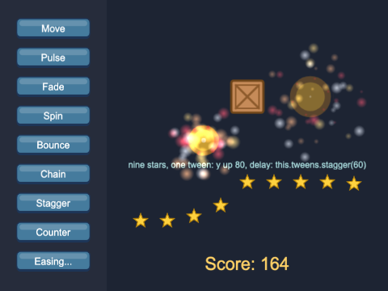

# Chapter 7 - Animations

A game where things only ever slide about looks dead. In this chapter you bring it to life in three
ways: **frame animations**, where a sprite flicks through the pictures of a sprite sheet like a
flip book; **tweens**, where Phaser changes a value - a position, a size, a transparency - smoothly
over time; and **particles**, hundreds of tiny images thrown out at once for sparks and explosions.
Along the way you build a hero who runs, jumps and falls, driven by a small state machine.


## What you will learn

- how a sprite sheet is turned into named animations with `this.anims.create(...)` and
  `generateFrameNumbers(...)`, and why they are made once, for the whole game
- how to play, stop, pause, speed up, chain and queue animations on a sprite, and how to listen for
  animation events such as `ANIMATION_COMPLETE`
- how `setFlipX` lets one set of frames face both ways
- how a **state machine** keeps a character's animations under control (idle, run, jump, fall, hurt)
- how to tween any value with `this.tweens.add(...)`: duration, ease, yoyo, hold, repeat and delay
- what easing is, and how to chain, stagger and count with tweens
- how to make a burst of particles with `this.add.particles(...)` and `explode(...)`

## The projects

| Project | What it shows |
|---|---|
| [ch07_animation_lab](projects/ch07_animation_lab/) | five sprite sheets animating, and a big hero whose animation you control from the keyboard, with its state and events shown as they happen |
| [ch07_hero_animations](projects/ch07_hero_animations/) | the hero on a strip of ground: run, flip, jump, fall and get hurt, driven by a state machine |
| [ch07_tweens_and_particles](projects/ch07_tweens_and_particles/) | a playground of buttons that set off different tweens, explosions made from an animation and particles, and a gallery of easing curves |

## Two kinds of animation

Phaser has two quite different tools that both get called "animation":

- a **frame animation** changes *which picture* a sprite shows: frame 2, then 3, then 4... - a
  running character, a spinning coin. The code only decides which frames, in what order, how fast
- a **tween** changes *a number* smoothly over a time you choose: `x` from 100 to 500 in 800
  milliseconds, `alpha` from 1 to 0. It works on any object with numbers in it

A character usually needs both: frames to move its legs, tweens (or physics) to move it across the
screen.

## Sprite sheets and frame animations

### Sprite sheets

Chapter 3 loaded sprite sheets; here is a reminder. A **sprite sheet** is one picture made of
equal-sized frames, side by side. Phaser cuts it up for you when you tell it the size of a frame:

`ch07_animation_lab/src/scenes/PreloadScene.ts`
```ts
this.load.spritesheet(HERO_SHEET, HERO_FILE, { frameWidth: HERO_WIDTH, frameHeight: HERO_HEIGHT });
```

`hero.png` is 352 x 48 pixels, and each frame is 32 x 48, so it has eleven frames, numbered from 0:


### Making an animation

An animation is a list of frames, a speed, and what to do at the end. You make one with the
scene's animation manager, `this.anims`, and give it a key of its own:

`ch07_animation_lab/src/scenes/PreloadScene.ts`
```ts
this.anims.create({
  key: HERO_RUN,
  frames: this.anims.generateFrameNumbers(HERO_SHEET, { start: 2, end: 7 }),
  frameRate: 12,
  repeat: -1,
});
```

- `key` - the animation's name, `"hero-run"`. It is a different key from the sheet's (`"hero"`):
  one sheet usually holds several animations
- `frames` - `generateFrameNumbers(sheet, { start, end })` makes the list of frames 2, 3, 4, 5,
  6, 7 of the sheet. To pick frames in any order, list them instead: `{ frames: [10, 9, 10, 9, 10] }`
- `frameRate` - frames per second. Six frames at 12 a second is one stride every half second
- `repeat` - how many times to play it again after the first time. `-1` means for ever

A few more settings you will meet:

| Setting | What it does |
|---|---|
| `yoyo: true` | play forwards, then backwards: 0 1 2 3 2 1 0 - the slime and ghost in the lab use it |
| `repeatDelay` | milliseconds to wait before each repeat - the lab's explosion waits 800 between bangs |
| `delay` | milliseconds to wait before it starts |
| `duration` | the whole animation's length, in milliseconds, instead of a `frameRate` |

A single-frame "animation" is fine too: `hero-jump` is just frame 8, so the code can always say
"play the animation for this state".

### Made once, for the whole game

Animations belong to the **game**, not to the scene that made them - like loaded pictures (Chapter
2). `this.anims` in any scene is the same, game-wide animation manager. So every project in this
chapter makes its animations in `PreloadScene.create()`, once, and every later scene just plays
them.

Make them in a scene that starts more than once - a `GameScene` that restarts for every level -
and the second time round the browser's console says `AnimationManager key already exists:
hero-idle`, and Phaser keeps the old one. Harmless, but a sign the code is in the wrong place. (A
sprite can also have animations of its own, `sprite.anims.create(...)`, but global ones are what you
want nearly always.)

### Playing an animation

Only a **Sprite** can play an animation. An `Image` shows one frame and that is all:

`ch07_animation_lab/src/scenes/LabScene.ts`
```ts
// a Sprite, not an Image: only a Sprite can play an animation
const sprite = this.add.sprite(x, 72, sheet);
...
sprite.play(anim);
```

Make an image and try to `play` it, and the build stops you with
`Property 'play' does not exist on type 'Image'`. An image *can* show any single frame, though - the
strip of frames along the bottom of the lab is eleven images, each given a frame number:

```ts
this.add.image(x, 505, HERO_SHEET, frame)
```


In `ch07_animation_lab`, try the keys: the panel shows the hero's animation state, and the log
shows the events it sends.

### play, and play(key, true)

`this.hero.play(HERO_RUN)` starts the run animation **from its first frame** - even if it is
already running. Press 2 again and again in the lab and watch the hero stutter: every press
restarts the stride. Hold the key down (so it repeats) and the hero is stuck on frame 2.

`this.hero.play(HERO_RUN, true)` - key 3 - means "unless it is already playing". Pressed again, it
does nothing, and the stride carries on. Remember this one: it is the first thing that goes wrong
when you play animations from `update()`, which runs sixty times a second.

### Finding out what is playing

A sprite's animation state is `sprite.anims`. The lab's `update()` shows it every frame:

- `anims.currentAnim` - the animation it is playing (or last played), or `null` if none yet;
  `anims.currentAnim.key` is its name
- `anims.currentFrame.textureFrame` - which frame of the sheet is on show
- `anims.isPlaying`, `anims.isPaused` - `true` or `false`

### Controlling it

`ch07_animation_lab/src/scenes/LabScene.ts`
```ts
// chain: queue up what plays when this one completes (or is stopped)
keyboard.on("keydown-C", () => {
  this.hero.play(HERO_HURT);
  this.hero.chain(HERO_IDLE);
});

// playAfterRepeat: let the current loop finish, THEN change - no jump in the middle of a stride
keyboard.on("keydown-A", () => this.hero.anims.playAfterRepeat(HERO_IDLE));
```

- `chain(key)` queues an animation to play when this one ends. `hurt` plays once, then `idle`
  takes over with no more code. (`chain` can take an array to queue several)
- `playAfterRepeat(key)` waits until the current animation reaches the end of its loop, then
  switches. Start the hero running (2), then press A: the stride finishes before the hero stops
- `stop()` stops it where it is; `anims.pause()` and `anims.resume()` freeze it and carry on
- `anims.timeScale` speeds it up or slows it down: 2 is twice as fast, 0.5 half. It changes this
  sprite only; the animation itself - and every other sprite playing it - is unchanged

### Animation events

A sprite **emits events** as its animation goes along, and you can listen for them with `on` and
`once`, exactly as for `"pointerdown"` in Chapter 2:

`ch07_animation_lab/src/scenes/LabScene.ts`
```ts
const events = [
  Phaser.Animations.Events.ANIMATION_START,
  Phaser.Animations.Events.ANIMATION_REPEAT,
  Phaser.Animations.Events.ANIMATION_COMPLETE,
  Phaser.Animations.Events.ANIMATION_STOP,
  Phaser.Animations.Events.ANIMATION_RESTART,
];
for (const eventName of events) {
  this.hero.on(eventName, (animation: Phaser.Animations.Animation) => {
    this.addToLog(`${eventName.padEnd(18)} ${animation.key}`);
  });
}
```

The constants are just strings (`"animationstart"`...), but a constant cannot be misspelled. Each
listener is given the animation, the frame, the sprite and the frame's key. The event you will use
most is `ANIMATION_COMPLETE`: "that has finished - now do the next thing". For just one animation,
add its key to the end:

```ts
this.hero.on(Phaser.Animations.Events.ANIMATION_COMPLETE_KEY + HERO_HURT, () => {
  this.addToLog("  (hurt is over)");
});
```

> **Note** - an animation with `repeat: -1` never completes, so it never sends
> `ANIMATION_COMPLETE`. Only animations that end - `repeat: 0` (the default) or a number - complete.
> Stopping one with `stop()` sends `ANIMATION_STOP` instead.

## A hero with a state machine


`ch07_hero_animations` puts a hero on a strip of ground. Arrow keys run and jump; H hurts the hero.
It has no physics engine (that is Chapters 8 and 9) - the hero moves itself, in `preUpdate()`, with
a speed and a pretend gravity, just as the ball did in Chapter 1.

### Facing left and right

The frames in `hero.png` all face right. There is no need for a second set facing left: a sprite
can be mirrored.

`ch07_hero_animations/src/objects/Hero.ts`
```ts
// the frames face right; flipping the picture makes them face left
if (this.velocityX !== 0) {
  this.setFlipX(this.velocityX < 0);
}
```

`setFlipX(true)` draws the sprite mirrored left to right; `false` puts it back. The animation carries
on playing, mirrored. Notice the `if`: when the hero stops, it keeps facing whichever way it was
going.

### Why a state machine?

The obvious way to choose an animation is a pile of `if`s in the update:

```ts
// a sketch - NOT what the project does
if (onGround && movingSideways) {
  this.play(HERO_RUN, true);
} else if (onGround) {
  this.play(HERO_IDLE, true);
} else if (goingUp) {
  this.play(HERO_JUMP, true);
} ...
```

It works - for about a day. Then you add being hurt, which running must *not* interrupt, and
ducking, and attacking, and every new animation needs checks in every other `if`, until nobody can
say what the hero is doing.

A **state machine** turns that round. The hero is always in exactly **one state**; each state knows
its animation and knows the rules for leaving it:


### The states

`ch07_hero_animations/src/objects/Hero.ts`
```ts
export type HeroState = "idle" | "run" | "jump" | "fall" | "hurt";

// which animation each state plays. Record<HeroState, string> is "an object with one string for
// EVERY HeroState" - leave a state out, and the build says so
const ANIMATIONS: Record<HeroState, string> = {
  idle: HERO_IDLE,
  run: HERO_RUN,
  jump: HERO_JUMP,
  fall: HERO_FALL,
  hurt: HERO_HURT,
};
```

`HeroState` is a **union of string literals**: one of those five strings and nothing else, so
`this.changeState("runing")` is a build error. It does the job of a Java `enum`, with less ceremony.

`Record<HeroState, string>` is an object with a `string` for every state - a little like Java's
`EnumMap`. Add a sixth state and forget its animation, and the build says `Property 'duck' is
missing in type ... but required in type 'Record<HeroState, string>'`.

### Changing state - the one place an animation starts

`ch07_hero_animations/src/objects/Hero.ts`
```ts
private changeState(next: HeroState): void {
  if (next === this.currentState) {
    return;               // already in that state: do NOT restart its animation
  }
  this.currentState = next;
  this.play(ANIMATIONS[next]);
}
```

This is the whole trick. The hero never calls `play` anywhere else, and only calls it when the state
really **changes**. So animations never restart by accident, and there is no need for
`play(key, true)`.

### The rules for leaving each state

`ch07_hero_animations/src/objects/Hero.ts`
```ts
private updateState(): void {
  switch (this.currentState) {
    case "idle":
    case "run":
      this.changeState(this.velocityX === 0 ? "idle" : "run");
      break;
    case "jump":
      if (this.velocityY >= 0) {
        this.changeState("fall");
      }
      break;
    case "fall":
      if (this.isOnGround()) {
        this.changeState(this.velocityX === 0 ? "idle" : "run");
      }
      break;
    case "hurt":
      // nothing: the ANIMATION_COMPLETE listener in hurt() ends this state
      break;
  }
}
```

A `switch` on strings works just as it does in Java. Read each `case` as "while in this state, here
is when to leave it". Jumping is started from `readKeys()`, which only jumps from the ground:

```ts
// JustDown: true only on the first frame the key is down, so holding UP is one jump
if (Phaser.Input.Keyboard.JustDown(this.cursors.up) && this.isOnGround()) {
  this.velocityY = -JUMP_SPEED;
  this.changeState("jump");
}
```

`this.cursors` are the arrow keys, made by the scene with `this.input.keyboard!.createCursorKeys()`
and handed to the hero; each has an `isDown`.

### Hurt - ended by an animation event

Being hurt is the state where animation events earn their keep. The hero should stay hurt exactly
as long as the hurt animation lasts - so the animation decides:

`ch07_hero_animations/src/objects/Hero.ts`
```ts
public hurt(): void {
  if (this.currentState === "hurt") {
    return;
  }
  this.changeState("hurt");
  this.setTint(HURT_TINT);

  // knocked away from the way the hero is facing, and a little way up
  this.velocityX = this.flipX ? KNOCKBACK_X : -KNOCKBACK_X;
  this.velocityY = -KNOCKBACK_Y;

  // hurt has no repeat, so it completes - and this listener hears it, once
  this.once(Phaser.Animations.Events.ANIMATION_COMPLETE_KEY + HERO_HURT, () => {
    this.clearTint();
    this.changeState(this.isOnGround() ? "idle" : "fall");
  });
}
```

`once`, not `on`: with `on`, every hurt would add another listener, and they would pile up.
`preUpdate()` skips `readKeys()` while the hero is hurt, so the player cannot run out of it early.
Change the hurt animation's frame rate and the hero stays hurt longer or shorter, with no other
change: the animation and the game rule cannot get out of step.

### preUpdate, and super.preUpdate

`ch07_hero_animations/src/objects/Hero.ts`
```ts
protected override preUpdate(time: number, delta: number): void {
  super.preUpdate(time, delta);

  const seconds = delta / 1000;
  if (this.currentState !== "hurt") {
    this.readKeys();
  }
  this.move(seconds);
  this.updateState();
}
```

In Chapter 1 the ball was an `Image`, and its `preUpdate()` needed no `override`: `Image` has none of
its own. A `Sprite` does have one - it is where the sprite's animation moves on to the next frame
(Chapter 4 has the details). So here the method needs `override` (leave it out and the build says
`This member must have an 'override' modifier because it overrides a member in the base class
'Sprite'`) and, more importantly, it must call `super.preUpdate(time, delta)`.

Leave that line out and nothing complains - but the hero glides across the screen frozen on the
first frame of its run. If an animation "plays" but never moves, look for a missing
`super.preUpdate`.

### A pretend jump

`move()` in `Hero.ts` is Chapter 1's "speed x time = distance", plus gravity: a jump sets
`velocityY` to a big upward (negative) speed, and gravity adds to it every frame until the hero
falls back to the ground. The hero's origin is `(0.5, 1)` - the middle of its feet - so "standing
on the ground" is simply `y === groundY`. Arcade Physics (Chapters 8 and 9) will do this for you;
the state machine will not need to change.

> **Common mistakes with frame animations**
> - the sprite shows one frame and never moves: a missing `super.preUpdate(time, delta)`, or an
>   `Image` where a `Sprite` was needed
> - the animation is stuck on its first frame while a key is held: `play(key)` from `update()`
>   restarts it every frame. Use a state machine, or `play(key, true)`
> - the sprite carries on with its old animation, and the browser's console says
>   `Missing animation: hero-runn`: a misspelled key. Keep animation keys as constants
> - a field called `state` in a sprite class: every game object already has a `state`, and the build
>   says `Class 'Hero' incorrectly extends base class 'Sprite'`. The hero's is called `currentState`

## Tweens

A **tween** (from "in between") changes numbers on an object smoothly, from what they are now to
what you ask for, over a time you choose. You describe it once; Phaser's tween manager,
`this.tweens`, does the changing every frame and throws the tween away when it is done.



`ch07_tweens_and_particles` is a playground: each button on the left - or the keys 1 to 8 - sets
off a different tween on the crate or the stars. Here is the first:

`ch07_tweens_and_particles/src/scenes/PlaygroundScene.ts`
```ts
this.tweens.add({
  targets: this.crate,
  x: this.restX,
  y: this.restY,
  duration: 800,
  ease: "Cubic.easeInOut",
});
```

- `targets` - what to change: one object, or an array of them
- then **the values to change, and where they should end up**: here `x` and `y`. Any number
  property works: `x`, `y`, `scale`, `scaleX`, `alpha`, `angle`, ... - even a property of an
  object of your own
- `duration` - how long, in milliseconds
- `ease` - how the value gets from start to end (see Easing, below)

`this.tweens.add` returns straight away; the crate moves over the next 800 milliseconds while the
game carries on - more like handing a job to a timer than writing a loop.

### Yoyo, hold, repeat and delay

`ch07_tweens_and_particles/src/scenes/PlaygroundScene.ts`
```ts
this.tweens.add({
  targets: this.crate,
  alpha: 0,
  duration: 500,
  hold: 400,               // wait this long at alpha 0 before the yoyo
  yoyo: true,
});
```


| Setting | What it does |
|---|---|
| `delay` | wait this long before starting |
| `yoyo: true` | when it gets there, come back again (taking `duration` again) |
| `hold` | wait this long at the end value before the yoyo |
| `repeat` | play it this many **more** times (`-1` for ever). `repeat: 2` is three times in all |
| `repeatDelay` | wait this long before each repeat |
| `onComplete` | a function to call when it has finished |

The clouds in the hero project use `repeat: -1` to drift across the sky for ever. The **Bounce**
button uses `yoyo: true, repeat: 2` to hop three times.

A value can also be **relative**: `angle: "+=360"` means "360 more than it is now", so the Spin
button spins the crate one more whole turn every time, wherever it had got to.

### Doing something when it finishes

The **Counter** button shows a "+123" that floats up and fades out. Once it has faded it is no use
to anyone, so the tween removes it when it is done:

`ch07_tweens_and_particles/src/scenes/PlaygroundScene.ts`
```ts
this.tweens.add({
  targets: popup,
  y: popup.y - 70,
  alpha: 0,
  duration: 900,
  ease: "Quad.easeOut",
  onComplete: () => {
    popup.destroy();       // finished with: remove it from the scene
  },
});
```

Anything made just for an effect should remove itself when the effect is over, or the scene slowly
fills with invisible objects.

### Easing

Press 9 in the playground for the easing gallery: eight balls, each making the same trip in the same
two seconds, with eight different **eases**.


An ease is a function from "how far through the time" (0 to 1) to "how far along the way" (0 to 1).
`Linear` goes at a steady speed - which looks mechanical, because nothing in the real world starts
or stops instantly. The others speed up, slow down, overshoot or bounce. Next to each name is its
curve: time goes across, distance up.

Each family comes in three versions - press 1, 2 and 3 in the gallery to switch:

- `.easeIn` - starts slowly, finishes fast (like something falling)
- `.easeOut` - starts fast, finishes slowly (like something sliding to a stop). The name on its own,
  `"Cubic"`, means `"Cubic.easeOut"`
- `.easeInOut` - slow at both ends (like a lift between floors)

`Quad`, `Cubic`, `Quart`, `Quint` and `Expo` are more and more dramatic versions of one idea;
`Sine` is gentle; `Back` overshoots; `Elastic` wobbles; `Bounce` bounces. Rule of thumb: `easeOut`
for things arriving, `easeIn` for things leaving, `easeInOut` for moving from place to place.

> **Note** - an ease is a string, and a misspelled one (`"Bounce.easout"`) is not an error: Phaser
> quietly uses `Linear` instead. If a tween looks flat, check the spelling.

The gallery draws each curve by asking Phaser for the ease function and calling it:

`ch07_tweens_and_particles/src/scenes/EasingScene.ts`
```ts
// Phaser's types only say GetEaseFunction returns a Function; it is really this
const easeFunction = Phaser.Tweens.Builders.GetEaseFunction(ease) as (t: number) => number;
```

That `as` is a **type assertion**: Phaser's types say only "a function", and `as` says which kind.
Use it only where you know more than the types do, and say why. (The gallery also restarts itself
with `this.scene.restart(data)`, read in `init(data)` as in Chapter 2. `Partial<EasingData>` makes
every property optional, and `data.variant ?? "easeOut"` means "the variant, or `"easeOut"` if there
is none".)

### When tweens fight

Press Pulse twice quickly and, without care, two tweens would be changing the crate's scale at once,
and the second would "yoyo back" to a size half way through the first. So the playground stops any
tween still running on the crate, and puts it back as it was, before starting another:

`ch07_tweens_and_particles/src/scenes/PlaygroundScene.ts`
```ts
private resetCrate(): void {
  this.tweens.killTweensOf(this.crate);
  this.crate.setPosition(this.restX, this.restY);
  this.crate.setScale(CRATE_SCALE).setAlpha(1).setAngle(0);
}
```

`this.tweens.killTweensOf(target)` stops and removes every tween working on it.
`this.tweens.isTweening(target)` asks whether any are. Whenever a tween can be set off again while
it is still going - by a button, a key, a collision - decide what should happen, and write it.

### Chains

A **chain** is a list of tweens played one after another: each starts when the one before ends.

`ch07_tweens_and_particles/src/scenes/PlaygroundScene.ts`
```ts
this.tweens.chain({
  targets: this.crate,
  tweens: [
    { y: this.restY - 120, duration: 400, ease: "Quad.easeOut" },
    { angle: 360, duration: 500, ease: "Cubic.easeInOut" },
    { y: this.restY, duration: 700, ease: "Bounce.easeOut" },
    { scaleX: CRATE_SCALE * 1.4, scaleY: CRATE_SCALE * 0.6, duration: 120, yoyo: true },
  ],
});
```

The crate jumps up, spins, drops with a bounce, and squashes. Every tween in the chain uses its
`targets`. Without a chain, each tween's `onComplete` would have to start the next.

### Stagger

`ch07_tweens_and_particles/src/scenes/PlaygroundScene.ts`
```ts
this.tweens.add({
  targets: this.stars,
  y: STAR_Y - 80,
  duration: 300,
  ease: "Quad.easeOut",
  yoyo: true,
  delay: this.tweens.stagger(60),
});
```

One tween, nine targets. `delay: this.tweens.stagger(60)` gives each target a delay 60 milliseconds
longer than the one before, so a wave runs along the row - the trick behind menus that slide in item
by item.

### Counting

A tween does not need a game object at all. `addCounter` tweens a plain number, and hands it to you
every frame:

`ch07_tweens_and_particles/src/scenes/PlaygroundScene.ts`
```ts
this.tweens.addCounter({
  from: from,
  to: this.score,
  duration: 1200,
  ease: "Cubic.easeOut",
  onUpdate: (tween) => {
    // getValue() is number | null; "?? 0" means "or 0, if it is null"
    this.scoreText.setText(`Score: ${Math.round(tween.getValue() ?? 0)}`);
  },
});
```

The score really goes up at once; the **display** catches up over 1.2 seconds, fast at first and
slowing as it arrives. `onUpdate` is called every frame the tween changes.

## Particles

Click anywhere in the playground (not on a button) for an explosion.


A **particle emitter** throws out lots of small images - particles - each with its own speed,
direction, size, colour and lifetime. Particles are much simpler than game objects, so one emitter
can have hundreds alive at once.

`ch07_tweens_and_particles/src/scenes/PlaygroundScene.ts`
```ts
// ONE emitter, made now, emitting nothing (emitting: false) until explode() is called
this.sparks = this.add.particles(0, 0, PARTICLE_KEY, {
  speed: { min: 80, max: 360 },            // a random speed for each particle...
  angle: { min: 0, max: 360 },             // ...in a random direction
  lifespan: { min: 400, max: 900 },        // milliseconds each particle lives
  scale: { start: 2.5, end: 0 },           // shrinks away...
  alpha: { start: 1, end: 0 },             // ...and fades, over its life
  tint: [0xffd166, 0xf4a261, 0xe63946, 0xffffff],   // one of these colours each
  gravityY: 300,
  blendMode: "ADD",                        // overlapping particles add up to brighter light
  emitting: false,
});
```

The settings take several kinds of value:

- a number - every particle gets the same
- `{ min, max }` - each particle gets a random value in the range
- `{ start, end }` - the value changes over the particle's life: here each one shrinks to nothing
  and fades out as it dies
- an array - each particle gets one of the values, at random

Left to itself, an emitter **flows**: it emits particles every frame, for ever - right for smoke or a
fountain. `emitting: false` stops that. Then, on each click:

```ts
this.sparks.explode(SPARKS, x, y);
```

`explode(count, x, y)` throws out `count` particles at once, from that point. One emitter serves every
explosion: there is no need for a new one each time.

### An animation that tidies up after itself

The fireball in the middle of each explosion is a frame animation, from `explosion.png`. Every click
makes a new sprite, which destroys itself when its animation completes:

`ch07_tweens_and_particles/src/scenes/PlaygroundScene.ts`
```ts
// a new sprite for every explosion, which removes itself when its animation completes
const boom = this.add.sprite(x, y, EXPLOSION_SHEET).setScale(1.5);
boom.play(EXPLODE);
boom.once(Phaser.Animations.Events.ANIMATION_COMPLETE, () => {
  boom.destroy();
});

this.sparks.explode(SPARKS, x, y);
this.cameras.main.shake(150, 0.006);
```

The `EXPLODE` animation has no `repeat`, so it completes (with `repeat: -1` the explosions would
never go away). The last line shakes the camera for 150 milliseconds - a cheap way to make anything
feel bigger.

## Summary

- a **sprite sheet** is one picture of equal-sized frames, numbered from 0
- `this.anims.create({ key, frames: this.anims.generateFrameNumbers(sheet, { start, end }),
  frameRate, repeat })` makes an animation. Animations belong to the game: make them once
- only a `Sprite` plays animations: `play(key)` restarts, `play(key, true)` does not; `chain`,
  `playAfterRepeat`, `stop`, `anims.pause`, `anims.timeScale`
- `anims.currentAnim` and `currentFrame` say what is showing; events such as `ANIMATION_COMPLETE`
  say when it changes. A `Sprite` subclass's `preUpdate` must call `super.preUpdate(time, delta)`
- `setFlipX` mirrors a sprite; a **state machine** - one state at a time, one place that changes
  it - keeps a character's animations under control
- `this.tweens.add({ targets, ...values, duration, ease, yoyo, hold, repeat, onComplete })` changes
  numbers smoothly; `chain`, `stagger`, `addCounter` and `killTweensOf` do the rest
- `this.add.particles(x, y, key, config)` makes an emitter; `emitting: false` plus
  `explode(count, x, y)` makes bursts

## Challenges

1. **Different speeds** *(ch07_animation_lab)* - Make the bat flap twice as fast and the ghost bob
   more slowly, and update their labels. Then add a new animation, `hero-sprint`, made from the same
   frames as `hero-run` but at 20 frames a second, played on the 7 key. Add it to the help line at the
   bottom of the screen.

2. **Coin run** *(ch07_hero_animations)* - Put a row of spinning coins in the air above the ground
   (use `coin_spin.png` from the asset library - frames 0-5, 32 x 32). When the hero touches a coin,
   it floats upwards and fades out with a tween, then is removed; a count of coins collected is shown
   on screen. You can decide "touches" by the distance between the hero and the coin.

3. **Title sequence** *(ch07_tweens_and_particles)* - Pressing T plays a title sequence: the word
   "ANIMATIONS" drops in from above the screen and lands with a bounce, grows a little and shrinks
   back, wobbles side to side, holds for a moment, then fades away. Use one `this.tweens.chain`, and
   make sure pressing T again part way through starts the sequence cleanly from the beginning.

4. **Sparkle trail** *(ch07_tweens_and_particles)* - Make a trail of particles that follows the mouse
   pointer around the playground: small, short-lived and fading. The trail should stop while the
   pointer is over the buttons, and start again when it comes back. *Hint:* this emitter should flow,
   not explode. Look up `emitter.startFollow(...)` - anything with an `x` and a `y` can be followed -
   and `emitter.emitting`.

5. **Speed you can see** *(ch07_hero_animations)* - Make the hero speed up and slow down instead of
   starting and stopping instantly: holding an arrow key accelerates up to the running speed, and
   letting go slows the hero to a stop. The run animation should play at a frame rate that matches:
   slow steps when moving slowly, a full stride at top speed. The hero should only be "idle" once it
   has actually stopped. *Hint:* the hero's speed can be changed a little each frame, using `delta`.
   `anims.timeScale` changes how fast a sprite's animation plays without changing the animation.

6. **Stomp** *(ch07_hero_animations)* - Add three slimes (`slime.png`, 32 x 32, frames 0-3) that
   patrol back and forth along the ground, animated. If the hero lands on a slime from above, the
   slime is squashed: it is removed with an explosion animation (`explosion.png`) and a burst of
   particles, and the hero bounces up off it. If the hero walks into a slime from the side, the hero
   is hurt, and cannot be hurt again until the hurt state is over. *Hint:* for "touching", compare
   the two sprites' rectangles - `Phaser.Geom.Intersects.RectangleToRectangle(a.getBounds(),
   b.getBounds())` - Chapter 8 explains it. "From above" means the hero is falling at the moment they
   touch. Give `Hero` public methods for the scene to call, rather than letting the scene change its
   fields.

---

Previous: [Chapter 6 - Scoring](../ch06_scoring/README.md) ·
Next: [Chapter 8 - Collisions](../ch08_collisions/README.md)
