# Chapter 8 - Collisions

Nearly every game rule starts with "when this touches that": the player picks up a coin, a bullet
hits a ship, a ball bounces off a wall. In this chapter you first work out whether two shapes touch
by hand, with Phaser's geometry classes, and then hand the job to **Arcade Physics** - Phaser's
built-in physics engine - which gives game objects **bodies** and checks them for you every frame.
It ends with a complete breakout game.

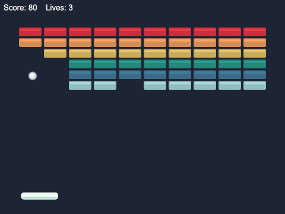

## What you will learn

- how to test whether two rectangles or two circles overlap, with `Phaser.Geom` and
  `Phaser.Geom.Intersects`, and why rectangles are unfair to round things
- how to give a circle a circular hit area, so clicks outside the circle miss it
- how to turn on Arcade Physics, give game objects **bodies**, and see them with `debug`
- how to size and shape a body to fit its picture: `setSize`, `setOffset` and `setCircle`
- the difference between `this.physics.add.overlap` and `this.physics.add.collider`
- how to collide whole **groups** - dynamic and static - with each other, and what the callbacks
  receive
- how to decide whether a collision counts, with a **process callback**, and how to switch
  collisions and bodies off

## The projects

| Project | What it shows |
|---|---|
| [ch08_hand_made_collisions](projects/ch08_hand_made_collisions/) | rectangles and circles to drag with the mouse; they turn red while they touch. No physics - just geometry |
| [ch08_collect_and_avoid](projects/ch08_collect_and_avoid/) | the first Arcade Physics game: collect stars, avoid enemies, bump into crates. Bodies, groups, colliders and overlaps |
| [ch08_breakout](projects/ch08_breakout/) | a complete breakout: a paddle, a ball, and a static group of bricks; a process callback, and aiming the ball by where it hits the paddle |

## Part 1: collisions by hand

To ask whether two things touch, you need shapes with numbers you can compare. Phaser's geometry
classes, in `Phaser.Geom` - `Rectangle`, `Circle`, `Line`, `Triangle`, `Polygon`, `Point` - are
exactly that: just numbers, never drawn.

`Phaser.Geom.Intersects` has a function for each pair of shapes. The two you will use most:

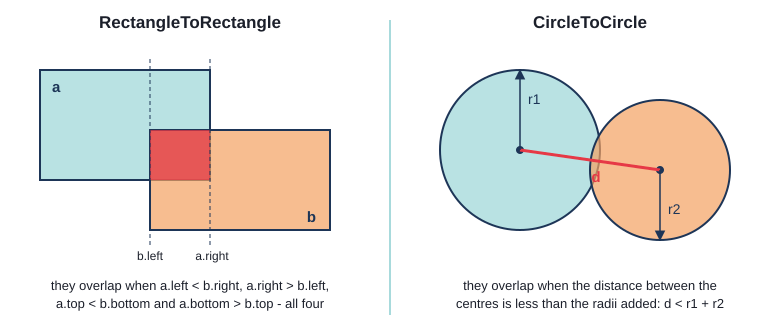

- **two rectangles** overlap if each one starts before the other one ends - across *and* down. Four
  comparisons, and no square roots, so it is very fast
- **two circles** overlap if the distance between their centres is less than their two radii added
  together

`CircleToRectangle` finds the point of the rectangle nearest the circle's centre, and checks
whether that is inside the circle.

### The shapes project

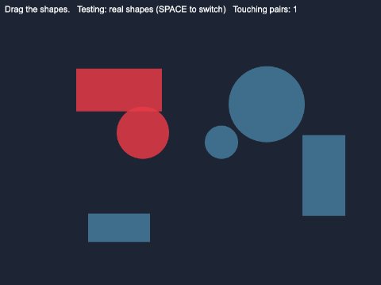

`ch08_hand_made_collisions` has three rectangles and three circles, which you can drag around with
the mouse. They are Phaser **shape game objects**: `this.add.rectangle(...)` makes a
`Phaser.GameObjects.Rectangle`, and `this.add.circle(...)` makes a `Phaser.GameObjects.Arc` (a circle
is an arc that goes all the way round). Neither knows anything about collisions. That is the job of
one function:

`src/geometry.ts`
```ts
// a union type: a shape on screen is a rectangle OR a circle
export type DragShape = Phaser.GameObjects.Rectangle | Phaser.GameObjects.Arc;

// the circle a round shape covers, in game coordinates
export function circleOf(shape: Phaser.GameObjects.Arc): Phaser.Geom.Circle {
  return new Phaser.Geom.Circle(shape.x, shape.y, shape.radius);
}
```

```ts
export function touching(a: DragShape, b: DragShape, boxesOnly: boolean): boolean {
  const intersects = Phaser.Geom.Intersects;

  // getBounds() gives the smallest rectangle, lined up with the screen, that holds the whole shape
  if (boxesOnly) {
    return intersects.RectangleToRectangle(a.getBounds(), b.getBounds());
  }

  // instanceof checks the class of an object while the game runs, as in Java - and TypeScript
  // then knows that `a` is an Arc inside the if, so a.radius is allowed
  if (a instanceof Phaser.GameObjects.Arc && b instanceof Phaser.GameObjects.Arc) {
    return intersects.CircleToCircle(circleOf(a), circleOf(b));
  }
  if (a instanceof Phaser.GameObjects.Arc) {
    return intersects.CircleToRectangle(circleOf(a), b.getBounds());
  }
  if (b instanceof Phaser.GameObjects.Arc) {
    return intersects.CircleToRectangle(circleOf(b), a.getBounds());
  }
  return intersects.RectangleToRectangle(a.getBounds(), b.getBounds());
}
```

- `type DragShape = ... | ...` gives a union type a name - a **type alias**
- **`getBounds()`**, on every game object with a size, returns a new `Phaser.Geom.Rectangle` - the
  **bounding box**: the smallest rectangle, square to the screen, that the object fits inside. For
  a circle, `circleOf()` builds a `Phaser.Geom.Circle` from the arc's centre and radius
- `instanceof` works as in Java, and TypeScript **narrows** the type: inside
  `if (a instanceof Phaser.GameObjects.Arc)` it knows `a` is an `Arc`, so `a.radius` compiles

### Testing every pair

Every frame, the scene tests every shape against every other shape - once:

`src/scenes/ShapesScene.ts`
```ts
override update(): void {
  // test every PAIR once: shape 0 with 1, 2, 3...; shape 1 with 2, 3...; and so on
  const touched = new Set<DragShape>();
  let pairs = 0;

  for (let i = 0; i < this.shapes.length; i++) {
    for (let j = i + 1; j < this.shapes.length; j++) {
      const a = this.shapes[i];
      const b = this.shapes[j];
      if (touching(a, b, this.boxesOnly)) {
        touched.add(a);
        touched.add(b);
        pairs++;
      }
    }
  }
  ...
```

Starting `j` at `i + 1` tests each pair once, and never a shape against itself. Six shapes make 15
pairs; 100 would make 4,950 - every frame - which is why physics engines work hard to skip pairs
that are obviously far apart. `Set` is like Java's `HashSet`; the rest of `update()` colours each
shape by asking `touched.has(shape)`.

### Why rectangles are unfair to round things

Press SPACE, and the project tests only the shapes' bounding boxes - which it outlines in orange:

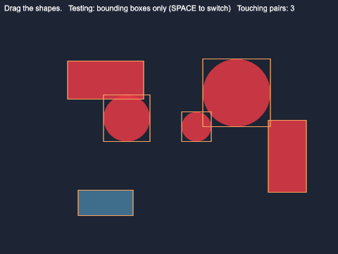

The two circles on the right are now "touching" each other and the tall rectangle, although there
is clear space between them. Their boxes overlap in the corners:

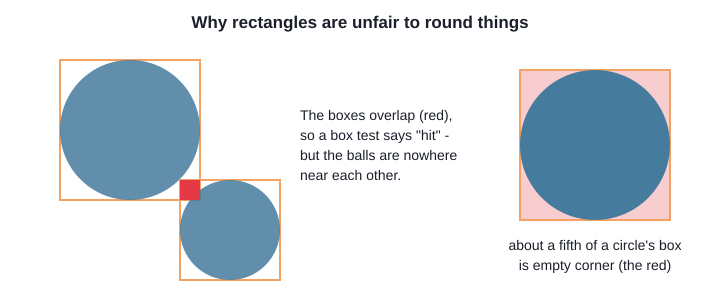

Players never forgive a bullet that visibly missed but still killed them. For anything round -
balls, coins, bubbles - test circles. For anything boxy - platforms, crates, bricks - rectangles are
exact, and faster.

### Point in shape: clicking a circle

Chapter 2 said that `setInteractive()` checks the pointer against a game object's rectangle. A
circle's rectangle has the same four empty corners, so by default a click just *outside* a circle,
in one of its corners, would pick it up. The fix is a different **hit area**:

`src/scenes/ShapesScene.ts`
```ts
private addCircle(x: number, y: number, radius: number): void {
  const circle = this.add.circle(x, y, radius, IDLE_COLOUR, SHAPE_ALPHA);

  // A circle's hit area would be its rectangle too - so clicking just outside the circle, in a
  // corner of its box, would pick it up. Give it a CIRCLE hit area instead. The hit area is in
  // the object's own coordinates, where (0, 0) is its top-left corner - so the centre is at
  // (radius, radius). Circle.Contains is the test Phaser runs: is this point inside the circle?
  circle.setInteractive({
    hitArea: new Phaser.Geom.Circle(radius, radius, radius),
    hitAreaCallback: Phaser.Geom.Circle.Contains,
    draggable: true,
    useHandCursor: true,
  });
  this.shapes.push(circle);
}
```

Every geometry class has a static `Contains(shape, x, y)` - "is this point inside?" - and you can
call them yourself, too. `draggable: true` makes the object draggable, and the scene listens for
drags on all of them at once:

```ts
this.input.on("drag", (_pointer: Phaser.Input.Pointer, shape: DragShape, dragX: number, dragY: number) => {
  shape.setPosition(dragX, dragY);
});
```

`dragX` and `dragY` are where the object should be now, allowing for where you grabbed it.

## Part 2: Arcade Physics

A real game has dozens of moving things, and you want them to *respond* - stop at a wall, bounce
off each other. **Arcade Physics** does all of that. It is fast because it only knows rectangles and
circles that never rotate - which suits most 2D games. (Chapter 9 looks at it in depth, and at
Matter.js, Phaser's other engine.)

### Turning it on

Physics is switched on in the game's config:

`ch08_collect_and_avoid/src/main.ts`
```ts
physics: {
  default: "arcade",
  arcade: {
    debug: false,
  },
},
```

This gives every scene a `this.physics` - the Arcade Physics **plugin** - and a physics **world**,
the size of the game, that it runs every frame. Nothing in the world has a body yet, though: game
objects only get one when you ask.

`debug: true` draws every body's outline, and a line showing which way and how fast it is moving.
It is the single most useful thing to turn on when a collision does not do what you expect:

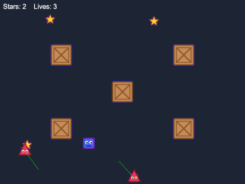

Pink outlines are **dynamic** bodies (they move); blue ones are **static** bodies (they never move).
Notice the stars' round bodies, and the small boxes inside the triangles - more on those soon.

### Bodies

A **body** is the physics engine's idea of a game object: a rectangle or circle, with a position, a
velocity, and settings such as bounce. Each frame, the world moves every body, checks for
collisions, and moves the game objects to match - the `speed * delta` maths from Chapter 1, done for
you.

There are three ways to get a game object with a body:

```ts
this.physics.add.image(x, y, key);       // a new Image, with a body
this.physics.add.sprite(x, y, key);      // a new Sprite (animations), with a body
this.physics.add.existing(gameObject);   // give a body to a game object you already have
```

The player in `ch08_collect_and_avoid` is a class of its own, so it uses the third:

`src/objects/Player.ts`
```ts
export class Player extends Phaser.Physics.Arcade.Image {
  constructor(scene: Phaser.Scene, x: number, y: number) {
    super(scene, x, y, PLAYER_KEY);

    scene.add.existing(this);           // show it: add it to the scene's display list
    scene.physics.add.existing(this);   // give it a dynamic physics body
```

`Phaser.Physics.Arcade.Image` is an `Image` with the physics methods added - `setVelocity`,
`setBounce`, `setCollideWorldBounds` and many more - so the player can call them on itself. Extending
it does not give the object a body, though; `scene.physics.add.existing(this)` does. Forget that line
and the first physics call fails as the game starts:

```
TypeError: Cannot read properties of null (reading 'setSize')
```

The player's `move()` method, called from the scene's `update()`, works out a speed across and down
from the arrow keys and calls `this.setVelocity(speedX, speedY)`. It never changes its own `x` and
`y`, and that matters: if a crate is in the way, the physics engine stops the body at its edge. If
the code set `x` itself, it could put the player straight through the crate. And
`setCollideWorldBounds(true)` keeps the body inside the world - the edges of the game.

### Fitting the body to the picture

A body starts as the size of the picture. That is rarely right: pictures have empty space round
their edges. `player.png` is 48 x 48, but the blob drawn in it is 36 x 34:

`src/objects/Player.ts`
```ts
// the body starts as the size of the picture; shrink it to fit the blob, and move it to
// where the blob is. The offset is measured from the picture's top-left corner.
this.setSize(BODY_WIDTH, BODY_HEIGHT);
this.setOffset(BODY_OFFSET_X, BODY_OFFSET_Y);
```

The enemies are triangles - the worst shape for a rectangle. A body the size of the picture would
hurt the player when they touched an empty corner, so each enemy gets a smaller box in the middle,
a little low, where most of the triangle is:

`src/scenes/GameScene.ts`
```ts
enemy.setSize(24, 24);
enemy.setOffset(12, 18);
```

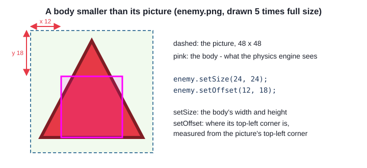

A slightly *small* hit box is the usual choice for things that hurt the player: a near miss feels
like skill, and a hit that looks like a miss feels like cheating. (Challenge 6 makes the triangles
exactly fair.)

Round things get round bodies. `setCircle(radius, offsetX, offsetY)` turns a body into a circle;
the offset is where the circle's bounding box starts, from the picture's top-left corner:

```ts
// a round body, smaller than the picture: radius 12, its top-left 4 across and 5 down
star.setCircle(12, 4, 5);
```

Turn on `debug` whenever you size a body: guessing numbers blind is slow work.

## Overlap or collider?

Arcade Physics has two ways to react to two things touching, and choosing the right one is most of
the work:

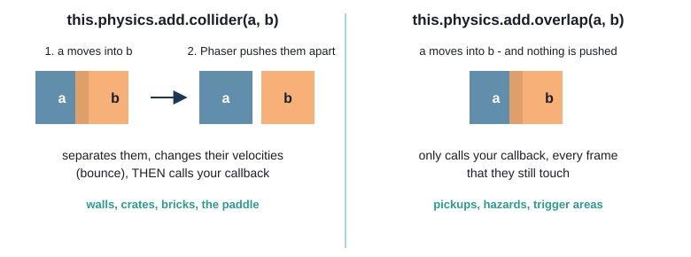

- **`this.physics.add.collider(a, b, callback)`** - `a` and `b` must not pass through each other.
  When their bodies overlap, Phaser **separates** them (pushes them back apart), changes their
  velocities - bouncing them if they have bounce - and then calls your callback, if you gave one
- **`this.physics.add.overlap(a, b, callback)`** - Phaser only tells you they touched. Nothing is
  pushed, and the callback is called **every frame** that they still overlap

Here are all the collisions in `ch08_collect_and_avoid`:

`src/scenes/GameScene.ts`
```ts
// COLLIDERS: these must not pass through each other. Phaser pushes them apart
this.physics.add.collider(this.player, this.crates);
this.physics.add.collider(this.enemies, this.crates);
this.physics.add.collider(this.enemies, this.enemies);   // a group against itself

// OVERLAPS: only tell us that they touched - nothing is pushed
this.physics.add.overlap(this.player, this.stars, (_player, star) => {
  // Phaser's types allow for a body or a tile here too; we know it is a star, because the
  // second thing we passed was the stars group
  this.collectStar(star as Phaser.Physics.Arcade.Sprite);
});
this.enemyOverlap = this.physics.add.overlap(this.player, this.enemies, () => {
  this.hurtPlayer();
});
```

These are set up **once**, in `create()`. Each call makes a `Collider` object and adds it to the
world, which checks it every frame from then on. There is no collision code in `update()` at all.

Why an overlap for the stars? With a collider, the player would *bump* the star before the callback
removed it; you want to walk straight through a pickup. And an enemy should hurt, not shove.

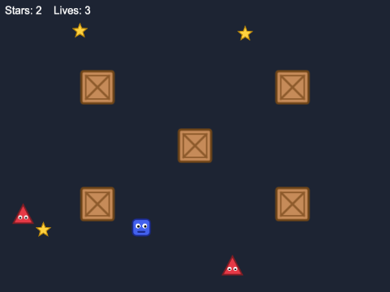

### Groups against groups

A collider or overlap can take a single game object, a **group**, or an array. Given a group, it
checks every member - so one line handles all the stars, however many there are, including ones
added later. `this.physics.add.collider(this.enemies, this.enemies)` checks every enemy against
every other enemy (each pair once, as in the shapes project), so they bounce off each other.

Physics groups come in two kinds:

- `this.physics.add.staticGroup()` gives its members **static bodies**: they never move, whatever
  hits them, and cost almost nothing to check. Perfect for walls, platforms and crates
- `this.physics.add.group(config)` gives its members **dynamic bodies**, which move with their
  velocity and can be pushed. The config sets defaults for every member it makes: the enemies group
  has `{ bounceX: 1, bounceY: 1, collideWorldBounds: true }`, so every enemy keeps all its speed
  when it bounces, and stays inside the game

`group.create(x, y, key)` makes a new member, with a body, and adds it to the group and the scene:

```ts
for (const [x, y] of CRATE_PLACES) {
  // create() makes a member of the group. It is typed `any`, so say what it is: a physics
  // group makes Arcade Sprites unless told otherwise
  const crate = this.crates.create(x, y, CRATE_KEY) as Phaser.Physics.Arcade.Sprite;
  crate.setScale(CRATE_SCALE);
  // a static body does not follow its game object: after scaling, make the body match again
  crate.refreshBody();
}
```

`const [x, y] of CRATE_PLACES` takes each two-number array in turn and **destructures** it into `x`
and `y`. And note `refreshBody()`: a static body is worked out once, when it is made, so if you
move or scale a static object afterwards, you must tell its body to catch up. Forget, and the
player bumps into an invisible crate-sized box inside a bigger crate.

### What the callbacks receive

A callback receives the two objects that touched, in the order you passed them - except that a
single object always comes before a group member, even if you passed the group first. TypeScript
does not know what is inside a group, and colliders can also involve bare bodies and tilemap tiles
(Chapter 10), so both parameters are typed as a union of all four. Use one directly:

```ts
this.physics.add.overlap(this.player, this.stars, (_player, star) => {
  star.disableBody(true, true);
});
```

and the build says:

```
TS2339 [ERROR]: Property 'disableBody' does not exist on type 'Body | StaticBody | Tile | GameObjectWithBody'.
```

You know better - the stars group only holds stars - so you say so with `as`, TypeScript's cast
(Java's `(Sprite) star`). It is exactly what `as` is for: a fact Phaser's types cannot know. Keep it
right next to the collider that guarantees it.

### Switching bodies off

When a star is collected, it should vanish - and stop being collectable:

```ts
private collectStar(star: Phaser.Physics.Arcade.Sprite): void {
  this.sound.play(COIN_SOUND);
  this.score++;
  this.showHud();

  // switch the star's body off and hide it: it can no longer be touched or seen
  star.disableBody(true, true);

  // ...and bring it back somewhere else a moment later
  this.time.delayedCall(STAR_RESPAWN_TIME, () => {
    const spot = this.freeSpot();
    star.enableBody(true, spot.x, spot.y, true, true);
  });
```

`disableBody(disableGameObject, hideGameObject)` takes the body out of the simulation - no
collisions at all - and with `true, true` also makes the star inactive and invisible.
`enableBody(reset, x, y, enableGameObject, showGameObject)` brings it back at a new place. The same
star object is reused, rather than destroyed and made again.

Where? `freeSpot()` picks random places until one is clear of the crates and the player - checking
the crates with `RectangleToRectangle`, by hand, as in Part 1.

### Switching collisions off

An overlap calls its callback every frame the two things touch. Standing on an enemy for half a
second would cost 30 lives. So after a hit, the player is safe for a moment:

```ts
// a short time of safety: switch the overlap off, flash the player, and switch it on again.
// Without this, touching an enemy would cost a life EVERY FRAME it touched
this.enemyOverlap.active = false;
this.tweens.add({ ... });
this.time.delayedCall(INVULNERABLE_TIME, () => {
  this.player.setAlpha(1);
  this.enemyOverlap.active = true;
});
```

`this.physics.add.overlap(...)` returns the `Collider` it made; keeping it in a field lets you
switch it off with `active = false` and on again with `active = true`. The player still overlaps the
enemies - the world just stops checking. (To remove a collider for good, call its `destroy()`.) The
flashing is a tween from Chapter 7, which fades the player in and out.

At the start of `hurtPlayer()` there is one more check - `if (!this.enemyOverlap.active)` - because
two enemies can touch the player in the same frame, and only the first should count.

## Breakout

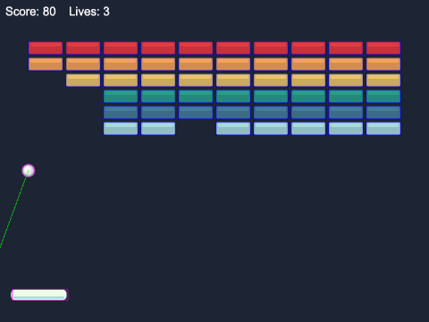

`ch08_breakout` puts it all together. It has three kinds of object:

- the **paddle** - a `Paddle` class, with a dynamic body made **immovable**: when the ball hits
  it, the physics engine moves only the ball (Chapter 9 has more on immovable bodies)
- the **ball** - a `Ball` class, with a circular body, bounce 1, and world-bounds collision
- the **bricks** - a static group of 60, made in rows and columns

The paddle and bricks are not in the asset library, so `makeTextures()` draws them with `Graphics`
and saves each as a texture with `generateTexture(key, width, height)` - usable by key, like a
loaded image. The brick is white, and each row is tinted with `setTint(colour)`.

### The ball

`src/objects/Ball.ts`
```ts
constructor(scene: Phaser.Scene, x: number, y: number) {
  super(scene, x, y, BALL_KEY);
  scene.add.existing(this);
  scene.physics.add.existing(this);

  // a round body the size of the picture - so the ball's corners never hit anything
  this.setCircle(RADIUS);
  this.setCollideWorldBounds(true);
  this.setBounce(1);
}
```

**Bounce** is how much speed a body keeps when it hits something: 0 stops dead, 0.5 keeps half,
1 keeps it all. With bounce 1 and world-bounds collision on, the ball bounces round the edges of the
game for ever - except that breakout needs a hole in the floor:

`src/scenes/BreakoutScene.ts`
```ts
// The ball bounces off the left, right and top edges of the world - but not the bottom:
// there it falls out, and a life is lost
this.physics.world.setBoundsCollision(true, true, true, false);
```

The four values are left, right, top, bottom. `update()` then watches for the ball falling below
the screen.

### Ball against bricks

```ts
// ball and bricks: a COLLIDER, so the ball bounces. The callback runs after the bounce
this.physics.add.collider(this.ball, this.bricks, (_ball, brick) => {
  // Phaser's types allow for a body or a tile too; we passed the bricks group, so it is one
  // of its members - and a group makes Arcade Sprites unless told otherwise
  this.hitBrick(brick as Phaser.Physics.Arcade.Sprite);
});
```

A collider this time: the ball must bounce off the brick. The physics engine does the bounce - it
works out which side was hit and reverses the right part of the velocity - and then the callback
removes the brick:

```ts
// gone for good: destroy() removes the brick from the scene, its body from the physics world,
// and the brick from the group
brick.destroy();
...
if (this.bricks.countActive() === 0) {
  this.endGame("You cleared the wall!", WIN_SOUND);
}
```

Stars were disabled, because they come back; bricks are destroyed, because they do not.
`countActive()` counts the group's active members - none left means the wall is cleared.

### Ball against paddle: a process callback

The paddle is where the player gets control, and it needs two extra ideas:

```ts
// ball and paddle: a collider with a PROCESS CALLBACK (the second function). Phaser asks it
// first, and if it answers false the two do not collide at all. Only a FALLING ball bounces
// off the paddle - so a ball that clips the paddle's end on its way up is not turned round
this.physics.add.collider(
  this.ball,
  this.paddle,
  () => {
    this.ball.bounceOff(this.paddle);
    this.sound.play(PADDLE_SOUND);
  },
  () => {
    return this.ball.isFalling();
  },
);
```

A collider (or overlap) can take a second function, the **process callback**. When the bodies
overlap, Phaser calls it *first*; if it returns `false`, the pair is ignored - no separation, no
bounce, no collide callback - for this frame. It is how you say "these two collide, *but only
when...*": only when the ball is falling; only when the player is not invulnerable; only from
above, for a platform you can jump up through.

Here it fixes a classic breakout bug: without it, a paddle moved sideways into a rising ball turns
the ball round, down into the paddle, where it can stick.

> **Note** - Phaser only skips the collision when the process callback returns exactly `false`. A
> process callback that forgets its `return` gives `undefined` - and everything collides as if there
> were no process callback at all. TypeScript will not warn you: Phaser's types say the callback
> returns nothing.

`Ball.isFalling()` returns `this.body!.velocity.y > 0`. A game object's `body` is typed as possibly
`null` - it only has one once physics gives it one - hence the `!`: "I know this is not null".

### Aiming the ball

If the ball simply bounced off the paddle like a wall, the player could never aim. Every breakout
game instead sends the ball off at an angle that depends on **where** it hit:

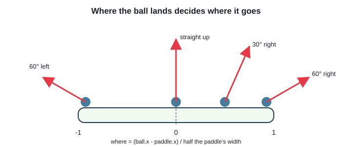

`src/objects/Ball.ts`
```ts
public bounceOff(paddle: Paddle): void {
  const halfWidth = paddle.displayWidth / 2;
  const where = Phaser.Math.Clamp((this.x - paddle.x) / halfWidth, -1, 1);
  this.setDirection(where * MAX_BOUNCE_ANGLE);
}
```

```ts
// move at BALL_SPEED, at `degrees` from straight up (negative = to the left)
private setDirection(degrees: number): void {
  const radians = Phaser.Math.DegToRad(degrees);
  this.setVelocity(Math.sin(radians) * BALL_SPEED, -Math.cos(radians) * BALL_SPEED);
}
```

`where` is -1 at the paddle's left end, 0 in the middle and 1 at the right (`Clamp` keeps it there
when the ball catches a corner), and becomes an angle of up to 60 degrees from straight up. `sin`
and `cos` split the speed into across and up, as in Chapter 2, so the ball always moves at exactly
`BALL_SPEED`. This runs in the **collide** callback - *after* Phaser has bounced the ball - so it
replaces the plain bounce.

### Moving the paddle

`src/objects/Paddle.ts`
```ts
// the mouse: jump straight to the pointer, keeping the whole paddle on screen
public moveTo(x: number): void {
  const halfWidth = this.displayWidth / 2;
  this.x = Phaser.Math.Clamp(x, halfWidth, this.scene.scale.width - halfWidth);
}
```

The arrow keys move the paddle by velocity (`moveWithKeys`); the mouse sets `x` directly, so the
paddle is exactly where the pointer is. That is safe: at the start of every step, a dynamic body
takes its position from its game object.

## Common mistakes

> **Note** - **"Cannot read properties of undefined (reading 'add')"** as the game starts: the
> config has no `physics` section, so `this.physics` does not exist.
>
> **A body in the wrong place**: the offset in `setOffset` and `setCircle` is measured from the
> picture's **top-left corner**, not its centre. Turn on `debug` and look.
>
> **Things bump that should pass through, or the other way round**: a `collider` where you meant
> `overlap`, or the other way round.

## Summary

- `Phaser.Geom` has shapes made only of numbers; `Phaser.Geom.Intersects` tests whether two of them
  overlap. `getBounds()` gives any game object's bounding rectangle
- rectangles are exact for boxy things and unfair to round ones: use circles for round things -
  and a circular `hitArea` for clicking them
- turn on Arcade Physics in the config; give game objects bodies with `this.physics.add.image` /
  `sprite`, or `this.physics.add.existing`. `debug: true` shows the bodies
- fit a body to its picture with `setSize` + `setOffset`, or `setCircle`
- `collider` separates and bounces; `overlap` only reports. Set them up once, in `create()`
- colliders work with single objects and whole groups: `staticGroup` for things that never move,
  `group` for things that do. Call `refreshBody()` after moving or scaling a static body
- callbacks get the two objects that touched (a single object before a group member); cast them
  with `as`
- a process callback decides whether a collision counts; `collider.active` switches one off for a
  while, `destroy()` for good; `disableBody` / `enableBody` switch one object's body off and on

## Challenges

1. **Debug key** *(ch08_collect_and_avoid)* - Press D to turn the physics debug drawing on and off
   while the game runs, and show "DEBUG" in the corner while it is on. The game should start with it
   off, as now.

2. **Hover highlight** *(ch08_hand_made_collisions)* - When the pointer is over a shape - without
   clicking - give that shape a thick white outline. The test must be fair: over a circle's empty
   corner is not over the circle. Do the point-in-shape tests yourself, with `Contains`, rather than
   with `setInteractive`'s events.

3. **Tough bricks** *(ch08_breakout)* - Make the top row of bricks take two hits. After the first
   hit, a tough brick should change colour (or look cracked) so the player knows; the second hit
   removes it. Tough bricks are worth more points.

4. **Wide paddle** *(ch08_breakout)* - Some bricks, chosen at random, drop a power-up when they are
   hit. It falls down the screen; if the paddle catches it, the paddle is half as wide again for ten
   seconds. If the paddle misses it, it falls off the bottom and is gone. *Hint:* the power-up needs a
   body with a velocity, and an overlap with the paddle. A dynamic body follows its game object's
   scale by itself.

5. **Glass bricks** *(ch08_breakout)* - Make one row out of glass: the ball smashes glass bricks as
   it touches them, but does **not** bounce off them - it carries straight on. Every other brick
   works as before. *Hint:* a process callback that returns `false` stops the collision - but it can
   still do something first. Remember which object is which in the callback.

6. **Fair triangles** *(ch08_collect_and_avoid)* - The enemies' small square bodies are a
   compromise: some hits are missed, and some touches still count that should not. Make it exact.
   Keep the square body (the physics engine cannot do triangles), but only count a hit when the
   player's body really touches the red triangle. *Hint:* the triangle's corners in `enemy.png` are
   (24, 4), (44, 42) and (4, 42), and `Phaser.Geom` has a `Triangle` and an
   `Intersects.RectangleToTriangle`. Where does the extra test go so that a near miss does not
   cost a life? Turn debug on to check, and make the enemies' bodies big enough to cover the whole
   triangle.

---

Previous: [Chapter 7 - Animations](../ch07_animations/README.md) ·
Next: [Chapter 9 - 2D physics](../ch09_physics/README.md)
