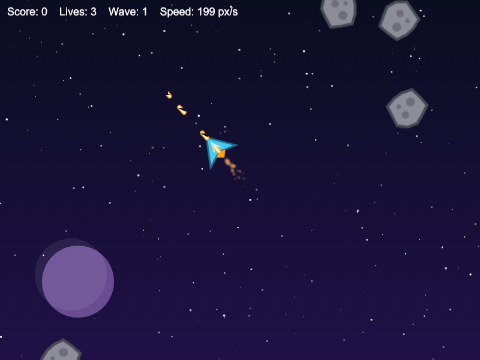
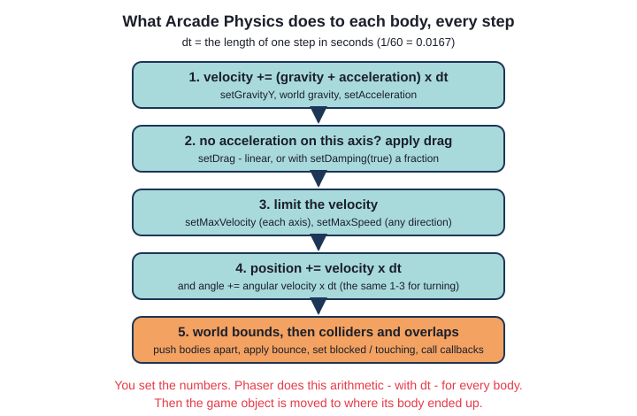
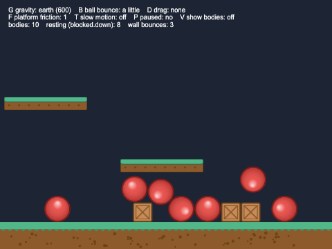
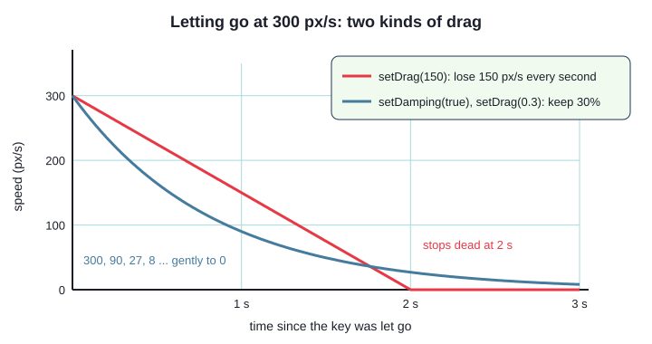
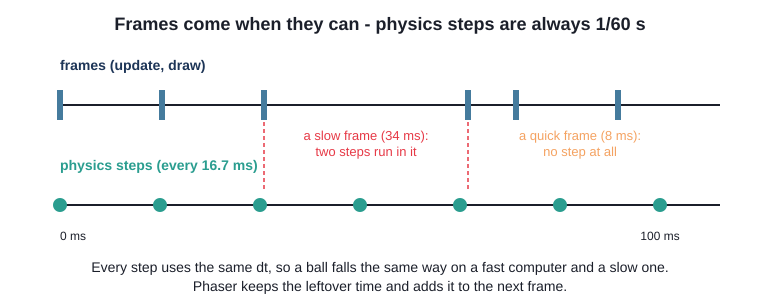
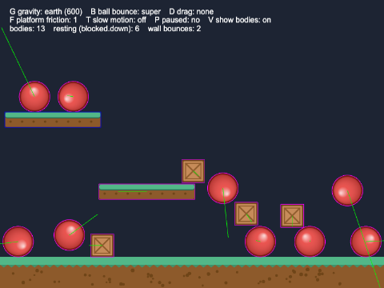
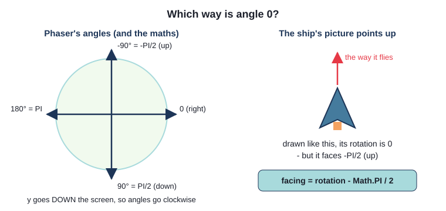
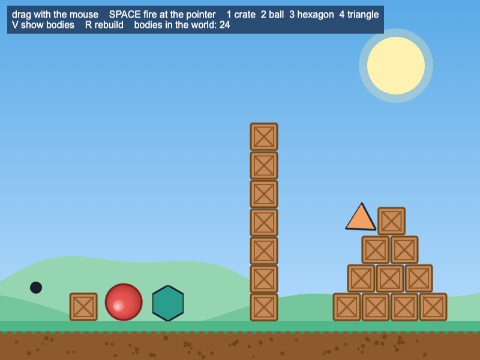
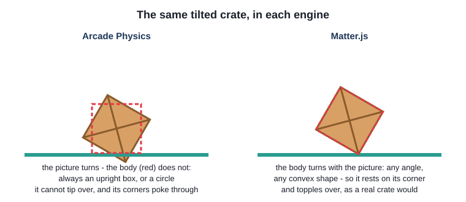
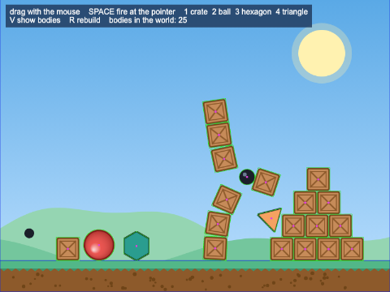

# Chapter 9 - 2D physics

Chapter 8 gave game objects **bodies**, and let Arcade Physics decide when they touch. This chapter
is about everything else a physics engine does: moving bodies with velocity and acceleration,
gravity, drag, bounce, mass and friction, turning, speed limits, and a world that wraps round at the
edges. You will play with all of them in a sandbox, fly an Asteroids-style ship built from nothing
but physics settings, and finish with a first look at **Matter.js** - Phaser's other physics engine,
where crates really stack and topple.



## What you will learn

- what Arcade Physics does to every body in every step, and why you never need `delta` when it
  moves things for you
- gravity, bounce, drag (linear and damping), maximum speed, mass and friction - and how to change
  them while a game runs
- the kinds of body - dynamic, immovable, not pushable, static - and who moves when two collide
- how to find out what a body is resting on (`blocked`, `touching`) and when it hits the edge of the
  world (`onWorldBounds`)
- turning with angular velocity and acceleration, flying the way you point with
  `velocityFromRotation`, and wrapping round the world with `wrap`
- the fixed time step, and pausing or slowing down the physics world
- Matter.js: real shapes that rotate and stack, and when to choose it instead of Arcade

## The projects

| Project | What it shows |
|---|---|
| [ch09_physics_playground](projects/ch09_physics_playground/) | balls and crates in an Arcade world, with keys that change gravity, bounce, drag, friction and time while it runs |
| [ch09_space_ship](projects/ch09_space_ship/) | an Asteroids-style game: rotation, thrust, damping, a top speed, spinning rocks, bullets and a wrapping world |
| [ch09_matter_stack](projects/ch09_matter_stack/) | a Matter.js world: a tower and a pyramid of crates to knock down with cannonballs, shapes to drop, and bodies to drag with the mouse |

## Why let physics move things?

In Chapter 1 the ball moved itself. Every frame, its `preUpdate()` did the arithmetic:

`ch01_moving_ball/src/objects/Ball.ts`
```ts
const seconds = delta / 1000;

// move: speed (pixels per second) x time (seconds) = distance (pixels)
this.x = this.x + this.speedX * seconds;
this.y = this.y + this.speedY * seconds;
```

Fine for one ball at a steady speed. But a ship that speeds up and drifts, a ball that falls
faster and faster and bounces, a crate that slows to a stop - each is more arithmetic, on every
object, every frame, and easy to get wrong. A physics body does it for you. You set **numbers** - a
velocity, an acceleration, a drag, a bounce - and in every step Arcade Physics works out the rest:



- **velocity** is how fast something moves, and which way: pixels per second, across (x) and down
  (y). It changes the **position**
- **acceleration** is how fast the velocity changes: pixels per second, **per second**. It changes
  the **velocity**. Gravity is an acceleration that every body shares

`setVelocityX(200)` means "move right at 200 pixels per second"; `setAccelerationX(200)` means "go
200 pixels per second faster every second". Your code says what; Phaser does the `delta` maths.

## The physics playground



`ch09_physics_playground` is a sandbox: a floor, a ledge, a sliding platform, and balls and crates.
Click to drop a ball, C to drop a crate, and use the keys to change the laws of physics as it runs.

### Gravity

Physics is switched on in the config, as in Chapter 8. This time the world has gravity:

`src/main.ts`
```ts
physics: {
  default: "arcade",
  arcade: {
    // pixels per second, per second: every second, a falling body goes 600 px/s faster
    gravity: { x: 0, y: 600 },
    // physics steps per second (60 is the default - written here so you can see it)
    fps: 60,
    // debug drawing: ON, so that Phaser gets ready to draw every body - but the scene hides
    // it at the start, and V shows it
    debug: true,
  },
},
```

World gravity pulls on every dynamic body. G changes it while the game runs:

`src/scenes/PlaygroundScene.ts`
```ts
// G: the world's gravity - shared by every body (a body can add its own with setGravityY)
keyboard.on("keydown-G", () => {
  this.gravityIndex = (this.gravityIndex + 1) % GRAVITY_CHOICES.length;
  this.physics.world.gravity.y = GRAVITY_CHOICES[this.gravityIndex].value;
});
```

`GRAVITY_CHOICES` is an array of `{ name, value }` objects (earth 600, jupiter 1500, off, moon 100).
A body can also change the gravity it feels: `setGravityY(g)` **adds** `g` to the world's gravity for
that body alone, and `body.setAllowGravity(false)` switches it off - as the moving platform does.

### Bounce and the edges of the world

A body's **bounce** is how much of its speed it keeps when it hits something: 0 stops dead, 1 comes
back at full speed, more than 1 gains speed. B cycles the balls through 0.5, 0.9, 1 and 0.

Balls bounce off other bodies, through the colliders, and off the **edges of the world**. The world
starts as big as the game; the playground ends it at the top of the grass:

```ts
// the physics world starts as big as the game; stop it at the top of the ground instead
this.physics.world.setBounds(0, 0, 800, FLOOR_Y);
```

`setCollideWorldBounds(true)` makes a body treat those edges as walls.

### Drag, two ways

A ball pushed along an Arcade floor rolls for ever: there is no friction with the ground, no air.
**Drag** slows things down, in two ways (D cycles through them):



- **linear drag** - `setDrag(150)` takes 150 pixels per second off the speed every second, until it
  reaches 0
- **damping** - `setDamping(true)` makes the drag number the **fraction of the speed kept** each
  second. `setDrag(0.3)` keeps 30%: fast things slow quickly, slow things gently, like a boat in
  water. It must be between 0 and 1, and *smaller* means *more* drag

`src/scenes/PlaygroundScene.ts`
```ts
private applySettings(thing: Phaser.Physics.Arcade.Image): void {
  const drag = DRAG_CHOICES[this.dragIndex];
  thing.setCollideWorldBounds(true);
  thing.setDamping(drag.damping);
  thing.setDrag(drag.value);
  if (thing instanceof Ball) {
    thing.setBounce(BOUNCE_CHOICES[this.bounceIndex].value);
  }
}
```

`instanceof` works as in Java: only balls get the bounce; crates keep the default, 0.

One rule catches everybody: **drag only works on an axis with no acceleration** - it is for slowing
down once the engine is off. (Gravity does not count, so with damping a falling ball reaches a
**terminal velocity**, like a skydiver.)

### Mass: who gets pushed

When two dynamic bodies collide, Arcade shares the push by their **mass**. The default is 1;
`addCrate()` calls `crate.setMass(CRATE_MASS)`, with `CRATE_MASS = 3`. A ball hardly moves a crate; a
crate knocks a ball aside. Against anything that cannot move, mass makes no difference.

### A trap: groups reset their members

Look at the order in `addBall()`:

```ts
private addBall(x: number, y: number): void {
  const ball = new Ball(this, x, y);
  // add to the group FIRST: a physics group resets the bodies it is given to its own defaults
  // (no bounce, no velocity...), so anything set before this line would be lost
  this.things.add(ball);
  bodyOf(ball).onWorldBounds = true;
  ball.setVelocityX(Phaser.Math.Between(-LAUNCH_SPEED, LAUNCH_SPEED));
  this.applySettings(ball);
}
```

In Chapter 8 a group's config set **defaults** for its members. The group applies them to *every*
body added to it - and with no config, the defaults are velocity 0, bounce 0, drag 0, mass 1, no
world bounds. Set a ball moving, then add it to the group, and it stops - with no error or warning.
So: **add to the group first, then set the body up.** (The circle body from `Ball`'s constructor
survives: shape is not a group default.)

`bodyOf()` is a helper at the top of the scene. A game object's `body` is typed "dynamic, static,
Matter, or `null`"; every body here is dynamic, so `bodyOf()` says so with `as`, once.

### Immovable, static, pushable - and friction

Here is the whole family of bodies, and what happens when a normal dynamic body runs into each:

| Body | Moves itself? | Pushed by collisions? | Made with |
|---|---|---|---|
| dynamic | yes - velocity, gravity, drag | yes, shared by mass | `physics.add.image`, `add.existing(obj)` |
| not pushable | yes | no - it pushes back, and the other body takes all the bounce | `setPushable(false)` |
| immovable | yes, if you give it a velocity | never | `setImmovable(true)` |
| static | never | never; the cheapest body of all | `physics.add.staticImage`, `staticGroup` |

The ledge on the left is **static**. The platform is **immovable**: it moves by its own velocity,
but nothing can push it about:

`src/objects/MovingPlatform.ts`
```ts
this.setImmovable(true);            // collisions never push it

// the Image has no setAllowGravity() - the body itself does. physics.add.existing() made a
// dynamic body, but Phaser's types cannot know which kind, so `as` says so
const body = this.body as Phaser.Physics.Arcade.Body;
body.setAllowGravity(false);        // it floats
this.setVelocityX(SPEED);
// turn round at the edges of the world: bounce 1 keeps all of its speed
this.setCollideWorldBounds(true, 1, 1);
```

Drop a crate on it and the crate rides along. That is **friction** - and in Arcade, friction belongs
to the *platform*: how much of its movement it passes to a rider. 1 (the default) carries it; 0
slides out from under it. F switches between them:

```ts
// F: friction belongs to the platform - it is how much of ITS movement it passes on
keyboard.on("keydown-F", () => {
  this.platformFriction = this.platformFriction === 1 ? 0 : 1;
  this.platform.setFriction(this.platformFriction, 0);
});
```

That is all Arcade friction does - not the grip of crate on crate (that needs Matter). It is also
why crates have no bounce: a bouncing crate would never be carried.

### What is it touching?

After every step, each body has two sets of flags - `up`, `down`, `left`, `right` and `none`:

- `body.blocked` - pushed against something that cannot give way: the edge of the world, a static or
  immovable body, or a body that is itself blocked
- `body.touching` - touching another body (of any kind) on that side

The playground's `update()` counts the bodies with `blocked.down` - resting on something solid. It
is every platform game's question: "is the player standing on something?" (Chapter 15). The flags
change every step, so check them in `update()`, not once in `create()`.

To hear about the world's edges, a body must **opt in**: the balls set `onWorldBounds = true`, and
the world emits `"worldbounds"` whenever one hits an edge:

```ts
this.physics.world.on(
  Phaser.Physics.Arcade.Events.WORLD_BOUNDS,
  (body: Phaser.Physics.Arcade.Body, _up: boolean, down: boolean) => {
    // the floor does not count, and neither does a ball just leaning on a wall (it would
    // "hit" it every step): only a real bounce, that sends the ball back with some speed
    if (!down && body.velocity.length() > BOUNCE_SPEED) {
      this.wallBounces = this.wallBounces + 1;
      this.flash(body.gameObject as Phaser.Physics.Arcade.Image); // only images have onWorldBounds on
    }
  },
);
```

The listener gets the **body** (`body.gameObject` leads back to the ball) and a boolean per edge.
Note the comment: the event fires for every *step* a body is against the edge, not just the first.

### Pausing and slowing the world

The physics world has its own clock, separate from the game's:

```ts
// T: the physics clock runs slower - but the game loop, and everything else, does not
keyboard.on("keydown-T", () => {
  const world = this.physics.world;
  world.timeScale = world.timeScale === 1 ? SLOW_MOTION : 1;
});

// P: freeze the physics world. Nothing moves, no colliders run - but the scene still
// updates, draws, and listens to keys
keyboard.on("keydown-P", () => {
  if (this.physics.world.isPaused) {
    this.physics.resume();
  } else {
    this.physics.pause();
  }
});
```

`timeScale` is backwards: **bigger is slower** (2 is half speed). `this.physics.pause()` freezes
every body, but unlike Chapter 4's `this.scene.pause()` the scene's `update()`, timers and tweens
carry on - handy for a game-over screen that freezes the action (the space ship does this).

### The fixed time step

Frames do not arrive exactly every 16.7 milliseconds: one might take 8, the next 34. Moving bodies
by `velocity x delta` once per frame, a slow frame would be one big jump - big enough to carry a
fast ball through a thin wall - and the game would behave differently on every computer. So Arcade
runs on a **fixed time step**: it moves the world in steps of exactly 1/60 s (`fps: 60`):



A slow frame gets two steps, a quick one none. Every step is the same size, so the same throw lands
in the same place on any computer. You never see this - but it is why a 120 Hz screen draws some
frames where nothing has moved, and why `fps: 120` makes collisions of very fast things more
reliable (for twice the work).

### Seeing the bodies

Press V: pink outlines for dynamic bodies, blue for static, green lines for velocity.



```ts
// V: debug drawing on and off. The config switches debug on (so Phaser makes the Graphics it
// draws with, and gets every body ready to be drawn), and create() switches the drawing off.
private toggleDebug(): void {
  const world = this.physics.world;
  world.drawDebug = !world.drawDebug;
  world.debugGraphic.clear();         // or the last drawing would stay on screen
}
```

Watch a ball roll. The picture turns - `Ball`'s `preUpdate()` sets an angular velocity of speed /
radius - but its body does not. **Arcade bodies never rotate.** A circle does not mind; a box does.
That is Arcade's biggest limit, and the reason Matter.js exists.

## The space ship


`ch09_space_ship` is a small Asteroids: LEFT and RIGHT turn, UP thrusts, SPACE fires. There is no
gravity, and the ship's code never sets its own position or angle - only accelerations.

### Which way is it pointing?

Phaser measures angles from **pointing right**, clockwise (`rotation` in radians, `angle` in
degrees). But `player_ship.png` points **up** - so at rotation 0 the ship faces -90 degrees:



Forget this and the ship flies sideways. Draw pictures pointing right, or - as here - subtract a
quarter turn whenever a rotation becomes a direction.

### Turning

Turning works like moving: **angular velocity** (degrees per second) turns the picture, **angular
acceleration** changes it, **angular drag** slows it, and `maxAngular` caps it:

`src/objects/Ship.ts`
```ts
// turning works just like moving: an angular acceleration, a drag, and a maximum
this.setAngularDrag(TURN_DRAG);
this.arcadeBody.maxAngular = MAX_TURN;
```

```ts
// -1 turns left (anticlockwise), 1 turns right, 0 lets the turn die away
public turn(direction: number): void {
  this.setAngularAcceleration(direction * TURN_ACCELERATION);
}
```

The scene calls `this.ship.turn(left + right)`, with -1 for LEFT and 1 for RIGHT. Full turning
speed comes in under a fifth of a second: quick, but with a little weight. (`arcadeBody` is the
body, cast once in the constructor: `maxAngular` and `setMaxSpeed` live on the body, not the image.)

### Thrust: flying the way you point

```ts
public thrust(on: boolean): void {
  if (on) {
    // the picture points UP when rotation is 0, but Phaser's angles start pointing RIGHT
    // (0 = right, PI/2 = down). A quarter turn back puts them in line.
    const facing = this.rotation - Math.PI / 2;
    // write the result straight into the body's acceleration - no new vector needed
    this.scene.physics.velocityFromRotation(facing, THRUST, this.arcadeBody.acceleration);
  } else {
    // no acceleration: now (and only now) drag slows the ship down
    this.setAcceleration(0);
  }
}
```

`velocityFromRotation(angle, speed, vector)` turns "this fast, that way" into an x and a y - the
`cos` and `sin` trick from Chapter 2 - and writes them into `vector`. Despite its name, here the
vector is the ship's **acceleration**: it speeds up the way it faces. Turn round and thrust, and you
slow, stop and fly back. (`velocityFromAngle` is the same in degrees.)

### Drifting, and a top speed

```ts
// damping: drag as a fraction of the speed kept each second, not pixels per second taken away
this.setDamping(true);
this.setDrag(DAMPING);
// a true speed limit. setMaxVelocity(x, y) limits each axis on its own, so going
// diagonally you could reach 1.4 times the limit
this.arcadeBody.setMaxSpeed(MAX_SPEED);
```

A coasting ship keeps 60% of its speed each second: it drifts, but does stop. Hold UP and the speed
on screen climbs to exactly 350, and no further. `setMaxVelocity(x, y)` suits a platform game, where
running and falling need different limits - but it limits x and y **separately**, so a diagonal
could reach 424. `setMaxSpeed` limits the real speed, whichever way it points.

### Wrapping round the world

Fly off the right edge, and you come back on the left:

`src/scenes/SpaceScene.ts`
```ts
// off one edge, on at the other. wrap() works with game objects and whole groups
this.physics.world.wrap(this.ship, SHIP_WRAP);
this.physics.world.wrap(this.rocks, ROCK_WRAP);
this.physics.world.wrap(this.bullets, BULLET_WRAP);
```

`wrap(object, padding)` moves anything past one edge of the world to the opposite edge. The
**padding** - about half its size - lets it slide off screen before it reappears, instead of
popping. It is a check, so it runs in `update()`, every frame.

### Rocks

`src/objects/Rock.ts`
```ts
public launch(): void {
  // a random direction and speed, turned into an x and y velocity
  const angle = Phaser.Math.Between(0, 359);
  const speed = Phaser.Math.Between(MIN_SPEED, MAX_SPEED);
  this.scene.physics.velocityFromAngle(angle, speed, (this.body as Phaser.Physics.Arcade.Body).velocity);

  // spin: angular velocity turns the PICTURE. The body is a circle, so it does not matter
  this.setAngularVelocity(Phaser.Math.Between(-MAX_SPIN, MAX_SPIN));

  // rocks bounce off each other without losing any speed
  this.setBounce(1);
}
```

`launch()` is not in the constructor because of the group trap: the scene adds each rock to its
group, then launches it. A collider between the rocks group and itself makes rocks bounce off each
other, trading speeds rather like snooker balls.

### Bullets

A bullet leaves at `BULLET_SPEED` the way the ship faces - **plus the ship's own velocity**, or a
fast ship would overtake its bullets:

```ts
// velocity = the ship's own velocity + BULLET_SPEED in the direction the ship faces
const body = bullet.body as Phaser.Physics.Arcade.Body; // a physics group makes dynamic bodies
this.physics.velocityFromRotation(this.ship.rotation - Math.PI / 2, BULLET_SPEED, body.velocity);
body.velocity.add((this.ship.body as Phaser.Physics.Arcade.Body).velocity);
```

`body.velocity` is a `Phaser.Math.Vector2`, with `add`, `scale`, `length` and more. A
`delayedCall` destroys each bullet after `BULLET_LIFE` milliseconds.

### Losing a life, and game over

Ship and rocks use an `overlap` with a process callback that ignores hits while a new ship blinks,
and `disableBody` / `enableBody` for losing a life (both from Chapter 8). When the last life goes,
`endGame()` calls `this.physics.pause()`: the rocks freeze, but the scene runs on, so R still
restarts it - and `init()` resets the score (Chapter 2's trap).

## Matter.js



Arcade is fast because it is simple: upright boxes and circles. For most 2D games that is enough.
But a tower of crates does not work: boxes cannot tip, and piles jitter and sink. Phaser's second
engine, **Matter.js**, is a real **rigid-body** engine: any convex shape, rotation, friction between
bodies, and stacks that stand and topple.



### Turning Matter on

`ch09_matter_stack/src/main.ts`
```ts
physics: {
  default: "matter",
  matter: {
    // Matter's gravity is not in pixels per second: y: 1 is "normal" gravity
    gravity: { x: 0, y: 1 },
    // debug drawing: ON, so that Phaser gets ready to draw every body - but the scene hides
    // it at the start, and V shows it
    debug: true,
  },
},
```

Scenes now have `this.matter` instead of `this.physics`. A game normally uses one engine or the
other.

### Matter game objects

`src/objects/Crate.ts`
```ts
export class Crate extends Phaser.Physics.Matter.Image {
  constructor(scene: Phaser.Scene, x: number, y: number) {
    super(scene.matter.world, x, y, CRATE_KEY, undefined, {
      friction: 0.6,        // wood on wood: grippy, so a stack stays up (0 = ice, 1 = rubber)
      restitution: 0.05,    // bounce: crates hardly bounce at all
    });
    scene.add.existing(this);
  }
}
```

Two differences from Arcade: the constructor takes the **Matter world**, and the body is made
straight away from the last argument, an object literal of settings (`undefined` is the frame).
`this.matter.add.image(x, y, key, frame, options)` does the same without a class.

**Restitution** is Matter's word for bounce. **Friction** is real friction: how much two surfaces
grip. With friction near 0 the tower slides apart at a touch. Without a `shape`, the body is a
rectangle the size of the picture; other shapes are asked for by name:

`src/objects/Ball.ts`
```ts
super(scene.matter.world, x, y, BALL_KEY, undefined, {
  shape: { type: "circle", radius: RADIUS },
  restitution: 0.7,     // bouncy: keeps 70% of its speed after a hit
  friction: 0.05,
});
```

`Polygon` asks for `{ type: "polygon", sides: sides, radius: RADIUS }`, and - there being no
hexagon in the asset library - draws its own picture with `Graphics` and `generateTexture`, corners
exactly where Matter puts them. Press V: the green outlines are Matter's shapes, turning with the
pictures.

### A static ground, and walls

```ts
// the ground: a Matter image whose body is STATIC - it never moves, whatever hits it
this.matter.add.image(400, 600 - 32, GROUND_KEY, undefined, { isStatic: true });

// walls at the left and right edges (none at the top or bottom - the ground is the bottom).
// setBounds(x, y, width, height, thickness, left, right, top, bottom)
this.matter.world.setBounds(0, -400, 800, 1000, 64, true, true, false, false);
```

Matter has no "collide with world bounds": `setBounds` builds real static walls just outside the
area you give.

### Heavy, and fast: density and velocity

`src/objects/Cannonball.ts`
```ts
super(scene.matter.world, x, y, CANNONBALL_KEY, undefined, {
  shape: { type: "circle", radius: RADIUS },
  density: 0.01,
  restitution: 0.2,
});
```

Matter works out **mass** from area and **density** (default 0.001). The cannonball is small but ten
times as dense, so the tower moves, not the cannonball.

`src/scenes/StackScene.ts`
```ts
// aim at the pointer: the angle from the cannon to the pointer, turned into an x and y speed
const angle = Phaser.Math.Angle.Between(CANNON_X, CANNON_Y, pointer.worldX, pointer.worldY);
cannonball.setVelocity(Math.cos(angle) * CANNON_SPEED, Math.sin(angle) * CANNON_SPEED);
```

`CANNON_SPEED` is 22 - because **Matter's velocities are pixels per step**, not per second (22 is
about 1,300 px/s). Its gravity and forces have their own units too; Arcade numbers go very wrong.



### Dragging with the mouse

One line:

```ts
// drag any body with the mouse or a finger: a springy "constraint" joins the body to the
// pointer while the button is held
this.matter.add.mouseSpring({ stiffness: 0.2 });
```

A **constraint** is Matter's joint: it holds two bodies, or a body and a point, together. The
mouse spring joins the pointer to the body you press on; being a spring, the body swings and knocks
things over on its way. Chains, pendulums and wheels are constraints too
(`this.matter.add.constraint(bodyA, bodyB, length, stiffness)`).

### Collision callbacks

In Matter everything collides with everything - no colliders. To *hear* about a collision, give a
body a callback:

```ts
// a thud, the first time it hits something
let hit = false;
cannonball.setOnCollide(() => {
  if (!hit) {
    hit = true;
    this.sound.play(HIT_KEY, { volume: 0.6 });
  }
});
```

`this.matter.world.on("collisionstart", ...)` hears every collision in the world.

### Arcade or Matter?

| | Arcade Physics | Matter.js |
|---|---|---|
| shapes | upright rectangles and circles | circles, rectangles, any convex polygon, shapes made of several parts |
| rotation | the picture turns; the body never does | bodies rotate, tumble and topple |
| stacking | poor: piles jitter and sink | good: towers stand until knocked over |
| units | pixels per second | pixels per step; gravity 1; tiny forces |
| collisions | only what you ask for, with `collider` and `overlap` | everything with everything, filtered by categories |
| speed | very fast: thousands of bodies | slower: hundreds of bodies |
| use it for | platformers, shooters, top-down games - most 2D games | physics puzzles, stacking, ragdolls, vehicles, pinball |

Use Arcade unless the game is *about* the physics. The rest of this guide uses Arcade.

## Common mistakes

> **Note** - **The group ate my velocity.** Adding a body to a physics group resets it to the
> group's defaults. Add it to the group first, then set it up.

> **Note** - **Drag does nothing.** Drag only slows an axis with no acceleration. Set it to 0 when
> the key is let go. And with damping, `setDrag(0.99)` is gentle; `setDrag(0.01)` is a brick wall.

> **Note** - **The ship flies sideways.** The picture points up but angle 0 is right. Subtract
> `Math.PI / 2` (or draw the picture pointing right).

> **Note** - **`Property 'setAllowGravity' does not exist on type ...`.** Some settings live only on
> the body: `(this.body as Phaser.Physics.Arcade.Body).setAllowGravity(false)`.

> **Note** - **Everything in Matter flies off the screen.** Matter velocities are per step and its
> forces are tiny: 5 is a brisk velocity, 0.05 a strong force. Arcade numbers are far too big.

## Summary

- a body moves itself: you set velocity (px/s) and acceleration (px/s per second); gravity is an
  acceleration every body shares. No `delta` maths in your code
- `setBounce`, `setCollideWorldBounds` and `world.setBounds` for bouncing off the world's edges
- `setDrag` takes speed away; with `setDamping(true)` it keeps a fraction. Drag needs zero
  acceleration. `setMaxVelocity` limits each axis, `setMaxSpeed` the real speed
- mass shares the push between dynamic bodies; immovable bodies are never pushed; static ones never
  move. Arcade friction is how much a moving immovable body carries its riders
- `body.blocked` / `body.touching` say what a body is up against; `onWorldBounds` and
  `"worldbounds"` report the world's edges
- angular velocity, acceleration and drag turn things; `velocityFromRotation` points a vector the
  way something faces; `world.wrap` wraps it round the world
- physics runs in fixed steps, and can be paused or slowed (`timeScale`)
- a physics group resets the bodies added to it: add first, then set up
- Matter.js: real shapes that rotate and stack, friction, density and constraints - in its own
  units. Use Arcade unless the physics is the game

## Challenges

1. **Gravity switch** *(ch09_physics_playground)* - Make the arrow keys choose which way gravity
   pulls - down, up, left or right - at the strength G has chosen. Everything should pile up against
   that edge of the world. Show the direction on the screen.

2. **Bouncy and dead** *(ch09_physics_playground)* - Add two new kinds of ball. Key 1 drops a light
   blue super-ball (`ball_blue.png` from the asset library) that bounces perfectly and has half the
   normal mass; key 2 drops a heavy, dead grey ball (the red ball, tinted) with no bounce and five
   times the mass. They keep their own bounce whatever B is set to. Drop a heavy ball onto a pile of
   light ones.

3. **Brakes and reverse** *(ch09_space_ship)* - Holding DOWN fires the ship's retro-rockets: half
   the thrust, backwards. Holding SHIFT puts the brakes on: the ship slows to a stop in about half
   a second, far faster than it drifts. Show "BRAKES" on the screen while they are on.

4. **Rocks that split** *(ch09_space_ship)* - Shooting a big rock breaks it into two medium rocks,
   and a medium rock into two small ones; only small rocks are destroyed. Smaller rocks move faster
   and are worth more points. A new wave only starts when every piece is gone. *Hint:* give `Rock` a
   size. `setScale` changes the body too. The two halves should fly apart - at an angle either side
   of the direction the bullet was going, say - and remember the group trap.

5. **Demolition** *(ch09_matter_stack)* - Turn the stack into a game: five cannonballs to knock down
   as many crates as possible. A crate counts as down once it has tipped more than 30 degrees or
   dropped more than half a crate below where it started. Show "Crates down" and "Shots left", and
   when the last shot has been fired and a few seconds have passed, show the final score. *Hint:*
   keep the crates in an array, and remember each one's starting `y`. `crate.angle` is in degrees,
   from -180 to 180.

6. **Pinball flipper** *(ch09_matter_stack)* - Add a flipper near the bottom left: a long thin
   Matter body that swings up round a pin at one end while Z is held, and falls back when it is let
   go - hard enough to flick a ball up into the tower. Drop balls onto it with 2. *Hint:* a
   `this.matter.add.worldConstraint(body, 0, 1, { pointA, pointB })` pins a point of a body to a point
   in the world; `pointB` is measured from the body's centre. `setAngularVelocity` spins a Matter
   body (in radians per step). Something must stop the flipper swinging all the way round: two small
   static bodies, or a check of its angle every frame.

---

Previous: [Chapter 8 - Collisions](../ch08_collisions/README.md) ·
Next: [Chapter 10 - Tilemaps](../ch10_tilemaps_simple/README.md)
