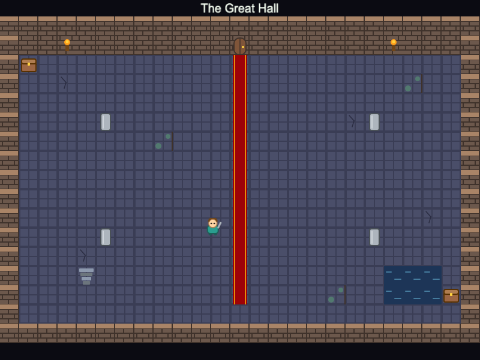

# Chapter 11 - Tilemaps with Tiled

In Chapter 10 you built maps by typing numbers into arrays. That works for a small room, but nobody
designs a real level that way. In this chapter you draw levels in **Tiled**, a free map editor, and
load them into Phaser: tiles you paint with the mouse, solid ground chosen by a property rather than
by a list of numbers, and the player, coins, enemies and doors placed in the editor instead of in the
code.


## What you will learn

- what Tiled is, and how to make a map in it: tilesets, tile layers, object layers and custom
  properties
- where the files go: the map's source (`.tmx`) and the JSON file the game loads (`.tmj`)
- what is inside an exported `.tmj` file, and what a **GID** is
- how to load a Tiled map with `tilemapTiledJSON`, `make.tilemap`, `addTilesetImage` and
  `createLayer` - and why the names must match exactly
- how to make tiles solid with `setCollisionByProperty`, and read any tile's properties
- three ways to read an object layer - `findObject`, `createFromObjects` and
  `getObjectLayer(...).objects` - and how to read custom properties on objects and maps
- how to join rooms together with doors that name the map they lead to

## The projects

| Project | What it shows |
|---|---|
| [ch11_tiled_level](projects/ch11_tiled_level/) | a platform level from Tiled: a ground layer made solid by a `collides` property, dangerous tiles with a `hazard` property, a background layer, and the player, coins, enemies and finish placed in an object layer |
| [ch11_tiled_doors](projects/ch11_tiled_doors/) | two top-down rooms made in Tiled with `dungeon_tiles.png`; doors with `target` and `entrance` properties load the next map and put the player at the right place |

## Why use a map editor?

A Chapter 10 map is a grid of numbers: to move a platform you count along a row. A map editor lets
you **see** the level while you make it - pick a tile, paint it, and that is what the game will show.
It also lets you put more in the map than tiles:

- **objects** - points and rectangles with names, such as "the player starts here", "a coin here",
  "this rectangle is a door"
- **custom properties** - your own named values, on a tile ("this tile is solid"), on an object ("this
  enemy walks at 100 pixels per second", "this door leads to the cellar") or on the whole map ("this
  level is called Green Hills")

The **level becomes data, not code**. The code says what a coin *does*; the map says where the coins
*are*. A designer who never opens the code can make a new level.

[Tiled](https://www.mapeditor.org/) is the editor almost everyone uses for 2D maps. It is free (you
can donate), it runs on Windows, macOS and Linux, and Phaser can read its JSON format directly. The
steps below use the menus of Tiled 1.12 (checked against 1.12.2); other versions may move things a
little.

## Tiled in seven steps

This section walks through making `level1`, the map in `ch11_tiled_level`. The finished map is in the
project, but open it in Tiled as you read, and try each step on a map of your own. Here is Tiled's
window, with the level open (a drawing - yours will look a little different):


### Where the files go

Each project keeps its map in two places:

```
ch11_tiled_level/
  tiled/
    level1.tmx                    the map's SOURCE - open and change this in Tiled
  public/
    assets/
      maps/
        level1.tmj                the map EXPORTED as JSON - the file the game loads
      tilesets/
        platform_tiles.png        the tileset picture, used by both
```

`.tmx` is Tiled's own format (XML); `.tmj` is its JSON format, which Phaser reads. You work on the
`.tmx`, and export the `.tmj` when you want the game to see your changes - just as you edit `.ts`
files and build `game.js`. (Tiled can also save straight to `.tmj`, with no `.tmx`; that works too.)

### Step 1 - a new map

**File > New > New Map...** opens the New Map dialog:


- **Orientation: Orthogonal** - an ordinary grid of squares (Tiled also does isometric and hexagonal
  maps)
- **Tile layer format: CSV** - how the tiles are written in the file. CSV is readable, and Phaser
  reads it. (Avoid the compressed Base64 formats: Phaser cannot read those)
- **Tile render order: Right Down** - leave it
- **Map size: Fixed, 64 x 20 tiles** - the level is 64 tiles across and 20 down. Not "Infinite": a
  game level has edges, and the camera and physics world need to know where they are
- **Tile size: 32 x 32 px** - the size of one tile in `platform_tiles.png`

Press **OK**. The new map opens, untitled: use **File > Save As...** to save it as `tiled/level1.tmx`
inside the project.

### Step 2 - a tileset

A **tileset** is the picture the tiles come from, cut into squares. **File > New > New Tileset...** (or
the New Tileset button at the bottom of the Tilesets panel) opens the second dialog above:

- **Name: platform_tiles** - Tiled suggests the picture's file name. Remember this name: the code
  needs it
- **Type: Based on Tileset Image** - one picture cut into tiles
- **Embed in map: ticked** - this matters. An embedded tileset is saved *inside* the map file. Phaser
  cannot read a separate tileset file (`.tsx` or `.tsj`). While the box is unticked, the dialog's
  button says **Save As...** (to save a separate tileset file); ticking it changes the button to **OK**
- **Source** - browse to `public/assets/tilesets/platform_tiles.png`. Tiled stores the path relative
  to the map file
- **Tile width and height: 32 px, margin and spacing 0** - this picture's tiles are packed edge to
  edge

Press **OK**, and the tiles appear in the **Tilesets** panel.

### Step 3 - tile layers, and painting

A new map starts with one tile layer, "Tile Layer 1". Double-click its name in the **Layers** panel
and rename it **Ground**. Then **Layer > New > Tile Layer** makes a second one: call it
**Background**, and drag it below Ground in the list. In the Layers panel, the layer at the **top of
the list is drawn on top** - so Background is drawn first, and Ground over it.

Why two layers? The bushes, sign and flag are scenery, not ground: a separate layer keeps them apart,
and lets one place hold two tiles - a bush in front of a wall, say.

To paint, click a layer in the Layers panel (it is easy to paint on the wrong one), click a tile in
the Tilesets panel, and use the tools:

| Tool | Key | Does |
|---|---|---|
| Stamp Brush | B | paints the chosen tile (or block of tiles - drag in the Tilesets panel to choose several) |
| Bucket Fill Tool | F | fills an area |
| Eraser | E | removes tiles |

With the Stamp Brush, right-click on the map to pick up the tile under the pointer. **Ctrl+Z**
(Cmd+Z on a Mac) undoes.

### Step 4 - custom properties on tiles

Which tiles are solid? In Chapter 10 the code had a list: `layer.setCollision([2])`. With Tiled you
can put the answer in the tileset instead, as a **custom property**.

Click **Edit Tileset** under the Tilesets panel. The tileset opens in a tab of its own. Select the
solid tiles - grass, dirt, the two grass edges, brick, stone and crate - with Ctrl-click (Cmd-click on
a Mac). Then, in the **Properties** panel, click the **+** button (**Add Property**), type the name
**collides**, choose the type **bool**, and press OK. Tick the new property's box: now all seven tiles
have `collides = true`.


Do the same for the spikes, water and lava, with a bool property called **hazard**. Tiles with no
property simply do not have it - the bushes, sign, flag and ladder have none.

Properties can be `bool`, `int`, `float`, `string`, `color`, `file` or `object`, and the names are up
to you: nothing in Tiled knows what "collides" means. Only your code gives it a meaning.

### Step 5 - an object layer

Some things in a level are not tiles: where the player starts, where the coins and enemies are, the
area that counts as the finish. **Layer > New > Object Layer** makes a layer for **objects**; call it
**Objects**.

The object tools appear in the tool bar when an object layer is selected:

| Tool | Key | Makes |
|---|---|---|
| Insert Point | I | a point: a single position |
| Insert Rectangle | R | a rectangle |
| Insert Polygon | P | a shape with many corners - or, finished without closing it, a line of points (a polyline) |
| Select Objects | S | select, move and resize objects |

Click with Insert Point to place the player's start. In the Properties panel, give it the **Name**
`player`. Place a point for each coin, each named `coin`, and one for each enemy, named `enemy`. Draw a
rectangle round the flag and name it `goal`.

Each enemy also has a custom property, added with **+** as for tiles: **speed**, a **float** - 60 for
the first slime, 100 for the second. Tiled measures each kind of object differently, which matters
when the code places things:


> **Note** - Tiled also has a **Class** field for every object (it was called **Type** in older
> versions). This chapter uses only the **Name**, because the name is saved the same way by every
> version of Tiled.

### Step 6 - map properties

**Map > Map Properties...** shows the properties of the whole map in the Properties panel. Add a
string property called **name**, with the value `Green Hills`. The game shows it in the corner of the
screen.

### Step 7 - save, and export

**File > Save** (Ctrl+S) saves `level1.tmx`. That is your work - but the game cannot read it. To make
the file the game loads, use **File > Export As...**, choose the type **JSON map files (\*.tmj
\*.json)**, and save it as `public/assets/maps/level1.tmj`.

Tiled remembers where you exported to. After the first time, **File > Export** (Ctrl+E, or Cmd+E on a
Mac) writes the `.tmj` again without asking. (In **Edit > Preferences** - in the **Tiled** menu on a
Mac - you can also tell Tiled to repeat the last export every time you save.) Then build the game,
and refresh.

> **Note** - If your tileset is *not* embedded, tick **Embed tilesets** under **Export Options** in
> Preferences before exporting, or use the **Embed Tileset** button at the bottom of the Tilesets
> panel. Otherwise Phaser shows *External tilesets unsupported. Use Embed Tileset and re-export* in
> the console, and the game stops with an error.

The maps in this chapter's projects were written by a small script,
[`tools/make_maps.ts`](tools/make_maps.ts), so that they are exactly what the text describes. They
open in Tiled like any other map. (The drawings of Tiled's windows in this chapter come from
[`tools/make_diagrams.ts`](tools/make_diagrams.ts).)

Here is the whole level, with its objects drawn over it as Tiled shows them:


## Inside a .tmj file

Open `public/assets/maps/level1.tmj` in Celbridge. It is long, but simple:


- the **map**: its size in tiles, the size of a tile, and its custom properties
- **tilesets**: each embedded tileset, with its name, picture, size, and the custom properties of
  the tiles that have any
- **layers**, in drawing order: a tile layer is a `data` list of numbers, one for each place in the
  map, row by row; an object layer is a list of `objects`, each with an `id`, a `name`, a position,
  and any custom properties

Custom properties are written as a list, each with a `name`, `type` and `value`.

### Tile numbers: GIDs

The numbers in a tile layer's `data` are not quite the tile numbers from Chapter 10. They are
**GIDs** - global tile IDs:


A map can use several tilesets, so Tiled numbers every tile in the map in one sequence. The first
tileset's tiles start at its **firstgid**, 1 - which leaves **0 to mean "no tile here"**. A second
tileset would carry on from 17. So grass top, which is tile 0 in the picture, is GID 1 in the map.

Phaser keeps the GIDs: a tile from a Tiled map has `tile.index` equal to its GID, and an empty place
has index -1. If you ever choose tiles by number in a Tiled map - `setCollision([1, 2, 3])` - they
are GIDs. That is one reason to choose them by property instead, as the next section does: then
nobody has to count.

## Loading the map in Phaser

### Two files to load

`src/scenes/GameScene.ts`
```ts
preload(): void {
  // the map (JSON), and the picture its tileset uses - two separate files
  this.load.tilemapTiledJSON(MAP_KEY, MAP_FILE);
  this.load.image(TILES_KEY, TILES_FILE);
```

`tilemapTiledJSON` loads the `.tmj` into Phaser's tilemap cache, under a key. It does **not** load the
tileset's picture, even though the map names it - you load the picture yourself, as an ordinary
image. The keys and file names are in `src/assets.ts`:

`src/assets.ts`
```ts
// the level, exported from Tiled as JSON (the Tiled source is tiled/level1.tmx)
export const MAP_KEY = "level1";
export const MAP_FILE = "assets/maps/level1.tmj";

// the tileset's picture. TILESET_NAME is the name the tileset has INSIDE the map - the name shown in
// Tiled's Tilesets panel. Phaser needs both: the name to find the tileset in the map, and the key to
// find the picture it loaded.
export const TILES_KEY = "platform_tiles";
export const TILES_FILE = "assets/tilesets/platform_tiles.png";
export const TILESET_NAME = "platform_tiles";

// the names of the layers, exactly as they are spelled in Tiled's Layers panel
export const BACKGROUND_LAYER = "Background";
export const GROUND_LAYER = "Ground";
export const OBJECTS_LAYER = "Objects";
```

### Four steps to a map on screen

`src/scenes/GameScene.ts`
```ts
private createMap(): void {
  // 1. the map: its layers, tileset and objects, all read from the JSON file loaded in preload()
  this.map = this.make.tilemap({ key: MAP_KEY });

  // 2. join the tileset in the map (by its NAME in Tiled) to the picture Phaser loaded (by its KEY)
  const tiles = this.map.addTilesetImage(TILESET_NAME, TILES_KEY);
  if (tiles === null) {
    throw new Error(`No tileset "${TILESET_NAME}" in the map, or no picture "${TILES_KEY}" loaded`);
  }

  // 3. a game object for each tile layer, by its name in Tiled. They are drawn in the order they
  //    are made, so the background goes first. (createLayer can also make a GPU layer, which is a
  //    different type - we did not ask for one, so this is an ordinary TilemapLayer.)
  this.map.createLayer(BACKGROUND_LAYER, tiles);
  this.ground = this.map.createLayer(GROUND_LAYER, tiles) as Phaser.Tilemaps.TilemapLayer;

  // 4. every tile whose "collides" property is ticked in Tiled's tileset becomes solid
  this.ground.setCollisionByProperty({ collides: true });
```

1. `this.make.tilemap({ key })` - in Chapter 10 you passed `data`, an array. Pass a `key` instead and
   Phaser builds the `Tilemap` from the loaded JSON: every layer, tileset and object in it. A
   `Tilemap` is not drawn; it is the data
2. `addTilesetImage(name, key)` joins the tileset **named in the map** to the picture **loaded under
   a key**. Here both are `"platform_tiles"`, but they are two different things - the first comes from
   Tiled, the second from your `load.image` call. If the map has no tileset with that name - or no
   picture was loaded with that key - you get `null`
3. `createLayer(name, tileset)` makes a `TilemapLayer` - a game object that draws one layer. Layers are
   drawn in the order you make them, so make the background first. The `as` is needed because
   `createLayer` is typed to return either an ordinary layer or a `TilemapGPULayer` (a faster, more
   limited kind you get by passing `true` as a fifth argument)
4. `setCollisionByProperty({ collides: true })` finds every tile in the layer whose Tiled properties
   include `collides: true`, and makes it solid. After that, a collider works just as in Chapter 10:

```ts
this.physics.add.collider(this.player, this.ground);
```

Every name in that code came from Tiled, and every one must be spelled exactly the same - capital
letters too:


That is why they are constants in `assets.ts`: each name is written once. When one is wrong, Phaser
does not stop with a clear error - it writes a warning in the browser's console (press F12) and hands
back `null` or nothing, and the game fails a line or two later. Check the console first.

### Seeing what is solid

Press **D** in the game. `toggleDebug()` calls `this.ground.renderDebug(graphics, colours)`, which
draws the layer's colliding tiles:


Every red tile is one with `collides` ticked in Tiled. The spikes, water and lava are not red - the
player falls into them.

### Reading a tile's properties

The `hazard` property is not used by Phaser at all. The scene reads it itself, every frame:

```ts
// Is the player touching a tile with the "hazard" property (spikes, water, lava)? Phaser has
// turned each tile's Tiled properties into an object, so it is just tile.properties.hazard.
private touchingHazard(): boolean {
  const body = this.player.body as Phaser.Physics.Arcade.Body;
  // the tiles under the player's body - trimmed by 2 pixels, so only a real touch counts
  const tiles = this.ground.getTilesWithinWorldXY(body.x + 2, body.y + 2, body.width - 4, body.height - 2);
  return tiles.some((tile) => tile.properties.hazard === true);
}
```

`getTilesWithinWorldXY(x, y, width, height)` returns every tile in a rectangle of the world - here,
the player's body. Each `Tile` has a `properties` object holding its custom properties from Tiled, so
a spike tile has `properties.hazard === true` and a grass tile has `properties.collides === true`.
`some(...)` is true if the function says yes for at least one tile - like Java's
`stream().anyMatch(...)`.

## Reading the object layer

Phaser gives you three ways into an object layer. The level uses all three, one for each kind of
thing.

### findObject - one particular object

`src/scenes/GameScene.ts`
```ts
// findObject: the first object in the layer that the function says yes to
const spawn = this.map.findObject(OBJECTS_LAYER, (obj) => obj.name === "player");
if (spawn === null) {
  throw new Error('The map has no object called "player" in its Objects layer');
}
// x and y are optional in Phaser's type for a Tiled object, so give them a fallback
this.spawnX = spawn.x ?? 0;
this.spawnY = spawn.y ?? 0;
```

Each object is a plain object (Phaser's type is `Phaser.Types.Tilemaps.TiledObject`) with the fields
from the `.tmj`: `name`, `x`, `y`, `width`, `height`, `properties`. `findObject` returns the first one
your function accepts - or `null`, which TypeScript makes you deal with.

### createFromObjects - a sprite for every matching object

```ts
// createFromObjects: a Sprite for every object called "coin", placed where the object is, with
// the texture we ask for
const coinSprites = this.map.createFromObjects(OBJECTS_LAYER, { name: "coin", key: COIN_KEY });
this.coinsTotal = coinSprites.length;

// a static physics group gives each coin a body that never moves, so the player can touch it
this.coins = this.physics.add.staticGroup(coinSprites);
this.coins.playAnimation(COIN_SPIN);
```

`createFromObjects` does the whole job for simple things: it makes a `Sprite` for each object called
`"coin"`, at the object's position, with the texture you name, already added to the scene. (You can
also choose objects by `id`, `gid` or `type`, and ask for your own class with `classType`.) It copies
each object's custom properties too: one whose name matches a sprite field (`alpha`, `angle`...) sets
that field; any other goes into the sprite's **data**, read back with `sprite.getData("name")`.

### getObjectLayer - every object, to do as you like with

Enemies need more than a sprite: each one is a `Slime`, with a speed from Tiled. Here the scene looks
through the objects itself:

```ts
// getObjectLayer(...).objects: every object in the layer, to look through ourselves
const objectLayer = this.map.getObjectLayer(OBJECTS_LAYER);
if (objectLayer === null) {
  throw new Error(`The map has no object layer called "${OBJECTS_LAYER}"`);
}

const slimes: Slime[] = [];
for (const obj of objectLayer.objects) {
  if (obj.name === "enemy") {
    // a custom property, set on each enemy in Tiled
    const speed = getTiledProperty(obj.properties, "speed", DEFAULT_SLIME_SPEED);
    slimes.push(new Slime(this, obj.x ?? 0, obj.y ?? 0, speed, this.ground));
  }
}
```

### Reading an object's custom properties

There is one untidy thing to know. Phaser turns a **tile's** properties into a handy object
(`tile.properties.hazard`), but leaves an **object's** properties - and the **map's** - just as Tiled
wrote them: a list of `{ name, type, value }`. So the project has a small function to look one up:

`src/tiled.ts`
```ts
export function getTiledProperty<T>(
  properties: unknown,
  name: string,
  fallback: T,
): T {
  if (!Array.isArray(properties)) {
    return fallback;
  }
  const found = (properties as TiledProperty[]).find((property) => property.name === name);
  if (found === undefined || typeof found.value !== typeof fallback) {
    return fallback;
  }
  // safe: the line above checked that the value is the same kind (string/number/boolean) as T
  return found.value as T;
}
```

`getTiledProperty(obj.properties, "speed", 60)` gives the enemy's speed - or 60 if the designer forgot
to set one, or typed `"fast"` into it. A map is made by a person: the game should cope with mistakes.

> **Java and TypeScript** - `<T>` makes this a **generic** function, just like a generic method in
> Java: `<T> T getTiledProperty(Object properties, String name, T fallback)`. TypeScript works out `T`
> from the fallback - a number here, a string for a door's target - so the result needs no cast. And,
> as in Java, generic types are **erased** when the code runs: the function cannot ask "is this a
> `T`?". Instead it compares `typeof` the value with `typeof` the fallback - `"number"`, `"string"` or
> `"boolean"` - which the running program *can* see.

The level's name uses the same function, on the map's properties:

```ts
// a custom property on the MAP itself (Map > Map Properties in Tiled)
const levelName = getTiledProperty(this.map.properties, "name", "Unnamed level");
```

### Rectangles become zones

The finish is a rectangle object. A `Zone` is an invisible game object with a size - just right for
"is the player in here?" - but remember from the objects diagram that Tiled measures a rectangle from
its top-left corner, and a zone is placed by its centre:

```ts
// Tiled measures a rectangle from its top-left corner; a Zone - like most game objects - is
// placed by its centre. A Zone is an invisible rectangle: just right for "is the player here?"
const zone = this.add.zone(x + width / 2, y + height / 2, width, height);
this.physics.add.existing(zone, true);
this.physics.add.overlap(this.player, zone, () => {
  this.finish();
});
```

### An enemy that reads the map

The `Slime` uses the tile layer too. Each frame it looks at the tile just past its front foot; if
there is no tile there, or it is not solid, it would walk off an edge - so it turns round:

`src/objects/Slime.ts`
```ts
const aheadX = this.direction < 0 ? body.left - 1 : body.right + 1;
const tileAhead = this.ground.getTileAtWorldXY(aheadX, body.bottom + 1);
if (tileAhead === null || !tileAhead.collides) {
  this.direction = -this.direction;
}
```

`tile.collides` is `true` for the tiles `setCollisionByProperty` made solid, so the slimes can patrol
any platform a designer adds.

## Doors between maps



`ch11_tiled_doors` has two rooms, each a Tiled map: `hall.tmj` and `cellar.tmj`. Walk onto the
stairs in the hall and you go down to the cellar; walk through the cellar's door and you come back
up, beside the stairs.

Each doorway is a rectangle object called `door`, with two custom string properties. Each place a
player can arrive is a point object with a name of its own:


- `target` - the map the door leads to
- `entrance` - the name of the point object *in that map* where the player appears

Nothing in the code lists the rooms or says how they join. That is all in the maps.

### One scene, restarted with a different map

There is only one scene. What it shows is decided by the data it is started with:

`src/scenes/RoomScene.ts`
```ts
// which map to show, and the name of the point object in it where the player appears
export interface RoomData {
  map: string;
  entrance: string;
}

const FIRST_ROOM: RoomData = { map: "hall", entrance: "start" };
```

```ts
// The first time the game starts, Phaser passes no data - an empty object - so each value falls back
// to the first room. Partial<RoomData> is RoomData with every field optional.
init(data: Partial<RoomData>): void {
  this.room = {
    map: data.map ?? FIRST_ROOM.map,
    entrance: data.entrance ?? FIRST_ROOM.entrance,
  };
  this.leaving = false;
}
```

`Partial<RoomData>` is one of TypeScript's built-in **utility types**: `RoomData` with every field
optional - exactly what `init` receives, nothing the first time and a full `RoomData` after that.

The scene loads only the map it needs:

```ts
// Only the map for THIS room. The map's name is also its key. The first visit to a room loads
// its file; after that it is already in the cache, and the loader does not load it again.
this.load.tilemapTiledJSON(this.room.map, MAPS_FOLDER + this.room.map + MAP_EXTENSION);
```

`preload()` runs every time the scene starts, but files whose keys are already in the cache are
skipped. So the cellar's map is loaded the first time the player heads for the cellar, and never
again (Chapter 3 has more on loading later).

`create()` then builds the room just as the level did - `make.tilemap`, `addTilesetImage`,
`createLayer`, `setCollisionByProperty` - and puts the player at the entrance point it was given:

```ts
// the entrance is a point object whose NAME is the one we were given
const entrance = map.findObject(OBJECTS_LAYER, (obj) => obj.name === this.room.entrance);
```


### A door is a zone that knows where it goes

`src/objects/Door.ts`
```ts
export class Door extends Phaser.GameObjects.Zone {
  public readonly target: string;
  public readonly entrance: string;

  constructor(scene: Phaser.Scene, obj: Phaser.Types.Tilemaps.TiledObject) {
    const x = obj.x ?? 0;
    const y = obj.y ?? 0;
    const width = obj.width ?? 32;
    const height = obj.height ?? 32;

    // Tiled measures a rectangle from its top-left corner; a Zone is placed by its centre
    super(scene, x + width / 2, y + height / 2, width, height);

    this.target = getTiledProperty(obj.properties, "target", "");
    this.entrance = getTiledProperty(obj.properties, "entrance", "");
```

`readonly` is like Java's `final` on a field: set in the constructor, never changed. The scene makes a
`Door` for every object called `door` - `filterObjects` is `findObject`'s sibling, returning *all* the
matches:

```ts
// filterObjects: every object in the layer that the function says yes to
const doorObjects = map.filterObjects(OBJECTS_LAYER, (obj) => obj.name === "door") ?? [];
for (const obj of doorObjects) {
  const door = new Door(this, obj);
  this.physics.add.overlap(this.player, door, () => {
    this.goThrough(door);
  });
}
```

### Going through

```ts
private goThrough(door: Door): void {
  // overlap fires every frame the player is in the doorway: only act on the first
  if (this.leaving || !door.isOpen()) {
    return;
  }
  this.leaving = true;
  this.player.freeze();
  this.sound.play(DOOR_SOUND);

  // fade to black, THEN start this scene again with the next room (see Chapter 4 for camera fades)
  this.cameras.main.fadeOut(FADE_TIME);
  this.cameras.main.once(Phaser.Cameras.Scene2D.Events.FADE_OUT_COMPLETE, () => {
    const next: RoomData = { map: door.target, entrance: door.entrance };
    this.scene.restart(next);
  });
}
```

`this.scene.restart(data)` shuts the scene down and starts it again, passing `data` to `init()` -
exactly like `this.scene.start` in Chapter 2, but for the scene that is already running. Every room is
built by the same `create()`.

Notice that the **entrance points are a tile or two away from the doors**, so the player does not
arrive standing in a doorway and bounce straight back. The rooms are smaller than the screen, so the
camera is pointed at the middle of each: `this.cameras.main.centerOn(map.widthInPixels / 2,
map.heightInPixels / 2)`.

## Common mistakes

> **Note** - **A name does not match.** `addTilesetImage("platform", ...)` when the tileset is
> called `platform_tiles` gives *Tilemap has no tileset "platform". Its tilesets are
> ['platform_tiles']* in the console, and `null`. `createLayer("ground", ...)` when the layer is
> `Ground` gives *Invalid Tilemap Layer ID: ground* and *Valid tilelayer names: ['Background',
> 'Ground']*, then `null` - and the next line fails with *Cannot read properties of null (reading
> 'setCollisionByProperty')*. Phaser's warnings list the names it *does* have: compare them with
> yours.

> **Note** - **The map file is not there.** A wrong path in `tilemapTiledJSON` gives a 404 in the
> browser's Network tab, then *No map data found for key level1* in the console, and every layer is
> missing. Did you export the map into `public/assets/maps/`, and build?

> **Note** - **Loading the .tmx.** `tilemapTiledJSON` given `level1.tmx` fails with *SyntaxError:
> Unexpected token '<', "<?xml vers"... is not valid JSON*: Phaser reads the JSON export, not Tiled's
> XML file.

> **Note** - **You changed the map but the game did not.** The game loads the `.tmj`, not the `.tmx`.
> Export (File > Export), build, then refresh.

> **Note** - **Everything falls through the floor.** No tile has `collides` ticked, the property is
> spelled differently (`Collides`, `collide`), or it is a `string` property holding `"true"` instead
> of a `bool`. Press D to see which tiles are solid.

> **Note** - **Things are half a tile out.** A rectangle's `x` and `y` are its top-left corner; a
> point's are the point. Add half the width and height to place a centred game object on a rectangle.

## Summary

- Tiled is a free map editor. A map has tilesets, tile layers, object layers and custom properties -
  on tiles, objects and the map itself
- keep the source as `tiled/<name>.tmx`; export JSON to `public/assets/maps/<name>.tmj` for the game.
  Use an **orthogonal**, **fixed-size** map, **CSV** tile data, and an **embedded** tileset
- the numbers in a Tiled tile layer are **GIDs**: firstgid + tile index, with 0 for "no tile". In
  Phaser `tile.index` is the GID, and an empty place is -1
- `this.load.tilemapTiledJSON(key, file)` loads the map; load the tileset's picture with
  `this.load.image`
- `this.make.tilemap({ key })`, then `map.addTilesetImage(nameInTiled, imageKey)`, then
  `map.createLayer(layerName, tileset)` - the names must match Tiled exactly
- `layer.setCollisionByProperty({ collides: true })` makes tiles solid by property; any tile's
  properties are in `tile.properties`
- read objects with `map.findObject` (one), `map.filterObjects` (all that match),
  `map.createFromObjects` (sprites, made for you) or `map.getObjectLayer(name).objects` (the lot).
  Object and map properties are a list of `{ name, type, value }`
- when the level is data, a new level - or a new room behind a door - needs a new map, not new code

## Challenges

1. **Above the player** *(ch11_tiled_doors)* - In Tiled, add a third tile layer, **Above**, to the
   hall. Paint something on it that the player should walk *behind* - wall tops along the bottom wall,
   say, or a row of pillars. Load it so it is drawn over the player, and check the player can walk
   behind it without bumping into it.

2. **Gems** *(ch11_tiled_level)* - Some coins should be worth more. In Tiled, give a few of the coin
   objects an **int** custom property called **value**, set to 5. Those coins should look different
   (use `gem.png` from the asset library) and add 5 to a score; ordinary coins add 1. Show the score
   as well as the coin count.

3. **A third room** *(ch11_tiled_doors)* - The hall has a closed door at the end of the red carpet.
   Open it: make a new room in Tiled - a library, a garden, a treasure room - with a door back to the
   hall, and make the hall's door lead to it. How much code did you have to change?

4. **Signposts** *(ch11_tiled_level)* - Add rectangle objects called **sign** to the level, each with
   a **string** property **message**. While the player is inside a sign's rectangle, show its message
   in a box on screen; when they leave, hide it. Put one by the sign at the start that explains the
   controls. *Hint:* `this.physics.overlap(a, b)` - with no callback - returns `true` or `false` there
   and then, so it can be asked in `update()`.

5. **Moving platforms** *(ch11_tiled_level)* - With the Insert Polygon tool, draw a **polyline**
   object called **platform** over one of the pits (finish it without closing the shape). Make a
   platform that travels along the line and back again, forever, carrying the player. *Hint:* the
   points in `obj.polyline` are measured from the object's `x` and `y`. A chain of tweens
   (`this.tweens.chain`) can visit them in turn. The platform needs a physics body that is not moved
   by gravity or by the player - look at `setImmovable` and `setAllowGravity`. Arcade Physics will
   push the player up with a platform moved by a tween, but not sideways: that part is up to you.

6. **Spinning coins, as tiles** *(ch11_tiled_level)* - Add `coin_spin.png` to the map as a *second*
   tileset, called **coins**. In Tiled's tileset editor, use the **Tile Animation Editor** to make its
   first tile an animation of all six frames. Paint animated coins on a new tile layer, **Pickups**,
   and let the player collect them by touching them. *Hint:* what is the second tileset's firstgid?
   `addTilesetImage` is called once per tileset. Phaser 4 plays Tiled's tile animations by itself.
   Look up `layer.removeTileAt(x, y)`, and remember that an overlap with a tile layer reports
   *every* tile under the player - empty places (index -1) included.

---

Previous: [Chapter 10 - Tilemaps](../ch10_tilemaps_simple/README.md) ·
Next: [Chapter 12 - Higher or lower](../ch12_higher_or_lower/README.md)
