# Chapter 12 - Higher or lower

The first of the game chapters. A card is face up; will the next one be higher or lower? It is
about the simplest card game there is, which makes it the right place to practise something every
game needs: keeping the **rules** of the game apart from the **pictures** of it. You build the game
three times - simple, intermediate and advanced - and each version grows out of the one before.

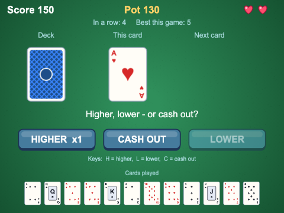

## What you will learn

- what makes a guessing game worth playing: risk, streaks, and the moment of the reveal
- how to model playing cards with a `Card` data class, a `Deck` and plain rule functions -
  separate from the `CardSprite` that draws a card (model/view separation)
- how to shuffle properly with the Fisher-Yates shuffle, and why the popular
  `sort(() => Math.random() - 0.5)` trick is wrong
- how to describe a game's state with a union of string literals, and ignore input while a card is
  being revealed
- how to turn a card over with a two-part tween, and make a reusable button with hover states
- how a game grows: from one scene and a few fields to scoring, lives, a history row and saved
  records

## The projects

| Project | What it shows |
|---|---|
| [ch12_higher_or_lower_simple](projects/ch12_higher_or_lower_simple/) | one scene: a `Card` class, card pictures, H and L keys, five right in a row to win, a wrong guess sends you back to zero |
| [ch12_higher_or_lower_intermediate](projects/ch12_higher_or_lower_intermediate/) | a real shuffled `Deck`, a `CardSprite` that flips, clickable buttons, a streak display, sounds, title and game over scenes |
| [ch12_higher_or_lower_advanced](projects/ch12_higher_or_lower_advanced/) | one deck and three lives, a pot of points that pays more for risky guesses, cash out, a row of cards played, a best score and longest run saved in the browser, and polish |

## What makes a guessing game fun?

On paper, higher or lower is barely a game: the player picks one of two options and the deck
decides. Yet people play it on television, in pubs and in every casino. Three things carry it:

- **Risk.** Guessing "higher" on a 2 is nearly safe; guessing "higher" on a jack is a gamble. A good
  version of the game makes the player *feel* the difference - and pays them for taking the risk.
- **Streaks.** One right guess is luck. Five in a row feels like skill (it mostly is not). Show the
  streak growing, and let the player lose it, and every guess matters more than the last.
- **The reveal.** The half-second while a card turns over is the whole game. Do not rush it, do not
  let the player skip it, and let the result land with a sound.

Watch those three grow through the chapter. The simple version has a streak and a reveal of sorts;
the intermediate version makes the reveal a real moment; the advanced version adds risk and reward.

Two rules need deciding before any code is written. **Aces are low** - an ace is 1, below a 2. And
**a tie does not count**: if the next card has the same rank, the guess was neither right nor wrong,
and play carries on. (Some versions count a tie as a loss. Ours is kinder, and it is a one-line
change - which is itself a good reason to keep the rules in one place.)

## Version 1 - simple

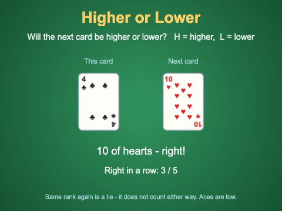

`ch12_higher_or_lower_simple` is a complete game in one scene, `GameScene`, plus one small class.
Press H or L; the next card is shown; after a moment it becomes the card to beat.

### A card is data

`src/Card.ts`
```ts
export type Suit = "clubs" | "diamonds" | "hearts" | "spades";

// in the same order as the rows of cards.png
export const SUITS: Suit[] = ["clubs", "diamonds", "hearts", "spades"];
...
export class Card {
  // readonly: set once, in the constructor, and never changed - a card does not turn into another
  public readonly suit: Suit;
  public readonly rank: number; // 1 = ace, 2 - 10, 11 = jack, 12 = queen, 13 = king

  constructor(suit: Suit, rank: number) {
    this.suit = suit;
    this.rank = rank;
  }

  // what "higher" and "lower" compare. Aces are low, so the value is just the rank.
  public get value(): number {
    return this.rank;
  }
```

Three TypeScript ideas in a few lines:

- `type Suit = "clubs" | "diamonds" | ...` is a **union of string literals**. A `Suit` is a string,
  but only one of those four. Write `new Card("heart", 3)` and the build fails. In Java you would
  reach for an `enum`; TypeScript has enums too, but a union of strings is lighter, and the value
  prints as itself in the console.
- `readonly` is Java's `final` for a field. A card never changes, so say so.
- `get value()` is a **getter**: a method you read like a field (`card.value`, no brackets). Right
  now it just returns the rank, so why not use `rank` everywhere? Because "the number the rules
  compare" and "which rank the card is" are different ideas that happen to be equal today. Make
  aces high and they stop being equal - and only `value` needs to change.

Notice what is **not** in `Card`: no `import Phaser`, no position, no picture, no "face up". A `Card`
is what the rules care about. That is the first half of model/view separation.

`Card` also has a `static random()` method that makes any card at all. There is no deck in this
version, so the same card can come up twice in a row - hold that thought.

### Which picture shows a card?

The pictures are all in one sprite sheet, `cards.png` from the asset library: 80 x 112 pixels a
card, thirteen to a row, one row per suit, then two card backs.

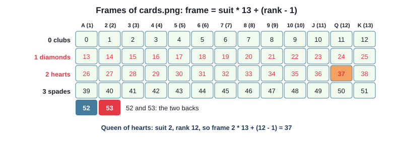

`src/scenes/GameScene.ts`
```ts
// The picture of a card is frame  suit * 13 + (rank - 1)  of cards.png: one row per suit, ace to
// king. The Card does not know this - pictures are the scene's business, not the card's.
private frameFor(card: Card): number {
  return SUITS.indexOf(card.suit) * 13 + (card.rank - 1);
}
```

It is loaded with `this.load.spritesheet(CARDS_KEY, CARDS_FILE, { frameWidth: CARD_WIDTH, frameHeight: CARD_HEIGHT })`
(Chapter 3), shown with `this.add.image(x, y, CARDS_KEY, frame)`, and changed with `setFrame(frame)`.
The face-down card is frame 52, `BACK_FRAME`.

### The rules, in one place

`src/scenes/GameScene.ts`
```ts
type Guess = "higher" | "lower";
type Outcome = "right" | "wrong" | "tie";
...
// Was the guess right? The rules of the game, in one place.
private judge(guess: Guess, current: Card, next: Card): Outcome {
  if (next.value === current.value) {
    return "tie";
  }
  const wentHigher = next.value > current.value;
  if ((guess === "higher" && wentHigher) || (guess === "lower" && !wentHigher)) {
    return "right";
  }
  return "wrong";
}
```

More unions. A method returning `Outcome` can only return one of three strings, and a `boolean`
would not do: there are three answers, not two. `judge` looks only at cards - it plays no sound and
changes no text. The caller decides what each outcome *looks* like.

### Game state: when to ignore the player

The game is not always ready for a guess. While the result is on screen, pressing H again should do
nothing - otherwise a quick player guesses against a card they have not seen yet. And once the game
is won, H and L should do nothing at all. So the scene keeps track of what it is doing:

```ts
// What the game is doing right now. While a card is being revealed, H and L are ignored - otherwise
// a fast player could guess again before seeing the result.
type GameState = "waiting" | "revealing" | "won";
...
private state: GameState = "waiting";
```

and the first thing `guess()` does is check it:

```ts
private guess(guess: Guess): void {
  if (this.state !== "waiting") {
    return; // a card is still being revealed, or the game is over
  }
  this.state = "revealing";

  // turn over the next card
  const next = Card.random();
  this.nextImage.setFrame(this.frameFor(next));
  this.sound.play(FLIP_KEY);

  const outcome = this.judge(guess, this.currentCard, next);
  if (outcome === "right") {
    this.inARow = this.inARow + 1;
    ...
  }
  this.showStreak();

  // leave the result on screen for a moment, then the next card becomes the one to beat
  this.time.delayedCall(REVEAL_TIME, () => {
    this.moveOn(next);
  });
}
```

`moveOn()` puts the new card in the "this card" place, turns the next card face down, and sets
`state` back to `"waiting"` - or to `"won"` after five in a row, when SPACE calls
`this.scene.restart()`. `init()` resets `state` and `inARow`, because a restarted scene is the same
object as before (Chapter 2's trap).

This `state` field is a tiny **state machine**: a value that says which of a few situations the game
is in, and code that behaves differently in each. Every game in the rest of the book has one.

### What the simple version is missing

Play it for a minute and you will find its limits. The next card just *appears*. The same card can
turn up twice. There is nothing to click, no title screen, and no way to lose. The rules and the
pictures are both inside `GameScene`, which is fine at 175 lines but will not stay fine. The
intermediate version fixes all of that.

## Version 2 - intermediate

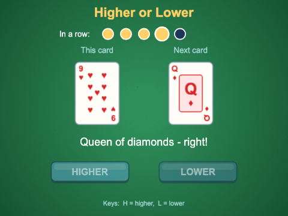

`ch12_higher_or_lower_intermediate` is a proper little game: a title screen, a shuffled deck,
cards that flip, HIGHER and LOWER buttons, five lights for the streak, sounds, and a game over screen.
Five right in a row wins; one wrong guess and you are out.

The code has spread out into files, and *where* each thing lives is the main lesson:

```
src/
  Card.ts          the model: plain TypeScript, no Phaser
  Deck.ts
  rules.ts
  assets.ts        every asset key and file
  objects/
    CardSprite.ts  the view: Phaser game objects
    Button.ts
  scenes/
    keys.ts  PreloadScene.ts  TitleScene.ts  GameScene.ts  GameOverScene.ts
```

### Model and view

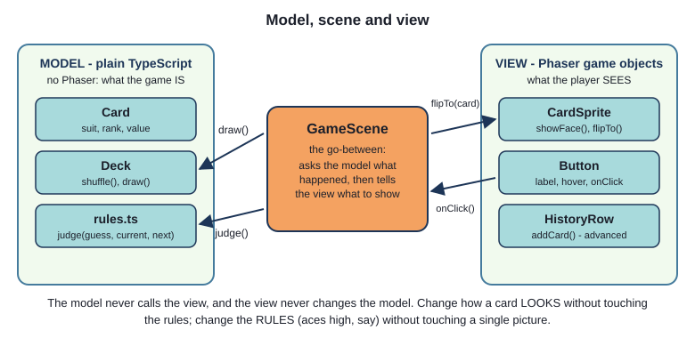

The **model** is what the game *is*: cards, a deck, the rules. The **view** is what the player
*sees*: pictures, buttons, animations. The **scene** sits between them - it asks the model what
happened, then tells the view what to show.

`judge()` has moved out of the scene into `src/rules.ts`, as a plain exported function, and the
`Guess` and `Outcome` types moved with it. The frame arithmetic has moved the other way, out of the
scene and into the view, `CardSprite`.

Why go to this trouble for a card game? Because the two halves change for different reasons. A
designer wants the cards to lift as they turn: that is `CardSprite`, and the rules cannot break. A
player wants aces high: that is `Card.value`, and no picture can break. You could test `judge()` and
`Deck` with no browser at all. And when the next chapter needs a deck of cards, `Card.ts` and
`Deck.ts` can be copied across unchanged - there is nothing in them about this game's screen.

> **Note** - you will meet this idea under other names: MVC (model-view-controller), or "separating
> logic from presentation". The rule of thumb is the same: the model never imports Phaser, and the
> view never decides what the rules are.

### A real deck

`src/Deck.ts`
```ts
export class Deck {
  private cards: Card[] = [];

  constructor() {
    for (const suit of SUITS) {
      for (let rank = 1; rank <= 13; rank++) {
        this.cards.push(new Card(suit, rank));
      }
    }
    this.shuffle();
  }

  // The Fisher-Yates shuffle. Work backwards through the deck; swap each card with a card chosen
  // at random from the ones not yet placed (itself included). Every one of the 52! possible orders
  // is exactly as likely as every other.
  public shuffle(): void {
    for (let i = this.cards.length - 1; i > 0; i--) {
      const j = Math.floor(Math.random() * (i + 1)); // 0 to i, inclusive
      const swap = this.cards[i];
      this.cards[i] = this.cards[j];
      this.cards[j] = swap;
    }
  }

  // take the top card off the deck
  public draw(): Card {
    const card = this.cards.pop();
    if (card === undefined) {
      throw new Error("The deck is empty");
    }
    return card;
  }
```

The **Fisher-Yates shuffle** is the one to know. Think of it as dealing the deck into a new order
from the back: position 51 gets a card picked at random from all 52; position 50 gets one of the 51
left; and so on. Each step is a fair pick from what is left, so the whole order is fair, and it takes
one pass through the deck.

Search online for "shuffle an array in JavaScript" and you will soon find this instead:

```ts
cards.sort(() => Math.random() - 0.5); // DON'T
```

It looks clever - "sort, but let each comparison come out at random" - and it is wrong. A sort
function expects its comparisons to be consistent (if a is before b and b before c, then a is before
c). Random answers break that promise, and what comes out depends on the order the sort happens to
compare things in. It is not even close to fair:

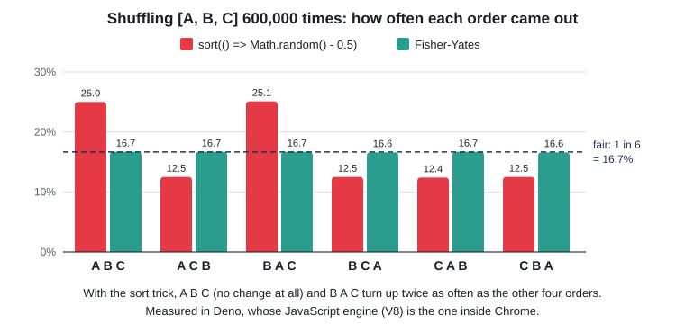

That chart is real: 600,000 shuffles of three cards in each way. With the sort trick, the order
that is *not shuffled at all* comes out a quarter of the time instead of a sixth. On a full deck it
is as bad: the top card stays on top about 6% of the time instead of 2%. In a card game, that is a
bug a sharp player can feel.

Phaser has a correct shuffle built in - `Phaser.Utils.Array.Shuffle(array)` is Fisher-Yates too. We
write our own because it is worth understanding, and because it keeps `Deck` free of Phaser.

`draw()` shows a small TypeScript safety net. `pop()` returns `Card | undefined` - an empty array
has nothing to pop - so TypeScript will not let `draw()` promise a `Card` until the `undefined` case
is dealt with. Throwing an error is right here: in this version the deck cannot run out (a game is
over long before 52 cards), so an empty deck would mean a bug.

### Flipping a card

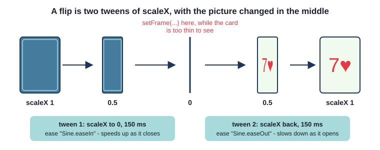

A card on screen is flat, so it cannot really turn over. The trick is to squash it to nothing
across, change the picture while it is invisible, and stretch it out again - and the eye sees a flip.

`src/objects/CardSprite.ts`
```ts
export class CardSprite extends Phaser.GameObjects.Image {
  ...
  public flipTo(card: Card | null, onComplete: () => void): void {
    this.scene.tweens.chain({
      targets: this,
      tweens: [
        {
          scaleX: 0,
          duration: FLIP_TIME / 2,
          ease: "Sine.easeIn",
          onComplete: () => {
            if (card === null) {
              this.showBack();
            } else {
              this.showFace(card);
            }
          },
        },
        {
          scaleX: this.baseScale,
          duration: FLIP_TIME / 2,
          ease: "Sine.easeOut",
        },
      ],
      onComplete: onComplete,
    });
  }
```

`this.scene.tweens.chain(...)` (Chapter 7) plays the two tweens one after the other. The first has
its own `onComplete`, which swaps the picture at the exact moment the card is edge-on. The chain has
an `onComplete` too, which calls back whoever asked for the flip. `card: Card | null` means "a card
to show, or `null` for the back".

The easing matters more than you would think. `Sine.easeIn` starts slowly and speeds up; `easeOut`
does the opposite. Together they make the card snap through the edge-on moment, as a real card does.
Try `"Linear"` for both and it looks like a door.

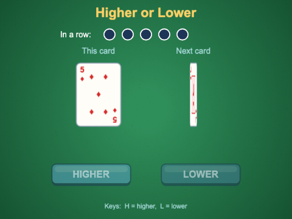

Why `scaleX` and not `scale`? `scale` sets both directions, so the card would shrink to a dot. The
card's image keeps its origin in the middle (the default), so it narrows towards its centre line.

`CardSprite` also has `showFace(card)`, `showBack()`, and the `static frameFor(card)` that used to
be in the scene. It extends `Image`, as Chapter 1's `Ball` did - it needs a picture and a frame, not
animations. The name says what it is to the game, not which Phaser class it happens to extend.

### Buttons

The keys still work, but a card game wants buttons. `src/objects/Button.ts` is a small class that
every later chapter could use:

```ts
export class Button extends Phaser.GameObjects.Container {
  private background: Phaser.GameObjects.Image;
  private label: Phaser.GameObjects.Text;
  private enabled = true;

  constructor(scene: Phaser.Scene, x: number, y: number, text: string, onClick: () => void) {
    super(scene, x, y);

    // positions inside a container are relative to the container: (0, 0) is its centre
    this.background = scene.add.image(0, 0, BUTTON_KEY);
    this.label = scene.add.text(0, -2, text, { ... }).setOrigin(0.5);
    this.add([this.background, this.label]);

    this.background.setInteractive({ useHandCursor: true });

    // three pictures for three states: normal, pointer over it, pressed
    this.background.on("pointerover", () => {
      this.background.setTexture(BUTTON_OVER_KEY);
    });
    ...
    this.background.on("pointerup", () => {
      this.background.setTexture(BUTTON_OVER_KEY);
      if (this.enabled) {
        scene.sound.play(CLICK_KEY);
        onClick();
      }
    });

    scene.add.existing(this);
  }
```

- A **`Container`** is a game object that holds other game objects - here a picture and a label - and
  moves, fades and hides them together. `setAlpha(0.5)` on the button fades both.
- The asset library has three button pictures: `button.png`, `button_over.png` and
  `button_down.png`. Swapping the texture on `"pointerover"`, `"pointerout"` and `"pointerdown"` is
  what makes a button feel alive.
- The action happens on `"pointerup"`, not `"pointerdown"`: that is how buttons behave everywhere
  else, and it lets a player press, change their mind, and slide off.
- The caller passes in `onClick`, a function. `Button` has no idea what it is for - the same class
  makes PLAY, HIGHER, LOWER, PLAY AGAIN and MENU.

`setEnabled(false)` fades the button and makes clicks do nothing. The game scene switches the
buttons off while a card is turning, so the player can *see* that now is not the time to click.

### The state machine, grown up

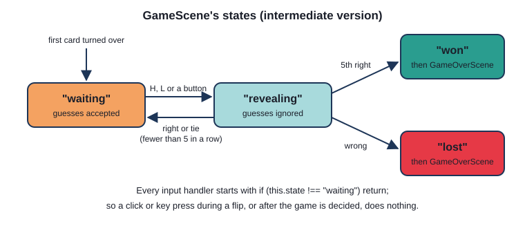

`src/scenes/GameScene.ts`
```ts
// What the game is doing right now. Only "waiting" accepts a guess.
type GameState = "waiting" | "revealing" | "won" | "lost";
```

The guess now happens in steps, each started by the one before:

```ts
private guess(guess: Guess): void {
  if (this.state !== "waiting") {
    return; // a card is turning over, or the game is over: ignore the click or key
  }
  this.state = "revealing";
  this.setButtonsEnabled(false);
  this.messageText.setText("");

  const next = this.deck.draw();
  this.sound.play(FLIP_KEY);
  this.nextSprite.flipTo(next, () => {
    this.reveal(guess, next);
  });
}
```

The result is not judged until the flip has finished: `reveal()` runs from the flip's `onComplete`.
So the player sees the card *before* the sound tells them whether they were right. That ordering is
the reveal - get it wrong (play the sound first) and the tension is gone.

`reveal()` asks `judge()`, then does one of three things: on a wrong guess, sets `"lost"` and starts
`GameOverScene` after a pause; on a fifth right guess, sets `"won"` and does the same; otherwise it
waits a moment and calls `moveOn()`, which shows the new card in the "this card" place and flips the
next card face down again - and when *that* flip finishes, `waitForGuess()` sets `"waiting"` and
switches the buttons back on.

Because the H key, the L key and both buttons all call the same `guess()`, one check at the top
covers them all. If input were handled in four places, there would be four places to forget it.

### Streak, sounds and endings

The streak is five circles made with `this.add.circle(...)`. A right guess fills the next one with
gold and gives it a quick `yoyo` tween to 1.4 times its size and back - a small thing that makes a
right answer feel like progress.

Sounds come from the asset library: `flip.wav` as a card turns, `correct.wav` or `wrong.wav` for the
result, `card_place.wav` for a tie and as a card goes down, `click.wav` for buttons, and `win.wav` or
`lose.wav` on the last screen (Chapter 5).

Winning and losing go to the **same** scene, `GameOverScene`, with an interface saying which:

`src/scenes/GameOverScene.ts`
```ts
export interface GameOverData {
  won: boolean;
  inARow: number;
  lastCard: string;
}
```

The two endings show the same things - a heading, a line about what happened, PLAY AGAIN and MENU -
so one scene reading `won` is simpler than two scenes that are nearly the same.

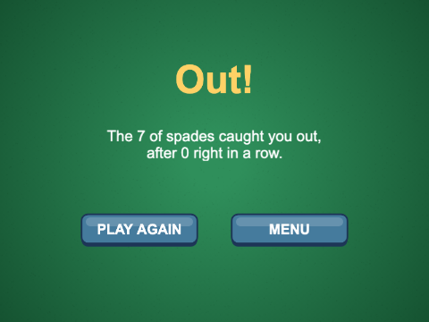

## Version 3 - advanced

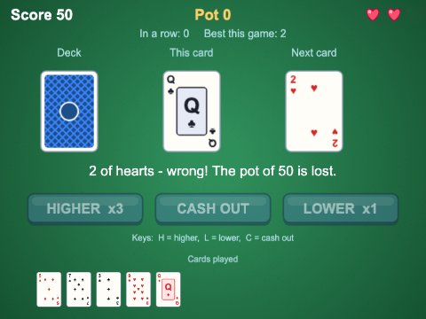

`ch12_higher_or_lower_advanced` turns a coin-toss into a game of nerve. You play right through one
deck, with three lives:

- every right guess adds points to a **pot** - more for a risky guess, and more the longer the run
- **CASH OUT** (or C) banks the pot into your score, where it is safe - but ends the run
- a **wrong** guess loses the whole pot **and** a life
- the game ends when the last life goes, or the deck runs out (and whatever is in the pot is banked)

The model gained scoring rules and a records class; the view gained a history row; the scene gained
lives, a score, a pot, and polish. `Card`, `Deck` and `Button` barely changed.

### Paying for risk

`src/rules.ts`
```ts
// Of the 13 ranks, how many would make this guess right? "Higher" on a 4 is won by 5 to king: 9.
// (This treats every rank as equally likely - it does not look at which cards are left in the deck.)
export function winningRanks(guess: Guess, current: Card): number {
  if (guess === "higher") {
    return 13 - current.value;
  }
  return current.value - 1;
}

// The riskier the guess, the more it pays: x1 if most ranks win, x2 for about half, x3 for a long
// shot. 0 means the guess cannot win at all ("higher" on a king).
export function riskMultiplier(guess: Guess, current: Card): number {
  const wins = winningRanks(guess, current);
  if (wins === 0) {
    return 0;
  }
  if (wins >= 7) {
    return 1;
  }
  if (wins >= 4) {
    return 2;
  }
  return 3;
}

// What a right guess adds to the pot: more for a risky guess, and more the longer the run.
export function pointsFor(multiplier: number, inARow: number): number {
  return BASE_POINTS * multiplier * inARow;
}
```

So three safe right guesses in a row are worth 10 + 20 + 30 = 60 - and each one after that is worth
more again. That is the streak doing its job: the longer you go, the more there is to lose, and the
harder it is to stop.

The player should not have to do this arithmetic, so the buttons show it. Every time the game is
ready for a guess:

`src/scenes/GameScene.ts`
```ts
private waitForGuess(): void {
  this.state = "waiting";
  this.messageText.setText(this.pot > 0 ? "Higher, lower - or cash out?" : "Higher or lower?");

  // show what each guess would pay; a guess that cannot win ("higher" on a king) is switched off
  const higher = riskMultiplier("higher", this.currentCard);
  const lower = riskMultiplier("lower", this.currentCard);
  this.higherButton.setText(higher > 0 ? `HIGHER  x${higher}` : "HIGHER");
  this.lowerButton.setText(lower > 0 ? `LOWER  x${lower}` : "LOWER");
  this.higherButton.setEnabled(higher > 0);
  this.lowerButton.setEnabled(lower > 0);
  this.cashOutButton.setEnabled(this.pot > 0);
}
```

`Button` gained a `setText()` method for this. Showing the stakes *before* the guess is what turns
risk from a hidden number into a decision the player makes.

### The pot, and cashing out

```ts
private cashOut(): void {
  if (this.state !== "waiting" || this.pot === 0) {
    return;
  }
  const banked = this.pot;
  this.score = this.score + this.pot;
  this.pot = 0;
  this.inARow = 0; // cashing out ends the run: the next right guess starts the pot again
  this.sound.play(COIN_KEY);
  this.sparkles.explode(30, this.scoreText.x + this.scoreText.width / 2, this.scoreText.y);
  this.pulse(this.scoreText);
  this.updateHud();
  this.waitForGuess();
  this.messageText.setText(`${banked} banked! Higher or lower?`);
}
```

The same `state` check guards it - C in the middle of a flip does nothing. A wrong guess goes the
other way, in `loseLife()`: the pot goes to zero, a life is lost, the camera shakes
(`this.cameras.main.shake(250, 0.01)`) and the heart for that life grows and fades away.

Two kinds of points - `score` (banked, safe) and `pot` (at risk) - are what make the game. With
only a score, the best play is to guess the likely way for ever. With a pot, *when to stop* is the
real question, and every player answers it differently.

### Dealing, and two sprites that swap jobs

Cards now come from somewhere: a face-down deck on the left. Each new card slides from the deck to
its place, then flips.

```ts
// Deal a card: it slides face down from the deck to x, then flips over. It is brought to the top
// of the display list, so it passes OVER the card to beat on its way across.
private dealTo(sprite: CardSprite, x: number, card: Card, onComplete: () => void): void {
  this.children.bringToTop(sprite);
  sprite.setPosition(DECK_X, CARD_Y).setVisible(true);
  sprite.showBack();
  this.sound.play(PLACE_KEY);
  sprite.slideTo(x, CARD_Y, () => {
    this.sound.play(FLIP_KEY);
    sprite.flipTo(card, onComplete);
  });
}
```

`CardSprite` gained `slideTo(x, y, onComplete)`, a single tween of `x` and `y`, and its flip now
also stretches `scaleY` a little at the halfway point, so the card seems to lift off the table.

After the reveal, the revealed card slides left to become the card to beat. Rather than destroy one
`CardSprite` and make another, the scene just **swaps** which sprite does which job:

```ts
private moveOn(next: Card): void {
  this.history.addCard(this.currentCard);
  this.currentCard = next;

  const oldCurrent = this.currentSprite;
  this.currentSprite = this.nextSprite;
  this.nextSprite = oldCurrent;
  this.nextSprite.setVisible(false);

  this.currentSprite.slideTo(CURRENT_X, CARD_Y, () => {
    if (this.lives === 0) {
      this.endGame("Out of lives!");
    } else if (this.deck.isEmpty()) {
      this.endGame("That was the last card!");
    } else {
      this.waitForGuess();
    }
  });
}
```

`currentSprite` and `nextSprite` are just *references*, as in Java - swapping them swaps the names,
not the objects. Two sprites do all the dealing for the whole game.

### The history row

The old card to beat goes into a row of small cards along the bottom, so the player can see what
has gone - useful for anyone counting cards.

`src/objects/HistoryRow.ts`
```ts
// (Container already has a method called add(), for adding game objects - hence addCard.)
public addCard(card: Card): void {
  // the new card starts one place to the right of the end of the row, invisible...
  const image = this.scene.add.image(this.images.length * SPACING, 0, CARDS_KEY, CardSprite.frameFor(card))
    .setScale(SCALE)
    .setAlpha(0);
  this.add(image);
  this.images.push(image);

  // ...the oldest fades out if there are too many...
  if (this.images.length > MAX_CARDS) {
    const oldest = this.images.shift()!; // shift() takes the first item off an array
    ...
  }

  // ...and every card slides into its place, fading in
  this.images.forEach((cardImage, index) => {
    this.scene.tweens.add({
      targets: cardImage,
      x: index * SPACING,
      alpha: 1,
      duration: SLIDE_TIME,
      ease: "Cubic.easeOut",
    });
  });
}
```

Rather than work out which cards need to move, every card is simply told where it should be. Cards
already in place tween nowhere; the rest slide along. "Tell everything where it belongs" is often
simpler than "work out what changed".

`CardSprite.frameFor()` is `static` so that `HistoryRow` can use it without a `CardSprite`: one
formula, in one place, used by everything that draws a card.

### Records that last

`src/Records.ts` keeps the best score and the longest run in the browser's local storage, the way
Chapter 6 kept its high scores:

```ts
export class Records {
  private data: RecordData = { bestScore: 0, bestStreak: 0 };

  constructor() {
    // local storage only holds strings, and may hold anything - or be switched off. If it cannot
    // be read, start from nothing rather than crash.
    try {
      const saved = localStorage.getItem(STORAGE_KEY);
      if (saved !== null) {
        this.data = { ...this.data, ...JSON.parse(saved) };
      }
    } catch {
      // keep the empty records
    }
  }
```

`{ ...this.data, ...JSON.parse(saved) }` starts from the defaults and lays the saved values over
them, so a record saved by an older version of the game, missing a field, still loads. `submit(score,
streak)` saves anything beaten and returns which records were new (`newBestScore` and
`newBestStreak`), and `GameScene.endGame()` passes them straight on to the game over screen by
spreading them into its data with `...newRecords`.

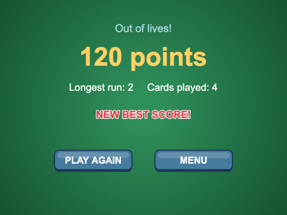

### Polish

None of these change the rules; all of them change how the game feels. Each is a few lines in
`GameScene` or the title screen:

| Polish | How |
|---|---|
| "+30" rises and fades over a right card | `floatText()`: a text with a tween of `y` and `alpha`, destroyed in `onComplete` |
| the pot and score jump when they change | `pulse()`: `scale` 1.25 with `yoyo: true` |
| a burst of sparkles when you cash out | a particle emitter with `emitting: false`, then `explode(30, x, y)` (Chapter 7) |
| the screen shakes on a wrong guess | `this.cameras.main.shake(250, 0.01)` |
| a heart pops and fades when a life goes | a tween of `scale` and `alpha` on that heart |
| the four aces fan out on the title screen | one tween per ace, each with a longer `delay` |
| impossible guesses are greyed out | `setEnabled(false)` when `riskMultiplier` is 0 |
| the deck disappears with its last card | `this.deckPile.setVisible(!this.deck.isEmpty())` |

## How the versions compare

| | simple | intermediate | advanced |
|---|---|---|---|
| cards come from | `Card.random()` | a shuffled `Deck` | one `Deck`, played right through |
| the rules live in | `GameScene` | `rules.ts` | `rules.ts`, with scoring |
| a card on screen | an `Image` and `setFrame` | a `CardSprite` that flips | a `CardSprite` that is dealt, flips and lifts |
| input | H, L | H, L, buttons | H, L, C, buttons showing the stakes |
| states | waiting, revealing, won | waiting, revealing, won, lost | dealing, waiting, revealing, over |
| win / lose | 5 in a row; wrong = back to 0 | 5 in a row; wrong = out | a score; 3 lives; a pot to cash out |
| scenes | 1 | 4 | 4 |
| remembers | nothing | nothing | best score and longest run |

Notice what did not change. `judge()` is the same function in all three. `Card` only lost its
`random()` method. That is the reward for separating the model: the game changed a lot, the rules hardly at
all.

## Common mistakes

> **Note - the frame is one out.** Forget the `- 1` in `suit * 13 + (rank - 1)` and every card shows
> as the next rank up - and the king of spades shows as frame 52, a card back. If the pictures look
> *nearly* right, check the arithmetic.

> **Note - guessing during the flip.** Leave out `if (this.state !== "waiting") return;` and a fast
> double-press draws two cards and judges both against the same card to beat. Nothing crashes; the
> game is just wrong. Every way in - keys, buttons - must go through the one check.

> **Note - `function` in a tween callback.** Write `onComplete: function () { this.showFace(card); }`
> and the build is happy, but the game stops at the first flip with
> `TypeError: this.showFace is not a function`. A `function` gets its own `this` (here, the tween);
> an arrow function `() => { ... }` keeps the `this` of the code around it. Use arrow functions for
> callbacks.

> **Note - naming a Container method `add`.** `Container` already has `add()`, for adding game
> objects, so a `HistoryRow.add(card)` fails the build with
> `Property 'add' in type 'HistoryRow' is not assignable to the same property in base type 'Container'`.
> Choose a name of your own, such as `addCard`.

## Summary

- a guessing game lives on **risk**, **streaks** and **the reveal**: show the stakes, show the
  streak, and never rush the moment the card turns
- keep the **model** (`Card`, `Deck`, `rules.ts` - no Phaser) apart from the **view** (`CardSprite`,
  `Button`, `HistoryRow`); the scene asks one and tells the other
- a union of string literals (`"higher" | "lower"`) is a small, safe set of values; use one for
  suits, guesses, outcomes and game states
- shuffle with **Fisher-Yates**; `sort(() => Math.random() - 0.5)` is biased
- a `state` field, checked at the top of every input handler, stops the player acting while the game
  is busy
- a flip is two tweens of `scaleX` in a chain, with the frame changed in between
- a `Container` groups game objects into one - a button is a picture and a label
- scores become interesting when the player can lose what they have not banked yet

## Challenges

1. **Aces high** *(ch12_higher_or_lower_simple)* - Make aces the highest card instead of the
   lowest: an ace beats a king. Change the rule shown at the bottom of the screen to match. The ace
   must still show the ace picture.

2. **Cards left** *(ch12_higher_or_lower_intermediate)* - Show how many cards are left in the deck,
   under the next card, and keep it up to date as cards are dealt. It should say 51 when the game
   starts.

3. **Probability hint** *(ch12_higher_or_lower_intermediate)* - Under each button, show the chance
   (as a percentage) that the guess will be right, worked out from the cards really left in the deck -
   not from the 13 ranks. Hide the hints while a card is being revealed, and update them for every new
   card to beat.

4. **Jokers wild** *(ch12_higher_or_lower_intermediate)* - Add two jokers to the deck. If the next
   card is a joker, the guess counts as right, whatever it was. You never guess against a joker: when
   a joker would become the card to beat, deal a fresh card on top of it instead (and never start a
   game with a joker). *Hint:* `cards.png` has no joker, so draw one with `Graphics` and save it with
   `generateTexture(key, width, height)` once everything is loaded. A joker is a *different texture*,
   not just a different frame - look up `setTexture(key, frame)`.

5. **Double or nothing** *(ch12_higher_or_lower_advanced)* - When there is a pot, let the player
   press D to gamble it instead of cashing out: one card is dealt from the deck; if it is red, the
   pot is doubled and banked; if it is black, the pot is lost (but not a life). Either way the run
   ends, and the card joins the history row. *Hint:* the game needs a new state while the gamble card
   is being dealt, so that nothing else can happen. `dealTo()` will deal the card for you.

6. **The computer plays the odds** *(ch12_higher_or_lower_advanced)* - Pressing A hands the game to
   the computer (and pressing it again takes it back). The computer counts the cards really left in
   the deck and guesses whichever way more of them go. If even that is not very likely - say less than
   a 65% chance - and there is something in the pot, it cashes out instead. It should wait a little
   before each move, so you can watch it play. *Hint:* the game tells you when it is ready for a move -
   it calls `waitForGuess()`. Start a timer from there. Remember the player may switch the computer off
   while it is thinking.

---

Previous: [Chapter 11 - Tilemaps with Tiled](../ch11_tilemaps_tiled/README.md) ·
Next: [Chapter 13 - Memory match](../ch13_memory_match/README.md)
