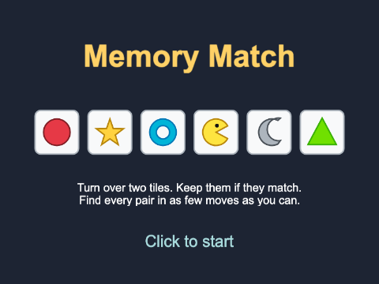
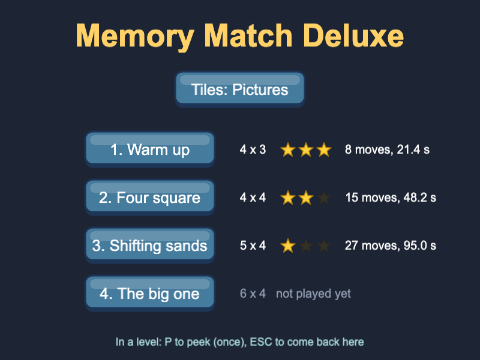

# Chapter 13 - Memory match

Turn over two tiles. If they match, they stay; if not, they turn back, and you try to remember
where they were. Memory match (you may know it as *Concentration* or *Pairs*) is one of the
simplest games there is to play, and a surprisingly good one to write: it needs a grid laid out in
code, a fair shuffle, animation that feels right, and - the heart of this chapter - a small **state
machine** that stops the player clicking while tiles are showing. You will build it three times,
each version growing from the one before.


## What you will learn

- how to lay out a grid of game objects with two loops, and centre it in the game
- how to make shuffled pairs, and deal them onto the grid
- how to show one frame of a sprite sheet on an `Image`, and change it with `setFrame`
- how to write game rules as a **state machine** - a union type and a `switch` - and use it to
  lock the board
- how to animate a flip with two tweens, and wait for it to finish with a **callback**
- how moves, time and a star rating turn a puzzle into a game
- how an `interface` lets one game play with different sets of tiles, and how to describe levels as data

## The projects

| Project | What it shows |
|---|---|
| [ch13_memory_simple](projects/ch13_memory_simple/) | the whole game in one scene: a 4 x 3 grid, click to turn over, a wrong pair turns back after a second |
| [ch13_memory_intermediate](projects/ch13_memory_intermediate/) | flip tweens, a moves counter and a clock, sounds, a title screen and a win screen with stars |
| [ch13_memory_advanced](projects/ch13_memory_advanced/) | four levels on bigger boards, a menu, playing-card tiles that match by rank and colour, a peek power-up, a shuffle twist, and best results saved in the browser |

Play all three before reading on. Notice what changes as the versions grow - and notice that the
simple one, with no animation at all, is already a real game.

## What makes a memory game work

A memory game is a game about **information**. At the start you know nothing; every tile you turn
over tells you something; the skill is in keeping it. A few things follow from that:

- **The player must see the wrong pair.** Turn a wrong pair back too quickly and the player never had
  the chance to remember it. Too slowly, and the game drags. About a second is right
- **The board must be fair.** While a wrong pair is showing, a quick player could click a third and a
  fourth tile and see four at once. The game must *lock* the board until the pair has turned back.
  This is the most important rule in the code, and the state machine exists to enforce it
- **Score what matters.** Finding every pair is guaranteed in the end - so the score is *how
  efficiently* you did it: moves (pairs of tiles turned over), and time
- **Feedback.** A flip, a sound, a little celebration for a pair and a shake for a miss. None of it
  changes the rules; all of it changes how the game feels

## The simple version


`ch13_memory_simple` is one scene and one game object class. It is worth reading all of it before
going on: about 230 lines in three files, a good part of them comments.

### A tile: one frame of a sprite sheet

All thirteen pictures a tile can show are in one file, `memory_tiles.png`. It is a **sprite sheet**:
a row of 100 x 100 frames. Frame 0 is the back of every tile (the purple "?"), and frames 1 to 12
are twelve different faces.


A sprite sheet is loaded with `load.spritesheet`, which cuts the picture into frames and numbers them
from 0, left to right:

`src/scenes/GameScene.ts`
```ts
preload(): void {
  // a sprite sheet: one picture, cut into equal frames, numbered from 0, left to right
  this.load.spritesheet(TILES_KEY, TILES_FILE, { frameWidth: TILE_SIZE, frameHeight: TILE_SIZE });
}
```

A `Tile` is an `Image` that starts on frame 0, and remembers which face it hides:

`src/objects/Tile.ts`
```ts
export class Tile extends Phaser.GameObjects.Image {
  // which picture this tile hides (1-12). Two tiles on the board have each face.
  // readonly: set once, in the constructor, and never changed - like final in Java
  public readonly face: number;

  private faceUp = false;

  constructor(scene: Phaser.Scene, x: number, y: number, face: number) {
    super(scene, x, y, TILES_KEY, BACK_FRAME);
    this.face = face;
    scene.add.existing(this);
  }
```

The fourth argument to an `Image`'s constructor is the **frame**. You might expect a sprite sheet to
need a `Sprite` - but an `Image` can show any single frame. A `Sprite` adds animation (playing frames
one after another, Chapter 7), which a tile does not need.

Turning a tile over is just changing its frame:

```ts
public showFace(): void {
  this.faceUp = true;
  this.setFrame(this.face);
}

public hideFace(): void {
  this.faceUp = false;
  this.setFrame(BACK_FRAME);
}
```

`readonly` is TypeScript's `final`: `face` can be set in the constructor and never again, so no code
anywhere can quietly change what a tile hides. `faceUp` is private, and read through
`isFaceUp()`. The tile knows *what it is*; it does not know the rules of the game. The scene decides
when a tile turns over and what a pair means - the same division as Chapter 2's `Ball`, which never
knew it could be clicked.

### Making the pairs

Six pairs need each of the faces 1 to 6 twice, in a random order:

`src/scenes/GameScene.ts`
```ts
// [1, 1, 2, 2, 3, 3, ...] - each face twice - in a random order
private makeFaces(pairs: number): number[] {
  const faces: number[] = [];
  for (let face = 1; face <= pairs; face++) {
    faces.push(face, face);
  }
  // Phaser's Fisher-Yates shuffle (Chapter 12 writes one by hand). It shuffles the array
  // in place, and returns it too.
  return Phaser.Utils.Array.Shuffle(faces);
}
```

`push` takes any number of values, so `faces.push(face, face)` adds the pair in one go. Chapter 12
explained why a proper shuffle matters and wrote Fisher-Yates in a `Deck` class; here we use the
same algorithm from Phaser's toolbox. `Phaser.Utils.Array` has many more small helpers worth a look -
`GetRandom`, `RemoveRandomElement`, `NumberArray`.

### Laying out the grid

Now the faces are dealt onto a grid, row by row. The grid should sit in the middle of the game
whatever its size, so its position is worked out, not typed in:


```ts
// ROWS x COLS tiles, with GAP pixels between them, centred in the game
private layOutGrid(faces: number[]): void {
  const gridWidth = COLS * TILE_SIZE + (COLS - 1) * GAP;
  const gridHeight = ROWS * TILE_SIZE + (ROWS - 1) * GAP;

  // the CENTRE of the top-left tile (a tile's origin is its centre)
  const left = (this.scale.width - gridWidth) / 2 + TILE_SIZE / 2;
  const top = (this.scale.height - gridHeight) / 2 + TILE_SIZE / 2;

  for (let row = 0; row < ROWS; row++) {
    for (let col = 0; col < COLS; col++) {
      const x = left + col * (TILE_SIZE + GAP);
      const y = top + row * (TILE_SIZE + GAP);
      const face = faces[row * COLS + col];

      const tile = new Tile(this, x, y, face);
      tile.setInteractive({ useHandCursor: true });
      tile.on("pointerdown", () => {
        this.tileClicked(tile);
      });
      this.tiles.push(tile);
    }
  }
}
```

Three things to notice:

- **Gaps are one fewer than tiles.** Four tiles across have three gaps between them. Forgetting the
  `- 1` is the classic off-by-one, and the grid ends up slightly off-centre
- **Origins are centres.** A tile's `x` and `y` are its middle (Chapter 1), so the first tile's centre
  is half a tile in from the grid's edge
- **`row * COLS + col`** turns a row and column into a position in a flat list: row 0 is items 0-3,
  row 1 is items 4-7, and so on. You will use this sum in every grid game you ever write

The `ROWS`, `COLS` and `GAP` constants are at the top of the file. Change them and the grid lays
itself out again - as long as `ROWS * COLS` is even, since every tile needs a partner.

### The rules as a state machine

What should happen when a tile is clicked? It depends. If nothing is showing, turn it over. If one
tile is showing, turn this one over and compare. If a wrong pair is showing, do *nothing*. The
answer depends on **what state the game is in** - and that is exactly what a state machine is: a
list of states the game can be in, and for each one, what each event does.

Chapter 12 kept a game's state in a union of string literals, and used it to ignore the player while
a card was being revealed. Here that idea is the heart of the game. This game has three states:

```ts
// the three states, as a union of string literals: `state` can hold these three strings and
// nothing else - a typo such as "oneup" is a build error
type State = "idle" | "oneUp" | "twoUp";
```

and the click handler is a `switch` on the state:

```ts
private tileClicked(tile: Tile): void {
  // a tile that is already face up - the first of this pair - cannot be picked again
  if (tile.isFaceUp()) {
    return;
  }

  switch (this.state) {
    case "idle":
      tile.showFace();
      this.firstTile = tile;
      this.state = "oneUp";
      break;

    case "oneUp":
      tile.showFace();
      this.checkPair(this.firstTile!, tile);
      break;

    case "twoUp":
      // a wrong pair is showing: ignore the click. Without this "lock", a quick player could
      // turn over a third and fourth tile while the first two are still up
      break;
  }
}
```

`firstTile` is declared as `Tile | null` - a tile, or nothing. In the `"oneUp"` state there is
always a first tile, but the compiler cannot know that, so `this.firstTile!` tells it "trust me,
this is not null". (If you were wrong, you would get an error when the game runs - use `!` only
where the state guarantees it.)

`checkPair` either keeps the pair or schedules the turn back:

```ts
private checkPair(first: Tile, second: Tile): void {
  this.firstTile = null;

  if (first.matches(second)) {
    first.setMatched();
    second.setMatched();
    this.pairsFound = this.pairsFound + 1;
    this.state = "idle";

    if (this.pairsFound === this.tiles.length / 2) {
      this.win();
    }
  } else {
    // leave the wrong pair showing long enough to remember, then turn both back
    this.state = "twoUp";
    this.time.delayedCall(MISMATCH_DELAY, () => {
      first.hideFace();
      second.hideFace();
      this.state = "idle";
    });
  }
}
```

`this.time.delayedCall(ms, callback)` runs the callback once, after a delay, on the scene's clock.
For that second, the game is in `"twoUp"`, and the `switch` ignores every click. That is the
**lock**: one line, and it is what makes the game fair.

Why not a boolean `locked`? For three states you could get away with `firstTile` and a `locked`
flag. But every new feature adds another flag - `flipping`, `peeking`, `shuffling` - and soon there
are combinations that should be impossible ("locked but not flipping but peeking?"). One `state`
field that holds exactly one value can never be in two states at once. The next two versions add
three more states; the pattern holds.

### Winning, and playing again

```ts
private win(): void {
  this.messageText.setText("All pairs found! Press SPACE to play again");

  this.input.keyboard!.once("keydown-SPACE", () => {
    this.scene.restart();
  });
}
```

`this.scene.restart()` stops the scene and starts it again. It is the same scene object, so - as
Chapter 2 warned - its fields keep their old values unless something resets them. `init()` does:

```ts
init(): void {
  this.tiles = [];
  this.state = "idle";
  this.firstTile = null;
  this.pairsFound = 0;
}
```

Forget `this.tiles = []` and the second game's array holds 24 tiles - twelve of them destroyed
objects from the first game - and the game can never be won, because `pairsFound` never reaches 12.

> **Common mistake: clicking to play again.** "Click to play again" seems more natural than SPACE,
> so you write `this.input.once("pointerdown", ...)` in `win()`. The game restarts *the instant you
> find the last pair*. The click that found the pair is still being handled: Phaser sends
> `pointerdown` to the tile first, then to the scene - and by then `win()` has added the new
> listener, so the same click triggers it. Either use a key, wait a moment (`delayedCall`), or move
> to another scene first, as the next version does.

## The intermediate version: making it feel good


`ch13_memory_intermediate` plays by exactly the same rules, on a 4 x 4 board. What it adds is
*feel*: flips, sounds, a celebration, a clock, and a reason to play again - stars. It also has a
title scene and a win scene, as in Chapter 2.

### The flip

A card has no thickness, so to turn it over you can squash it to nothing across, swap the picture
while it cannot be seen, and stretch it back. That is two tweens of `scaleX`:


`src/objects/Tile.ts`
```ts
// squash to nothing, swap the picture, stretch back - two tweens, one after the other
private flipTo(frame: number, onDone?: () => void): void {
  this.scene.tweens.add({
    targets: this,
    scaleX: 0,
    duration: HALF_FLIP,
    ease: "Sine.easeIn",
    onComplete: () => {
      this.setFrame(frame);
      this.scene.tweens.add({
        targets: this,
        scaleX: 1,
        duration: HALF_FLIP,
        ease: "Sine.easeOut",
        onComplete: () => {
          // onDone is optional: call it only if one was given
          if (onDone) {
            onDone();
          }
        },
      });
    },
  });
}
```

Chapter 12 flipped a card the same way. The easing matters more than you would think: `Sine.easeIn`
then `Sine.easeOut` makes the tile speed up as it turns edge-on and slow down as it opens - which is
how a real card moves. Try `"Linear"` for both and see how mechanical it looks.

The public methods set `faceUp` straight away, then start the flip:

```ts
// faceUp changes AT ONCE, not when the flip ends - so a second click on a tile that is still
// turning over is already ignored
public flipUp(onDone?: () => void): void {
  this.faceUp = true;
  this.clearTint();
  this.flipTo(this.face, onDone);
}
```

### Callbacks: "tell me when you have finished"

`onDone?: () => void` is a parameter that is a **function** - one that takes nothing and returns
nothing - and the `?` makes it optional. The caller passes in "what to do when the flip has
finished", and the tile calls it at the right moment. In Java you would pass a `Runnable` (or a
lambda for one); in TypeScript, functions are values, and any arrow function will do.

The flip needs it because it takes time. The simple version compared the two tiles the instant the
second was clicked. Here, the second tile is still turning over at that instant - showing the pair's
verdict before the player can see the second face would feel like cheating. So the game has to wait,
and that needs a **new state**:


`src/scenes/GameScene.ts`
```ts
type State = "idle" | "oneUp" | "twoUp" | "checking";
```

`"twoUp"` now means "the second tile is turning over"; `"checking"` means "both are showing and the
game is dealing with them". Both are locked:

```ts
private tileClicked(tile: Tile): void {
  // "twoUp" and "checking" are the LOCKED states: the board ignores the player
  if (this.state === "twoUp" || this.state === "checking") {
    return;
  }
  if (tile.isFaceUp()) {
    return;
  }

  this.sound.play(FLIP_KEY);

  if (this.state === "idle") {
    if (!this.clockRunning) {
      this.clockRunning = true;
      this.startTime = this.time.now;
    }
    this.firstTile = tile;
    this.state = "oneUp";
    tile.flipUp();
  } else {
    // "oneUp": this is the second tile. Wait for its flip to finish before checking the pair
    this.secondTile = tile;
    this.state = "twoUp";
    this.moves = this.moves + 1;
    this.updateHud();
    tile.flipUp(() => {
      this.checkPair();
    });
  }
}
```

The first `flipUp()` has no callback - nothing needs to happen when it finishes. The second passes
`() => { this.checkPair(); }`, so the pair is checked only once the player can see both faces.

In `checkPair`, the wrong-pair branch uses the callback again, so the board unlocks only when the
tiles are face down:

```ts
} else {
  this.sound.play(WRONG_KEY);
  first.shake();
  second.shake();
  this.time.delayedCall(MISMATCH_DELAY, () => {
    first.flipDown();
    second.flipDown(() => {
      this.state = "idle";   // unlock only once both are face down again
    });
  });
}
```

Both tiles start flipping at the same moment and take the same time, so waiting for the second is
waiting for both.

### Celebrate and shake

A found pair pops and fades; a wrong pair shakes. Each is a few lines in `Tile`, and the scene just
asks for them - `first.celebrate()`, `first.shake()`:

`src/objects/Tile.ts`
```ts
// part of a found pair: a quick "pop", then fade back - and no more clicks
public celebrate(): void {
  this.disableInteractive();
  this.scene.tweens.chain({
    targets: this,
    tweens: [
      { scale: 1.2, duration: 120, ease: "Back.easeOut", yoyo: true },
      { alpha: MATCHED_ALPHA, duration: 300 },
    ],
  });
}
```

`tweens.chain` (Chapter 7) plays tweens one after another. The first grows the tile by a fifth and
back (`yoyo`); the second fades it, so the board visibly empties as you play. The shake is a tween of
`x` six pixels right and back, three times (`yoyo: true, repeat: 2`).

Tiles also light up under the pointer when they can be picked. That is `pointerover` and
`pointerout` (Chapter 2) with `setTint` and `clearTint`, all inside `Tile`'s constructor.

### Moves, time and stars

A **move** is one pair of tiles turned over, counted when the second tile is clicked. The clock
starts at the first click, not when the board appears - the player should not lose time reading the
board before they start. `update()` only works out the time while `clockRunning` is true.

Moves become stars in a small function of their own:

`src/rating.ts`
```ts
const THREE_STARS = 1.5;    // up to 1.5 moves per pair: three stars
const TWO_STARS = 2.25;     // up to 2.25 moves per pair: two stars (anything more: one)

export function starsFor(moves: number, pairs: number): number {
  if (moves <= Math.ceil(pairs * THREE_STARS)) {
    return 3;
  }
  if (moves <= Math.ceil(pairs * TWO_STARS)) {
    return 2;
  }
  return 1;
}
```

Not everything needs to be a class. A rule that turns numbers into a number is a plain function in
its own module - easy to find, easy to test, and easy to tune. The limits are per pair, so the same
function will work for any size of board. (For 8 pairs: 12 moves or fewer for three stars, 18 or
fewer for two.)


The win scene draws three stars from one picture. The earned ones start at scale 0 and grow in one
after another, each with a slightly longer `delay`; the others are tinted grey and faded:

`src/scenes/WinScene.ts`
```ts
for (let i = 0; i < 3; i++) {
  const star = this.add.image(centreX + (i - 1) * STAR_SPACING, 240, STAR_KEY);
  if (i < stars) {
    // earned: grow from nothing, each a little later than the last
    star.setScale(0);
    this.tweens.add({
      targets: star,
      scale: STAR_SCALE,
      duration: 400,
      delay: 300 + i * 250,
      ease: "Back.easeOut",
    });
  } else {
    star.setScale(STAR_SCALE).setTint(UNEARNED_TINT).setAlpha(0.4);
  }
}
```

Showing the stars you *missed* is deliberate: two gold stars and a grey one says "you could do
better" far more clearly than two stars alone.

### A title screen that earns its place



The title scene loads everything and shows a row of tiles that drop in one after another - one
tween with many targets, and `delay: this.tweens.stagger(100)` (Chapter 7). Its "Click to start"
also does a job: browsers play no sound until the player has clicked or pressed a key (Chapter 5),
so after that first click every flip can make a noise.

## The advanced version: levels, themes and twists



`ch13_memory_advanced` turns the game into something you could put in front of people: a menu, four
levels, two sets of tiles, a power-up, a twist on the harder levels, and best results that last. Its
`GameScene` is bigger, but it is still the same state machine with the same four states - plus two
more.

### Levels as data

`src/levels.ts`
```ts
export interface LevelData {
  name: string;
  cols: number;
  rows: number;           // cols x rows must be even - every tile needs a partner
  shuffleAfter: number;   // after this many wrong pairs, the unmatched tiles swap places. 0 = never
}

export const LEVELS: LevelData[] = [
  { name: "Warm up", cols: 4, rows: 3, shuffleAfter: 0 },
  { name: "Four square", cols: 4, rows: 4, shuffleAfter: 0 },
  { name: "Shifting sands", cols: 5, rows: 4, shuffleAfter: 4 },
  { name: "The big one", cols: 6, rows: 4, shuffleAfter: 3 },
];
```

A level is not a class or a scene; it is a few numbers. The menu makes a button for each entry, the
game scene is started with the level's index (`{ level: 2, theme: "cards" }`), and everything else
- the grid, the HUD, whether tiles shuffle - is worked out from the data. Adding a fifth level is
adding a line.

### A board that always fits

With levels of different sizes, and cards (80 x 112) as well as tiles (100 x 100), a fixed layout
will not do. `layOutGrid` works out the grid's full-size width and height, then a **scale** that
makes it fit the area below the HUD:

`src/scenes/GameScene.ts`
```ts
const gridWidth = cols * width + (cols - 1) * GAP;
const gridHeight = rows * height + (rows - 1) * GAP;
const scale = Math.min(1, AREA_WIDTH / gridWidth, AREA_HEIGHT / gridHeight);

const left = (this.scale.width - gridWidth * scale) / 2 + (width * scale) / 2;
const top = AREA_TOP + (AREA_HEIGHT - gridHeight * scale) / 2 + (height * scale) / 2;
```

`Math.min(1, ...)` takes the smallest of three numbers: 1 (never enlarge), and the scales at which
the width and the height would just fit. Every tile is made at that scale, and every distance in the
layout is multiplied by it. (All four levels happen to fit at full size; a 6 x 6 board would not,
and would be shrunk.)

That creates a small trap. The flip tweened `scaleX` back to **1** - which would make a shrunk tile
pop back to full size the first time it turned over. So the advanced `Tile` remembers its
`baseScale`, as Chapter 12's `CardSprite` did, and every tween that returns to "normal" returns to
that:

`src/objects/Tile.ts`
```ts
this.scene.tweens.add({
  targets: this,
  scaleX: this.baseScale,
  duration: HALF_FLIP,
  ease: "Sine.easeOut",
```

### Themes: pictures or playing cards

The menu offers two sets of tiles. In the picture theme a pair is two identical pictures. In the
card theme a pair is two cards of the **same rank and colour**: the seven of hearts matches the seven
of diamonds, and the king of clubs matches the king of spades. It makes for a harder game - your
eye is looking for identical pictures, and the pairs are never identical.

It also breaks an assumption. Until now, "match" meant "same frame". Two cards that match show
*different* frames. So a tile's face becomes two things: what it shows, and what it means.


`src/themes/Theme.ts`
```ts
// one tile's face: what it shows, and what it matches
export interface TileFace {
  frame: number;       // the sprite sheet frame shown when the tile is face up
  matchKey: string;    // two tiles match when their matchKeys are the same
}

export interface Theme {
  readonly label: string;         // shown on the menu
  readonly texture: string;       // the sprite sheet's key...
  readonly file: string;          // ...and file
  readonly tileWidth: number;     // the size of one frame
  readonly tileHeight: number;
  readonly backFrame: number;
  readonly maxPairs: number;      // how many different pairs the theme can make
  readonly background?: string;   // optional (the ?): a picture to put behind the board

  // pairs x 2 faces, each pair next to each other (the game shuffles them)
  makeFaces(pairs: number): TileFace[];
}
```

`Theme` is an interface in the Java sense: a list of what a class must provide. Two classes provide
it. `PictureTheme` picks some of the twelve pictures and makes each into a pair with the same frame.
`CardTheme` does this:

`src/themes/CardTheme.ts`
```ts
public makeFaces(pairs: number): TileFace[] {
  // every pair there could be - 13 ranks x 2 colours - in a random order
  const kinds: { rank: number; red: boolean }[] = [];
  for (let rank = 1; rank <= RANKS; rank++) {
    kinds.push({ rank: rank, red: true }, { rank: rank, red: false });
  }
  Phaser.Utils.Array.Shuffle(kinds);

  const faces: TileFace[] = [];
  for (const kind of kinds.slice(0, pairs)) {
    const suits = kind.red ? [HEARTS, DIAMONDS] : [CLUBS, SPADES];
    const matchKey = `${kind.rank} ${kind.red ? "red" : "black"}`;
    for (const suit of suits) {
      faces.push({ frame: suit * RANKS + (kind.rank - 1), matchKey: matchKey });
    }
  }
  return faces;
}
```

`{ rank: number; red: boolean }[]` is an array of objects of an **inline type** - handy when a shape
is used in just one place. The frame sum is the one from Chapter 12: `cards.png` has 13 cards per
row, one row per suit, so the seven of hearts (suit 2) is frame 2 x 13 + 6 = 32.

And the tile compares meanings, not pictures:

`src/objects/Tile.ts`
```ts
// compare what the tiles MEAN, not what they show - two cards can match with different pictures
public matches(other: Tile): boolean {
  return this.face.matchKey === other.face.matchKey;
}
```

The game scene never mentions pictures or cards. It asks its `Theme` for faces, a texture and a
size, and plays. (The preload scene loads every theme's sprite sheet in a loop, using each theme's
own frame size - so it does not know about pictures or cards either.) The themes are kept by name:

`src/themes/themes.ts`
```ts
export type ThemeName = "pictures" | "cards";

export const THEMES: Record<ThemeName, Theme> = {
  pictures: new PictureTheme(),
  cards: new CardTheme(),
};
```

`Record<K, V>` is an object type whose keys are `K` and whose values are `V` - here, exactly one
`Theme` for each `ThemeName`. Add `"animals"` to `ThemeName` and the compiler insists you add an
animals theme to `THEMES`. A third theme is one new class and two short lines.

> **Note** - `class CardTheme implements Theme` works as in Java, with one difference worth knowing.
> TypeScript checks the *shape*, not the name: any object with the right properties and methods is
> a `Theme`, whether or not its class says `implements`. Writing `implements` is still good
> practice - it makes the compiler check the class where it is written, and tells the reader what
> it is for.

### Two more locked states: peek and shuffle

The advanced state machine has six states (see the diagram above - the dashed ones are new). Both
new states are locked, and both are entered only from `"idle"`, when no tile is face up.

**The peek** is a power-up: once per level, press **P** (or click the button) and every unmatched
tile turns face up for a second and a half. Useful - so it costs the third star.

`src/scenes/GameScene.ts`
```ts
private peek(): void {
  if (this.state !== "idle" || this.peeksLeft === 0) {
    return;
  }
  this.state = "peeking";
  this.peeksLeft = this.peeksLeft - 1;
  this.peeked = true;
  ...

  const hidden = this.tiles.filter((tile) => !tile.isMatched());
  for (const tile of hidden) {
    tile.flipUp();
  }
  this.time.delayedCall(PEEK_TIME, () => {
    hidden.forEach((tile, index) => {
      if (index === hidden.length - 1) {
        // the flips all take the same time: when the last has finished, so have the rest
        tile.flipDown(() => {
          this.state = "idle";
        });
      } else {
        tile.flipDown();
      }
    });
  });
}
```

The first line is the state machine doing its job again. Pressing P while a tile is showing, or
during a shuffle, or twice quickly, does nothing - with no special cases, because every one of those
situations is simply "not `idle`".

`filter` makes a new array of the items for which the function returns `true` (like Java's
`stream().filter(...)`), and `forEach` gives each item *and* its index.

**The shuffle** is a twist on the later levels: after `shuffleAfter` wrong pairs in a row, every
unmatched tile slides to where another one was. Everything you remembered is now wrong - but the
tiles move slowly enough to follow, if you are quick.


```ts
// the twist: every tile not yet matched moves to where another unmatched tile was
private shuffleUnmatched(): void {
  this.state = "shuffling";
  this.wrongSinceShuffle = 0;

  const loose = this.tiles.filter((tile) => !tile.isMatched());
  const places = loose.map((tile) => ({ x: tile.x, y: tile.y }));
  Phaser.Utils.Array.Shuffle(places);

  this.sound.play(SHUFFLE_KEY);
  loose.forEach((tile, index) => {
    tile.slideTo(places[index].x, places[index].y, SHUFFLE_TIME);
  });
  this.flashMessage("Shuffle!");

  this.time.delayedCall(SHUFFLE_TIME, () => {
    this.state = "idle";
  });
}
```

The trick is to shuffle the **places**, not the tiles. `map` makes a list of where the loose tiles
are now (`({ x: tile.x, y: tile.y })` - the brackets tell TypeScript the `{` starts an object, not a
block of code); shuffling that list and sending tile *i* to place *i* moves every tile to a place that
was occupied, so the board keeps its shape. `slideTo` is one tween of `x` and `y` with
`"Cubic.easeInOut"`.

When does it happen? After a wrong pair has turned back:

```ts
// both tiles of a wrong pair are face down again: time for the twist, or back to the player
private afterWrongPair(): void {
  const shuffleAfter = this.level.shuffleAfter;
  if (shuffleAfter > 0 && this.wrongSinceShuffle >= shuffleAfter) {
    this.shuffleUnmatched();
  } else {
    this.state = "idle";
  }
  this.updateHud();
}
```

A state machine makes this kind of rule easy to slot in: `"checking"` used to lead only to
`"idle"`, and now it can lead to `"shuffling"` instead. Nothing else had to change.

### Buttons

The menu, the HUD's peek button and the level-complete screen all use a `Button` - Chapter 12's
idea: a **`Container`** holding the `button.png` picture and a text, which changes picture when
hovered and pressed, and runs an `onClick` callback it was given. Because a container moves, scales
and fades its contents as one, the HUD's smaller button is just `new Button(...).setScale(0.7)`.
`setEnabled(false)` fades the button and stops it listening, once the peek has been spent.

### Remembering the best

The best result for each level, in each theme, is kept in the browser's local storage (Chapter 6),
by a plain class, `BestResults`. What counts as "best" is a rule of its own:

`src/BestResults.ts`
```ts
// more stars is better; with the same stars, fewer moves; with the same moves, less time
private static isBetter(a: BestResult, b: BestResult): boolean {
  if (a.stars !== b.stars) {
    return a.stars > b.stars;
  }
  if (a.moves !== b.moves) {
    return a.moves < b.moves;
  }
  return a.seconds < b.seconds;
}
```

When the results are read back, each one is checked - anything could be in storage, from an older
version of the game or a curious player - and anything that does not look like a result is dropped
rather than crashing the menu.

The chosen theme is kept in the **registry** (Chapter 2), so it survives going from the menu to a
level and back, and the level-complete scene hands the theme on when you pick "Next level".

## Common mistakes

> **The board is not locked.** Every click handler should start by asking the state whether clicks
> are allowed. If turning three tiles over quickly is possible, a state is missing - or a callback
> sets `"idle"` too early.

> **Tweening back to 1.** A tile made at `scale` 0.8 and flipped back to `scaleX: 1` is suddenly
> wider than its neighbours. Tween back to the scale it started with.

## Summary

- a grid is two loops; its size is `COLS * TILE_SIZE + (COLS - 1) * GAP`, and it is centred by
  splitting what is left into two equal margins. `row * COLS + col` finds a grid square in a flat list
- pairs are made by pushing each face twice and shuffling (`Phaser.Utils.Array.Shuffle`)
- an `Image` can show any frame of a sprite sheet; `setFrame` changes it
- game rules are a **state machine**: a union type of states, and code that asks the state what an
  event should do. Locked states ignore the player
- a flip is two `scaleX` tweens with `setFrame` between; a callback (`onDone?: () => void`) says when
  it has finished, and the game waits for it in a state of its own
- moves and time are the score; a small function turns them into stars
- an `interface` (`Theme`) lets one game play with any set of tiles; a `matchKey` separates what a
  tile shows from what it matches
- levels are data; the board scales to fit; tweens return to a tile's `baseScale`

## Challenges

1. **Choose the size** *(ch13_memory_simple)* - Let the player choose the board: keys **1**, **2**
   and **3** start a new game on a 4 x 3, 4 x 4 or 6 x 4 board, and SPACE after a win plays again at
   the same size. Show the size in the message at the top.

2. **Against the clock** *(ch13_memory_intermediate)* - Give the player 60 seconds. Show the time
   *left*, counting down, and turn it red for the last ten seconds. If it runs out, lock the board,
   turn every tile face up, and go to the win scene - which should say "Out of time!" and show no
   stars.

3. **A hint** *(ch13_memory_intermediate)* - Press **H** to make one unmatched pair flash (without
   turning over) so the player knows where it is. A hint costs two moves, and only works when no
   tile is face up.

4. **Two players** *(ch13_memory_intermediate)* - Players 1 and 2 take turns. A pair wins a point
   and another go; a wrong pair passes the turn. Show whose turn it is and both scores, and have the
   win scene announce the winner (or a draw). *Hint:* there is exactly one place in `GameScene` where
   the game knows a turn has ended. Think about what the stars mean now - perhaps nothing.

5. **Triple match** *(ch13_memory_simple)* - Make it a game of threes: each face appears three
   times on a 4 x 3 board, and you turn over up to three tiles. Two that do not match are a wrong
   guess straight away; three the same stay up. *Hint:* replace `firstTile` with an array of the tiles
   showing, and let the states be about how many are up. How big can the board be with twelve faces?

6. **Keyboard control** *(ch13_memory_advanced)* - Play the whole game without a mouse: a cursor
   (a highlighted outline) moves round the grid with the arrow keys, and SPACE or ENTER turns over
   the tile under it. It must work on every level, in both themes, and after a shuffle. *Hint:* a
   cursor is a column and a row, not a tile. After a shuffle the tiles have moved - so find the tile
   *at* the cursor's position when SPACE is pressed, rather than remembering one.

---

Previous: [Chapter 12 - Higher or lower](../ch12_higher_or_lower/README.md) ·
Next: [Chapter 14 - Catch, avoid and shoot](../ch14_catch_avoid_shoot/README.md)
