# Chapter 14 - Catch, avoid and shoot

A player at the bottom of the screen, moving left and right. Things come down from the top: some to
catch, some to dodge, some to shoot. From *Space Invaders* and *Galaxian* to a hundred phone games,
it is one of the oldest shapes a game can have. In this chapter you build it three times - a fruit
catcher, a space shooter, and a space shooter with levels, bosses and power-ups - and on the way meet
the tools every action game needs: spawn timers, **object pools**, waves, fire rates, invulnerability,
particles, and a difficulty that keeps rising.

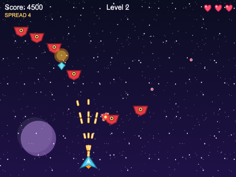

## What you will learn

- how to keep a player on one line and move it with physics, held on screen by the world's edges
- how to spawn things on a timer with `this.time.addEvent({ delay, loop, callback })`, and stop it
- what an **object pool** is, why shooters need one, and how to build one with a physics group,
  `get()`, `enableBody` and `disableBody` - and why `killAndHide` alone is not enough
- how to send enemies in **waves** with patterns made from tweens, timers and curved paths
- a fire rate, lives, flashing invulnerability, explosions with particles, and a parallax starfield
- how to grow a small game into a big one: levels as data, a boss, power-ups, a HUD scene fed by
  events, music and high scores

## The projects

| Project | What it shows |
|---|---|
| [ch14_catcher_simple](projects/ch14_catcher_simple/) | catch the fruit, dodge the bombs: a spawn timer, falling physics groups, overlaps, score and lives |
| [ch14_shooter_intermediate](projects/ch14_shooter_intermediate/) | a ship that fires, pooled bullets and enemies, two wave patterns, explosions, a starfield |
| [ch14_shooter_advanced](projects/ch14_shooter_advanced/) | three levels with a boss each, enemies that shoot back, a curved wave, power-ups, a HUD scene, music, high scores |

Each is a complete game. Play all three before reading on - it is much easier to follow the code
when you know what it does.

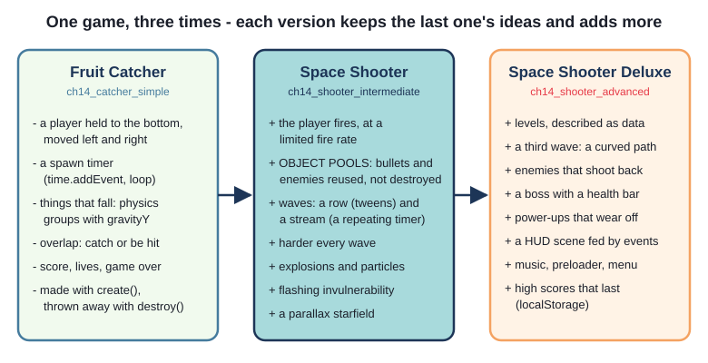

## What makes the genre work

The player can do almost nothing: move along one line, and perhaps press one button. Everything
interesting comes from what comes down the screen, and when - so that is where most of the code goes.
Three things make it work:

- **readable threats** - a fruit looks like a fruit, a bomb like a bomb; enemy bullets are a
  different colour from yours
- **rising pressure** - easy at first, harder and harder, so beginners survive and experts are tested
- **fairness** - hit boxes a little smaller than the pictures, a moment of safety after a hit, and
  enemies that stop firing when they are too close to dodge

## Version 1: Fruit Catcher

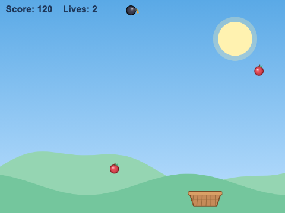

`ch14_catcher_simple` is one scene and one small class - under 300 lines, comments and all. Fruit
and bombs fall; catch the fruit for 10 points; catching a bomb, or letting a fruit hit the ground,
costs one of three lives.

### A player held to the bottom

The basket is an Arcade Physics image (Chapter 8) - an image with a **body**:

`src/objects/Basket.ts`
```ts
scene.add.existing(this);          // show it
scene.physics.add.existing(this);  // give it a body

this.setBodySize(CATCH_WIDTH, CATCH_HEIGHT, false);
this.setOffset(CATCH_OFFSET_X, CATCH_OFFSET_Y);

// the edges of the game stop the basket: no checks of our own needed
this.setCollideWorldBounds(true);
```

- the basket **never changes its y**: nothing gives it a vertical velocity, and the world has no
  gravity, so it stays on its line without being told
- `setCollideWorldBounds(true)` stops it at the edges - no checks of our own, unlike Chapter 1's ball
- the body is **not** the whole picture: `setBodySize(84, 16, false)` and `setOffset(6, 4)` make it a
  thin strip across the top (`false`: "do not centre it; I will place it"). A fruit that brushes the
  side does not count - it has to fall *in*

The basket's only method is `move(direction)`, which sets its x velocity to -1, 0 or 1 times its
speed. Every frame, `update()` checks `this.cursors.left.isDown` and `this.cursors.right.isDown` -
`this.input.keyboard!.createCursorKeys()` makes those key objects - and calls it. `isDown` is the tool
for **holding** a key; `keyboard.on("keydown-...")` (Chapter 1) is the tool for a single press.

### Spawning on a timer

Something has to drop from the sky every 700 milliseconds. You could count time in `update()`, but
the scene's clock will do it for you:

`src/scenes/GameScene.ts`
```ts
// the spawner: call dropSomething() every SPAWN_DELAY milliseconds, for ever (loop)
this.spawnTimer = this.time.addEvent({
  delay: SPAWN_DELAY,
  loop: true,
  callback: () => {
    this.dropSomething();
  },
});
```

`this.time.addEvent(config)` makes a **TimerEvent**. With `loop: true` it goes off every `delay`
milliseconds until it is removed; with `repeat: 4` instead it would go off five times (once, plus
four repeats) and then stop by itself. Keep the `TimerEvent` in a field if you will need it again:
the game-over code calls `this.spawnTimer.remove()` to stop the drops.

You met `this.time.delayedCall(ms, callback)` in Chapter 2. It is just `addEvent` with no repeats -
one call, after a wait.

The timer belongs to the scene's clock, so it pauses when the scene pauses and is thrown away when
the scene shuts down. You never have to clean it up when the scene restarts.

### Things that fall

`src/scenes/GameScene.ts`
```ts
// Two physics groups. Every member they make gets a body, and the settings here -
// gravityY - are given to each new member as it is made.
this.fruit = this.physics.add.group({ gravityY: FALL_GRAVITY });
this.bombs = this.physics.add.group({ gravityY: FALL_GRAVITY });
```

There is no gravity in the game's config - if there were, the basket would fall too. Instead each
group gives its own members gravity as they are made. So a fruit starts still, just above the screen,
and speeds up as it falls, the way a real one would (Chapter 9).

The timer's callback makes the fruit and bombs:

`src/scenes/GameScene.ts`
```ts
if (Math.random() < BOMB_CHANCE) {
  // group.create() makes a physics sprite, adds it to the scene AND to the group
  const bomb: Phaser.Physics.Arcade.Sprite = this.bombs.create(x, DROP_Y, BOMB_KEY);
  bomb.setAngularVelocity(Phaser.Math.Between(-180, 180));   // a slow tumble, in degrees per second
} else {
  this.fruit.create(x, DROP_Y, FRUIT_KEY);
}
```

`Math.random()` is a number from 0 up to (not including) 1, so `Math.random() < 0.3` is true 30% of
the time - the usual way to say "sometimes".

### Catching, and missing

`src/scenes/GameScene.ts`
```ts
this.physics.add.overlap(this.basket, this.fruit, (_basket, fruit) => {
  this.catchFruit(fruit as Phaser.Physics.Arcade.Sprite);
});
this.physics.add.overlap(this.basket, this.bombs, (_basket, bomb) => {
  this.catchBomb(bomb as Phaser.Physics.Arcade.Sprite);
});
```

One overlap against a **whole group** covers every fruit there will ever be, including the ones not
made yet (Chapter 8). The callback is handed the two objects that touched; Phaser types them loosely,
so `as` says which class they really are - a physics group makes `Phaser.Physics.Arcade.Sprite`s
unless it is told otherwise.

Things that fall past the bottom are finished with. `update()` checks every member of each group:

`src/scenes/GameScene.ts`
```ts
for (const fruit of this.fruit.getChildren() as Phaser.Physics.Arcade.Sprite[]) {
  if (fruit.y > GONE_Y) {
    fruit.destroy();
    this.loseLife();       // a dropped fruit costs a life
  }
}
```

`getChildren()` returns a **copy** of the group's members as an array, so destroying some of them
inside the loop is safe. (Changing a list while you walk through it is as bad an idea in TypeScript
as it is in Java.)

### Lives and game over

`src/scenes/GameScene.ts`
```ts
private endGame(): void {
  this.gameOver = true;
  this.sound.play(LOSE_SOUND);

  // stop the world: no more drops, and everything freezes where it is
  this.spawnTimer.remove();
  this.physics.pause();
  this.basket.setTint(0x777777);
```

`this.physics.pause()` stops every body in the scene, and with them every overlap check - so nothing
can be caught after the game is over. A GAME OVER message goes up, and SPACE calls
`this.scene.restart()`, which shuts the scene down and starts it again. The score and lives are
fields, and a restarted scene keeps its fields (Chapter 2's trap) - so `init()` puts them back.

That is a whole game: a player, a spawner, two kinds of falling thing, a score and a way to lose.
Everything else in the chapter is built on it.

## Version 2: Space Shooter

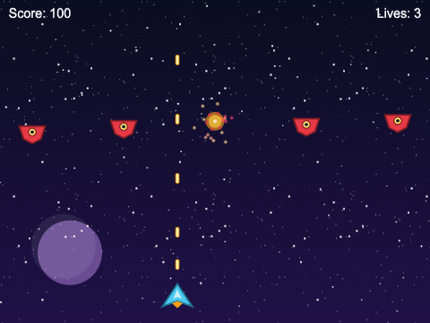

`ch14_shooter_intermediate` turns the basket into a ship, and the fruit into enemies that have to be
shot. Look at what stays the same: `PlayerShip.move()` is `Basket.move()`; the game is still a scene
with a timer, some groups and some overlaps. What is new is **how many** objects there are, and how
often they come and go.

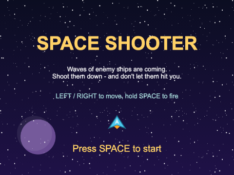

### A fire rate

Hold SPACE and the ship fires about five shots a second - not sixty. The ship remembers the time
of its next allowed shot:

`src/objects/PlayerShip.ts`
```ts
public tryToFire(time: number): boolean {
  if (time < this.nextFireTime) {
    return false;
  }
  this.nextFireTime = time + FIRE_DELAY;
  return true;
}
```

The scene's `update(time)` fires when `this.fireKey.isDown && this.ship.tryToFire(time)` - `time`
is the scene's clock, in milliseconds. A stored "next allowed" time is the standard way to limit how
often anything happens: shots, jumps, footstep sounds.

### Why pool?

Hold fire for a minute and the ship fires over 300 bullets. In the catcher, every fruit was made with
`create()` and thrown away with `destroy()`. Do that with bullets and the game builds hundreds of
objects a minute - each a game object with a physics body - and leaves every one for JavaScript's
**garbage collector** to clear up. The collector runs when it decides to, and when it runs a lot, the
game stutters.

The fix is an **object pool**: make a few bullets, and **reuse** them. A bullet that leaves the screen
is not destroyed - it is switched off, and waits to be fired again. After the first few seconds the
game makes no new bullets at all.

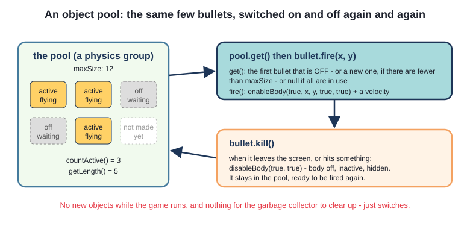

### A pool in Phaser

A physics group can be a pool. Give it a `classType` - the class it should make its members from -
and a `maxSize`:

`src/scenes/GameScene.ts`
```ts
// POOLS: physics groups that make members of our own classes, up to maxSize of them. Asking a
// pool for an object reuses a switched-off one if it can, and only makes a new one if it must.
this.bullets = this.physics.add.group({ classType: Bullet, maxSize: BULLET_POOL_SIZE });
this.enemies = this.physics.add.group({ classType: Enemy, maxSize: ENEMY_POOL_SIZE });
```

The bullet class knows how to switch itself on and off:

`src/objects/Bullet.ts`
```ts
export class Bullet extends Phaser.Physics.Arcade.Image {
  // The pool makes new bullets itself, calling `new Bullet(scene, x, y, ...)`. The pool also adds
  // them to the scene and gives them a body, so there is nothing else to do here.
  constructor(scene: Phaser.Scene, x: number, y: number) {
    super(scene, x, y, BULLET_KEY);
  }

  // Switch on: body enabled and reset to (x, y), active (so preUpdate runs), and visible.
  public fire(x: number, y: number): void {
    this.enableBody(true, x, y, true, true);
    this.setVelocityY(-SPEED);
  }

  // Switch off: body disabled (so it hits nothing), inactive (so preUpdate stops), and hidden.
  // It stays in the pool, ready for next time.
  public kill(): void {
    this.disableBody(true, true);
  }
```

and its `preUpdate()` calls `kill()` once the bullet is above the top of the screen. Compare the
constructor with `Basket`'s: no `scene.add.existing`, no `scene.physics.add.existing`.
The **pool** makes bullets, so the pool adds them to the scene and gives them bodies.

A game object has three separate switches, and a pooled object needs all three:

| Switch | Set by | Off means |
|---|---|---|
| `active` | `setActive(false)` | Phaser stops calling its `preUpdate()`; the pool treats it as free |
| `visible` | `setVisible(false)` | it is not drawn |
| `body.enable` | `disableBody()` | physics stops moving it, and it overlaps nothing |

`disableBody(true, true)` turns off all three at once (the two `true`s mean "and make it inactive",
"and hide it"). `enableBody(true, x, y, true, true)` turns them all back on, and moves the body to
`(x, y)` with its old velocity cleared.

Firing asks the pool for a bullet:

`src/scenes/GameScene.ts`
```ts
private fire(): void {
  // get() finds a switched-off bullet in the pool (or makes one, if the pool is not full yet).
  // It returns `any`, because a group can hold anything - we know ours holds Bullets. It returns
  // null when all BULLET_POOL_SIZE bullets are already on screen.
  const bullet = this.bullets.get() as Bullet | null;
  if (bullet === null) {
    return;
  }
  bullet.fire(this.ship.x, this.ship.y - MUZZLE_OFFSET);
  this.sound.play(SHOOT_SOUND, { volume: 0.4 });
}
```

`get()` looks for the first member whose `active` is `false`. If there is none and the group has
fewer than `maxSize` members, it makes a new one; if the pool is full, it gives back `null`. The type
`Bullet | null` makes the compiler insist that you check - forget, and a burst of fire with a full
pool ends the game with `TypeError: Cannot read properties of null (reading 'fire')`.

You can watch the pool work. We played for a minute, holding fire the whole time, and then asked
the game how many bullets it had ever made - `this.bullets.getLength()` - and the answer was **9**.
Nine bullet objects, fired over three hundred times.

> **Note** - `killAndHide` is not enough. Groups have a method `group.killAndHide(child)`, and you
> will see it in many Phaser examples. It sets `active` and `visible` to `false` - but it does not
> touch the **body**. The body stays enabled, keeps its velocity, and keeps overlapping things. We
> tried it: a bullet switched off with `killAndHide`, invisible and inactive, carried on up the
> screen and shot down an enemy. For physics objects in a pool, use `disableBody(true, true)`. (For
> objects without bodies - a pool of text pop-ups, say - `killAndHide` is exactly right.)

When is `destroy()` still the right choice? When objects are **rare**. The shooter's explosions are
not pooled - there are a few a second at most, each lives for less than half a second, and the
code stays simpler:

`src/scenes/GameScene.ts`
```ts
private explode(x: number, y: number): void {
  const boom = this.add.sprite(x, y, EXPLOSION_KEY).play(EXPLODE_ANIM);
  boom.once(Phaser.Animations.Events.ANIMATION_COMPLETE, () => {
    boom.destroy();
  });
  this.sparks.explode(SPARK_COUNT, x, y);
  this.sound.play(EXPLOSION_SOUND, { volume: 0.5 });
}
```

Pool what you make **many of, often**. The explosion is an animated sprite (Chapter 7) that
destroys itself when its animation ends, plus a burst from **one** particle emitter made in
`create()` with `emitting: false`. `explode(count, x, y)` fires that many particles at that point -
one emitter serves every explosion in the game.

### Waves

The catcher's timer dropped things at random. A shooter is more fun when enemies come in
**waves**, each with a shape the player learns to read. This version has two:

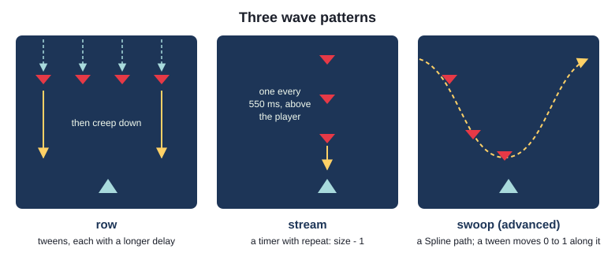

`src/scenes/GameScene.ts`
```ts
private startNextWave(): void {
  this.wave = this.wave + 1;
  const size = Math.min(FIRST_WAVE_SIZE + this.wave - 1, MAX_WAVE_SIZE);
  const extraSpeed = (this.wave - 1) * SPEED_PER_WAVE;
  this.enemiesLeft = size;
  this.showBanner(`WAVE ${this.wave}`);

  if (this.wave % 2 === 1) {
    this.rowWave(size, ROW_SPEED + extraSpeed);
  } else {
    this.streamWave(size, STREAM_SPEED + extraSpeed);
  }
}
```

This is the game's **difficulty ramp**: wave 1 has five ships, and every wave has one more (up to
twelve) and flies a little faster. The ramp is two lines of arithmetic, driven by named constants at
the top of the file - which makes it easy to tune. Play, change a number, play again.

A **row** wave uses tweens (Chapter 7). Every ship starts above the screen; each one's tween waits a
little longer (`delay: i * ROW_STAGGER`), so they swoop into line one after another. `Back.easeOut`
overshoots and settles, which reads as "arriving". When a ship's tween completes, it starts to creep
down:

`src/scenes/GameScene.ts`
```ts
this.tweens.add({
  targets: enemy,
  y: ROW_Y,
  duration: ROW_ENTRY_TIME,
  ease: "Back.easeOut",
  delay: i * ROW_STAGGER,
  onComplete: () => {
    enemy.setVelocityY(speed);
  },
});
```

Tweening a physics object's position is fine: each frame, before it moves, an Arcade body copies its
position from its game object. While the tween runs the ship has no velocity, and the tween moves
it; after, the velocity does.

A **stream** wave uses a timer with `repeat`, dropping one ship at a time above wherever the player
is - so standing still is not an option:

`src/scenes/GameScene.ts`
```ts
this.time.addEvent({
  delay: STREAM_GAP,
  repeat: size - 1,
  callback: () => {
    const x = Phaser.Math.Clamp(this.ship.x, EDGE, this.scale.width - EDGE);
    const enemy = this.spawnEnemy(x, SPAWN_Y);
    enemy?.setVelocityY(speed);
  },
});
```

`enemy?.setVelocityY(speed)` is **optional chaining**: "if `enemy` is not `null` (or `undefined`),
call the method; otherwise do nothing". It is a short way of writing the `if (enemy !== null)` check.

How does the game know a wave is over? It counts. `enemiesLeft` is set to the wave's size, and every
way an enemy can leave - shot down, crashed into the ship, flown off the bottom - calls one method:

`src/scenes/GameScene.ts`
```ts
// one fewer enemy in this wave; when there are none left, the next wave comes after a pause
private enemyGone(): void {
  this.enemiesLeft = this.enemiesLeft - 1;
  if (this.enemiesLeft === 0 && !this.gameOver) {
    this.time.delayedCall(WAVE_PAUSE, () => {
      this.startNextWave();
    });
  }
}
```

Why not just ask the pool `this.enemies.countActive() === 0`? Because in a stream wave, the ships
arrive over several seconds - after the first ship is shot, there are no active enemies at all,
but the wave is far from over.

### Pooled objects and tweens

A pooled enemy can be shot down in the middle of its entrance tween. If nothing stopped the tween,
it would carry on. We tried it: we switched an enemy off halfway into its swoop and at once handed
it out again at (700, 500) - and the old tween dragged it straight back up into the row, then set it
creeping down at the row's speed. So `kill()` does more than switch the enemy off:

`src/objects/Enemy.ts`
```ts
public kill(): void {
  // A pooled object must be switched off COMPLETELY: a tween still moving this enemy would carry
  // on moving it while it waits in the pool, and move it again when it is reused.
  this.scene.tweens.killTweensOf(this);
  this.disableBody(true, true);
}
```

This is the price of pooling: an object that is reused must be **fully reset**, every time. Anything
you attach to it - a tween, a timer, a tint, a changed scale - comes back with it next time unless
`kill()` or `spawn()` puts it right.

### Getting hit: invulnerability

When an enemy crashes into the ship, the player loses a life - and for the next two seconds the ship
flashes and cannot be hurt again. Without that moment, one bad crash in the middle of a stream could
cost every life at once.

`src/objects/PlayerShip.ts`
```ts
public makeInvulnerable(): void {
  this.invulnerable = true;
  this.scene.tweens.add({
    targets: this,
    alpha: 0.15,
    duration: FLASH_TIME,
    yoyo: true,
    repeat: INVULNERABLE_TIME / (FLASH_TIME * 2) - 1,
    onComplete: () => {
      this.setAlpha(1);
      this.invulnerable = false;
    },
  });
}
```

One tween does both jobs. `yoyo: true` fades out and back in (200 ms), `repeat` does that ten times
(two seconds), and `onComplete` ends the safe time. The overlap uses a **process callback**
(Chapter 8), which Phaser asks before calling the overlap callback:

`src/scenes/GameScene.ts`
```ts
this.physics.add.overlap(this.ship, this.enemies, (_ship, enemy) => {
  this.enemyHitsShip(enemy as Enemy);
}, () => {
  return !this.ship.isInvulnerable();
});
```

While the ship is flashing, the process callback says `false`, and enemies pass straight through it.

### A parallax starfield

A still background makes a ship look parked. The shooter's sky scrolls - in three layers:

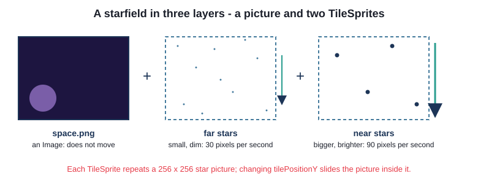

`space.png` does not move. Over it are two **TileSprites**. A `TileSprite` is a rectangle filled with
a picture repeated over and over, like tiles on a floor; changing its `tilePositionY` slides the
picture inside the rectangle, and the repeats mean it never runs out.

`src/objects/StarLayer.ts`
```ts
export class StarLayer extends Phaser.GameObjects.TileSprite {
  ...
  // TileSprite has a preUpdate of its own, so call it too (Chapter 4)
  protected override preUpdate(time: number, delta: number): void {
    super.preUpdate(time, delta);
    // a smaller tilePositionY slides the picture DOWN, which looks like flying UP
    this.tilePositionY = this.tilePositionY - this.speed * delta / 1000;
  }
```

The far layer moves at 30 pixels a second, the near layer at 90. Things far away seem to move
slowly and things close by quickly - the effect you see from a train window, called **parallax** - so
two layers at two speeds are enough to give the sky depth.

The star pictures are not files: the start scene **draws** them, once, with `Graphics`, and saves the
drawing as a texture:

`src/objects/StarLayer.ts`
```ts
const graphics = scene.make.graphics({}, false);   // false: draw it, but not on screen
...
  graphics.fillCircle(x, y, radius);
...
graphics.generateTexture(key, TILE_SIZE, TILE_SIZE);
graphics.destroy();         // the texture is saved; the Graphics is no longer needed
```

`generateTexture(key, width, height)` turns what the Graphics has drawn into a texture called `key`,
which any scene can then use like a loaded picture. `makeTexture` is `static` - it belongs to the
class, not to one star layer, just as in Java - and it checks `scene.textures.exists(key)` first, so
coming back to the title screen does not draw the stars again.

## Version 3: Space Shooter Deluxe

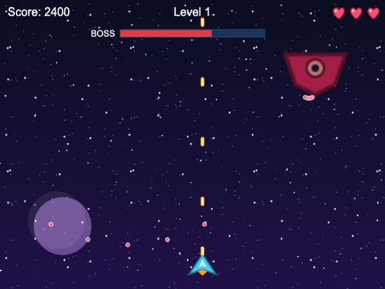

`ch14_shooter_advanced` is the same shooter, grown into a game you could hand to a friend: three
levels, a boss at the end of each, enemies that shoot back, power-ups, a menu, music and a high-score
table. It is more than twice the size of the intermediate version, so it is split into more
classes - but much of it is the intermediate version's code, moved to a better home.

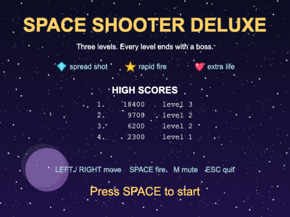

### Levels as data

In the intermediate version, the waves are worked out by arithmetic. Here each level is described
by **data**:

`src/levels.ts`
```ts
// how a wave of enemies moves (see WaveSpawner)
export type WavePattern = "row" | "stream" | "swoop";

export interface WaveData {
  pattern: WavePattern;
  size: number;             // how many ships
  speed: number;            // pixels per second (for "swoop": how long each ship's flight lasts, in ms)
}

export interface LevelData {
  waves: WaveData[];
  enemyFireChance: number;  // 0 to 1: how likely a chosen enemy is to fire, each time one is chosen
  bossHealth: number;       // hits it takes to destroy the boss
  bossFireDelay: number;    // milliseconds between the boss's volleys
  bossSweepTime: number;    // milliseconds for the boss to cross the screen
}
```

and `LEVELS` is an array of three `LevelData` object literals - level 1 starts with
`{ pattern: "row", size: 6, speed: 50 }`.

`WavePattern` is a **union of string literals** - the only strings allowed are those three. Type
`"sweep"` by mistake and the build fails. It does the job of a Java `enum`, with less ceremony.

Why data? Because a level designer - you, next week - can add a fourth level, or make level 2
harder, by editing a table, without reading any game code. The game scene never says how many levels
there are; it asks `LEVELS.length`.

### The phase

The scene now has more to keep track of - waves, then a boss, then a pause, then the next level - so
it keeps a **phase**, a small state machine like the ones in Chapters 12 and 13:

`src/scenes/GameScene.ts`
```ts
// what the scene is doing - which decides what happens when the last enemy of a wave goes
type Phase = "waves" | "between" | "boss" | "over";
```

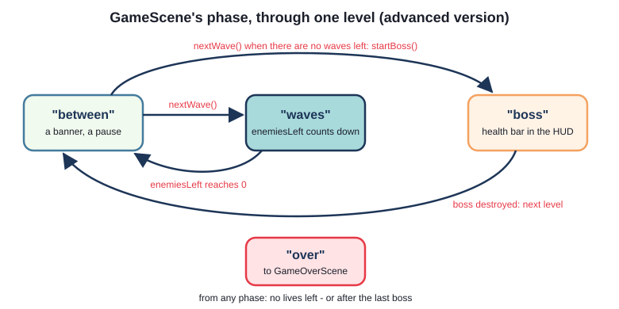

`src/scenes/GameScene.ts`
```ts
private nextWave(): void {
  const level = LEVELS[this.levelIndex];
  this.waveIndex = this.waveIndex + 1;
  if (this.waveIndex >= level.waves.length) {
    this.startBoss();
    return;
  }
  const wave = level.waves[this.waveIndex];
  this.phase = "waves";
  this.enemiesLeft = wave.size;
  this.spawner.start(wave);
}
```

`enemyGone()` is the intermediate version's, with one change: it only starts the next wave if the
phase is `"waves"`. When the game is over, or the boss is on screen, a stray enemy leaving must not
start anything.

### The WaveSpawner, and a curved path

The wave patterns have moved out of the scene into a class of their own, `WaveSpawner`. The scene
says *which* wave to start; the spawner knows *how*. `row` and `stream` are the intermediate
version's code, unchanged. `swoop` is new - ships that follow one another along a curve:

`src/WaveSpawner.ts`
```ts
private swoop(size: number, duration: number): void {
  const width = this.scene.scale.width;
  const fromRight = Math.random() < 0.5;
  const points = SWOOP_POINTS.map((value, index) => {
    const isX = index % 2 === 0;
    return fromRight && isX ? width - value : value;
  });
  const path = new Phaser.Curves.Spline(points);
  const start = path.getStartPoint();

  for (let i = 0; i < size; i++) {
    const enemy = this.spawnEnemy(start.x, start.y);
    enemy?.followPath(path, duration, i * SWOOP_GAP);
  }
}
```

A **spline** is a smooth curve through a list of points - here six points, from off the left edge,
down across the screen and off the right edge (`SWOOP_POINTS` holds them as x, y pairs). Half the
time every x is mirrored (`width - value`), so the swoop comes from the right.

How does a ship follow a curve? A curve can tell you the point any fraction of the way along it:
`path.getPointAt(0)` is the start, `getPointAt(0.5)` is halfway, `getPointAt(1)` is the end. So the
enemy has a number, `pathProgress`, that a tween moves from 0 to 1, and every frame it puts itself at
that point:

`src/objects/Enemy.ts`
```ts
// fly along `path`, taking `duration` milliseconds, starting after `delay` milliseconds
public followPath(path: Phaser.Curves.Curve, duration: number, delay: number): void {
  this.path = path;
  this.pathProgress = 0;
  this.scene.tweens.add({
    targets: this,
    pathProgress: 1,
    duration: duration,
    delay: delay,
  });
}
```

`src/objects/Enemy.ts`
```ts
preUpdate(_time: number, _delta: number): void {
  if (this.path !== null) {
    // getPointAt measures along the curve's length, so the ship moves at an even speed
    this.path.getPointAt(this.pathProgress, this.point);
    this.setPosition(this.point.x, this.point.y);
  }
}
```

A tween can move **any** number property of any object - not just `x`, `y` and `alpha`. Tweening a
number of your own, and using it to work out something else, is one of the most useful tricks there
is. And because the tween's target is the enemy, `kill()`'s `killTweensOf(this)` still stops it.

(Phaser also has a `PathFollower` game object, but one pooled enemy class that can fly any pattern
is simpler than two kinds of enemy.)

### Enemies that shoot back

Enemy bullets are a third pool, of `EnemyBullet`s. A looping timer (every 400 ms) might make one
enemy fire:

`src/scenes/GameScene.ts`
```ts
const shooter: Enemy = Phaser.Utils.Array.GetRandom(shooters);
const bullet = this.enemyBullets.get() as EnemyBullet | null;
if (bullet === null) {
  return;
}
const angle = Phaser.Math.Angle.Between(shooter.x, shooter.y, this.ship.x, this.ship.y);
bullet.fire(shooter.x, shooter.y, angle, ENEMY_BULLET_SPEED);
```

`Phaser.Math.Angle.Between(x1, y1, x2, y2)` is the angle, in radians, from the first point to the
second, so the bullet flies at where the ship **is now**. (Keep moving and it misses.) Before this,
`enemyFires()` rolls against the level's `enemyFireChance`, and chooses `shooters` only from enemies
that are on screen and not too low - an enemy firing from right above the ship would be impossible
to dodge, which is not hard, just unfair.

`EnemyBullet.fire()` turns the angle into a velocity with `cos` and `sin`, as Chapter 2 did for the
ball.

### The boss

After a level's last wave comes the boss: the enemy picture, scaled up, tinted, and much tougher.
There is only ever one, so it is not pooled - the scene makes it once, switched off, and switches it
on at the end of each level:

`src/objects/Boss.ts`
```ts
onComplete: () => {
  this.scene.tweens.add({
    targets: this,
    x: RIGHT_X,
    duration: sweepTime,
    ease: "Sine.easeInOut",
    yoyo: true,
    repeat: -1,
  });
},
```

That is the end of `appear()`: a first tween flies the boss down into place, and when it completes,
a second sweeps it across and back (`yoyo`) for ever (`repeat: -1`). The `Sine.easeInOut` ease slows the boss at each end, the way a pendulum slows.

A hit makes the boss flash white:

`src/objects/Boss.ts`
```ts
// Phaser 4: a FILL tint paints the whole picture in the tint colour (here, white)
this.setTint(0xffffff).setTintMode(Phaser.TintModes.FILL);
this.scene.time.delayedCall(HIT_FLASH_TIME, () => {
  this.setTint(BOSS_TINT).setTintMode(Phaser.TintModes.MULTIPLY);
});
```

> **Note** - Phaser 3 code does this with `setTintFill(0xffffff)`, and you will find it in many
> tutorials. Phaser 4 removed `setTintFill`: a tint now has a colour (`setTint`) and a **mode**
> (`setTintMode`). `MULTIPLY` is the ordinary tint that darkens the picture; `FILL` paints over it.

The boss fires a fan of five bullets every `bossFireDelay` milliseconds, from a timer the scene
keeps in `bossFireTimer` so it can `remove()` it when the boss is destroyed. The boss's health goes to
the HUD, which draws the bar.

One detail: when an overlap is between a single object and a group, list the single object
**first** - `overlap(this.boss, this.bullets, ...)` - so you know the callback gets `(boss, bullet)`
in that order.

### Power-ups

A destroyed enemy sometimes (15% of the time) drops a power-up. There are three kinds:

`src/objects/PowerUp.ts`
```ts
export type PowerUpKind = "spread" | "rapid" | "life";

// which picture shows which kind - a Record is an object with one entry for every kind, and the
// compiler checks that none is missing
const TEXTURES: Record<PowerUpKind, string> = {
  spread: GEM_KEY,
  rapid: STAR_KEY,
  life: HEART_KEY,
};
```

`Record<K, V>` is TypeScript's type for "an object with a `V` for every `K`" - here, a picture key for
every kind of power-up. Add a fourth kind to `PowerUpKind` and forget its picture, and the build
fails. In Java you would reach for an `EnumMap`.

Power-ups are rare, so they are not pooled; they go into an ordinary physics group,
`this.physics.add.group({ velocityY: POWERUP_FALL_SPEED })`, which gives every member the same
falling speed.

Spread shot and rapid fire **wear off** after eight seconds. Like the fire rate, the ship keeps
them as times on the scene's clock: picking up spread shot sets `this.spreadUntil = time +
POWER_UP_TIME`, and it is on while `time < this.spreadUntil`. There is no timer to cancel, nothing
to clean up if the game ends, and a second spread shot just moves the time later. `tryToFire()` uses a
shorter delay while rapid fire is on; with spread shot, `fire()` asks the pool for three bullets and
fires them at -12, 0 and 12 degrees.

Collecting one shows off TypeScript's **narrowing**:

`src/scenes/GameScene.ts`
```ts
private collect(powerUp: PowerUp): void {
  this.sound.play(POWERUP_SOUND);
  if (powerUp.kind === "life") {
    this.lives = Math.min(this.lives + 1, MAX_LIVES);
    this.events.emit(LIVES_CHANGED, this.lives);
  } else {
    // here TypeScript knows kind is "spread" or "rapid" - the only other possibilities
    this.ship.powerUp(powerUp.kind, this.time.now);
  }
  powerUp.destroy();
}
```

`ship.powerUp()` only accepts `"spread" | "rapid"`. Inside the `else`, the compiler has worked out that
`kind` cannot be `"life"`, so it allows the call. Move that line above the `if` and the build fails.

### A HUD scene, fed by events

The score, hearts, level, power-ups and boss bar are drawn by `HudScene`, which the game scene
launches to run on top of itself (Chapter 4):

`src/scenes/GameScene.ts`
```ts
// the HUD runs on top of this scene, starting from these values
const hudData: HudData = { score: this.score, lives: this.lives, level: 1 };
this.scene.launch(HUD_SCENE, hudData);
```

After that, the game scene never touches the HUD. When something changes, it **emits an event**
- `this.events.emit(SCORE_CHANGED, this.score)` - and the HUD, which listens, redraws (Chapter 6).
The event names are constants in `src/events.ts`, for the same reason scene keys are.

`src/scenes/HudScene.ts`
```ts
const gameEvents = this.scene.get(GAME_SCENE).events;
gameEvents.on(SCORE_CHANGED, this.showScore, this);
gameEvents.on(LIVES_CHANGED, this.showLives, this);
gameEvents.on(LEVEL_CHANGED, this.showLevel, this);
gameEvents.on(WEAPON_CHANGED, this.showWeapon, this);
gameEvents.on(BOSS_HEALTH_CHANGED, this.showBossHealth, this);

this.events.once(Phaser.Scenes.Events.SHUTDOWN, () => {
  gameEvents.off(SCORE_CHANGED, this.showScore, this);
```

...and so on for the other four. The HUD listens on **another scene's** emitter, which outlives the
HUD: every new game launches a new HUD. Without the `off` calls, each game would add another set of
listeners, all still attached to HUDs that are long gone (Chapter 4's listener leak). Passing the
method with its `this` (`this.showScore, this`) to both `on` and `off` is what lets `off` find the
right listener to remove.

The boss bar is a `Container` of three objects, shown and hidden as one; its red fill has its origin
at its left end, so `setScale(health / maxHealth, 1)` shrinks it towards the left.

### Music, and scores that last

Two more things come from earlier chapters and need no new ideas:

- `src/music.ts` plays one music track at a time. The sound manager belongs to the game, not a scene,
  so `playMusic()` checks whether a track is already playing before starting it (Chapter 5)
- `src/HighScores.ts` keeps the best five scores in `localStorage`, and checks what it loads back:
  anything that is not a list of `{ score, level }` objects is treated as an empty table rather than
  crashing the game (Chapter 6)

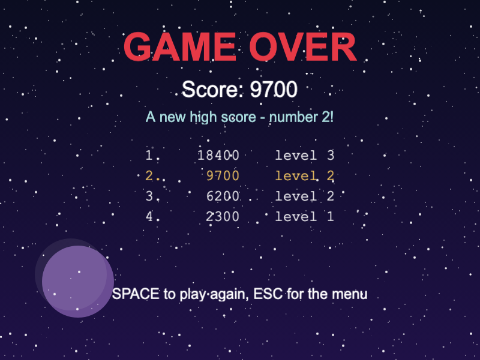

## Common mistakes

> **Note** - Four bugs that every shooter-writer meets:
>
> - **a pooled object that keeps something from last time** - an old angle, an old tween, an old
>   tint. Whatever `kill()` does not undo, `spawn()` or `fire()` must set. If an object misbehaves
>   only the *second* time it is used, this is why
> - **`get()` returning `null`** - type it `as Bullet | null`, not `as Bullet`, and let the compiler
>   make you check
> - **a body left switched on** - `killAndHide` and `setVisible(false)` leave the body working.
>   Invisible things that still hit things are nearly always this
> - **timers that outlive their purpose** - a spawner never removed keeps spawning after the game is
>   over. `remove()` it, or check the game's state at the top of the callback, as `enemyFires()` does

## Summary

- the genre is simple on the player's side; the design is in what comes down the screen, how fast,
  and how readable and fair it is
- `this.time.addEvent({ delay, loop: true, callback })` spawns on a timer; `repeat: n` runs it
  `n + 1` times; `remove()` stops it
- a physics group with `gravityY` or `velocityY` gives every member the same motion
- an **object pool** reuses objects instead of making and destroying them: a physics group with
  `classType` and `maxSize`, `get()` (which may return `null`), `enableBody(true, x, y, true, true)`
  to switch on and `disableBody(true, true)` to switch off. `killAndHide` leaves the body on
- pool what you make many of, often; `destroy()` is fine for the rare things
- a fire rate is a stored "next allowed" time; so is a power-up that wears off
- waves: tweens with staggered delays, timers with `repeat`, and a tween moving an object along a
  `Spline`; count the ships in a wave to know when it is over
- invulnerability is a flashing tween plus a process callback; a parallax starfield is two
  `TileSprite`s scrolling at different speeds
- as a game grows: levels as data, a phase, classes with one job each, and a HUD scene that only
  listens to events

## Challenges

1. **Pointer control** *(ch14_catcher_simple)* - Let the player move the basket with the mouse, or
   a finger on a touch screen, as well as the arrow keys. The basket should slide towards the pointer
   at its usual speed - not jump to it - and stop when it gets there. The arrow keys should still
   work.

2. **Combo scoring** *(ch14_catcher_simple)* - Reward catching fruit in a row. Each fruit caught
   without a miss in between is worth more: 10, then 20, then 30, up to 50 a fruit. Dropping a fruit
   or catching a bomb breaks the combo. Show the current combo on screen, and pop up a short floating
   "+30" where each fruit was caught.

3. **Zig-zag enemies** *(ch14_shooter_intermediate)* - Add a third kind of wave in which the ships
   zig-zag from side to side as they come down the screen. Make it every third wave (row, stream,
   zig-zag, row, ...), and make the zig-zag grow wilder as the waves go on.

4. **Shield power-up** *(ch14_shooter_advanced)* - Add a fourth power-up: a shield. While the ship
   has it, a bubble shows round the ship, and the next hit - from an enemy or a bullet - pops the
   shield instead of costing a life. The shield does not wear off with time. Show it on the menu's
   power-up list too. *Hint:* follow `PowerUpKind` through the code, and let the compiler show you
   everywhere a new kind needs handling. The picture can be drawn with `Graphics` and
   `generateTexture`.

5. **Smart bomb** *(ch14_shooter_advanced)* - The player starts each game with three bombs. Pressing
   B uses one: every enemy on screen explodes (and scores), every enemy bullet disappears, the screen
   flashes, and the boss - if it is there - loses a chunk of health but survives. Show the bombs left
   in the HUD. *Hint:* the enemies are in a pool - which method gives you the ones that are really on
   screen? And think carefully about `enemiesLeft` when many ships are destroyed at once. The camera
   can `flash(duration)`.

6. **Second player** *(ch14_shooter_intermediate)* - Add a second ship for a second player, moved
   with A and D and firing with W, in a different colour. Each player has their own score and lives
   (show both); a player with no lives left disappears, and the game ends when both are out. The game
   over screen should say who won. *Hint:* the ship's class should not need to know which keys move
   it. Can both ships share the bullet pool? And what should the stream wave aim at now?

---

Previous: [Chapter 13 - Memory match](../ch13_memory_match/README.md) ·
Next: [Chapter 15 - Platformer](../ch15_platformer/README.md)
