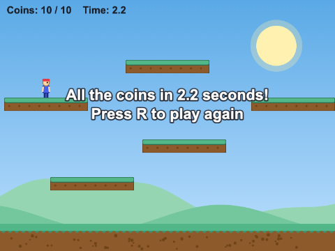
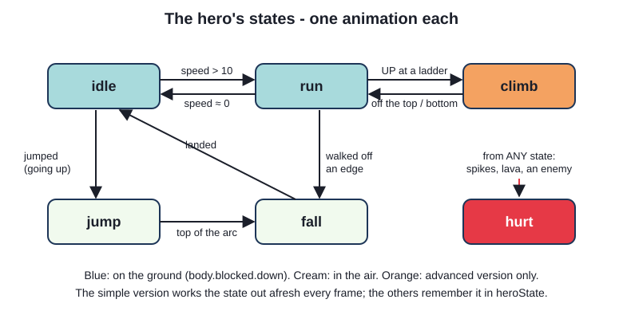
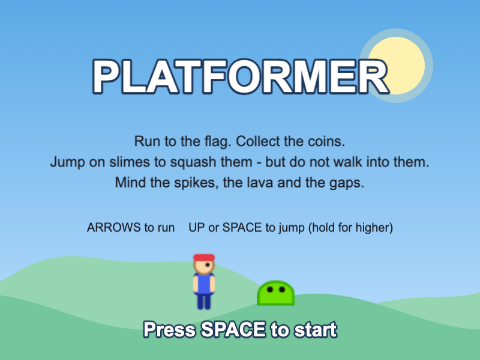
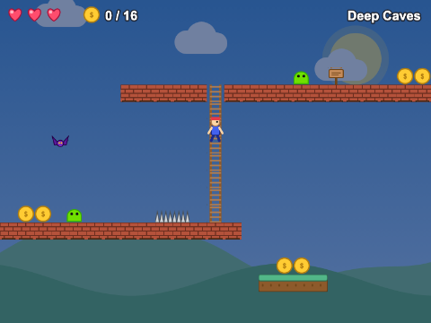

# Chapter 15 - Platformer

Run, jump, land on things, and do not fall down the hole. The platformer is the genre where
physics matters most: the whole game is how the hero moves. In this chapter you build one three
times - a single screen of platforms and coins, then a scrolling level made in Tiled with enemies
and hazards, then a three-level game with ladders, moving platforms, checkpoints and a level select -
and see how each version grows out of the one before.


## What you will learn

- how gravity, `body.blocked.down` and a jump velocity make a hero that runs and jumps
- what makes a jump *feel* right: acceleration and drag, a variable jump height, coyote time and jump
  buffering
- how to build a level in Tiled whose tiles say what they are - solid, deadly, climbable - and read
  its objects to place the hero, coins, enemies and the goal
- how enemies patrol, how the game tells a stomp from a hurt, and how hazards are fair
- one-way platforms, platforms that move and carry the hero, and ladders
- checkpoints, lives, a HUD scene and a level select that unlocks as you play

## The projects

| Project | What it shows |
|---|---|
| [ch15_platformer_simple](projects/ch15_platformer_simple/) | one screen: gravity, a static group of platforms, an animated hero, coins to collect |
| [ch15_platformer_intermediate](projects/ch15_platformer_intermediate/) | a scrolling Tiled level: a jump with good feel, slimes to stomp, spikes and lava, a flag to reach, a camera that follows |
| [ch15_platformer_advanced](projects/ch15_platformer_advanced/) | three levels and a level select; moving and one-way platforms, ladders, bats that swoop, checkpoints, lives and a HUD |

## What makes a platformer

A platformer is a game about **movement**. The player spends the whole game running and
jumping, so if the jump feels floaty, or a jump pressed a moment too late is ignored, the game feels
bad however good the levels are. So the three versions spend as much time on *how the hero moves*
as on *what is in the level*:

| | simple | intermediate | advanced |
|---|---|---|---|
| the level | platforms placed in code | a Tiled map, bigger than the screen | three Tiled maps, one scene |
| the hero | velocity straight from the keys | acceleration, variable jump, coyote time, buffering | ... and ladders |
| danger | none | slimes, spikes, lava, gaps | ... and swooping bats |
| when hurt | - | start the level again | lose a life, back to the checkpoint |
| around it | one scene | title, game and end scenes | preload, level select, game, HUD, result |

This chapter uses ideas from all the chapters before it, and points back to them rather than
explaining them again: sprite sheets and animations (Chapter 7), Arcade Physics bodies, colliders
and groups (Chapters 8 and 9), tilemaps (Chapter 10) and Tiled maps (Chapter 11).

## Version 1: the simple platformer


### Gravity

Physics is switched on for the whole game in the config, with gravity:

`src/main.ts`
```ts
physics: {
  default: "arcade",
  arcade: {
    gravity: { x: 0, y: 900 },
    debug: false, // true draws every body's outline - try it
  },
},
```

Every dynamic body is now pulled down, speeding up by 900 pixels per second every second. Nothing
stays in the air unless something holds it up.

### The hero

`Hero` extends `Phaser.Physics.Arcade.Sprite` - a Sprite (so it can play animations) that can be
given a physics body:

`src/objects/Hero.ts`
```ts
export class Hero extends Phaser.Physics.Arcade.Sprite {
  // Phaser types `body` as "a dynamic body, a static body, or null", because it cannot know which
  // this sprite will get. It is always a dynamic body (the constructor makes it), and `declare`
  // tells TypeScript so. It adds no code - it only narrows the type.
  declare body: Phaser.Physics.Arcade.Body;

  private cursors: Phaser.Types.Input.Keyboard.CursorKeys;

  constructor(scene: Phaser.Scene, x: number, y: number) {
    super(scene, x, y, HERO_KEY, 0);

    scene.add.existing(this); // draw it, and call its preUpdate() every frame
    scene.physics.add.existing(this); // give it a dynamic Arcade Physics body

    // the body is centred across the picture, and its bottom is the bottom of the feet
    this.body.setSize(BODY_WIDTH, BODY_HEIGHT);
    this.body.setOffset((this.width - BODY_WIDTH) / 2, this.height - BODY_HEIGHT);
    this.setCollideWorldBounds(true);
```

Two things to notice:

- **`declare body`**. The type of `body` on an Arcade Sprite is `Body | StaticBody | null`, so
  without this line every `this.body.velocity` would be a type error ("possibly null"). `declare`
  re-states the type of an inherited field without adding any code. It is a promise - like `as` -
  so it is only right because the constructor really does give the sprite a dynamic body
- **the body is smaller than the picture**. The hero picture is 32 x 48 with space around the
  figure. A body of 18 x 42, standing on the same feet, means the hero does not bump its head on
  thin air or hang off a ledge by an empty corner. Turn on `debug: true` to see it

Like Chapter 1's `Ball`, the hero looks after itself every frame:

`src/objects/Hero.ts`
```ts
protected override preUpdate(time: number, delta: number): void {
  // a Sprite's own preUpdate() moves its animation on - without this line the hero never animates
  super.preUpdate(time, delta);

  this.run();
  this.jump();
  this.animate();
}
```

### Standing on something

The platforms are a **static group** (Chapter 8): bodies that never move and cannot be pushed.
`create()` on a static group makes a sprite and gives it a static body in one go:

`src/scenes/GameScene.ts`
```ts
const platforms = this.physics.add.staticGroup();
platforms.create(400, 568, GROUND_KEY); // the ground strip, 800 x 64, along the bottom
for (const p of PLATFORMS) {
  platforms.create(p.x, p.y, PLATFORM_KEY);
}

// --- the hero, who stands on the platforms
Hero.createAnimations(this);
this.hero = new Hero(this, 60, 480);
this.physics.add.collider(this.hero, platforms);
```

Gravity pulls the hero into a platform; the collider pushes it back out and stops it. And as it
does, it sets a flag on the hero's body: **`body.blocked.down`** is `true` when, in the last
physics step, something stopped the body moving down. That one flag is the answer to the question
every platformer asks all the time: *is the hero standing on something?*

### Jumping

`src/objects/Hero.ts`
```ts
private jump(): void {
  const jumpPressed = Phaser.Input.Keyboard.JustDown(this.cursors.up) ||
    Phaser.Input.Keyboard.JustDown(this.cursors.space);

  if (jumpPressed && this.body.blocked.down) {
    this.setVelocityY(-JUMP_SPEED); // negative y is UP
    this.scene.sound.play(JUMP_SOUND);
  }
}
```

A jump is just an upward velocity. Gravity then takes it away, 900 pixels per second every second,
until the hero stops rising and starts to fall: the arc comes for free. `JustDown` is true only on
the frame the key went down, so holding the key does not bounce the hero up and down.

Running is even simpler: left and right set the horizontal velocity, and no key sets it to 0.

### Choosing an animation

Chapter 7 built an animation state machine for this hero. Here the state is worked out from the
body every frame - in the air or not, moving or not - and each state has one animation:

`src/objects/Hero.ts`
```ts
private animate(): void {
  const velocity = this.body.velocity;

  if (!this.body.blocked.down) {
    this.play(velocity.y < 0 ? JUMP : FALL, true);
  } else if (velocity.x !== 0) {
    this.play(RUN, true);
  } else {
    this.play(IDLE, true);
  }
```

`play(key, true)` means "unless it is already playing" - without the `true`, the run animation would
restart from its first frame 60 times a second, and look frozen.

### Coins: overlap, not collide

The coins are a static group too, but the hero must pass *through* them, so they use `overlap`:

`src/scenes/GameScene.ts`
```ts
// Phaser passes the two objects in the order they were given: hero first, then the coin.
// Its types cannot know which is which, so the coin is cast with `as`
this.physics.add.overlap(this.hero, coins, (_hero, coin) => {
  this.collectCoin(coin as Phaser.Physics.Arcade.Sprite);
});
```

`collectCoin()` destroys the coin - sprite and body together, so it cannot be collected twice - and
counts it. Ten coins wins. R restarts the scene, and `init()` puts the count back to 0 (Chapter 2).

That is a complete platformer in about 350 lines, many of them comments. Play it, and you will notice what is missing: the
hero starts and stops dead, every jump is the same height, and a jump pressed a fraction too late at
the edge of a platform does nothing. The next version fixes all three.



## Version 2: a level from Tiled, and a jump that feels right


### The level

The level is a Tiled map (Chapter 11), 80 tiles wide and 20 high - much bigger than the screen.
It has three tile layers - Background, Ground and Hazards - and an Objects layer. (The advanced
version's maps add a fourth tile layer, for ladders; the picture shows all five.)


The important idea is in the tileset: its tiles carry **custom properties**. Grass, dirt, brick
and stone have `collides = true`; spikes, lava and water have `hazard = true`; the ladder has
`ladder = true`. The code never mentions a tile number - it asks for tiles by what they *are*:

`src/scenes/GameScene.ts`
```ts
this.map = this.make.tilemap({ key: MAP_KEY });
const tileset = this.map.addTilesetImage(TILESET_NAME, TILES_KEY);
if (tileset === null) {
  // null means the name did not match the tileset's name inside the map
  throw new Error(`The map has no tileset called "${TILESET_NAME}"`);
}
this.map.createLayer("Background", tileset);
const ground = this.createLayer("Ground", tileset);
const hazards = this.createLayer("Hazards", tileset);

// collide with every tile that has collides = true in Tiled - no tile numbers in the code
ground.setCollisionByProperty({ collides: true });
```

`addTilesetImage` and `createLayer` quietly give back `null` when a name does not match the map -
and the game then fails somewhere else, with a confusing error. Checking for `null` straight away,
and saying *which* name was wrong, turns a puzzle into a one-line fix.

Notice `TILES_KEY`: the tileset picture was loaded as a **sprite sheet** of 32 x 32 frames. A
tilemap only needs the picture, so a sprite sheet works; and the same key can show a single tile
as a sprite - the flag is `this.physics.add.staticImage(x, y, TILES_KEY, FLAG_FRAME)`.

> **Note** - The maps in this chapter were not drawn by hand in Tiled: a small script,
> `chapters/ch15_platformer/tools/make_levels.ts`, turns levels drawn as text into `.tmj` files -
> see "The level generator" near the end of the chapter. They are ordinary Tiled maps, with the
> tileset embedded: each project has a copy in `tiled/` to open in Tiled, and the game loads the one
> in `public/assets/maps/`.

**Changing a level in Tiled.** Open the map from the project's `tiled/` folder, make your changes,
and save. Then **File > Export As...**, choose **JSON map files**, and save it over the map of the
same name in `public/assets/maps/` - that is the file the game loads. (The export dialog starts in
`tiled/`, so move to `public/assets/maps/` first. After the first time, **File > Export** repeats
it.) Build, and refresh the game. Tiled writes the tileset's picture path relative to wherever you
export to; Phaser never reads that path - the code names the picture with `addTilesetImage` - so it
only has to be right for Tiled.

### A world bigger than the screen

`src/scenes/GameScene.ts`
```ts
const width = this.map.widthInPixels;
const height = this.map.heightInPixels;
this.physics.world.setBounds(0, 0, width, height);
this.physics.world.setBoundsCollision(true, true, false, false);
this.cameras.main.setBounds(0, 0, width, height);
```

The physics world and the camera become the size of the map (Chapter 10). `setBoundsCollision`
takes left, right, up, down: the bottom of the world is **open**, so a hero who falls down a gap
falls out of the world - and `update()` notices when the hero is 100 pixels below the map.

The camera follows the hero with `startFollow(this.hero, true, 0.1, 0.1)`: the last two numbers are
the *lerp* - each frame the camera moves a tenth of the way to the hero, which smooths out every
jump and landing. The sky has `setScrollFactor(0)` so it never moves, and the clouds `0.3`, so they
drift slowly past: far things seem to move more slowly, and this **parallax** makes the flat picture
look deep.

### Things placed in Tiled

The Objects layer holds points: where the hero starts, and where every coin, slime and the flag
go. Each point is named by its `type` - in Tiled, that is the object's **Class** field (the Objects
panel shows it in its Class column). The **Name** is only a label: an object whose Name says
"slime" but whose Class says `coin` becomes a coin. A point marks where the thing's *feet* go:

`src/scenes/GameScene.ts`
```ts
// every object on the Objects layer with this type
private objectsOfType(type: string): Phaser.Types.Tilemaps.TiledObject[] {
  return this.map.getObjectLayer("Objects")!.objects.filter((o) => o.type === type);
}
```

`src/scenes/GameScene.ts`
```ts
const start = this.findObject("player");
this.hero = new Hero(this, start.x!, start.y!);
this.physics.add.collider(this.hero, ground);
```

A `TiledObject`'s `x` and `y` are typed `number | undefined`, because a few kinds of Tiled object
have no position; ours always do, hence the `!`. The hero calls `this.setOrigin(0.5, 1)`, so its
position *is* its feet, and it stands exactly on the point. (Arcade bodies follow the origin, so
the body stays in the right place.)

### Game feel 1: speeding up and slowing down

The simple hero went from standing to full speed in one frame. Now the keys set an
**acceleration**, and **drag** slows the hero when no key is held:

`src/objects/Hero.ts`
```ts
// drag slows the hero only while its acceleration is zero - that is, when no key is held
this.setDragX(RUN_DRAG);
this.setMaxVelocity(MAX_RUN_SPEED, MAX_FALL_SPEED);
```

`src/objects/Hero.ts`
```ts
private run(): void {
  if (this.cursors.left.isDown) {
    this.setAccelerationX(-RUN_ACCELERATION);
  } else if (this.cursors.right.isDown) {
    this.setAccelerationX(RUN_ACCELERATION);
  } else {
    this.setAccelerationX(0); // let drag bring the hero to a stop
  }
}
```

With an acceleration of 1400 the hero reaches full speed (220) in about a sixth of a second:
quick enough to feel responsive, slow enough to feel like it has weight. `setMaxVelocity` caps the
running speed - and the falling speed too, so a long fall can never be fast enough to pass through
a floor in a single step. These numbers are the *feel* of your game: change them and play.

### Game feel 2: a jump you control


In almost every platformer, a tap makes a hop and holding the button makes a full jump. The trick
is not to keep pushing the hero up while the key is held - it is to **cut the jump short** when the
key is let go:

`src/objects/Hero.ts`
```ts
// a short tap makes a short hop: letting go while still going up cuts the speed
const released = Phaser.Input.Keyboard.JustUp(this.cursors.up) ||
  Phaser.Input.Keyboard.JustUp(this.cursors.space);
if (released && this.body.velocity.y < 0) {
  this.setVelocityY(this.body.velocity.y * JUMP_CUT);
}
```

Every jump starts at the same speed. Letting go while the hero is still rising keeps only 40% of
the upward speed, so the hero peaks soon after. Held all the way, the jump is 150 pixels high -
about four and a half tiles; a quick tap is under 40.

### Game feel 3: coyote time and jump buffering

Two small timers make a big difference, and players never notice them - they only notice when they
are missing:


- **coyote time**: like the cartoon coyote who runs off a cliff and does not fall until he looks
  down, the hero can still jump for 100 ms after running off a ledge. Players press jump when they
  *see* the edge, which is often a frame or two after the feet left it
- **jump buffering**: a jump pressed up to 120 ms *before* landing is remembered, and happens the
  moment the hero lands. Without it, a jump pressed slightly early is simply lost

Both come from the same change of thinking: instead of "is the hero on the floor *now*?" and "is
jump pressed *now*?", remember *when* each last happened:

`src/objects/Hero.ts`
```ts
private jump(time: number): void {
  // remember WHEN things happened, rather than only whether they are happening now
  if (this.body.blocked.down) {
    this.lastOnFloor = time;
  }
  if (Phaser.Input.Keyboard.JustDown(this.cursors.up) || Phaser.Input.Keyboard.JustDown(this.cursors.space)) {
    this.jumpPressedAt = time;
  }

  const recentlyOnFloor = time - this.lastOnFloor <= COYOTE_TIME;
  const recentlyPressed = time - this.jumpPressedAt <= JUMP_BUFFER;

  if (recentlyOnFloor && recentlyPressed) {
    this.setVelocityY(-JUMP_SPEED);
    this.scene.sound.play(JUMP_SOUND);
    // use both up, so one press cannot make two jumps
    this.lastOnFloor = -1000;
    this.jumpPressedAt = -1000;
  }
```

`time` is the `time` given to `preUpdate()`, in milliseconds. The last two lines matter: without
them, the frame after a jump would still count as "recently on the floor" *and* "recently pressed",
and the hero would jump again.

### The state machine, remembered



The simple hero worked out its state every frame and called `play()`. This one also *remembers*
its state, as a union of string literals (Chapter 12):

`src/objects/Hero.ts`
```ts
type HeroState = "idle" | "run" | "jump" | "fall" | "hurt";
```

`src/objects/Hero.ts`
```ts
// every change of state goes through here, so each state's animation is set in one place
private setHeroState(next: HeroState): void {
  if (next !== this.heroState) {
    this.heroState = next;
    const animations: Record<HeroState, string> = { idle: IDLE, run: RUN, jump: JUMP, fall: FALL, hurt: HURT };
    this.play(animations[next]);
  }
```

Remembering it means the hero can have a state that the body cannot tell you about - `"hurt"` - and
behave differently in it: once hurt, `preUpdate()` returns before reading any keys. (The field is
called `heroState` because every game object already has a field called `state`.) `Record<HeroState,
string>` is an object with exactly one entry for each state: add a state to `HeroState` and forget its
animation, and the build fails.

### Slimes that patrol


A slime walks one way until it should turn round. Walls are easy - the collider sets
`body.blocked.left` or `blocked.right`. The edge of a platform, or a spike, it has to *look for*,
by asking the tilemap what is just in front of its feet:

`src/objects/Slime.ts`
```ts
// look just beyond the leading edge of the body: no ground under that spot, or a hazard in it,
// means turn round
private shouldTurn(): boolean {
  const aheadX = this.direction < 0 ? this.body.left - 2 : this.body.right + 2;
  const noGround = !this.ground.hasTileAtWorldXY(aheadX, this.body.bottom + 4);
  const hazard = this.hazards.hasTileAtWorldXY(aheadX, this.body.bottom - 4);
  return noGround || hazard;
}
```

The slime is given the two layers in its constructor. It only checks while standing on something
(`blocked.down`), so a slime that is falling does not spin round in mid-air.

### Stomp, or be hurt?

The hero and the slimes only overlap; the callback decides what the touch means:

`src/scenes/GameScene.ts`
```ts
// landing on top of a slime squashes it; any other touch hurts the hero
private heroMeetsSlime(slime: Slime): void {
  if (this.hero.isHurt() || slime.isSquashed()) {
    return;
  }
  const falling = this.hero.body.velocity.y > 0;
  const feetOnTop = this.hero.body.bottom <= slime.body.top + STOMP_MARGIN;

  if (falling && feetOnTop) {
    slime.squash();
    this.hero.bounce();
    this.sound.play(STOMP_SOUND);
  } else {
    this.hurtHero();
  }
}
```

Why the margin? Physics runs in steps. In the step when they first touch, a falling hero is
usually a few pixels *into* the slime already, so "feet exactly on top" would almost never be true.
Twelve pixels of forgiveness is fair; and "falling" stops a hero who jumps up into a slime from
below from counting as a stomp. `squash()` switches the slime's body off at once - so it cannot hurt
the hero in the next frame - then tweens it flat and destroys it.

### Hazards, fairly

Spikes and lava are tiles, and the hero only overlaps them. But there is a surprise in overlapping
a tilemap layer: Phaser calls the callback for **every tile near the body - including empty ones**.
A process callback (Chapter 8) decides which tiles count:

`src/scenes/GameScene.ts`
```ts
// hazards only OVERLAP. Phaser checks every tile near the hero - even empty ones - so the
// process callback decides which count: a hazard tile, with the feet well into it
this.physics.add.overlap(this.hero, hazards, () => this.hurtHero(), (_hero, tile) => {
  return this.isDeadly(tile as Phaser.Tilemaps.Tile);
});
```

`src/scenes/GameScene.ts`
```ts
private isDeadly(tile: Phaser.Tilemaps.Tile): boolean {
  return tile.properties.hazard === true && this.hero.body.bottom > tile.pixelY + HAZARD_MARGIN;
}
```

`tile.properties` is the tile's custom properties from Tiled. The spikes are drawn in the bottom
two thirds of their square, so the hero must be 12 pixels *into* the square before they hurt:
brushing the top corner of an empty-looking square is not a death. Fair hit boxes are a big part
of what makes a hard game feel fair rather than cheap.

### Being hurt

When the hero is hurt it plays the classic platformer "ouch": a hop, then a fall straight through
the floor - `hurt()` sets `body.checkCollision.none = true` so it collides with nothing. The camera
stops following, and a moment later the scene restarts itself, passing on how many attempts there
have been:

`src/scenes/GameScene.ts`
```ts
this.time.delayedCall(RESTART_DELAY, () => {
  const data: GameData = { attempt: this.attempt + 1 };
  this.scene.restart(data);
});
```

`scene.restart(data)` hands `data` to `init()`, just like `scene.start` (Chapter 2). Reaching the
flag fades the camera out and starts `EndScene` with the coins, the time and the number of attempts.



## Version 3: three levels, ladders and moving platforms



### One scene, every level

All three levels are Tiled maps with the same layers, so one `GameScene` can play any of them. What
is different about each level is a list:

`src/config/levels.ts`
```ts
export const LEVELS: LevelInfo[] = [
  { key: "level1", file: "assets/maps/level1.tmj", name: "Green Hills", skyTint: 0xffffff },
  { key: "level2", file: "assets/maps/level2.tmj", name: "Deep Caves", skyTint: 0x7080a0 },
  { key: "level3", file: "assets/maps/level3.tmj", name: "Lava Castle", skyTint: 0xff9070 },
];
```

`PreloadScene` loads every map in the list; `GameScene` is started with `{ level: index }` and
builds whichever it is told. A fourth level would be one more map and one more line - no new code.
This is **data-driven** design: the code says *how* a level works, the data says *which* levels
there are.

### One-way platforms


Rectangles on the Objects layer become `MovingPlatform`s. Each is solid on its top face only:

`src/objects/MovingPlatform.ts`
```ts
// one-way: only the TOP collides. Jump up through it from underneath, or walk through
// its ends; land on it from above
this.body.checkCollision.down = false;
this.body.checkCollision.left = false;
this.body.checkCollision.right = false;
```

`checkCollision` says which faces of a body take part in collisions. With only `up` left, a hero
jumping from below passes straight through and lands on top. (Chapter 8 did the same thing another
way, with a process callback.)

### Platforms that move - and carry the hero

A platform given `moveX` and `moveY` in Tiled goes there and back for ever. It moves by
**velocity**, turning round at each end:

`src/objects/MovingPlatform.ts`
```ts
// called every frame (Phaser calls preUpdate on anything added with add.existing that has one)
protected preUpdate(): void {
  if (this.length === 0) {
    return; // a platform that stays still
  }
  // turn round at each end. Comparing distances from the two FIXED ends means small
  // overshoots never add up, however long the game runs
  if (this.outward && this.start.distance(this) >= this.length) {
    this.outward = false;
    this.setVelocity(-this.velocity.x, -this.velocity.y);
  } else if (!this.outward && this.end.distance(this) >= this.length) {
    this.outward = true;
    this.setVelocity(this.velocity.x, this.velocity.y);
  }
}
```

It is `immovable` (the hero cannot push it down) and ignores gravity. Now the physics engine does
something clever: when a body stands on an immovable body that moves, the engine moves the rider by
the same distance each step. So the hero rides along with no code of ours at all - and a platform
rising into the hero lifts it, because the collider pushes the hero out of the way.

> **Note** - Why not a tween, which would give a nicer ease in and out? A tween moves the *picture*,
> and the physics engine only notices afterwards. Phaser has `body.setDirectControl(true)` for
> exactly this case - the engine then works out a speed from how far the tween moved the body - but
> the engine can take two or three physics steps in one slow frame, and the hero then slides about
> on the platform. With velocity, the engine moves the platform itself, and knows exactly how far.

### Ladders

A ladder needs three things: a way to know the hero is at one, a `"climb"` state, and a top you
can stand on.

**Finding ladders.** The hero should not need to know about tilemaps, so it is given a *function*
to ask - the type of a function is written like this in TypeScript:

`src/objects/Hero.ts`
```ts
// "is there a ladder at (x, y)?" - the answer is the ladder's centre x, or null for no ladder
export type LadderFinder = (x: number, y: number) => number | null;
```

`src/scenes/GameScene.ts`
```ts
this.hero = new Hero(this, start.x!, start.y!, (x, y) => this.findLadder(x, y));
```

`src/scenes/GameScene.ts`
```ts
// the function the hero is given: the middle of the ladder at (x, y), or null
private findLadder(x: number, y: number): number | null {
  const tile = this.ladders.getTileAtWorldXY(x, y);
  if (tile === null) {
    return null;
  }
  return tile.getCenterX();
}
```

In Java this would be an interface with one method; in TypeScript you can pass the function itself.
The same `Hero` would work with ladders made of sprites, or of anything else.

**Climbing.** UP with a ladder behind the hero, or DOWN while standing on top of one, switches to
the `"climb"` state: gravity off, the hero lined up with the ladder, and the arrow keys now move it
up and down:

`src/objects/Hero.ts`
```ts
this.setHeroState("climb");
this.x = ladderX; // line up with the ladder, so the body fits the hole it goes through
this.body.setAllowGravity(false);
this.setAcceleration(0, 0);
this.setVelocity(0, 0);
return true;
```

The hero leaves the ladder by jumping, stepping sideways, climbing off the top, or reaching the
floor at the bottom - and gravity comes back on.

**The top.** Each ladder's top square is made solid on its top face only - the tile version of a
one-way platform - so the hero can stand on it and walk off onto the ledge beside it:

`src/scenes/GameScene.ts`
```ts
private makeLadderTopsSolid(): void {
  this.ladders.forEachTile((tile) => {
    const above = this.ladders.getTileAt(tile.x, tile.y - 1);
    if (tile.index !== -1 && above === null) {
      tile.setCollision(false, false, true, false);
    }
  });
}
```

But a climbing hero must pass *through* that top, going up or down. A process callback on the
collider switches it off while climbing:

`src/scenes/GameScene.ts`
```ts
// ladder tops are solid - except while climbing, when the hero must pass through them
this.physics.add.collider(this.hero, this.ladders, undefined, () => !this.hero.isClimbing());
```

### Bats that swoop

A bat hovers, bobbing gently, until the hero passes underneath - then swoops at where the hero
*was*, and flies home. It is a second small state machine:

`src/objects/Bat.ts`
```ts
if (this.batState === "hover") {
  this.setVelocity(0, Math.cos(time / 250) * BOB_SPEED);
  if (time > this.stateEnds && this.canSeeTarget()) {
    // aim at where the hero is NOW - if the hero keeps moving, the bat misses
    this.batState = "swoop";
    this.stateEnds = time + SWOOP_TIME;
    this.scene.physics.moveToObject(this, this.target, SWOOP_SPEED);
  }
} else if (this.batState === "swoop") {
  if (time > this.stateEnds) {
    this.batState = "return";
    this.scene.physics.moveTo(this, this.home.x, this.home.y, RETURN_SPEED);
  }
```

`physics.moveToObject` sets a velocity towards a target at a given speed - the bat does not steer
after that, which is what makes it dodgeable. Bats have `setAllowGravity(false)` and no collider
with the ground: they fly through walls.

### Slimes and bats are both Enemies

The scene treats a slime and a bat the same way when the hero touches one. An **interface** says
what they have in common:

`src/objects/Enemy.ts`
```ts
export interface Enemy {
  body: Phaser.Physics.Arcade.Body;
  isSquashed(): boolean;
  squash(): void;
}
```

`class Slime extends Phaser.Physics.Arcade.Sprite implements Enemy` - exactly as in Java, and the
compiler checks that the class really has everything the interface lists. Then one handler serves
both (it is the intermediate version's `heroMeetsSlime`, with `Enemy` where `Slime` was):

`src/scenes/GameScene.ts`
```ts
// one overlap, and one handler, for both kinds: Slime and Bat both implement Enemy, and
// that is all heroMeetsEnemy() needs to know
this.physics.add.overlap(this.hero, [...slimes, ...bats], (_hero, enemy) => {
  this.heroMeetsEnemy(enemy as Slime | Bat);
});
```

A collider or overlap takes a game object, a group, or - as here - an array of game objects.

### Checkpoints, lives and coming back

Touching a signpost `Checkpoint` moves the **respawn point** there. Being hurt now costs a life
(kept in the registry, so the HUD can show it), and then - unless that was the last life - the hero
comes back at the respawn point instead of the whole level restarting:

`src/scenes/GameScene.ts`
```ts
const lives: number = this.registry.get(LIVES) - 1;
this.registry.set(LIVES, lives);

this.time.delayedCall(RESPAWN_DELAY, () => {
  if (lives > 0) {
    this.hero.respawn(this.respawnPoint.x, this.respawnPoint.y);
    this.cameras.main.startFollow(this.hero, true, 0.1, 0.1);
  } else {
    this.endLevel("gameOver");
  }
});
```

`respawn()` puts the hero back with `body.reset(x, y)` - which moves the sprite *and* its body and
stops it - and gives it a moment of flashing invulnerability, so a bat hovering near the checkpoint
cannot hurt it again before the player has even seen where it is. Squashed enemies and collected
coins stay gone.

### The HUD, fed by the registry


The hearts, coins and level name are drawn by `HudScene`, launched on top of the game (Chapter 4).
It never talks to `GameScene`: the game puts numbers in the registry, and the registry announces
every change (Chapter 6):

`src/scenes/HudScene.ts`
```ts
this.refresh();
this.registry.events.on("changedata", this.refresh, this);

// the registry outlives this scene: stop listening when the scene stops, or the old
// listener would try to update texts that no longer exist (Chapter 4)
this.events.once(Phaser.Scenes.Events.SHUTDOWN, () => {
  this.registry.events.off("changedata", this.refresh, this);
});
```

### A level select that unlocks


`MenuScene` shows a button for each level in `LEVELS`; the ones not reached yet are dimmed and do
nothing. Which levels are open is remembered in `localStorage` by a small plain class,
`Progress` - checked on the way back in, because anything in storage might be missing or have been
edited (Chapter 6). Finishing a level calls `Progress.unlockAfter(level, LEVELS.length)` in
`ResultScene`. Lives carry from one level into the next; choosing a level from the menu is a new
game, with full lives. And the music is started once, in the menu, only if it is not already
playing (Chapter 5).

## The level generator

Tiled is the right tool for making levels, and you should use it for yours. For this chapter,
though, the levels were drawn as text, one character per tile, and turned into Tiled maps by a
script - which keeps them easy to read in a book, and easy to change:

`tools/make_levels.ts`
```ts
"...............===.................H......................................####......................",
"...................................H......................===...................XX..................",
"..P..*...cc...............*..s.....H.......k....^^...s................s.........XX....s...*....F....",
"###############........#################################........####################################",
```

`#` is ground (the top of a run becomes grass), `H` a ladder, `^` spikes, `=` a platform, and the
letters are objects: `P` the player, `c` coins, `s` slimes, `k` a checkpoint, `F` the flag. The
script writes each map twice - into the project's `public/assets/maps/` for the game, and into its
`tiled/` folder with the tileset path Tiled expects - with the tileset and its `collides`, `hazard`
and `ladder` properties embedded. Run it from the guide's folder with
`deno run -A chapters/ch15_platformer/tools/make_levels.ts`.

## Common mistakes

> **Note** - **The hero falls through the floor.** The collider is missing
> (`this.physics.add.collider(hero, ground)`), or the layer has no colliding tiles: a Tiled map needs
> `setCollisionByProperty({ collides: true })` *and* the property set on the tiles in the tileset.
> Turn on `debug: true` to see the bodies.

> **Note** - **The hero cannot jump.** `body.blocked.down` is only set by a collider or the world
> bounds. If the hero stands on something with `overlap` instead of `collider`, it is never
> "blocked", and never allowed to jump.

> **Note** - **The animation is frozen on its first frame.** Either `play(key)` is called every
> frame without `true` (so it restarts every frame), or a `preUpdate()` override forgot
> `super.preUpdate(time, delta)`.

> **Note** - **Touching any empty square near the spikes kills the hero.** Overlapping a tilemap
> layer calls the callback for empty tiles too; check the tile in a process callback.

## Summary

- Arcade gravity in the config pulls every dynamic body down; a jump is an upward velocity, and the
  arc comes for free
- `body.blocked.down` means "standing on something": only jump when it is true - or was, very
  recently (coyote time)
- acceleration and drag, a jump cut when the key is released, coyote time and jump buffering are
  what make the movement feel good; tune the numbers by playing
- a hero's state (`"idle" | "run" | ...`) chooses its animation; remembering it allows states the
  body cannot show, such as hurt and climbing
- tiles with custom properties (`collides`, `hazard`, `ladder`) let the code ask what a tile *is*;
  the Objects layer places everything else
- stomp or hurt is decided in the overlap callback, from the direction and position of the hero;
  hazards overlap, with a process callback to skip empty tiles and be fair
- `checkCollision` makes one-way platforms; immovable bodies moved by velocity carry whatever
  stands on them
- one data-driven scene can play every level; lives, checkpoints and a registry-fed HUD scene turn
  levels into a game

## Challenges

1. **Double jump** *(ch15_platformer_simple)* - Let the hero jump once more while in the air. The
   second jump should be a little lower than the first, and the hero gets it back on landing. Two
   jumps in the air must not be possible.

2. **Springboard** *(ch15_platformer_simple)* - Add a springboard on the ground that throws the hero
   high into the air - high enough to reach the top platform straight from the ground. There is no
   picture for it in the asset library, so draw one with `Graphics` and `generateTexture`.

3. **Coin record** *(ch15_platformer_advanced)* - Show the most coins ever collected in each level on
   its button in the level select, e.g. "1   Green Hills   15/21", remembered between visits to the
   page. A level not yet finished shows no record.

4. **Wall jump** *(ch15_platformer_intermediate)* - When the hero is in the air and pressing into a
   wall, it slides down the wall slowly; pressing jump then pushes it up and away from the wall.
   Build a tall shaft into the level (in Tiled, or in the map file) that can only be climbed this
   way. *Hint:* `body.blocked.left` and `body.blocked.right` say the hero is against a wall. For a
   moment after a wall jump, ignore the arrow keys, or the player will pull the hero straight back.

5. **Medal times** *(ch15_platformer_advanced)* - Give each level a gold, silver and bronze time.
   Show a running clock in the HUD; on the result screen, show the medal won (if any), and on the
   level select show the best medal for each level. *Hint:* the times belong in `LevelInfo`. The HUD
   can read the start time from the registry and work out the clock in its own `update()`.

6. **A new enemy** *(ch15_platformer_advanced)* - Add ghosts (`ghost.png` in the asset library):
   they drift slowly towards the hero, through walls, and **cannot** be stomped - landing on one hurts.
   Place some in the maps. *Hint:* the scene decides what a touch means using only the `Enemy`
   interface, so the interface will need to say whether an enemy can be stomped. Add points of type
   `"ghost"` to the Objects layer of a map in Tiled (`tiled/level1.tmj`), and save a copy over the
   one in `public/assets/maps/`.

---

Previous: [Chapter 14 - Catch, avoid and shoot](../ch14_catch_avoid_shoot/README.md)
