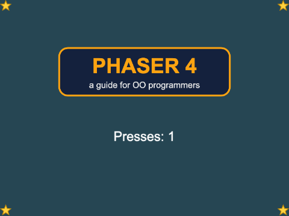
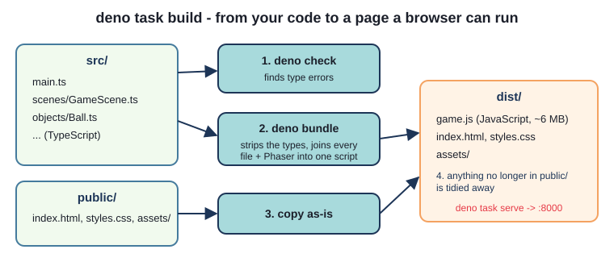
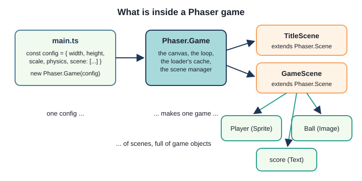
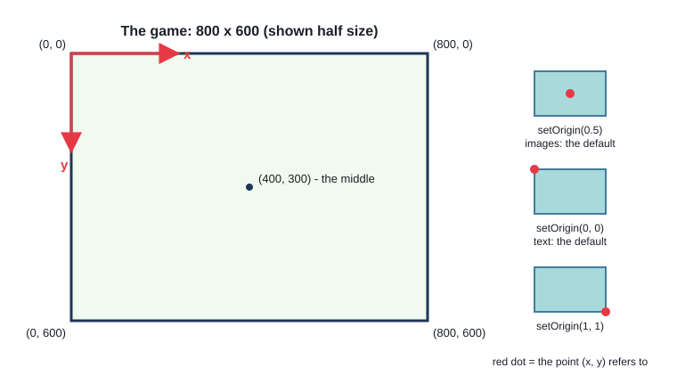
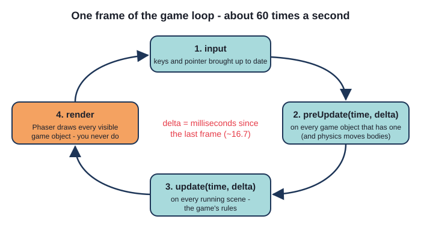
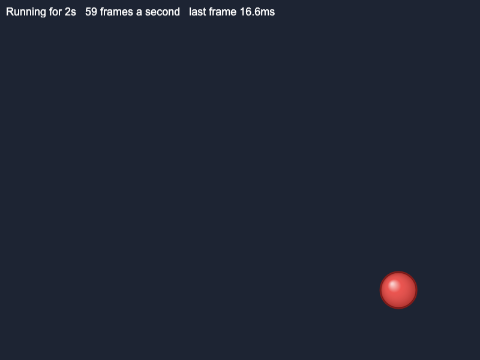

# Chapter 1
## Introduction: your first Phaser 4 game

Phaser 4 2D games, in TypeScript, with Deno



---

## Today

- what Phaser is - and what changed in Phaser 4
- building and running a project with Deno and Celbridge
- TypeScript, for Java programmers
- config, scenes, game objects
- coordinates and origins
- the game loop, and pixels per **second**

---

## What is Phaser?

- a free, open source framework for **2D games in the browser**
- you write the rules; Phaser draws, loops, loads, reads input, plays sound, runs physics
- **Phaser 4** (2025): a new drawing engine; the API you write is almost the same as Phaser 3
- most tutorials online are Phaser 3 - nearly always still right
- ships with TypeScript types: the compiler knows every Phaser class and method

---

## The tools

- **Deno** - runs TypeScript, type checks, bundles, serves. Nothing else to install
- the only package: **Phaser** (downloaded once, on the first build)
- **Celbridge** - `terminal.console` (buttons for each command) and `game.webview`

```
deno task build     type check + bundle into dist/
deno task serve     http://127.0.0.1:8000/
deno task dev       rebuild on every save
```

---

## What "build" does



The game must be **served**: browsers will not load pictures for a page opened from a file.

---

## TypeScript for Java programmers (1)

```ts
const SPEED = 200;           // never changes
let score = 0;               // changes - type worked out: number
let name: string = "Ada";    // type AFTER the name

7 / 2                        // 3.5 - there is only `number`
a === b                      // always ===, never ==

`Presses: ${this.presses}`   // template string
```

---

## TypeScript for Java programmers (2)

```ts
export class GameScene extends Phaser.Scene {
  private score: number;

  constructor() {
    super("GameScene");            // before using `this`
    this.score = 0;                // ALWAYS `this.`
  }

  override update(_time: number, delta: number): void {
    this.score = this.score + delta / 1000;
  }
}
```

`override` is compulsory here. `_time` = "not used".

---

## TypeScript for Java programmers (3)

```ts
private message!: Phaser.GameObjects.Text;   // "set later, in create()"

this.input.keyboard!.on("keydown-SPACE", () => {   // arrow function:
  this.changeColour();                             // `this` is still the scene
});

import { HelloScene } from "./scenes/HelloScene.ts";   // .ts on your own files
```

---

## Inside a Phaser game



---

## 1. The config - `main.ts`

```ts
const config: Phaser.Types.Core.GameConfig = {
  type: Phaser.AUTO,
  parent: "game",
  backgroundColor: "#1d2433",
  scale: { width: 800, height: 600,
           mode: Phaser.Scale.FIT, autoCenter: Phaser.Scale.CENTER_BOTH },
  scene: [HelloScene],
};
new Phaser.Game(config);
```

Always **800 x 600 inside**, scaled to fit the page.

---

## 2. Scenes

| Method | Called | For |
|---|---|---|
| `constructor()` | once | `super("HelloScene")` - its key |
| `preload()` | scene starts | load pictures and sounds |
| `create()` | all loaded | make game objects |
| `update(time, delta)` | every frame | the rules |

---

## 3. Game objects

```ts
preload(): void {
  this.load.image("logo", "assets/images/logo.png");
}

create(): void {
  this.add.image(400, 200, "logo");
  this.message = this.add.text(400, 380, "Press SPACE", { ... });
  this.message.setOrigin(0.5);
}
```

**You never draw.** Change a game object; Phaser draws it next frame.

---

## Coordinates and origins



---

## Try it: Hello Phaser

- open `ch01_hello_phaser`, build, serve, open `game.webview`
- click the game, press SPACE
- find the line that picks the colour - and the one that counts

```ts
this.input.keyboard!.on("keydown-SPACE", () => {
  this.changeColour();
});
```

---

## The game loop



---

## A game object that moves itself

```ts
export class Ball extends Phaser.GameObjects.Image {
  constructor(scene: Phaser.Scene, x: number, y: number,
              speedX: number, speedY: number) {
    super(scene, x, y, BALL_KEY);
    ...
    scene.add.existing(this);    // put it in the scene
  }

  preUpdate(_time: number, delta: number): void {
    const seconds = delta / 1000;
    this.x = this.x + this.speedX * seconds;
    this.y = this.y + this.speedY * seconds;
  }
```

---

## Why pixels per second?

- `delta` = milliseconds since the last frame (~16.7 at 60 fps)
- "4 pixels a frame" = 240/s at 60 Hz ... and **576/s** at 144 Hz
- speed x time = distance: the same game on every screen



---

## Summary

- **config** -> **game** -> **scenes** -> **game objects**
- Phaser calls `preload`, `create`, `update`; you never draw
- `setOrigin` says which point `(x, y)` means; `y` grows downwards
- events (`keyboard.on(...)`) for one-off actions
- the loop runs ~60 times a second; move by `speed * delta / 1000`

---

## Challenges

1. **Make it yours** - title, colours, text style
2. **Corner labels** - coordinates in each corner, using origins
3. **Reset key** - R puts everything back
4. **More balls** - five random balls, one loop
5. **Bounce counter** - the ball counts, the scene shows
6. **Steer the ball** - arrows push the ball, up to a top speed

Next: **Chapter 2 - a three-scene game**
