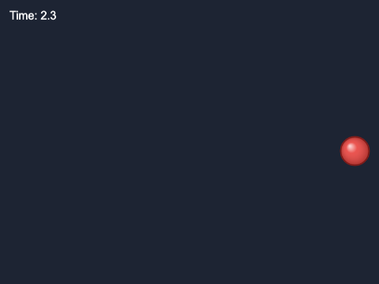
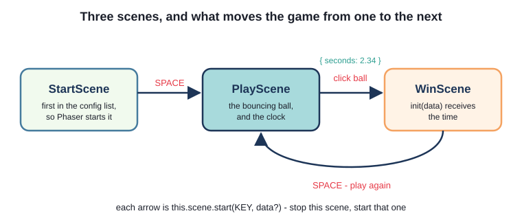
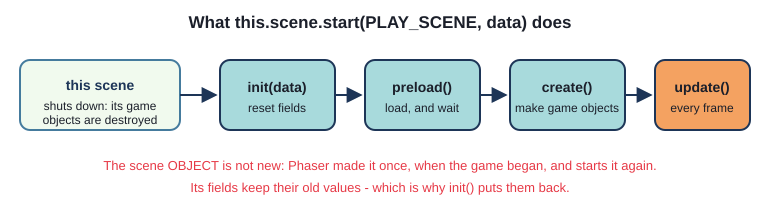
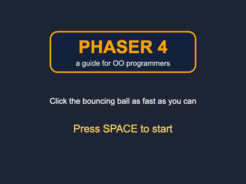
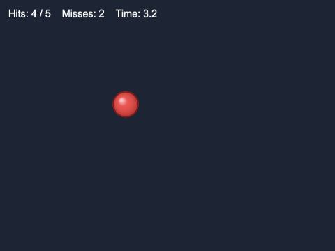

# Chapter 2
## A three-scene game

Start - play - win



---

## Today

- splitting a game into **scenes**
- moving between scenes; passing data along
- the trap: scenes are **reused**
- clicking on game objects
- `on` and `once`
- the **registry**: values every scene can see

---

## Three scenes



```ts
scene: [StartScene, PlayScene, WinScene],   // Phaser starts the FIRST
```

---

## Scene keys - as constants

```ts
// keys.ts
export const START_SCENE = "StartScene";
export const PLAY_SCENE = "PlayScene";
export const WIN_SCENE = "WinScene";

// PlayScene.ts
constructor() {
  super(PLAY_SCENE);
}
```

`start("Playscene")` fails **silently**. `start(PLAYSCENE)` fails the **build**.

---

## Starting a scene

```ts
this.input.keyboard!.once("keydown-SPACE", () => {
  this.scene.start(PLAY_SCENE);
});
```



---

## `on` or `once`?

- `on(event, fn)` - every time
- `once(event, fn)` - the first time, then stop listening
- a scene's listeners are removed when it shuts down
- use `once` when something should happen once: it says what you mean

---

## Load once, use everywhere

```ts
// StartScene - the first scene
preload(): void {
  this.load.image(LOGO_KEY, LOGO_FILE);
  this.load.image(BALL_KEY, BALL_FILE);
}
```

Loaded files belong to the **game**. `PlayScene` has no `preload()`.

---

## Clicking a game object

```ts
const ball = new Ball(this, 400, 300, speedX, speedY);

ball.setInteractive({ useHandCursor: true });

ball.on("pointerdown", () => {
  this.win();
});
```

- ignored by the pointer until `setInteractive()`
- **pointer** = mouse *or* finger
- `Ball` does not know it can be clicked - the scene decides

---

## Timing

```ts
create(): void {
  this.startTime = this.time.now;
}

override update(time: number, _delta: number): void {
  const seconds = (time - this.startTime) / 1000;
  this.timeText.setText(`Time: ${seconds.toFixed(1)}`);
}
```

`this.time` - the scene's clock, in milliseconds

---

## Try it: Click the Ball

- build, serve, play `ch02_click_the_ball`
- find the three `this.scene.start(...)` calls
- which scene loads the ball's picture? Which uses it?



---

## Passing data

```ts
// PlayScene
const data: WinData = { seconds: seconds };
this.scene.start(WIN_SCENE, data);

// WinScene
export interface WinData {
  seconds: number;
}

init(data: WinData): void {
  this.seconds = data.seconds;
}
```

`{ seconds: 2.3 }` - an **object literal**. `interface` - its shape, checked.

---

## The trap

```ts
private hits = 0;      // runs ONCE - when the object is made
```

- Phaser makes **one** `PlayScene`, and starts the **same object** again
- game objects: new every time (`create()`)
- fields: **whatever the last round left**

```ts
init(): void {         // runs EVERY time the scene starts
  this.hits = 0;
  this.misses = 0;
}
```

---

## The plus version



- 5 hits to win; faster each time
- misses cost a second
- sounds
- a best time

---

## Clicks on nothing

```ts
this.input.on("pointerdown",
  (_pointer: Phaser.Input.Pointer, over: Phaser.GameObjects.GameObject[]) => {
    if (over.length === 0) {
      this.miss();
    }
  });
```

`over` = the interactive game objects under the pointer

---

## Ask, don't reach in

```ts
// Ball
public speedUp(factor: number): void {
  this.speedX = this.speedX * factor;
  this.speedY = this.speedY * factor;
}

// PlayScene
this.ball.speedUp(SPEED_UP);
this.ball.teleport();
```

---

## The registry

```ts
// WinScene
const best: number | undefined = this.registry.get(BEST_TIME);
if (best === undefined || total < best) {
  this.registry.set(BEST_TIME, total);
}
```

- shared by **every scene**, for as long as the game runs
- `number | undefined` - a **union type**
- `{ ...style, fontSize: "64px" }` - **spread**: a copy, with changes

---

## Summary

- `scene: [...]` - Phaser starts the first
- `this.scene.start(KEY, data)` -> the new scene's `init(data)`
- keys as constants; data described by an `interface`
- scenes are reused: reset in `init()`
- `setInteractive()` + `"pointerdown"`; `this.input.on(...)` for every click
- `this.registry` - shared values

---

## Challenges

1. **Restyle** - blue ball, faster, new words
2. **Enter works too** - ENTER does what SPACE does
3. **Give up** - ESC back to the title
4. **Too slow!** - 5 seconds, then "Too slow!" - no fourth scene
5. **The decoy** - a blue ball worth two misses
6. **Top five** - a best-times table in the registry

Next: **Chapter 3 - Preloading**
