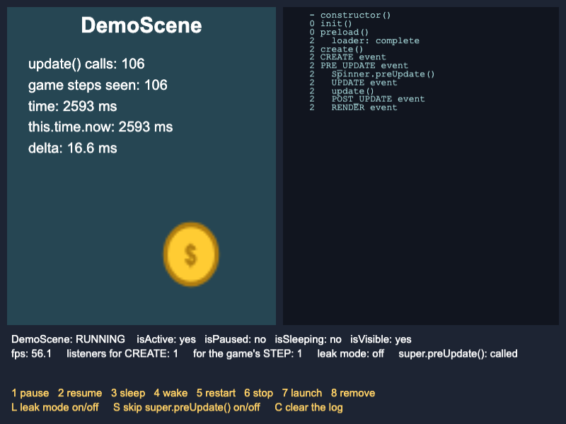
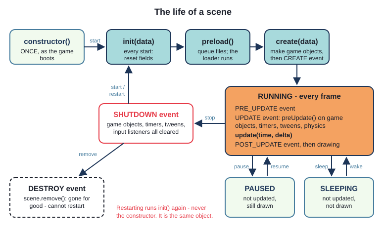
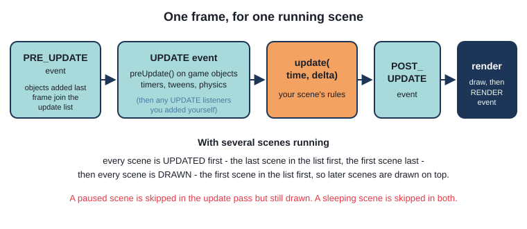
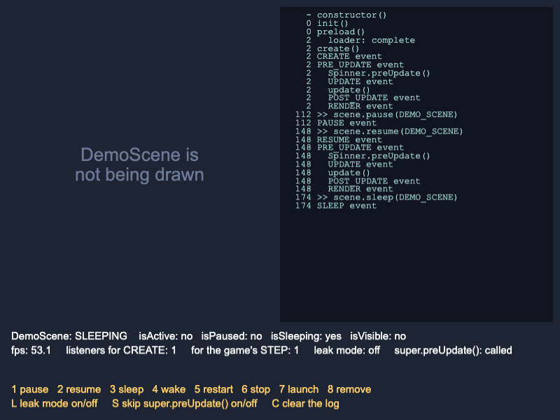
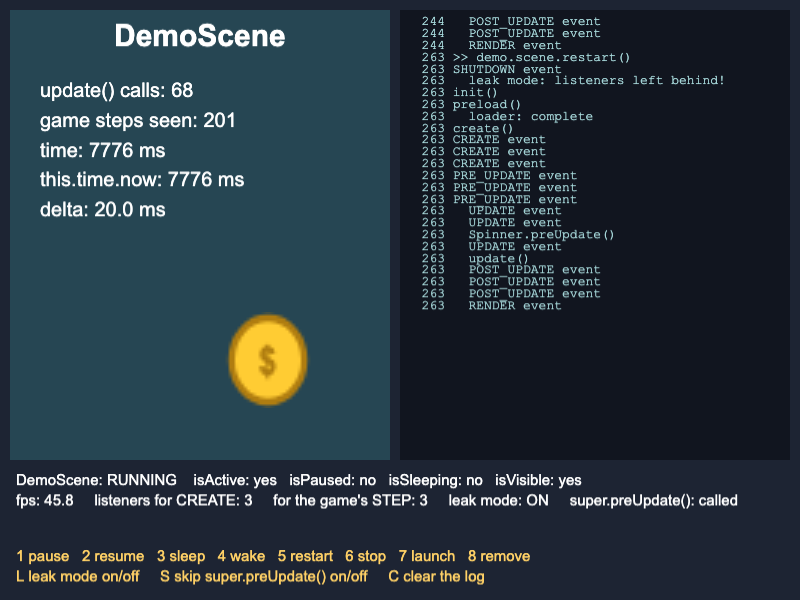
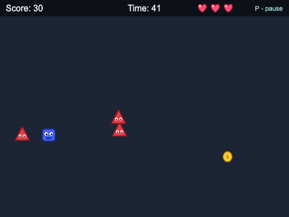
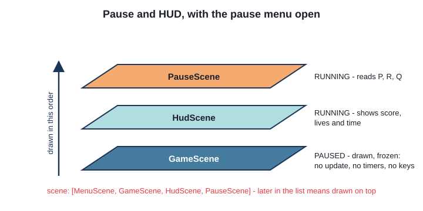
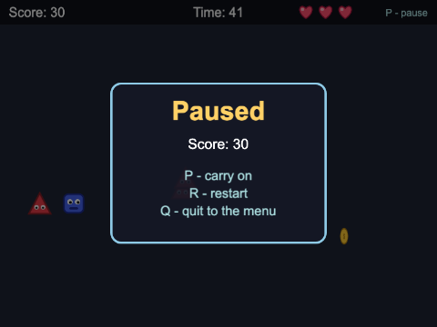

# Chapter 4
## The life of a scene

What Phaser calls, and when - and the scene manager's other powers



---

## Today

- the order: `constructor`, `init`, `preload`, `create`, `update`
- one frame, step by step; scene **events**
- a `Sprite`'s own `preUpdate` - and `super`
- `launch`, `pause`/`resume`, `sleep`/`wake`, `stop`, `remove`
- cleaning up: the listeners Phaser does **not** remove
- `time` vs `delta`; the frame rate
- a HUD and a pause menu, as scenes

---

## The life of a scene



---

## Once, or every start?

```ts
constructor() {
  super(DEMO_SCENE);
  eventLog.add("constructor()");
}

// Runs every time the scene starts: the place to reset fields
init(): void {
  this.log("init()");
  this.updates = 0;
  ...
}
```

- constructor: **once**, when the game boots
- `init()`, `preload()`, `create()`: **every** start - then the `CREATE` event
- restart: `init()` again, never the constructor. Same object

---

## Try it: Lifecycle Logger

- build, serve, open `ch04_lifecycle_logger`
- read the log from the top: what happens in frame 0? frame 2?
- press **5** (restart): what is missing from the log this time?
- press **S**: what does `super.preUpdate()` do?


---

## One frame, in order



`update()` comes after every game object has moved itself.

---

## Listening for scene events

```ts
this.events.on(Phaser.Scenes.Events.PAUSE, this.onPause, this);
this.events.on(Phaser.Scenes.Events.RESUME, this.onResume, this);
...
this.game.events.on(Phaser.Core.Events.STEP, this.onGameStep, this);
...
this.events.once(Phaser.Scenes.Events.SHUTDOWN, this.onShutdown, this);
```

- `on(event, method, context)` - the **context** is the object to call it on
- Java: `this::onPause` remembers its object. JavaScript's `this.onPause` does not
- the same three arguments take it off again: `off(event, method, context)`

---

## A Sprite's own `preUpdate`

`Coin.ts`
```ts
protected override preUpdate(time: number, delta: number): void {
  super.preUpdate(time, delta);
  ...
  this.age = this.age + delta;
  ...
}
```

- `Image` has no `preUpdate` - `Sprite` does: it moves the animation on
- `override` and `protected` - the compiler checks
- `super.preUpdate(...)` - **nobody** checks. Leave it out: moves, never animates

---

## The scene manager

| | Updated? | Drawn? | Game objects |
|---|---|---|---|
| `launch(key)` - alongside this one | yes | yes | new |
| `pause(key)` / `resume(key)` | no | **yes** | kept |
| `sleep(key)` / `wake(key)` | no | **no** | kept |
| `stop(key)` | no | no | destroyed |
| `remove(key)` | - | - | gone for good |

`start` stops **the caller**. `restart()` has no key.
Requests are **queued**: they happen as the scene manager's next update begins.

---

## Paused or asleep?



- **paused**: frozen, still on screen
- **asleep**: not drawn either
- both keep everything
- neither hears the keyboard - so the keys live in **another** scene

---

## Cleaning up

When a scene shuts down, Phaser clears:

- its game objects, timers, tweens, input listeners

It does **not** clear listeners on:

- the scene's own `this.events` (the object - and emitter - is reused)
- `this.game.events`, `this.registry.events`, another scene's `events`

**Whatever you add to an emitter that outlives your scene, take off in `SHUTDOWN`.**

---

## A leak you can see



Leak mode (L), then restart twice (5, 5):

- every event logged **three** times
- "game steps seen" climbs 3x too fast
- 3 listeners for `CREATE`, 3 for `STEP`

In a game: doubled scores, tripled sounds... then a crash.

---

## Time and delta

- `time` / `this.time.now` - the **game's** clock. Keeps going while a scene is paused
- `delta` - ms since the last frame. Only arrives while the scene **runs**
- timers (`this.time.delayedCall`) belong to the scene: they wait during a pause

```ts
fps: {
  target: 60,
  limit: 0,
},
```

`limit: 10` - the coin moves just as fast, in bigger steps

---

## Try it: Pause and HUD



```ts
scene: [MenuScene, GameScene, HudScene, PauseScene],
```

- arrows, collect coins, avoid triangles
- P pauses; R, Q from the menu
- which scenes are running when paused?

---

## Scenes side by side



```ts
const hudData: HudData = { score: this.score, lives: this.lives, seconds: this.secondsShown };
this.scene.launch(HUD_SCENE, hudData);
```

---

## The HUD listens

```ts
this.events.emit(SCORE_CHANGED, this.score);
```

```ts
const gameScene = this.scene.get(GAME_SCENE);
gameScene.events.on(SCORE_CHANGED, this.showScore, this);
...
this.events.once(Phaser.Scenes.Events.SHUTDOWN, () => {
  gameScene.events.off(SCORE_CHANGED, this.showScore, this);
  ...
});
```

`GameScene` emits; `HudScene` listens. `GameScene`'s emitter outlives the HUD - so the HUD cleans up.

---

## Pausing

```ts
private pauseGame(): void {
  const data: PauseData = { gameOver: false, title: "Paused", score: this.score };
  this.scene.launch(PAUSE_SCENE, data);
  this.scene.pause();
}
```

```ts
private carryOn(): void {
  this.scene.resume(GAME_SCENE);
  this.scene.stop();
}
```

`GameScene` pauses itself; `PauseScene` (running) resumes it



---

## Time that survives a pause

```ts
this.player.setAlpha(0.4);
this.time.delayedCall(SAFE_TIME, () => {
  this.safe = false;
  this.player.setAlpha(1);
});
```

Not `this.safeUntil = this.time.now + SAFE_TIME` - `this.time.now` keeps going during a pause.
Measure time with **timers** and **`delta`** (as `Coin` ages itself).

---

## Summary

- constructor **once**; `init`, `preload`, `create` every start; `update` every frame
- frame: `PRE_UPDATE`, `UPDATE` (objects' `preUpdate`), `update()`, `POST_UPDATE`, draw
- `Sprite` subclass: `protected override preUpdate` + `super.preUpdate(time, delta)`
- `launch` alongside; `pause` = frozen but drawn; `sleep` = hidden too; `stop`; `remove`
- scenes are drawn in list order; `bringToTop`
- clean up listeners on long-lived emitters in `SHUTDOWN`
- pausable time: timers and `delta`

---

## Challenges

1. **Count the frames drawn** - `RENDER` events vs `update()` calls
2. **Thirty frames a second** - `fps.limit`, and a real frame counter on the HUD
3. **How long was I away?** - time paused, counted once
4. **Settings** - a settings scene; the pause menu sleeps; H hides the HUD
5. **Fade in, fade out** - camera fades between scenes
6. **Auto-pause, without a leak** - `BLUR`/`HIDDEN`, proved leak-free

Next: **Chapter 5 - Audio**
