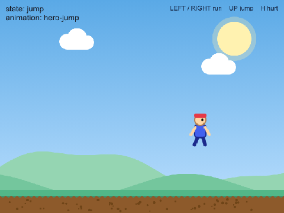
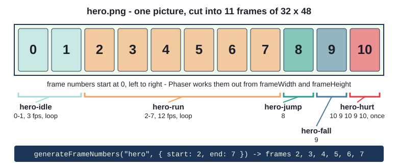
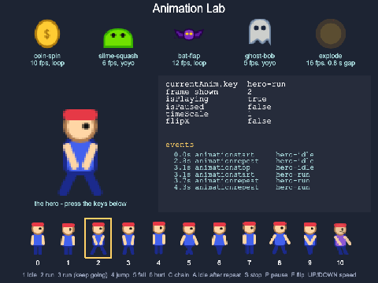
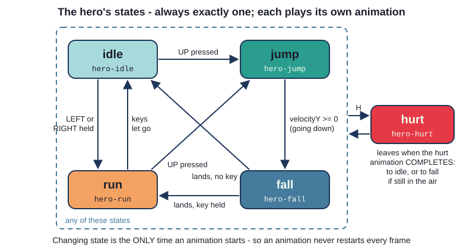
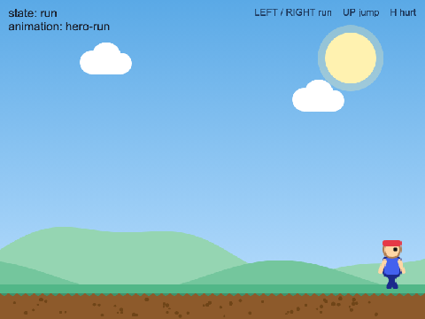
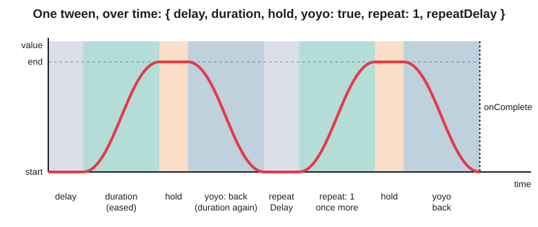
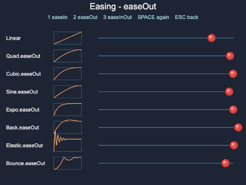
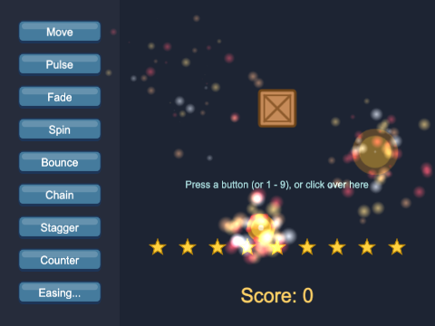

# Chapter 7
## Animations

Frames, tweens and particles



---

## Today

- sprite sheets become **animations**: `this.anims.create`
- playing, chaining and listening to animations
- `setFlipX`, and a **state machine** for the hero
- **tweens**: smooth changes to any number
- easing, chains, stagger, counters
- **particles**: bursts of sparks

---

## Two kinds of animation

| Frame animation | Tween |
|---|---|
| changes **which picture** a sprite shows | changes **a number** smoothly |
| frames from a sprite sheet | `x`, `y`, `scale`, `alpha`, `angle`, ... |
| a running hero, a spinning coin | a sliding menu, a fading popup |
| `this.anims`, `sprite.play(key)` | `this.tweens.add({...})` |

A character usually needs both.

---

## Sprite sheets



```ts
this.load.spritesheet(HERO_SHEET, HERO_FILE, { frameWidth: HERO_WIDTH, frameHeight: HERO_HEIGHT });
```

---

## Making an animation

```ts
this.anims.create({
  key: HERO_RUN,                        // the animation's own name
  frames: this.anims.generateFrameNumbers(HERO_SHEET, { start: 2, end: 7 }),
  frameRate: 12,                        // frames per second
  repeat: -1,                           // -1: for ever
});

this.anims.create({
  key: HERO_HURT,
  frames: this.anims.generateFrameNumbers(HERO_SHEET, { frames: [10, 9, 10, 9, 10] }),
  frameRate: 8,                         // no repeat: plays once, then COMPLETES
});
```

Also: `yoyo: true`, `repeatDelay`, `delay`, `duration`

---

## Once, for the whole game - on a Sprite

- `this.anims` is the **game's** animation manager, in every scene
- make animations **once**, in the preload scene
- twice? `AnimationManager key already exists: hero-idle`

```ts
const sprite = this.add.sprite(x, 72, sheet);    // a Sprite can play
sprite.play(anim);

this.add.image(x, 505, HERO_SHEET, frame)        // an Image shows ONE frame
```

`image.play(...)` - `Property 'play' does not exist on type 'Image'`

---

## play restarts

```ts
// play() starts the animation again from its first frame - even if it is already playing
keyboard.on("keydown-TWO", () => this.hero.play(HERO_RUN));
// play(key, true): "ignore this if that animation is already playing"
keyboard.on("keydown-THREE", () => this.hero.play(HERO_RUN, true));
```

- `play(key)` in `update()` = stuck on the first frame for ever
- lab: hold **2**, then hold **3**

---

## Controlling, and listening

```ts
this.hero.play(HERO_HURT);
this.hero.chain(HERO_IDLE);                    // then idle, automatically

keyboard.on("keydown-A", () => this.hero.anims.playAfterRepeat(HERO_IDLE));
this.hero.anims.timeScale = Math.min(this.hero.anims.timeScale * 2, MAX_TIME_SCALE);

this.hero.on(Phaser.Animations.Events.ANIMATION_COMPLETE_KEY + HERO_HURT, () => {
  this.addToLog("  (hurt is over)");
});
```

`repeat: -1` never completes - no `ANIMATION_COMPLETE`

---

## Try it: the Animation Lab

- keys **1-6**: play each animation
- **C** chain, **A** after repeat, **S** stop, **P** pause
- **F** flip, **UP/DOWN** speed
- watch the **event log**



---

## Facing both ways - and a state machine

```ts
if (this.velocityX !== 0) {
  this.setFlipX(this.velocityX < 0);   // frames face right; mirrored = left
}
```



---

## States in code

```ts
export type HeroState = "idle" | "run" | "jump" | "fall" | "hurt";

const ANIMATIONS: Record<HeroState, string> = {
  idle: HERO_IDLE,
  run: HERO_RUN,
  ...
};

private changeState(next: HeroState): void {
  if (next === this.currentState) {
    return;               // already in that state: do NOT restart its animation
  }
  this.currentState = next;
  this.play(ANIMATIONS[next]);
}
```

The **only** place the state - and the animation - changes

---

## Hurt: ended by the animation

```ts
public hurt(): void {
  ...
  this.changeState("hurt");
  this.setTint(HURT_TINT);

  this.once(Phaser.Animations.Events.ANIMATION_COMPLETE_KEY + HERO_HURT, () => {
    this.clearTint();
    this.changeState(this.isOnGround() ? "idle" : "fall");
  });
}

protected override preUpdate(time: number, delta: number): void {
  super.preUpdate(time, delta);   // leave out: frozen on one frame, NO error
```

---

## Try it: Hero Animations

- LEFT / RIGHT, UP, and **H**
- watch the state at the top
- change the hurt `frameRate` - what else changes?
- delete `super.preUpdate` - then put it back



---

## Tweens

```ts
this.tweens.add({
  targets: this.crate,         // one object, or an array
  x: this.restX,               // the values, and where they end up
  y: this.restY,
  duration: 800,               // milliseconds
  ease: "Cubic.easeInOut",
});
```

- returns at once; Phaser does the changing, every frame
- relative values: `angle: "+=360"`
- `onComplete: () => popup.destroy()` - effects clean up after themselves

---

## Yoyo, hold, repeat, delay



`repeat: 2` = three times in all. `repeat: -1` = for ever.

---

## Easing



- `easeIn` - slow start (leaving)
- `easeOut` - slow finish (arriving)
- `easeInOut` - both (moving)
- `Back`, `Elastic`, `Bounce` - character
- misspelled ease = **linear**, silently

---

## Chains, stagger, counters

```ts
this.tweens.chain({
  targets: this.crate,
  tweens: [
    { y: this.restY - 120, duration: 400, ease: "Quad.easeOut" },
    { angle: 360, duration: 500, ease: "Cubic.easeInOut" },
    { y: this.restY, duration: 700, ease: "Bounce.easeOut" },
    ...
  ],
});
```

- **stagger**: one tween, many targets - `delay: this.tweens.stagger(60),`
- **counter**: a plain number - `this.tweens.addCounter({ from, to, onUpdate })`
- **no fighting**: `this.tweens.killTweensOf(this.crate);` before starting another

---

## Particles

```ts
this.sparks = this.add.particles(0, 0, PARTICLE_KEY, {
  speed: { min: 80, max: 360 },            // random in a range
  ...
  scale: { start: 2.5, end: 0 },           // changes over its life
  ...
  tint: [0xffd166, 0xf4a261, 0xe63946, 0xffffff],   // one of these
  ...
  emitting: false,                         // made ONCE, silent...
});
this.sparks.explode(SPARKS, x, y);      // ...until a burst

boom.once(Phaser.Animations.Events.ANIMATION_COMPLETE, () => {
  boom.destroy();                       // the explosion sprite removes itself
});
```



---

## Summary

- `this.anims.create` + `generateFrameNumbers` - once, for the game
- only a `Sprite` plays; `play(key, true)`; `chain`, `playAfterRepeat`, `timeScale`
- animation **events**; `ANIMATION_COMPLETE` needs a finite `repeat`
- `super.preUpdate` in a `Sprite` subclass
- a **state machine**: one state, one place that changes it
- `this.tweens.add` / `chain` / `stagger` / `addCounter` / `killTweensOf`
- `this.add.particles(...)`, `emitting: false`, `explode(n, x, y)`

---

## Challenges

1. **Different speeds** - new frame rates; a `hero-sprint` on key 7
2. **Coin run** - spinning coins to collect, with a floating tween
3. **Title sequence** - one `tweens.chain`, restartable
4. **Sparkle trail** - particles that follow the pointer
5. **Speed you can see** - acceleration; stride matched with `timeScale`
6. **Stomp** - patrolling slimes: squash from above, hurt from the side

Next: **Chapter 8 - Collisions**
