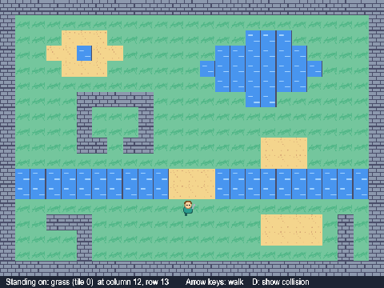
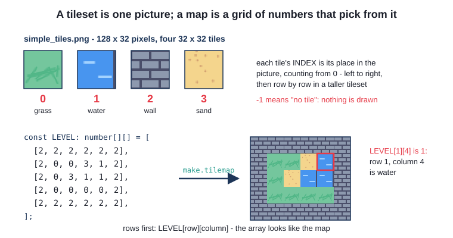
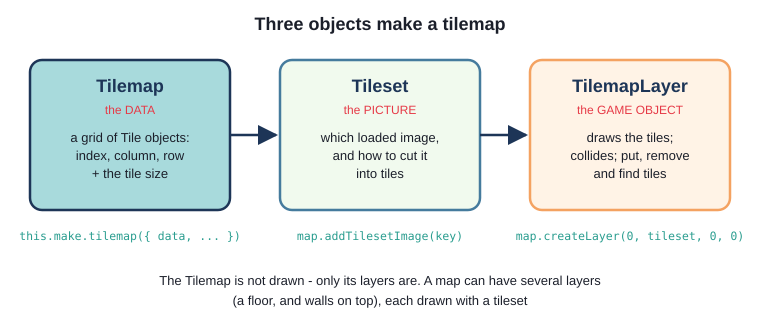
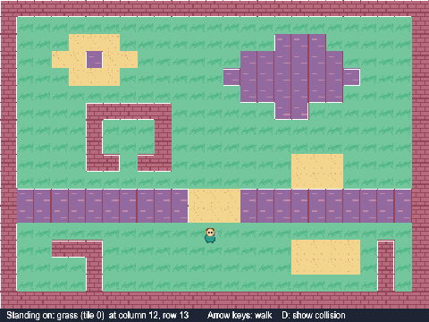
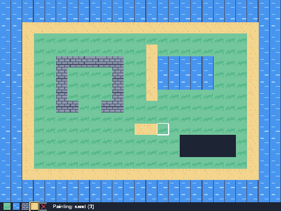
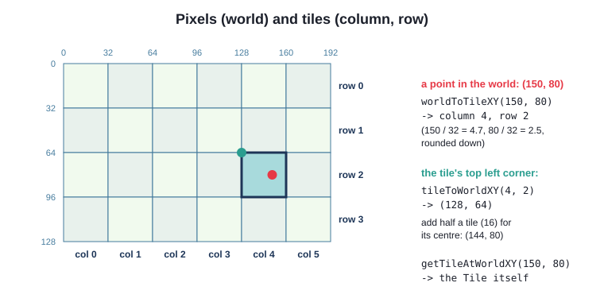
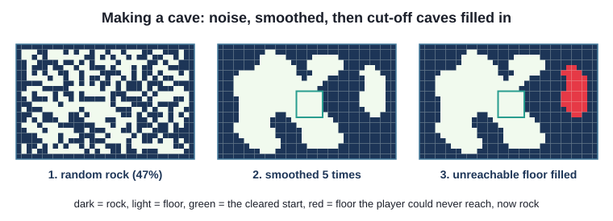
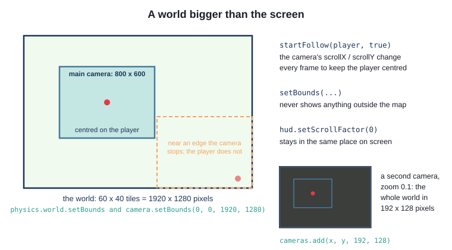
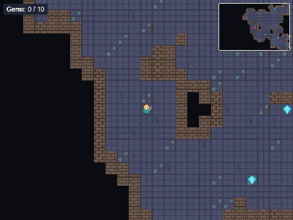
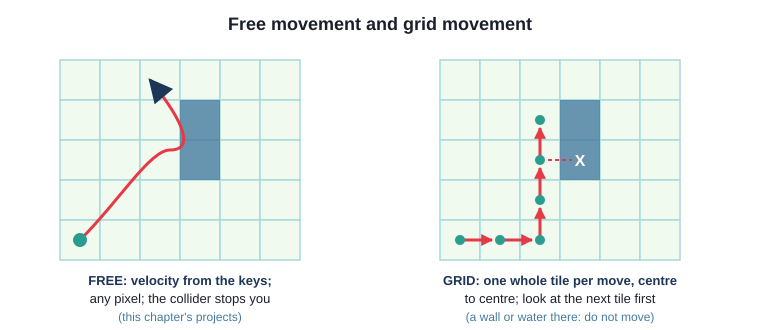

# Chapter 10
## Tilemaps

Worlds built from tiles - in code



---

## Today

- why games use **tiles**; tilesets and tile **indexes**
- a map from a **2D array**: map, tileset, layer
- **collision** by tile index
- finding tiles; **pixels and tiles**
- changing the map while the game runs
- a world **bigger than the screen**: camera follow, bounds, a minimap
- free movement or **grid** movement?

---

## Why tiles?

- **memory**: one small picture, reused. A 60 x 40 level as one picture: ~10 MB
- **level design**: a level is a grid of numbers - change a number, change the level
- **rules**: "is this a wall?" is a question about a number, not about pixels

Tilesets in the library (all 32 x 32): `simple_tiles.png` (4), `dungeon_tiles.png` (16),
`platform_tiles.png` (16)

---

## Tiles, indexes, and the level



`LEVEL[row][column]` - **rows first**. `-1` = no tile

---

## Three objects make a tilemap



---

## Five steps

```ts
const map = this.make.tilemap({ data: LEVEL, tileWidth: TILE_SIZE, tileHeight: TILE_SIZE });

const tileset = map.addTilesetImage(TILES_KEY)!;

this.layer = map.createLayer(0, tileset, 0, 0) as Phaser.Tilemaps.TilemapLayer;

this.layer.setCollision([WATER, WALL]);

this.physics.add.collider(this.player, this.layer);
```

- `!` - "not `null` this time"
- `as` - `createLayer` could also make a GPU layer; we know it did not

---

## Collision

```ts
// a body smaller than the picture, centred on it
this.setSize(BODY_SIZE, BODY_SIZE);
```

- a 32 x 32 body through a 32-pixel door: pixel-perfect or stuck
- `setCollision` is **by index**, and remembered - tiles put later collide too
- press **D**: `layer.renderDebug(graphics, {...})`



---

## Try it: Array Map - which tile am I on?

```ts
const tile = this.layer.getTileAtWorldXY(this.player.x, this.player.y);
if (tile) {
  const name = TILE_NAMES[tile.index];
  ...
```

- `tile.x`, `tile.y` - column and row, **in tiles**; `pixelX`, `pixelY` - pixels
- walk round `ch10_array_map`; watch the strip; press D
- put a wall in the doorway (one number in `level.ts`)

---

## The tile painter: put and remove

```ts
this.layer = map.createBlankLayer("ground", tileset)!;
this.layer.fill(GRASS);
...
if (this.current === EMPTY) {
  this.layer.removeTileAt(cell.x, cell.y);          // leaves a hole: nothing is drawn there
} else {
  this.layer.putTileAt(this.current, cell.x, cell.y);
}
```

- `EMPTY` is `-1`: no tile. `0` is grass!



---

## Pixels and tiles



`pointer.worldX`, not `pointer.x` - it allows for the camera

---

## Save, load, print

```ts
localStorage.setItem(SAVE_KEY, JSON.stringify(this.toArray()));
...
let data: unknown = null;
...
if (!this.isMap(data)) {
  ...
}
this.layer.putTilesAt(data, 0, 0);
...
private isMap(value: unknown): value is number[][] {
```

- `unknown` - could be anything: check it

- `value is number[][]` - a **type guard**
- P prints the map as TypeScript - paste it into `ch10_array_map`

---

## Try it: Tile Painter

- paint an island: 1-4 choose, 0 erases, drag to paint
- S, C, L - save, clear, load
- P, then look in the browser's console (F12)
- paste the result into `ch10_array_map/src/level.ts` and walk round it

---

## A cave made in code



- `Cave` is plain data - no Phaser. **Model**, not view
- the scene decides what it looks like

---

## Two layers

```ts
const floor = map.createBlankLayer("floor", tileset)!;
floor.weightedRandomize([
  { index: FLOOR, weight: 12 },
  { index: FLOOR_CRACKED, weight: 1 },
  { index: FLOOR_MOSSY, weight: 1 },
]);

const walls = map.createBlankLayer("walls", tileset)!;
walls.putTilesAt(this.wallTiles(cave), 0, 0);
walls.setCollisionByExclusion([EMPTY]);       // every tile that is not empty collides
```

Walls: `-1` where the cave is open, so the floor shows through

---

## The camera

```ts
this.physics.world.setBounds(0, 0, width, height);
this.cameras.main.setBounds(0, 0, width, height);
this.cameras.main.startFollow(this.player, true);     // true: round to whole pixels - no shimmer
this.hudText.setScrollFactor(0);        // stays put on the screen while the camera moves
```



---

## A minimap is just another camera

```ts
const minimap = this.cameras.add(MINI_X, MINI_Y, MINI_WIDTH, MINI_HEIGHT);
minimap.setZoom(MINI_ZOOM);
minimap.centerOn(width / 2, height / 2);

this.marker = this.add.circle(this.player.x, this.player.y, MARKER_RADIUS, 0xe63946);
this.cameras.main.ignore(this.marker);
minimap.ignore([frame, this.hudText]);
```

Every camera draws everything - unless told to `ignore` it

---

## Try it: Scrolling World

- find the ten gems; R for a new cave
- the same `Player` class as `ch10_array_map` - unchanged
- what happens without `minimap.ignore(...)`? Without `setScrollFactor(0)`?



---

## Free or grid movement?



Zelda? Sokoban? Pac-Man? A roguelike?

---

## Summary

- tileset = one picture; index from 0; `-1` = empty; `data[row][column]`
- `make.tilemap` (data) -> `addTilesetImage` (picture) -> `createLayer` (game object)
- `setCollision` + `physics.add.collider`
- `getTileAt(WorldXY)`, `worldToTileXY`, `tileToWorldXY` (top left corner)
- `putTileAt`, `removeTileAt`, `putTilesAt`, `fill`, `weightedRandomize`
- `camera.setBounds`, `startFollow`, `setScrollFactor(0)`, `cameras.add`, `ignore`

---

## Challenges

1. **A new island** - moat, second bridge, maze, new start
2. **Sand slows you down** - half speed on sand
3. **Eyedropper** - right-click picks up a tile
4. **Treasure tiles** - chests in the map, collected by walking into them
5. **A map from strings** - `#`, `~`, `.`, `s`, `@`
6. **Grid movement** - one tile at a time, with tweens

Next: **Chapter 11 - Tilemaps with Tiled**
