# Chapter 11
## Tilemaps with Tiled

Draw the level. Load the level.

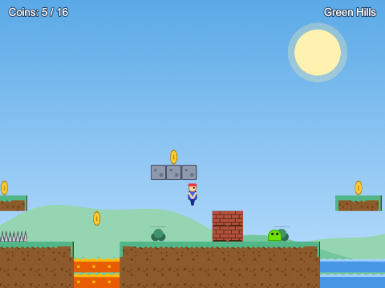

---

## Today

- **Tiled**: tilesets, tile layers, object layers, custom properties
- `.tmx` (source) and `.tmj` (what the game loads)
- GIDs
- `tilemapTiledJSON`, `make.tilemap`, `addTilesetImage`, `createLayer`
- solid tiles **by property**
- reading objects: spawn points, coins, enemies, doors
- the level is **data**, not code

---

## Tiled

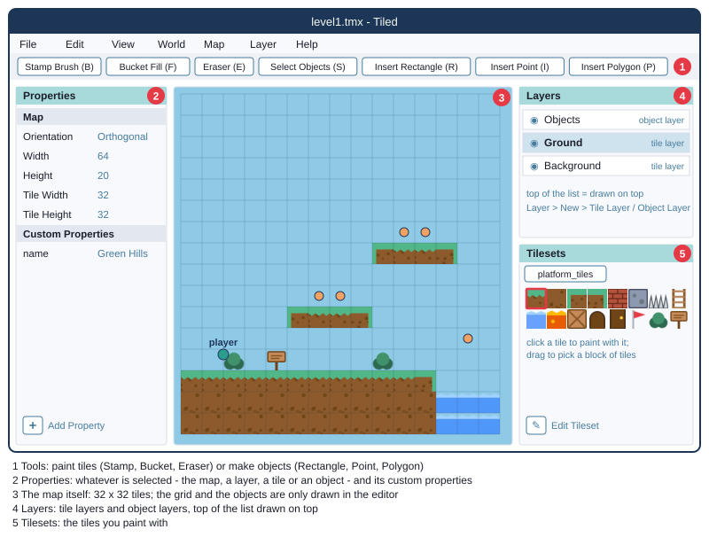

Free, mapeditor.org - Windows, macOS, Linux

---

## A new map, a new tileset

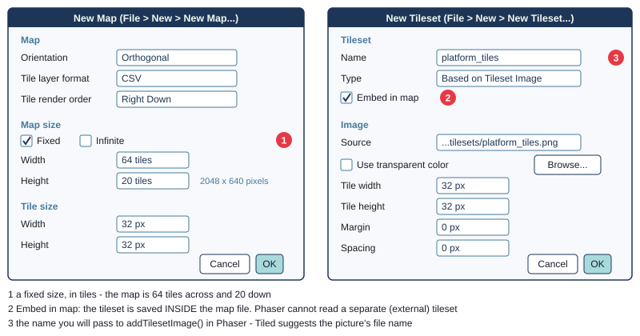

Orthogonal · **fixed** size · CSV · tileset **embedded in map**

---

## Layers, and painting

- the map starts with one tile layer: rename it **Ground**
- Layer > New > Tile Layer: **Background**, below Ground
- top of the Layers list = drawn on top
- Stamp Brush (B), Bucket Fill Tool (F), Eraser (E)
- **check which layer is selected before you paint**

---

## Custom properties on tiles

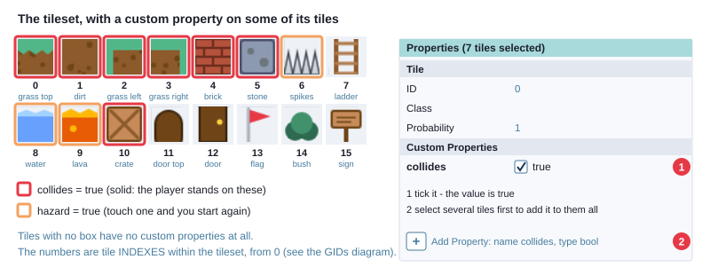

Edit Tileset → select tiles → **+** → `collides`, **bool**, ticked

---

## Objects

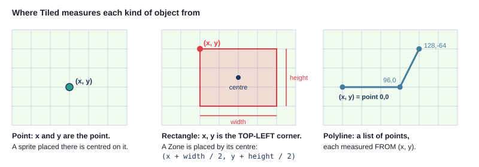

Layer > New > Object Layer · Insert Point (I) · Insert Rectangle (R) · **Name** them: `player`, `coin`, `enemy`, `goal`

---

## Save, then export

```
tiled/level1.tmx                    File > Save          - you edit this
public/assets/maps/level1.tmj       File > Export As...  - the game loads this
```

- after the first time: **File > Export** (Ctrl+E / Cmd+E)
- then **build**, then **refresh**
- "I changed the map and nothing happened" = not exported

---

## Inside a .tmj

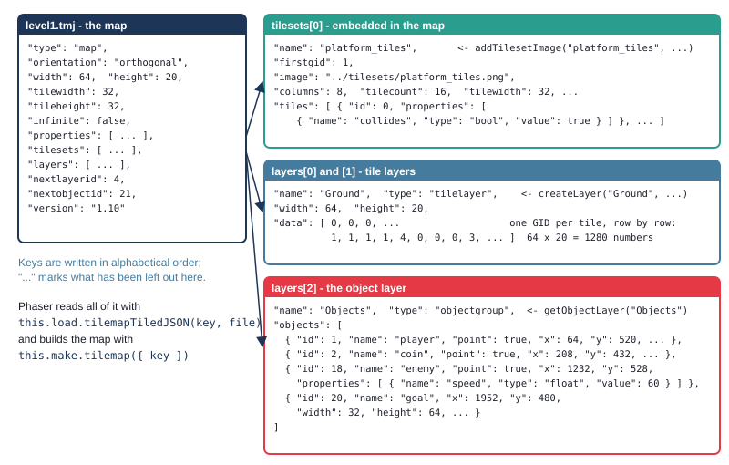

---

## GIDs

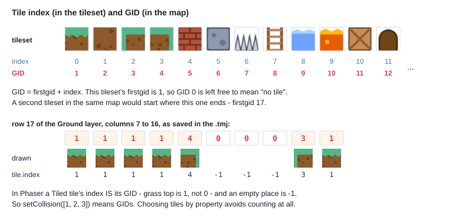

---

## Loading the map

```ts
// preload()
this.load.tilemapTiledJSON(MAP_KEY, MAP_FILE);   // the .tmj
this.load.image(TILES_KEY, TILES_FILE);          // its picture - separately

// create()
this.map = this.make.tilemap({ key: MAP_KEY });
const tiles = this.map.addTilesetImage(TILESET_NAME, TILES_KEY);
this.map.createLayer(BACKGROUND_LAYER, tiles);
this.ground = this.map.createLayer(GROUND_LAYER, tiles) as Phaser.Tilemaps.TilemapLayer;
this.ground.setCollisionByProperty({ collides: true });
```

`addTilesetImage(name in Tiled, key in Phaser)`

---

## The names must match

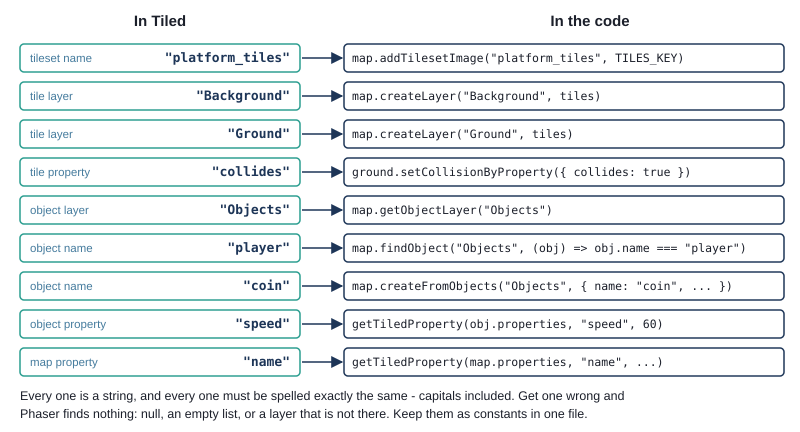

---

## Press D

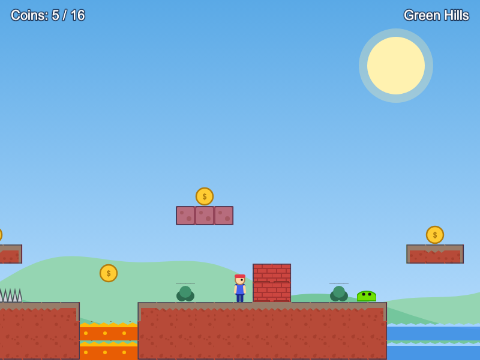

```ts
tiles.some((tile) => tile.properties.hazard === true);   // any tile property
```

---

## Three ways into an object layer

```ts
// one object
const spawn = this.map.findObject(OBJECTS_LAYER, (obj) => obj.name === "player");

// a Sprite for every match
const coinSprites = this.map.createFromObjects(OBJECTS_LAYER, { name: "coin", key: COIN_KEY });

// all of them, to do as you like with
for (const obj of objectLayer.objects) {
  if (obj.name === "enemy") {
    const speed = getTiledProperty(obj.properties, "speed", DEFAULT_SLIME_SPEED);
```

Object and map properties: a list of `{ name, type, value }`

---

## Try it: Tiled Level

- build, serve, play `ch11_tiled_level`
- open `tiled/level1.tmx` in Tiled
- change a slime's `speed`; add a platform and two coins
- export, build, refresh

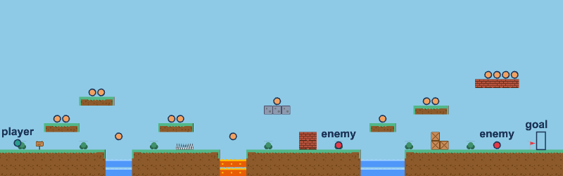

---

## Doors between maps

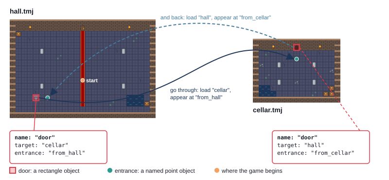

---

## One scene, restarted

```ts
init(data: Partial<RoomData>): void {
  this.room = {
    map: data.map ?? FIRST_ROOM.map,
    entrance: data.entrance ?? FIRST_ROOM.entrance,
  };
  this.leaving = false;
}
// preload(): only this room's map - skipped if already in the cache
this.load.tilemapTiledJSON(this.room.map, MAPS_FOLDER + this.room.map + MAP_EXTENSION);

// goThrough(door), after the fade:
const next: RoomData = { map: door.target, entrance: door.entrance };
this.scene.restart(next);
```

---

## Try it: Tiled Doors

- down the stairs; back through the cellar door
- where is the list of rooms? (there isn't one)
- why are the entrance points away from the doors?

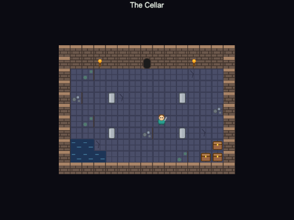

---

## Summary

- Tiled: tilesets, tile layers, object layers, custom properties
- edit `.tmx`, **export** `.tmj`; embedded tileset, fixed size, CSV
- GID = firstgid + index; in Phaser, `tile.index` is the GID, empty = -1
- `tilemapTiledJSON` → `make.tilemap({ key })` → `addTilesetImage` → `createLayer`
- `setCollisionByProperty({ collides: true })`; `tile.properties`
- `findObject`, `filterObjects`, `createFromObjects`, `getObjectLayer(...).objects`
- names are the contract: constants, spelled exactly

---

## Challenges

1. **Above the player** - a layer drawn over the player
2. **Gems** - coins with a `value` property
3. **A third room** - behind the closed door (how much code?)
4. **Signposts** - rectangles with messages
5. **Moving platforms** - along a polyline
6. **Spinning coins, as tiles** - a second tileset, animated in Tiled

Next: **Chapter 12 - Higher or lower**
