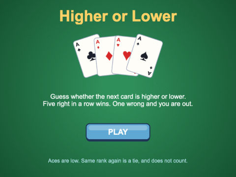
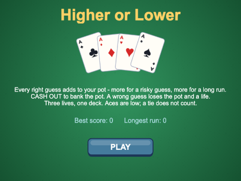

# Chapter 12
## Higher or lower

One game, three versions


---

## Today

- what makes a guessing game fun
- a `Card`, a `Deck`, the rules - **no Phaser**
- a `CardSprite` and a `Button` - **the view**
- a proper shuffle (and a broken one)
- game state: ignoring the player at the right moments
- a flip made of two tweens
- risk, reward, and cashing out

---

## What makes it fun?

The luck is the same in all three versions. So why is one more fun?

- **risk** - "higher" on a 2 is safe; on a jack it is a gamble. Show it; pay for it
- **streaks** - five in a row feels like skill. Let the player lose it
- **the reveal** - the half-second while the card turns *is* the game

Rules: aces low (1); a tie does not count

---

## Try it: simple


- `ch12_higher_or_lower_simple`
- H = higher, L = lower
- five right in a row wins
- wrong: back to zero
- one scene, one small class

---

## A card is data

```ts
export type Suit = "clubs" | "diamonds" | "hearts" | "spades";

export class Card {
  public readonly suit: Suit;
  public readonly rank: number; // 1 = ace, 2 - 10, 11 = jack, 12 = queen, 13 = king
  ...
  public get value(): number {
    return this.rank;
  }
```

- union of string literals: only those four
- `readonly` = Java's `final`; `get` = read like a field
- no picture, no position, no Phaser

---

## Which picture?


```ts
return SUITS.indexOf(card.suit) * 13 + (card.rank - 1);
```

---

## The rules - and when to listen

```ts
type Outcome = "right" | "wrong" | "tie";
type GameState = "waiting" | "revealing" | "won";

private guess(guess: Guess): void {
  if (this.state !== "waiting") {
    return; // a card is still being revealed, or the game is over
  }
  this.state = "revealing";
  ...
  const outcome = this.judge(guess, this.currentCard, next);
```

`judge()` only looks at cards. The scene decides what each outcome *looks* like.

---

## Model and view


---

## Try it: intermediate



- `ch12_higher_or_lower_intermediate`
- a shuffled deck: no repeats
- cards flip; buttons; five lights
- one wrong and you are out
- find: `Card.ts`, `Deck.ts`, `rules.ts` - which import Phaser?

---

## Fisher-Yates

```ts
public shuffle(): void {
  for (let i = this.cards.length - 1; i > 0; i--) {
    const j = Math.floor(Math.random() * (i + 1)); // 0 to i, inclusive
    const swap = this.cards[i];
    this.cards[i] = this.cards[j];
    this.cards[j] = swap;
  }
}
```

- fill each place, from the back, with a fair pick of what is left
- one pass; every order equally likely
- `Phaser.Utils.Array.Shuffle` does the same

---

## The shuffle you will find online

```ts
cards.sort(() => Math.random() - 0.5); // DON'T
```


---

## A flip is two tweens


```ts
this.scene.tweens.chain({
  targets: this,
  tweens: [
    {
      scaleX: 0,
      duration: FLIP_TIME / 2,
      ease: "Sine.easeIn",
      onComplete: () => {
        ...
      },
    },
    { ... },
  ],
  onComplete: onComplete,
});
```

The first tween's `onComplete` calls `showFace(card)` (or `showBack()`) while the card is edge-on

---

## A button

```ts
export class Button extends Phaser.GameObjects.Container {
  ...
  this.add([this.background, this.label]);
  this.background.setInteractive({ useHandCursor: true });

  this.background.on("pointerover", () => {
    this.background.setTexture(BUTTON_OVER_KEY);
  });
  ...
  this.background.on("pointerup", () => {
    ...
    onClick();
```

- a **Container**: one object holding a picture and a label
- normal / over / down pictures; act on **pointerup**
- the caller passes in what to do

---

## The state machine


`reveal()` runs from the flip's `onComplete`: see the card **first**, then hear the result

---

## Try it: advanced



- `ch12_higher_or_lower_advanced`
- one deck, three lives
- a **pot**: more for risk, more for a long run
- **cash out** (C) to bank it
- wrong: lose the pot **and** a life

---

## Paying for risk

```ts
export function winningRanks(guess: Guess, current: Card): number {
  if (guess === "higher") {
    return 13 - current.value;
  }
  return current.value - 1;
}

export function pointsFor(multiplier: number, inARow: number): number {
  return BASE_POINTS * multiplier * inARow;
}
```

- `riskMultiplier()`: 7+ winning ranks x1, 4-6 x2, 1-3 x3, 0 = impossible
- the buttons show it: `HIGHER  x1`, `LOWER  x3`

---

## The pot and cash out


- `score` - banked, safe
- `pot` - at risk
- only a score: always guess the likely way. No decisions
- with a pot: **when do you stop?**

```ts
this.score = this.score + this.pot;
this.pot = 0;
this.inARow = 0;
```

---

## Dealing, history, records, polish

```ts
const oldCurrent = this.currentSprite;
this.currentSprite = this.nextSprite;
this.nextSprite = oldCurrent;
```

- two sprites swap jobs - they are references, as in Java

- `HistoryRow` - a `Container`: tell every card where it belongs
- `Records` - best score and longest run in local storage
- floating "+30", pulses, sparkles, a shake, a heart that pops

---

## Summary

- risk, streaks, the reveal
- **model** (`Card`, `Deck`, `rules.ts`) apart from **view** (`CardSprite`, `Button`)
- unions of strings for suits, guesses, outcomes, states
- Fisher-Yates - not `sort(random)`
- a `state` checked at the top of every input
- flip = two tweens of `scaleX`, frame changed in between
- a pot you can lose makes the score interesting

---

## Challenges

1. **Aces high** - an ace beats a king
2. **Cards left** - count down the deck
3. **Probability hint** - the real chance, from the deck
4. **Jokers wild** - two jokers, drawn in code
5. **Double or nothing** - red doubles, black loses
6. **The computer plays the odds** - press A and watch

Next: **Chapter 13 - Memory match**
