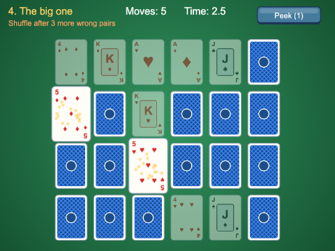
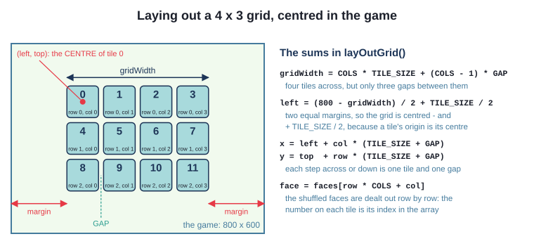
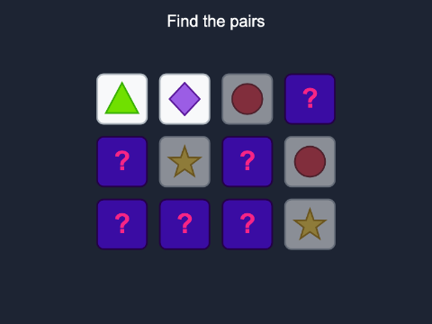
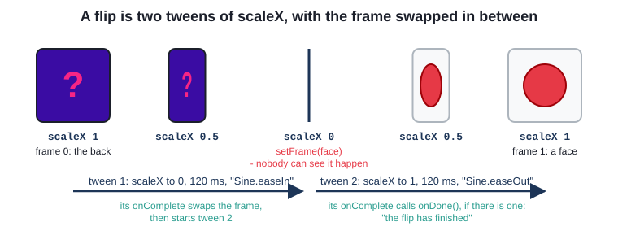
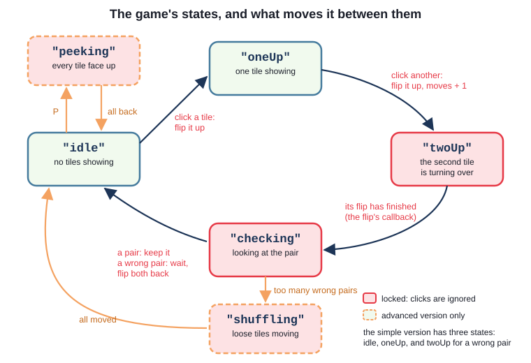
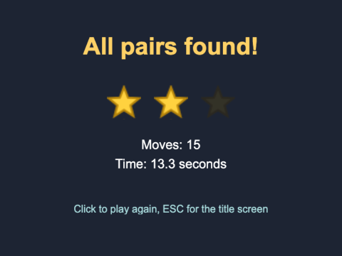
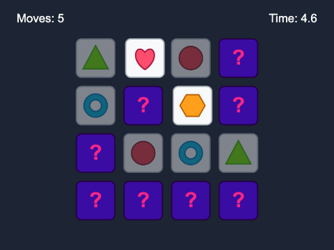
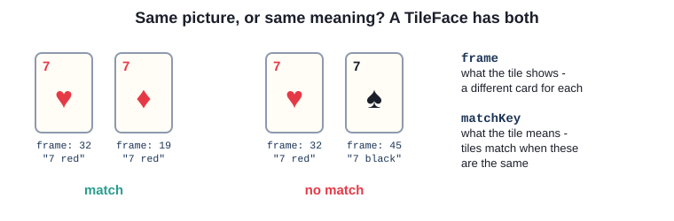
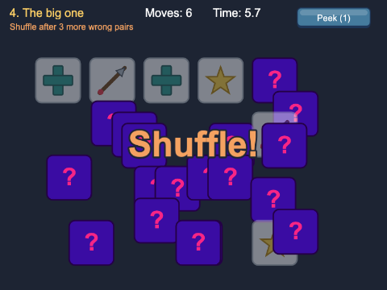

# Chapter 13
## Memory match

Turn over two. Keep them if they match.



---

## Today

- a grid laid out **by arithmetic**
- shuffled pairs, dealt onto the grid
- the rules as a **state machine** - and locking the board
- a flip made of two tweens, and **callbacks**
- moves, time and stars
- levels as data; a `Theme` interface; peek and shuffle

---

## What makes a memory game work

- it is a game about **information**: every tile turned tells you something
- the player must **see** a wrong pair - about a second
- the board must be **fair**: no third tile while two are showing
- score **efficiency**: moves and time
- **feedback**: flip, sound, pop, shake

---

## A tile is one frame of a sprite sheet


```ts
this.load.spritesheet(TILES_KEY, TILES_FILE, { frameWidth: TILE_SIZE, frameHeight: TILE_SIZE });
...
super(scene, x, y, TILES_KEY, BACK_FRAME);
...
public showFace(): void {
  this.faceUp = true;
  this.setFrame(this.face);
}
```

A `Tile` is an `Image` that starts on frame 0 (the back). An `Image` can show any frame;
`Sprite` is for animation.

---

## Pairs, then a grid

```ts
for (let face = 1; face <= pairs; face++) {
  faces.push(face, face);
}
return Phaser.Utils.Array.Shuffle(faces);
```

```ts
for (let row = 0; row < ROWS; row++) {
  for (let col = 0; col < COLS; col++) {
    const x = left + col * (TILE_SIZE + GAP);
    const y = top + row * (TILE_SIZE + GAP);
    const face = faces[row * COLS + col];
```

---

## Centring the grid



---

## The rules are a state machine

```ts
type State = "idle" | "oneUp" | "twoUp";

switch (this.state) {
  case "idle":
    tile.showFace();
    this.firstTile = tile;
    this.state = "oneUp";
    break;
  case "oneUp":
    tile.showFace();
    this.checkPair(this.firstTile!, tile);
    break;
  case "twoUp":
    break;
}
```

`"twoUp"`: a wrong pair is showing - the click is ignored. That is the **lock**

---

## A wrong pair locks the board

```ts
} else {
  // leave the wrong pair showing long enough to remember, then turn both back
  this.state = "twoUp";
  this.time.delayedCall(MISMATCH_DELAY, () => {
    first.hideFace();
    second.hideFace();
    this.state = "idle";
  });
}
```

- one `state` field - never two states at once
- remove the lock: three tiles up, then a `TypeError`

---

## Try it: the simple version

- build, serve, play `ch13_memory_simple`
- change `ROWS`, `COLS` and `GAP` - the grid lays itself out
- what goes wrong with a 5 x 5 board?



---

## The flip: two tweens of `scaleX`



```ts
this.scene.tweens.add({
  targets: this,
  scaleX: 0,
  duration: HALF_FLIP,
  ease: "Sine.easeIn",
  onComplete: () => {
    this.setFrame(frame);
    this.scene.tweens.add({
      ...
```

---

## Wait for it: callbacks, and a fourth state

```ts
public flipUp(onDone?: () => void): void {
...
this.state = "twoUp";
...
tile.flipUp(() => {
  this.checkPair();
});
```

`onDone` is a function (like a Java `Runnable`); `?` makes it optional



---

## Moves, time and stars

```ts
export function starsFor(moves: number, pairs: number): number {
  if (moves <= Math.ceil(pairs * THREE_STARS)) {
    return 3;
  }
  if (moves <= Math.ceil(pairs * TWO_STARS)) {
    return 2;
  }
  return 1;
}
```

- a **move** = two tiles; the clock starts at the first click
- show the stars you *missed*, too



---

## Try it: the intermediate version

- play `ch13_memory_intermediate` - how many moves for three stars?
- set `HALF_FLIP` to 600: watch the flip slowly
- try `"Linear"` instead of the `Sine` eases



---

## Levels are data; the board fits

```ts
export const LEVELS: LevelData[] = [
  { name: "Warm up", cols: 4, rows: 3, shuffleAfter: 0 },
  { name: "Four square", cols: 4, rows: 4, shuffleAfter: 0 },
  { name: "Shifting sands", cols: 5, rows: 4, shuffleAfter: 4 },
  { name: "The big one", cols: 6, rows: 4, shuffleAfter: 3 },
];
```

```ts
const scale = Math.min(1, AREA_WIDTH / gridWidth, AREA_HEIGHT / gridHeight);
```

Flips tween back to the tile's `baseScale`, not to 1.

---

## Themes: what a tile shows vs what it means



```ts
export interface TileFace {
  frame: number;       // the sprite sheet frame shown when the tile is face up
  matchKey: string;    // two tiles match when their matchKeys are the same
}
```

`PictureTheme` and `CardTheme` both `implements Theme`

---

## Two more locked states

```ts
private peek(): void {
  if (this.state !== "idle" || this.peeksLeft === 0) {
    return;
  }
  this.state = "peeking";
  ...
```

```ts
const loose = this.tiles.filter((tile) => !tile.isMatched());
const places = loose.map((tile) => ({ x: tile.x, y: tile.y }));
Phaser.Utils.Array.Shuffle(places);
```

Shuffle the **places**, not the tiles

---

## Buttons and best results

- `Button extends Phaser.GameObjects.Container` (Chapter 12) - an image and a text that move as
  one; `onClick` is a callback
- `BestResults` - local storage (Chapter 6), checked when read back

```ts
if (a.stars !== b.stars) {
  return a.stars > b.stars;
}
if (a.moves !== b.moves) {
  return a.moves < b.moves;
}
return a.seconds < b.seconds;
```

---

## Try it: the advanced version

- play both themes: which is harder, and why?
- level 3 or 4: make wrong guesses until the board shuffles
- add a fifth level - one line



---

## Summary

- grids: two loops, `(COLS - 1) * GAP`, equal margins, `row * COLS + col`
- `Shuffle` for pairs; `setFrame` to turn a tile over
- rules as a **state machine**; locked states ignore the player
- flips are two tweens; **callbacks** say when they have finished
- moves and time -> stars, in one small function
- an `interface` for themes; `matchKey` vs `frame`; levels as data

---

## Challenges

1. **Choose the size** - keys 1, 2, 3 for three board sizes
2. **Against the clock** - 60 seconds, counting down
3. **A hint** - H flashes a pair, for two moves
4. **Two players** - take turns; a pair means another go
5. **Triple match** - groups of three
6. **Keyboard control** - a cursor, arrows and SPACE

Next: **Chapter 14 - Catch, avoid and shoot**
