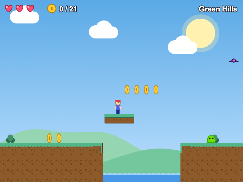
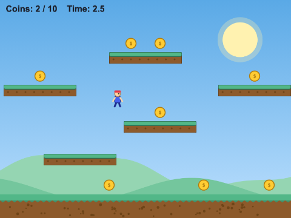
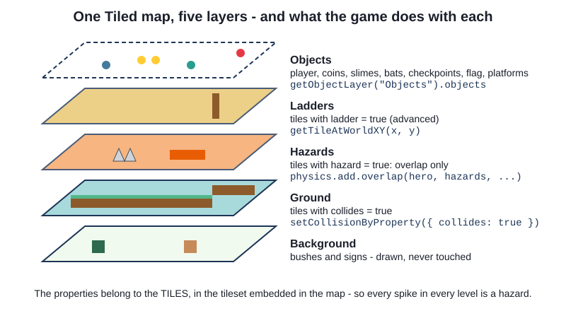
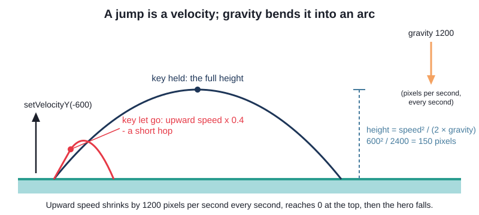
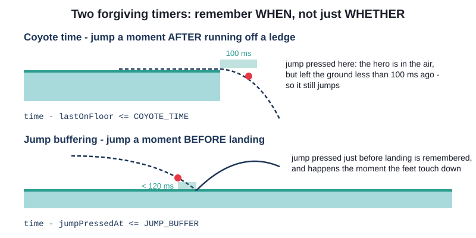
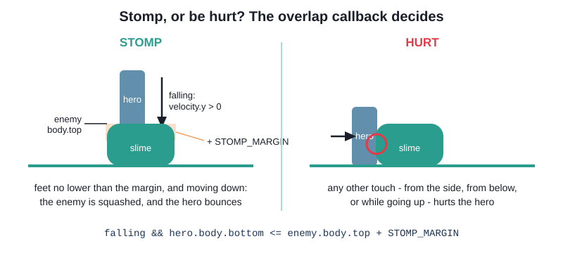
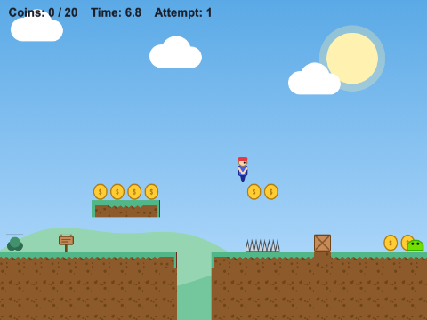
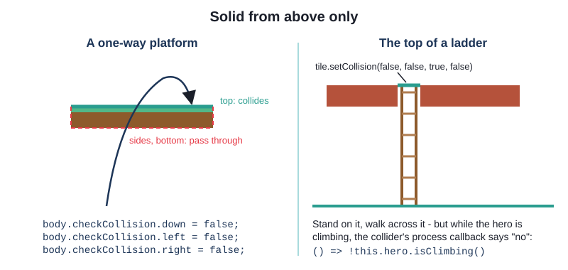
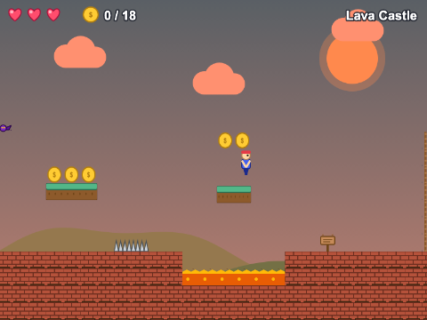
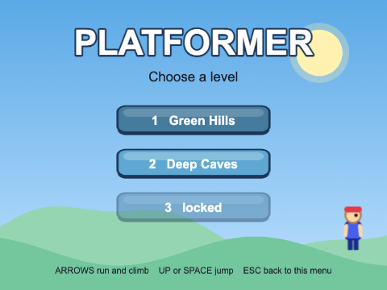

# Chapter 15
## Platformer

Run, jump, and do not fall down the hole



---

## Today

- gravity, `body.blocked.down` and a jump
- **game feel**: acceleration, a variable jump, coyote time, jump buffering
- a level from **Tiled** whose tiles say what they are
- enemies to stomp, hazards that are fair
- one-way and moving platforms, ladders
- lives, checkpoints, a HUD and a level select

---

## Gravity

```ts
physics: {
  default: "arcade",
  arcade: {
    gravity: { x: 0, y: 900 },
    debug: false, // true draws every body's outline - try it
  },
},
```

Every dynamic body falls - unless something holds it up

---

## The hero

```ts
export class Hero extends Phaser.Physics.Arcade.Sprite {
  declare body: Phaser.Physics.Arcade.Body;

  constructor(scene: Phaser.Scene, x: number, y: number) {
    super(scene, x, y, HERO_KEY, 0);
    scene.add.existing(this); // draw it, and call its preUpdate() every frame
    scene.physics.add.existing(this); // give it a dynamic Arcade Physics body
```

- `declare body` - narrows `Body | StaticBody | null` to the body it really has
- the body is **smaller than the picture** - fairer

---

## Standing, and jumping

```ts
if (jumpPressed && this.body.blocked.down) {
  this.setVelocityY(-JUMP_SPEED); // negative y is UP
  this.scene.sound.play(JUMP_SOUND);
}
```

- `blocked.down` - a collider stopped the body moving down: **standing on something**
- a jump is a velocity; gravity bends it into an arc

---

## Try it: the simple platformer

- play `ch15_platformer_simple`
- how does the jump *feel*?
- set `debug: true` in `main.ts` and look at the bodies



---

## A level from Tiled



```ts
ground.setCollisionByProperty({ collides: true });
```

---

## Feel 1: a jump you control



```ts
if (released && this.body.velocity.y < 0) {
  this.setVelocityY(this.body.velocity.y * JUMP_CUT);
}
```

---

## Feel 2: remember WHEN



```ts
const recentlyOnFloor = time - this.lastOnFloor <= COYOTE_TIME;
const recentlyPressed = time - this.jumpPressedAt <= JUMP_BUFFER;
```

---

## Stomp, or be hurt?



`squash()` switches the enemy's body off **at once**

---

## Fair hazards

```ts
this.physics.add.overlap(this.hero, hazards, () => this.hurtHero(), (_hero, tile) => {
  return this.isDeadly(tile as Phaser.Tilemaps.Tile);
});

private isDeadly(tile: Phaser.Tilemaps.Tile): boolean {
  return tile.properties.hazard === true && this.hero.body.bottom > tile.pixelY + HAZARD_MARGIN;
}
```

Overlapping a tile layer calls back for **empty tiles too**

---

## Try it: the intermediate platformer

- play `ch15_platformer_intermediate`
- set `COYOTE_TIME` and `JUMP_BUFFER` to 0 - play - put them back
- open `tiled/level.tmj` in Tiled



---

## One scene, every level

```ts
export const LEVELS: LevelInfo[] = [
  { key: "level1", file: "assets/maps/level1.tmj", name: "Green Hills", skyTint: 0xffffff },
  { key: "level2", file: "assets/maps/level2.tmj", name: "Deep Caves", skyTint: 0x7080a0 },
  { key: "level3", file: "assets/maps/level3.tmj", name: "Lava Castle", skyTint: 0xff9070 },
];
```

A new level = a map + one line. **Data-driven**

---

## Solid from above only



Moving platforms move by **velocity**: the engine carries the rider

---

## Ladders: pass a function

```ts
export type LadderFinder = (x: number, y: number) => number | null;

this.hero = new Hero(this, start.x!, start.y!, (x, y) => this.findLadder(x, y));
```

- the hero does not know about tilemaps
- `"climb"` state: gravity off, arrows move up and down

---

## Enemies share an interface

```ts
export interface Enemy {
  body: Phaser.Physics.Arcade.Body;
  isSquashed(): boolean;
  squash(): void;
}
```

`class Bat extends Phaser.Physics.Arcade.Sprite implements Enemy` - hover, swoop, return

---

## Lives, checkpoints, HUD

- being hurt costs a life; come back at the last **checkpoint**, flashing
- `HudScene` on top, redrawn on the registry's `"changedata"` event
- `Progress` keeps unlocked levels in `localStorage`



---

## Try it: the advanced platformer

- play all three levels of `ch15_platformer_advanced`
- climb a ladder; ride both kinds of moving platform
- find `makeLadderTopsSolid()` - why is the collider switched off while climbing?



---

## Summary

- gravity + `blocked.down` + an upward velocity = a jump
- acceleration, drag, jump cut, coyote time, buffering = **feel**
- tiles with properties; objects from the Objects layer
- stomp or hurt in the overlap callback; fair hazards in a process callback
- `checkCollision` for one-way; velocity for moving platforms
- one data-driven scene, a HUD scene, lives and checkpoints

---

## Challenges

1. **Double jump** - once more, in the air
2. **Springboard** - drawn with `Graphics`, it throws the hero up
3. **Coin record** - best coins per level, on the level select
4. **Wall jump** - slide down walls, jump off them
5. **Medal times** - gold, silver, bronze, and a clock in the HUD
6. **A new enemy** - ghosts that cannot be stomped
